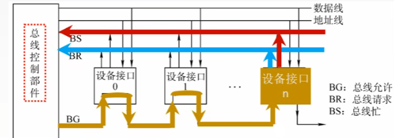

# Computer Organization

# 第6章 总线

## 总线的定义

计算机系统的五大部件之间的**互连方式有两种**, 一种是各部件之间使用单独的连线, 称为**分散连接**; 另一种是将各部件连到一组公共信息传输线上, 称为**总线连接**.

**总线是连接多个部件的信息传输线, 是各部件共享的传输介质.**

总线是一组能为多个部件**分时共享**的公共信息传送线路.

> 为什么要用总线？
> 早期计算机外部设备少时大多采用分散连接方式, 不易实现随时增减外部设备. 为了更好地解决I/O设备和主机之间连接的灵活性问题, 计算机的结构从分散连接发展为总线连接. 

> 当多个部件与总线相连时, 如果出现两个或两个以上部件同时向总线发送信息, 势必导致信号冲突, 传输无效. 因此, 在某一时刻, 只允许有一个部件向总线发送信息, 而多个部件可以同时从总线上接收相同的信息.

> 总线实际上是由许多传输线或通路组成, 每条线可一位一位地传输二进制代码, 一串二进制代码可在一段时间内逐一传输完成. 若干条传输线可以同时传输若干位二进制代码, 如16条传输线组成的总线可同时传输16位二进制代码. (就是串行跟并行传输)

串行就是一位一位bit传, 并行就是几条线一次性把n位传过去.

## 总线结构

### 单总线结构

> 一对部件使用, 其他部件等. 故带宽低. 不支持并发.
>
> 若同时传输多个设备数据, 需要电流就大, 容易烧坏电路.

### 双总线结构

> 特点是将速度较低的I/O设备从单总线上分离出来, 形成主存总线与I/O总线分开的结构. 图中通道是一个具有特殊功能的处理器, CPU 将一部分功能下放给通道, 使其对I/O设备具有统一管理的功能, 以完成外部设备与主存储器之间的数据传送, 其系统的吞吐能力可以相当大. 这种结构大多用于大, 中型计算机系统.

### 三总线结构

将速率不同的I/O设备进行分类, 然后将它们连接在不同的通道上, 那么计算机系统的工作效率将会更高, 由此发展成多总线结构.

> 三套总线, 每个时刻只有一条总线工作. 所以系统工作效率较低. 主存总线与DMA总线不能同时对主存进行存取, I/O总线只有在CPU执行I/O指令时才能用到.

另一种三总线结构

处理器与Cache之间有一条局部总线, 它将CPU与Cache或与更多的局部设备连接. Cache的控制机构不仅将Cache 连到局部总线上, 而且还直接连到系统总线上, 这样Cache就可通过系统总线与主存传输信息, 而且I/O设备与主存之间的传输也不必通过CPU. 还有一条扩展总线, 它将局域网, 小型计算机接口(SCSI) , 调制解调器(Modem) 以及串行接口等都连接起来, 并且通过这些接口又可与各类I/O设备相连, 因此它可支持相当多的I/O设备. 与此同时, 扩展总线又通过扩展总线接口与系统总线相连, 由此便可实现这两种总线之间的信息传递, 可见其系统的工作效率明显提高. 

### 四总线结构

为了进一步提高I/0 设备的性能, 使其更快地响应命令出现了四总线结构.

又增加了一条与计算机系统紧密相连的高速总线, 在高速总线上挂接了一些高速I/0 设备, 如高速局域网, 图形工作站, 多媒体, SCSI等. 它们通过Cache控制机构中的**高速总线桥**或高速缓冲器与系统总线和局部总线相连, 使得这些高速设备与CPU更密切. 而一些较低速的设备如图文传真FAX, 调制解调器及串行接口仍然挂在扩展总线上, 并由扩展总线接口与高速总线相连. 

这种结构对高速设备而言, 其自身的工作可以**很少依赖CPU,** 同时它们又比扩展总线上的设备更贴近CPU, 可见**对于高性能设备与CPU来说, 各自的效率将获得更大的提高**. 在这种结构中,  CPU, 高速总线的速度以及各自信号线的定义完全可以不同, 以至各自改变其结构也不会影响高速总线的正常工作, 反之亦然.

### VL-BUS局部总线结构

局部总线VL-BUS就相当于在CPU与高速I/O设备之间架上了高速通道, 使CPU与高性能外设得到充分发挥, 满足了图形界面软件的要求. 由于VL-BUS是从CPU总线演化而来的, 与CPU的关系太紧密(实际上这种总线与486配合最佳), 以致很难支持功能更强的CPU, 因此出现了PCI 总线.

### PCI总线结构

PCI总线是通过PCI桥路(包括PCI控制器和PCI加速器)与CPU总线相连. 这种结构使CPU总线与PCI总线互相隔离, 具有更高的灵活性, 可以支持更多的高速运行设备, 而且具有即插即用的特性. 当然, 挂在PCI总线上的设备都要求数据传输速率高的设备, 如多媒体卡, 高速局域网适配器, 高性能图形卡等, 与高速CPU总线是相匹配的. 至于低速的FAX , Modem, 打印机仍然挂在ISA, EISA总线上.

当PCI总线驱动能力不足时, 可采用多层结构.

### 多层 PCI 总线结构

## 总线的物理图

## 总线设备

总线上所连接的设备, 按其**对总线有无控制功能**可分, **主设备和从设备**两种

**主设备:** 总线的主设备是指获得总线控制权的设备.

**从设备:** 总线的从设备是指被主设备访问的设备, 它只能响应从主设备发来的各种总线命令.

## 总线特性

> CPU, 主存,I/O这些插板(又称插卡)通过插头与水平方向总线插槽(按总线标准用印刷电路板或一束电缆连接而成的多头插座)连接. 为了保证机械上的可靠连接, 必须规定其机械特性; 为了确保电气上正确连接, 必须规定其电气特性; 为保证正确地连接不同部件, 还需规定其功能特性和时间特性. 

1. 机械特性: 总线在机械连接方式上的一些性能, 尺寸, 形状, 管脚数, 排列顺序, 接头处的可靠接触

2. 电气特性: 总线的每一根传输线上信号的传输方向和有效的电平范围

   > 通常规定由CPU发出的信号称为输出信号, 送入CPU 的信号称为输入信号. 控制总线的每一根都
   > 是单向的, 但从整体看, 有输入, 也有输出. 大多数总线的电平定义与TTL 是相符的, 也有例外.

3. 功能特性: 每根传输线的功能(地址, 数据, 控制)

4. 时间特性: 指总线中的任一根线在什么时间内有效. 各种信号的时序关系

## 总线分类

#### 片内总线

芯片内部的总线(如CPU内部总线)

#### 系统总线

计算机各部件(CPU, 主存,I/O设备)之间的信息传输线.

由于这些部件通常都安放在主板或各个插件板(插卡)上, 故又称板级总线(在一块电路板上各芯片间的连线)或板间总线.

- **数据总线**

  数据总线用来传输各功能部件之间的数据信息, 它是**双向传输总线**, 其**位数与机器字长, 存储字长有关**, 一般为8 位 ,16 位或32 位. 数据总线的位数称为**数据总线宽度**, 它是衡量系统性能的一个重要参数. 如果数据总线的宽度为8 位, 指令字长为16 位, 那么,  CPU 在取指阶段必须两次访问主存.

- **地址总线**

  地址总线主要用来**指出**数据总线上的源数据或目的数据在主存单元的地址或I/O设备的**地址**.

  > 如, 欲从存储器读出一个数据, 则CPU 要将此数据所在存储单元的地址送到地址线上. 
  > 又如, 欲将某数据经I/O设备输出, 则CPU除了需将数据送到数据总线外, 还需将该输出设备的地址(通常都经I/O接口)送到地址总线上. 可见, 地址总线上的代码是用来指明CPU欲访问的存储单元或I/O端口的地址, 由CPU 输出, **单向传输**. 地址线的位数与存储单元的个数有关.

- **控制总线**

  由千数据总线, 地址总线都是被挂在总线上的所有部件共享的, 如何使各部件能在不同时刻占有总线使用权, 需依靠控制总线来完成, 因此控制总线是用来发出各种控制信号的传输线. **通常对任一控制线而言, 它的传输是单向的.** 

  例如, 存储器读/写命令或I/O设备读/写命令都是由CPU发出的. 但**对于控制总线总体来说, 又可认为是双向的.** 例如, 当某设备准备就绪时, 便向CPU 发中断请求; 当某部件(如DMA接口)需获得总线使用权时, 也向CPU发出总线请求. 此外, 控制总线还起到监视各部件状态的作用. 例如. 查询该设备是处于"忙"还是"闲", 是否出错等. 因此**对CPU而言, 控制信号既有输出, 又有输入.**

  > 常见的控制信号如下:
  > 时钟：用来同步各种操作. 
  > 复位：初始化所有部件. 
  > 总线请求：表示某部件需获得总线使用权. 
  > 总线允许：表示需要获得总线使用权的部件已获得了控制权. 
  > 中断请求：表示某部件提出中断请求. 
  > 中断响应：表示中断请求已被接收. 
  > 存储器写：将数据总线上的数据写至存储器的指定地址单元内. 
  > 存储器读：将指定存储单元中的数据读到数据总线上. 
  > I/O读：从指定的I/0 端口将数据读到数据总线上. 
  > I/O写：将数据总线上的数据输出到指定的I/O端口内. 
  > 传输响应：表示数据已被接收, 或已将数据送至数据总线上. 

#### 通信总线

这类总线**用于计算机系统之间或计算机系统与其他系统(如控制仪表, 移动通信等)之间的通信**. 由这类联系涉及许多方面, 差别极大, 因此通信总线的类别很多. 但按传输方式可分为两种: **串行通信和并行通信**.

**串行通信**是指数据在**单条1位宽的传输线上**, 一位一位地**按顺序分时传送**. 如1字节的数据, 在串行传送中, 1字节的数据要通过一条传输线分8 次由低位到高位按顺序逐位传送. 
**并行通信**是指数据在**多条并行**1位宽的传输线上, **同时**由源传送到目的地. 如1 字节的数据, 在并行传送中, 要通过8条并行传输线同时由源传送到目的地.

> **并行通信适宜于近距离的数据传输, 通常小于30m;** **串行通信适宜于远距离传送, 可以从几米到数千千米**. 而且, **串行和并行通信的数据传送速率都与距	离成反比**. 在**短距离内, 并行数据传送速率比串行数据传送速率高得多**. 随着大规模和超大规模集成电路的发展, 逻辑器件的价格趋低, 而**通信线路费用趋高**, 因此**对远距离通信而言, 采用串行通信费用远比并行通信费用低得多**. 此外**串行通信还可利用现有的电话网络来实现远程通信, 降低了通信费用.**

## 总线性能指标

总线的传输周期(总线周期), 总线时钟周期, 总线的工作频率, 总线的时钟频率 , 总线宽度, 总线带宽, 总线复用, 信号线数.  

#### 总线时钟周期

即机器的时钟周期. 计算机有一个统一的时钟, 以控制整个计算机的各个部件, 总线也要受此时钟的控制. 由CPU内的晶振产生.

#### 总线的传输周期(总线周期)

一次总线操作所需的时间(包括申请阶段, 寻址阶段, 传输阶段和结束阶段), 通常由**若干个总线时钟周期**构成.

> 可能会有一个时钟周期完成四个操作, 或者一个时钟周期完成多个操作的例外情况.

#### 总线的时钟频率

就是机器的时钟频率, 由晶振产生, 是时钟周期的倒数.
若时钟周期为T, 则**时钟频率**为1/T.  **实际上指一秒内有多少个时钟周期.** 

#### 总线的工作频率

为总线上各种操作的频率, 为**总线周期**的**倒数.** 
若总线周期=N个时钟周期, 则总线的工作频率=1/NT=时钟频率/N. 
**实际上指一秒内传送几次数据.** 

#### 总线宽度

又称为**总线位宽**, 它是总线上**同时**能够**传输的数据位数**, 通常是指**数据总线的根数**, 如32根称为32位(bit)总线. 

#### 总线带宽

可理解为**总线的数据传输率**, 即**单位时间内总线上可传输数据的位数,** 通常用**每秒钟传送信息的字节数来衡量**, 单位可用字节/秒(B/s)表示.

总线带宽 = 总线工作频率 × 总线宽度(bit/s) = 总线工作频率 × (总线宽度/8) (B/s)  

> 总线工作频率 是 总线周期的倒数. 可以用` 1/总线周期`来代替`总线工作频率`.

注意: 总线带宽是指**总线本身所能达到的最高传输速率**.
在计算实际的有效数据传输率时, 要用实际传输的数据量除以耗时.

回顾一下之前的串行总线与并行总线:

看个例子: 

#### 总线复用

总线复用是指一种信号线在不同的时间传输不同的信息. (一条信号线上分时传送两种信号.)
可以使用较少的线传输更多的信息, 从而节省了空间和成本.

> 如, 通常地址总线与数据总线在物理上是分开的两种总线, 地址总线传输地址码, 数据总线传输数据信息. 为了提高总线的利用率, 优化设计, 特将地址总线和数据总线共用一组物理线路, 在这组物理线路上分时传输地址信号和数据信号, 即为总线的多路复用.

这个8086CPU就是复用, AD0到AD15这十六个引脚, 就是地址跟数据线复用的. A就Address, D就是Data.

这16个引脚接出去的线, 既传地址, 又传数据.

#### 信号线数

地址总线, 数据总线和控制总线3种**总线数的总和**称为信号线数.

#### 时钟同步/异步

总线上的数据与**时钟同步工作的总线**称为同步总线, **与时钟不同步工作**的总线称为异步总线.

#### 总线控制方式

包括突发工作, 自动配置, 仲裁方式, 逻辑方式, 计数方式等.

#### 其他指标

如**负载能力**, 电源电压(是采用5V 还是3.3V), 总线宽度能否扩展等.
> 总线的负载能力即驱动能力, 是指当总线接上负载后, 总线输入输出的逻辑电平是否能保持在正常的额定范围内.
>
> 例如, PC 总线的输出信号为低电平时, 要吸入电流, 这时的负载能力即指当它吸收电流时, 仍能保持额定的逻辑低电平.  总线输出为高电平时, 要输出电流, 这时的负载能力是指当它向负载输出电流时, 仍能保持额定的逻辑高电平. 
>
> 由于不同的电路对总线的负载是不同的, 即使同一电路板在不同的工作频率下, 总线的负载也是不同的, 因此, 总线负载能力的指标不是太严格的. 通常用可连接扩增电路板数来反映总线的负载能力.

## 总线标准

所谓**总线标准**, 可**视为系统与各模块, 模块与模块之间的一个互连的标准界面**. 这个界面对**它两端的模块都是透明的**, 即**界面的任一方只需根据总线标准的要求完成自身一方接口的功能要求**, 而**无须了解对方接口与总线的连接要求**. 因此, **按总线标准设计的接口可视为通用接口**. 采用总线标准可以**为计算机接口的软硬件设计提供方便**. 对硬件设计而言, 使各个模块的接口芯片设计相对独立; 对软件设计而言, 更有利于接口软件的模块化设计.

#### ISA 总线

ISA (Industrial Standard Architecture) 总线是IBM**为了采用全16位的CPU**而推出的, 又称AT总线, 它使用独立于CPU 的总线时钟, 因此CPU 可以采用比总线频率更高的时钟, 有利于CPU性能的提高. 由于ISA总线**没有支持总线仲裁的硬件逻辑**因此它**不能支持多台主设备**(不支持多台具有申请总线控制权的设备)系统, 而且**ISA上的所有数据的传送必须通过CPU或DMA(直接存储器存取)接口来管理**, 因此使CPU花费了大量时间来控制与外部设备交换数据. 
ISA总线时钟频率为8MHz , 最大传输率为16MBps, 数据线为16位, 地址线为24 位.

#### EISA 总线

EISA (Extended Industrial Standard Architecture) 是一种在ISA 基础上扩充开放的总线标准, 与ISA可以完全兼容, **从CPU中分离出了总线控制权**, 是一种**具有智能化的总线**, 能**支持多个总线主控器和突发方式(总线上可进行成块的数据传送)的传输**. EISA总线的时钟频率为8 MHz, 最大传输率可达33 MBps, 数据总线为32位, 地址总线为32 位, 扩充DMA访问范围达2^32.

#### VESA(VL-BUS) 总线

VESA总线是由VESA (Video Electronic Standard Association, 视频电子标准协会)提出的**局部总线标准**, 又称为**VL-BUS(Local BUS)总线**. 所谓**局部总线**, 是指**在系统外为两个以上模块提供的高速传输信息通道**. VL-BUS是**由CPU总线演化而来的**, 采用CPU的时钟频率达33MHz, 数据线为32位, 可通过扩展槽扩展到64位, **配有局部控制器**, 最大传输率达133MBps . **通过局部总线控制器, 将高速I/O设备直接挂在CPU上, 实现CPU与高速I/O设备之间的高速数据交换.**

#### PCI 总线

随着图形用户界面(Graphical User Inte1face, GUI)和多媒体技术在PC系统中的广泛应用, ISA总线和EISA总线由于受带宽的限制, 已不能适应系统工作的要求, 成为整个系统的主要瓶颈. 因此对总线提出了更高的性能要求, 促使总线技术进一步发展. 

PCI (Peripheral Component Interconnect , 外围部件互连) 主要特点:

- **高性能**

  PCI总线是一种**不依附于某个具体处理器**的**局部总线**. 它**为系统提供了一个高速的数据传输通道**, **与CPU 时钟频率无关**, 自身采用33 MHz和66MHz的总线时钟, 数据线为32 位, 可扩展到64 位, 传输速率从132MBps(33MHz 时钟,  32位数据通路)可升级到528MBps(66 MHz时钟, 64位数据通路). 它**支持突发工作方式**, 这种方式是**指若被传送的数据在主存中连续存放, 则在访问此组数据时, 只需给出第一个数据的地址, 占用一个时钟周期, 其后每个数据的传送各占一个时钟周期, 不必每次给出各个数据的地址**, 因此**可提高传输速率**. 

- **良好的兼容性**

  **PCI总线部件和插件接口相对于`处理器`是独立的**, 它支持所有的目前和将来不同结构的处理器, 因此具有相对长的生命周期. PCI总线与ISA, EISA 总线均可兼容, 可以转换为标准的ISA, EISA.

- **支持即插即用(Plug and Play)** 

  即**任何扩展卡只要插入系统便可工作**. PCI设备中配有**存放设备具体信息的寄存器**, 这些信息**可供BIOS(基本输入输出系统)和操作系统层的软件自动配置PCI总线部件和插件**, 使系统使用方便, 无须进行复杂的手动配置. 

- **支持多主设备能力**

  **主设备即对总线有控制权的设备**, PCI支持多主设备, 即**允许任何主设备和从设备(对总线没有控制权的设备)之间实现点到点对等存取**, 体现了**接纳设备的高度灵活性.**

- **具有与处理器和存储器子系统完全并行操作的能力**

  **PCI总线可视为CPU与外设之间的一个中间层**, 它**通过PCI桥路(PCI控制器)与CPU相连**. **PCI桥路有多级缓冲**, 可**把一批数据快速写入缓冲器中**, 在这些数据不断写入PCI设备过程中, 可真正实现与处理器/存储器子系统的**安全并发**工作.

- **提供数据和地址奇偶校验功能**

  保证了数据的完整和准确.

- **支持两种电压标准**

  5V和3.3 V. 3.3~5V的组件技术可以使电压平滑过渡. 3.3V电压的PCI总线可用于便携式微型计算机中.

- **可扩充性好**

  当PCI 总线驱动能力不足时, 可以采用多层结构.

- **软件兼容性好**

  PCI部件可以完全兼容现有的驱动程序和应用程序. 设备驱动程序可被移植到各类平台上.

- **采用多路复用技术**

  减少了总线引脚个数. 

> 随着网络的高速发展以及其他周边设备的技术革新, 诸如千兆网卡之类的设备对PCI总线提出了更高要求. Intel 公司近年来又推出PCI-Express总线, 它采用了类似网络传输TCP/IP协议的分层结构和数据帧逐层传递的模式. 

#### AGP 总线

处理三维数据不仅要求有惊人的数据量, 而且要求有更宽广的数据传输带宽. 

如对640x480像素的分辨率而言, 以每秒75次画面更新率计算, 要求全部的数据带宽达370MBps; 若分辨率提高到800X600像素时, 总带宽高达580MBps. 因此PCI总线成为传输瓶颈. 

AGP(Accelerated Graphics Port, 加速图形端口), 这是**显示卡专用的局部总线**, 基于PCI2.1版规范并进行扩充修改而成, 它**采用点对点通道方式,** 以66.7MHz的频率直接与主存联系, **以主存作为帧缓冲器**, **实现了高速存取**. 最大数据传输率(**数据宽度为32位**)为266MBps, 是传统PCI总线带宽的2倍. AGP还定义了一种**"双激励"(Double Pumping)**的传输技术, **能在一个时钟的上,下沿双向传递数据**, 这样,  AGP实现的传输频率为66.7MHzx2, 即133MHz, 最大数据传输率可增为533MBps. 后来又依次推出了AGP2X, AGP4X, AGP8X多个版本, 数据传输速率可达2.1GBps.

#### PCI-E

#### RS-232C 总线

RS-232C(RS即Recommended Standard的缩写, 232为标识号,C表示修改次数) 是由美国电子工业协会EIA (Electronic Industries Association)推荐的一种**串行通信总线标准**, 它是**应用于串行二进制交换的数据终端设备(DTE)和数据通信设备(DCE)之间的标准接口.**

上图中, DTE(Data Terminal Equipment)是数据终端设备, 它是**产生二进制信号的数据源**, **也是接收信息的目的地**, 是由**数据发生器或接收器或兼具两者组成的设备**, 它可以是一台计算机. 

DCE(Data Communication Equipment) 是数据通信设备, 它**实质是一个信号的匹配器**, 既能满足DTE的要求, 又能使传输信号符合线路要求. 它具有**提供数据终端设备与通信线路之间通信的建立, 维持和终止连接等功能**, 同时还执行信号变换与编码. 它可以是一个Modem (调制解调器). DTE与DCE之间传输的是"0"或"1"的数据, 通过RS-232C接口规定的各种控制信号, 可实现两者之间的协调配合. 

> 计算机之间通信传送的是数字信号, 它要求传送的频带很宽, 而计算机远程通信通常是通过载波电话传送的, 不可能有这样宽的频带. 如果数字信号直接进行通信, 经过传输线后, 必然会产生畸变. 因此在发送端必须通过调制器将数字信号转换成模拟信号, 即对载波电话线上载波进行调制; 而在接收端又必须用解调器检出从发送端来的模拟信号, 并恢复为原来的数字信号. 

要注意的是: RS-232C规定的逻辑电平与计算机系统中TTL和MOS电平不一样. 在计算机系统中, 以＋5V代表逻辑"1" , 接地电压代表逻辑"0". 
而RS-232C的电气特征规定低电平表示逻辑"1", 并要求低电平为 -15 ~ -3V; 用高电平表示逻辑"0", 并要求高电平为+3 ~ +15V, 因此使用RS-232C 时, 必须实现两种电平的转换.
随着计算机网络的发展, 现代计算机之间的远距离通信可直接由网卡经网线(8 根, 双绞线)传输.

#### USB 总线

USB(Universal Serial Bus)通用串行总线是Compaq, DEC, IBM, Intel, Microsoft, NEC(日本)和Northern Telecom (加拿大)等七大公司于1994 年11月联合开发的计算机串行接口总线标准，1996年1月颁布了USB 1.0 版本. 它**基于通用连接技术**，**实现外设的简单快速连接**，达到方便用户, 降低成本, 扩展PC接连外设范围的目的. 用户可以将几乎所有的外设装置, 包括显示器, 键盘, 鼠标, 打印机, 扫描仪, 数码相机, U盘, 调制解调器等直接插入标准USB插口. 还可以将一些USB外设进行串接, 使一大串设备共用PC上的端口.它的主要特点是：

- 具有真正的即插即用特征

  用户可以**在不关机的情况下**很方便地**对外设实行安装和拆卸**, **主机可按外设的增删情况自动配置系统资源**, **外设装置驱动程序的安装, 删除均自动实现**.

- 具有很强的连接能力

  使用USB HUB(USB 集线器)实现系统扩展, 最多可链式连接127个外设到同一系统. 下图是典型的USB系统拓扑结构. 标准USB电缆长度为3m, 低速传输方式时可为5m, 通过HUB或中继器可使传输距离达30m. 

  

- 数据传输率

  USB 1.0版有两种, 即采用**普通无屏蔽双绞线**, 速度可达1.5Mbps, 若用带屏蔽的双绞线, 速度可达12Mbps. USB 2.0版的数据传输率最高可达480Mbps.

- 标准统一

  USB 的引入**减轻了对目前PC中所有标准接口的需求**, 如串口的鼠标, 键盘, 并口的打印机, 扫描仪,  IDE接口的硬盘, 都可以改成以统一的USB标准接入系统, 从而减少了对PC插槽的需求, 节省空间.

- 连接电缆轻巧, 电源体积缩小

  USB使用的4芯电缆中的2条用于信号连接, 2条用于电源/地, 可为外设提供+5V的直流电源, 方便用户. 

- 生命力强

  USB 是一种开放性的不具有专利版权的工业标准，它是由一个标准化组织"USB 实施者论坛"(该组织由150多家企业组成)制定出来的, 因此不存在专利版权问题, **USB规范具有强大的生命力**. 

#### SATA

#### SCSI

小结:

#### 视频线标准

## 总线控制

由于总线上连接着多个部件, 什么时候由哪个部件发送信息, 如何给信息传送定时, 如何防止信息丢失, 如何避免多个部件同时发送, 如何规定接收信息的部件等一系列问题都需要由总线控制器统一管理. 它主要包括判优控制(或称仲裁逻辑) 和通信控制。

### 总线仲裁(判优)控制

#### 基本概念

**同一时刻只能有一个设备控制总线传输**操作, 可以**有一个或多个设备从总线接收数据**.
将总线上所连接的各类设备按其**对总线有无控制功能**分为:
主设备: 获得总线控制权的设备. 
从设备: 被主设备访问的设备, 只能响应从主设备发来的各种总线命令.

- 为什么要仲裁？
  总线作为一种**共享设备**, 不可避免地会出现**同一时刻有多个主设备竞争总线控制权**的问题. 

- 总线仲裁的定义：
  **多个主设备同时竞争主线控制权**时, **以某种方式选择一个主设备优先获得总线控制权**称为总线仲裁。

- 总线仲裁分类：
  **集中仲裁方式**  链式查询方式, 计数器定时查询方式, 独立请求方式
  **分布仲裁方式**

  > 前者将**控制逻辑集中在一处**(如在CPU中), 后者**将控制逻辑分散在与总线连接的各个部件或设备上**.

#### 集中仲裁方式

**访问总线工作流程：**

1. 主设备发出请求信号;
2. 若多个主设备同时要使用总线, 则由总线控制器的判优, 仲裁逻辑按一定的优先等级顺序确定哪个主设备能使用总线;
3. 获得总线使用权的主设备开始传送数据.

- **链式查询方式**

  

  图中控制总线中有3根线用于总线控制(BS总线忙, BR总线请求, BG总线允许), 其中**总线允许信号BG是串行地从一个I/O接口送到下一个I/O接口**. 如果**BG到达的接口有总线请求**,  **BG信号就不再往下传**, 意味着该**接口获得了总线使用权**, **并建立总线忙BS信号**, 表示**它占用了总线**. 可见在链式查询中, **离总线控制部件最近的设备具有最高的优先级**. 

  这种方式的特点是: 只需很少几根线就能按一定优先次序实现总线控制, 并且很容易扩充设备, 但对电路故障很敏感, 且优先级别低的设备可能很难获得请求. 

  查询过程:

  

  ①: 某时刻, 设备接口1跟设备接口n同时通过**总线请求线BR**提出总线请求.

  ②: 总线控制部件接收到请求后查询BS总线忙, 发现此时没有设备占用总线, 它就会通过总线允许BG发出信号, 串行地从一个I/O接口送到下一个I/O接口, 途经设备接口时查一下它有没有发BR.

  ③: 当BG信号传到设备接口1, 发现它有总线请求BR, 就会把总线的控制器交给设备接口1. 此设备就会占用总线, 并且发送**BS总线忙信号** 到 **总线忙线**上. 
  此时总线控制部件发现总线忙上面有信号, 知道总线现在被占用了, 就停止BG信号的传递.

  

  接着上面的流程:

  当设备接口1完成数据输送, 它就取消总线请求, 同时把总线忙BS信号释放掉.  但是此时设备接口n还在发送总线请求BR信号, 总线控制部件发现现在总线不忙了, 就控制BG信号继续传递, 传到设备接口n, 把控制器给设备n. 设备n占用总线, 并发送BS信号到总线忙这条信号线上.

  > "总线忙"信号的建立者是获得总线控制权的设备.
  > 优先级：离总线控制器越近的部件, 其优先级越高; 离总线控制器越远的部件, 其优先级越低.

  优点：链式查询方式优先级固定.只需很少几根控制线就能按一定优先次序实现总线控制, **结构简单**, **扩充容易**. 
  缺点：**对硬件电路的故障敏感**, 并且**优先级不能改变**. 当优先级高的部件频繁请求使用总线时, 会使优先级较低的部件长期不能使用总线. 

  > 如果每次BG都是从头开始, 那可能有设备永远都没办法用总线.

- **计数器查询方式**

  

  跟链式查询相比, 多了一组设备地址线, 少了一根总线允许线BG.

  总线控制部件接到由BR送来的总线请求信号后, 在**总线未被使用(BS= 0)的情况下**, 总线控制部件中的**计数器开始计数,** 并**通过设备地址线**, **向各设备发出一组地址信号**. (每数一个数就进行这个操作.)
  当某个**请求占用总线的设备地址与计数值一致**时, 便**获得总线使用权**, 此时**终止计数查询**. 

  这种方式的优点是: 

  - **计数可以从"0"开始**, 此时一旦设备的优先次序被固定, **设备的优先级**就按0, 1, …,  n的顺**序降序排列**, 而且**固定不变**; 

  - **计数也可以从上一次计数的终止点开始**, 即是**一种循环方法**, 此时**设备使用总线的优先级相等**; 
  - **计数器的初始值还可由程序设置**, 故优先次序可以改变. 

  - 这种方式**对电路故障不如链式查询方式敏感**

  缺点:

  - 增加了控制线(设备地址)数.
  - 控制较复杂.

  

- **独立请求方式**

  

  **每台设备**均有一对**总线请求线BRi**和**总线允许线BGi**. 

  当设备要求使用总线时, 便发出该设备的请求信号. **总线控制部件**中有一**排队电路**, 可**根据优先次序**确定响应哪一台设备的请求. (根据一条共用线 总线忙BS, 获得控制器的设备发送总线忙BS信号)

  这种方式的优点是: 

  响应速度快, 优先次序控制灵活(通过程序改变), 

  缺点: 但控制线数量多, 总线控制更复杂. 

  

- **小结**

  

#### 分布仲裁方式

特点:**不需要中央仲裁器**, **每个潜在的主模块都有自己的仲裁器和仲裁号**, **多个仲裁器竞争使用总线**.

当设备有总线请求时, 它们就把**各自唯一的仲裁号发送到共享的仲裁总线上**;
每个仲裁器将从仲裁总线上得到的仲裁号与自己的仲裁号进行比较; 
如果仲裁总线上的号优先级高, 则它的总线请求不予响应, 并撤销它的仲裁号; 
最后, 获胜者的仲裁号保留在仲裁总线上.

### 总线通信控制

众多部件共享总线, 在争夺总线使用权时, 应按各部件的优先等级来解决. 在通信时间上, 则应按分时方式来处理, 即以获得总线使用权的先后顺序分时占用总线, 即哪一个部件获得使用权, 此刻就由它传送, 下一部件获得使用权, 接着下一时刻传送. 这样一个接一个轮流交替传送.

#### 总线周期四阶段

通常将**完成一次总线操作的时间**称为总线周期, 可分为以下4 个阶段.

1) 申请分配阶段: 由需要使用总线的主模块(或主设备)提出申请, 经总线仲裁机构决定将下一传输周期的总线使用权授予某一申请者. 也可将此阶段细分为传输请求和总线仲裁两个阶段.
2) 寻址阶段: 获得使用权的主模块通过总线发出本次要访问的从模块(从设备)的地址及有关命令, 启动参与本次传输的从模块. 
3) 传输阶段: 主模块和从模块进行数据交换, 数据由源模块发出, 经数据总线流入目的模块. 可单向或双向进行数据传送. 
4) 结束阶段: 主模块的有关信息均从系统总线上撤除, 让出总线使用权. 

> 对于仅有一个主模块的简单系统, 无须申请, 分配和撤除, 总线使用权始终归它占有. 对于包含中断, DMA 控制或多处理器的系统, 还需要有其他管理机构来参与. 

总线通信控制主要解决通信双方如何获知传输开始和传输结束, 以及通信双方如何协调如何配合. 通常用四种方式: 同步通信, 异步通信, 半同步通信和分离式通信.

**总线定时**是指总线在**双方交换数据的过程中**需要**时间上配合关系**的控制, 这种控制称为总线定时, 它的**实质是一种协议或规则**.

#### 同步(定时)通信

通信双方由统一时标(时钟信号)控制数据传送称为同步通信. 时钟信号通常由CPU的总线控制部件发出, 送到总线上的所有部件; 也可以由每个部件各自的时序发生器发出, 但必须由总线控制部件发出的时钟信号对它们进行同步. 

图中总线传输周期是连接在总线上的两个部件完成一次完整且可靠的信息传输时间, 它包含4个时钟周期T1,  T2, T3, T4.

CPU在T1上升沿发出地址信息; 在T2的上升沿发出读命令; 与地址信号相符合的输入设备按命令进行一系列内部操作, 且必须在T3的上升沿到来之前将CPU 所需的数据送到数据总线上; CPU在T3时钟周期内, 将数据线上的信息送到其内部寄存器中; CPU在T4的上升沿撤销读命令, 输入设备不再向数据总线上传送数据, 撤销它对数据总线的驱动. 如果总线采用三态驱动电路, 则从T4起, 数据总线呈浮空状态. 

同步通信在系统总线设计时, 对T1, T2, T3, T4都有明确, 唯一的规定:
对于**读命令**, 其传输周期如下：
T1  主模块发地址.
T2  主模块发读命令.
T3  从模块提供数据.
T4  主模块撤销读命令, 从模块撤销数据。
对于**写命令**, 其传输周期如下：
T1  主模块发地址.
T1.5 主模块提供数据.
T3  主模块发出写命令, 从模块接收到命令后, 必须在规定时间内将数据总线上的数据写到地址总线所指明的单元中. 
T4  主模块撤销写命令和数据等信号. 

> 这种通信的优点是规定明确, 统一, 模块间的配合简单一致. 其缺点是主, 从模块时间配合属于强制性”同步”, 必须在限定时间内完成规定的要求. 并且对所有从模块都用同一限时, 这就势必造成, 对各不相同速度的部件而言, 必须按最慢速度的部件来设计公共时钟, 严重影响总线的工作效率, 也给设计带来了局限性, 缺乏灵活性.
>
> 同步通信一般用千总线长度较短, 各部件存取时间比较一致的场合.
> 在同步通信的总线系统中, 总线传输周期越短, 数据线的位数越多, 直接影响总线的数据传输率.

#### 异步(定时)通信

异步通信克服了同步通信的缺点, **允许各模块速度的不一致性**, 给设计者充分的灵活性和选择余地. 它**没有公共的时钟标准**, **不要求所有部件严格的统一操作时间**, 而是**采用应答方式(又称握手方式)**, 即当主模块发出请求(Request)信号时, 一直等待从模块反馈回来“响应”(Acknowledge)信号后才开始通信. 当然, 这就**要求主, 从模块之间增加两条应答线(握手交互信号线Handshaking)**.

异步通信的应答方式又可分为不互锁, 半互锁和全互锁三种类型.

- 不互锁方式

  主模块发出请求信号后, **不必等待接到从模块的回答信号**, 而是**经过一段时间**, **确认从模块已收到请求信号后**, 便**撤销其请求信号**; 从模块接到请求信号后, 在**条件允许时发出回答信号**, 并且**经过一段时间**(这段时间的设置对不同设备而言是不同的)**确认主模块已收到回答信号后**, **自动撤销回答信号**. 可见通信双方并无互锁关系. 

  例如, CPU向主存写信息, CPU 要先后给出地址信号, 写命令以及写入数据, 即采用此种方式.

- 半互锁方式

  主模块发出请求信号, **必须待接到从模块的回答信号**后**再撤销其请求信号**, 有互锁关系; 
  而**从模块在接到请求信号后发出回答信号**, 但**不必等待获知主模块的请求信号已经撤销**, 而是隔一段时间后自动撤销其回答信号, 无互锁关系. 由于一方存在互锁关系, 一方不存在互锁关系, 故称半互锁方式.

  例如, 在多机系统中, 某个CPU需访问共享存储器(供所有CPU访问的存储器)时, 该CPU 发出访存命令后, 必须收到存储器未被占用的回答信号, 才能真正进行访存操作.

- 全互锁方式

  主模块发出请求信号, 必须待从模块回答后再撤销其请求信号; 从模块发出回答信号, 必须待获知主模块请求信号已撤销后, 再撤销其回答信号. 双方存在互锁关系, 故称为全互锁方式.

  例如, 在网络通信中, 通信双方采用的就是全互锁方式.

  

异步通信可用于并行传送或串行传送.

异步并行通信可见图5.6, 图中“Ready” 和"Strobe”就是联络信号. 
异步串行通信时, 没有同步时钟, 也不需要在数据传送中传送同步信号. 
为了确认被传送的字符, 约定字符格式为:1个起始位(低电平), 5~8个数据位(如ASCII码为7位), 1个奇偶校验位(作检错用), 1或1.5或2个终止位(高电平). 

传送时起始位后面紧跟的是要传送字符的**最低位**, 每个字符的结束是一个高电平的终止位. 起始位至终止位构成一帧, 两帧之间的间隔可以是任意长度的.

看个实例:

异步串行通信的数据传送速率用波特率来衡量. 波特率是指单位时间内传送二进制数据的位数, 单位用bps(位/秒)表示, 记作波特.

图3.19 是两种数据传输率的异步串行传送格式, 其中图3.19 (a) 两帧之间有空闲位(高电平), 而图3.19(b) 两帧之间无空闲位, 故数据传输率更高. 

为了提高速度, 将异步串行传送中这些附加位去掉, 就可以采用同步传送, 在同步传送时, 数据块开始处要用同步字符SYN 来指明, 如图3.21所示.

**同步串行传送速度高于异步串行传送速度**, 可达500千波特, 而异步通信传送一般为50~19200波特. 

#### 半同步通信

半同步通信既保留了同步通信的基本特点, (如所有的地址, 命令, 数据信号的发出时间, 都严格参照系统时钟的某个前沿开始, 而接收方都采用系统时钟后沿时刻来进行判断识别;) 同时又像异步通信那样, 允许不同速度的模块和谐地工作. 为此增设了一条”等待"(WAIT\*) 响应信号线, 采用插入时钟(等待)周期的措施来协调通信双方的配合问题.

T3 从模块提供数据. 
T4 主模块撤销读命令, 从模块撤销数据. 

半同步通信**适用于系统工作速度不高但又包含了由许多工作速度差异较大的各类设备组成的简单系统**. 半同步通信控制方式比异步通信简单, 在全系统内各模块又在统一的系统时钟控制下同步工作, 可靠性较高, 同步结构较方便. 其缺点是对系统时钟频率不能要求太高, 故从整体上来看, 系统工作的速度还不是很高. 

#### 分离式通信

以上三种通信方式都是从主模块发出地址和读写命令开始, 直到数据传输结束. 在整个传输周期中, 系统总线的使用权完全由占有使用权的主模块和由它选中的从模块占据. 进一步分析读命令传输周期, 发现除了申请总线这一阶段外, 其余时间主要花费在如下3个方面:
一. 主模块通过传输总线向从模块发送地址和命令.    --- 使用总线
二. 从模块按照命令进行读数据的必要准备.             ----不用总线
三. 从模块经数据总线向主模块提供数据.          --- 使用总线

 由二可见, 对系统总线而言, 从模块内部读数据过程并无实质性的信息传输, **总线纯属空闲等待**. **为了克服和利用这种消极等待**, 尤其在大型计算机系统中, 总线的负载巳处于饱和状态, 充分挖掘系统总线每瞬间的潜力, 对提高系统性能起到极大作用. 

为此人们又提出了"分离式"的通信方式, 其基本思想是**将一个传输周期(或总线周期)分解为两个子周期**. 

在第一个子周期中, 主模块A在获得总线使用权后将命令, 地址以及其他有关信息, 包括该主模块编号(当有多个主模块时, 此编号尤为重要)发到系统总线上, 经总线传输后, 由有关的从模块B 接收下来. 主模块A向系统总线发布这些信息**只占用总线很短的时间**, **一旦发送完, 立即放弃总线使用权**, 以便其他模块使用. 

在第二个子周期中, 当B模块收到A模块发来的有关命令信号后, 经选择, 译码, 读取等一系列内部操作, 将A模块所需的**数据准备好**, 便由B模块申请总线使用权, 一旦获准, B模块便将A模块的编号, B模块的地址, A模块所需的数据等一系列信息送到总线上, 供A模块接收. 很明显, **上述两个传输子周期都只有单方向的信息流, 每个模块都变成了主模块**. 

这种通信方式的特点如下: 
一. 各模块欲占用总线使用权都必须提出申请. 
二. 在得到总线使用权后, 主模块在限定的时间内向对方传送信息, 采用同步方式传送, 不再等待对方的回答信号.
三. 各模块在准备数据的过程中都不占用总线, 使总线可接受其他模块的请求.
四. 总线被占用时都在做有效工作, 或者通过它发送命令, 或者通过它传送数据, 不存在空闲等待时间, 充分地利用了总线的有效占用, 从而实现了总线在多个主, 从模块间进行信息交叉重叠并行式传送, 这**对大型计算机系统是极为重要**的.
当然, 这种方式控制比较复杂, **一般在普通微型计算机系统很少采用.**

#### 小结回顾

