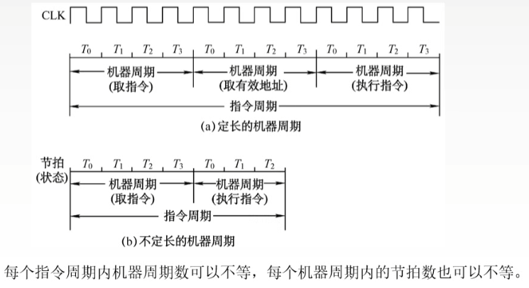
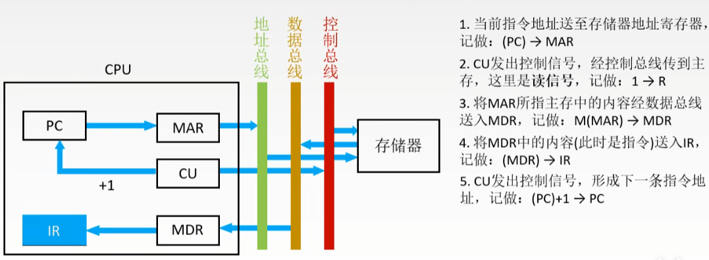
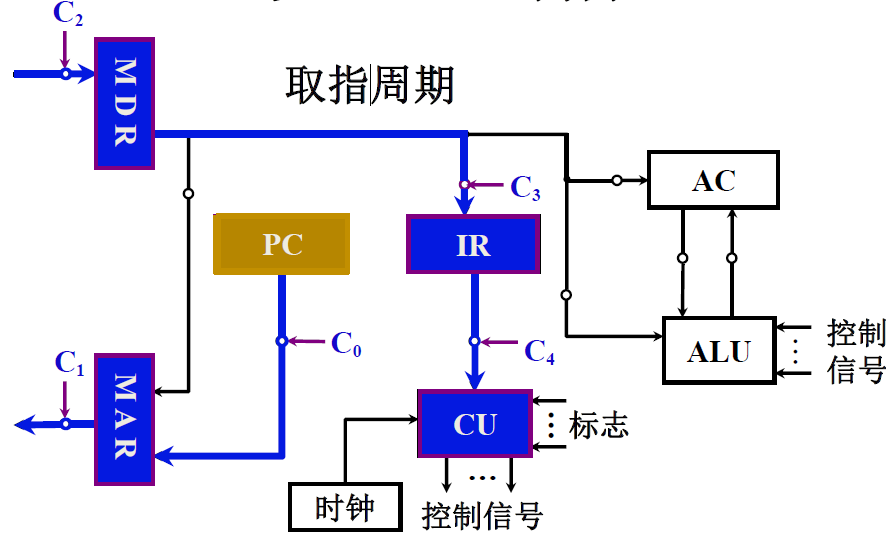
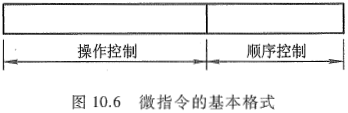

# Computer Organization

> 练拳不练功, 到老一场空. 基础不牢, 地动山摇.

# 第5章 CPU

> 从分析CPU 的**功能和内部结构**入手, 详细讨论机器完成一条指令的全过程, 以及为了进一步提高数据的处理能力, 开发系统的并行性所采取的**流水技术**. 此外, 本章还进一步概括了**中断技术**在提高整机系统效能方面的作用. 

## CPU的功能与基本结构

> CPU 实质包括运算器和控制器两大部分, 前面介绍过运算器, 这里重点介绍控制器的功能.

### CPU功能

对冯诺依曼结构的计算机而言, 一旦程序进入存储器后, 就可由计算机自动完成取指令和执行指令的任务, 控制器就是专用于完成此项工作的, 它负责协调并控制计算机各部件执行程序的指令序列, 其基本功能是取指令, 分析指令和执行指令.

### 控制器功能

1. 取指令
    控制器**必须具备能自动地从存储器中取出指令的功能**. 为此, 要求控制器**能自动形成指令的地址**, 并能**发出取指令的命令**, 将**对应此地址的指令取到控制器中**. **第一条指令的地址可以人为指定, 也可由系统设定.** 
2. 分析指令
    分析指令包括两部分内容: 其一, 分析此**指令要完成什么操作**, 即**控制器需发出什么操作命令**; 其二, **分析参与这次操作的操作数地址**, 即**操作数的有效地址**. 
3. 执行指令
    执行指令就是根据分析指令产生的"操作命令"和"操作数地址"的要求, 形成操作控制信号序列(不同的指令有不同的操作控制信号序列), 通过对运算器, 存储器以及I/O设备的操作, 执行每条指令. 

4. 中断处理

   控制器还必须能**控制程序的输入和运算结果的输**出(即控制主机与I/O设备交换信息)以及**对总线的管理**, 甚至能处理机器运行过程中出现的异常情况(如掉电)和特殊请求(如打印机请求打印一行字符), 即**处理中断的能力**. 

> 总之, CPU 必须具有控制程序的顺序执行(称**指令控制**), 产生完成每条指令所需的控制命令(称**操作控制**), 对各种操作加以时间上的控制(称**时间控制**), 对数据进行算术运算和逻辑运算(**数据加工**)以及**处理中断**等功能.

### CPU的结构

根据CPU 的功能不难设想, 要取指令, 必须有一个寄存器专用于存放当前指令的地址; 要分析指令, 必须有存放当前指令的寄存器和对指令操作码进行译码的部件; 要执行指令, 必须有一个能发出各种操作命令序列的控制部件CU; 要完成算术运算和逻辑运算, 必须有存放操作数的寄存器和实现算逻运算的部件ALU; 为了处理异常情况和特殊请求, 还必须有中断系统. 可见, CPU 可由四大部分组成. ALU 部件实际上只对CPU 内部寄存器的数据进行操作. 

#### 运算器基本结构

运算器接收从控制器送来的命令并执行相应的动作, 对数据进行加工和处理. 运算器是计算机对数据进行加工处理的中心. 它主要有ALU, 暂存寄存器, ACC, 通用寄存器, 程序状态字寄存器(PSW), 移位器, 计数器(CT)等组成.

如果几个寄存器同时向ALU输送数据, 那ALU就分不清是该怎么办了. 所以处理方式有三种:

- 多路选择器

  

- 用三态门

  

  > 上图写错了, 8个三态门都有自己的控制, R0out为0, 则R0中的数据不能传到A端.

- 用CPU内部单总线方式

  

  

其他的寄存器功能图示:

#### 控制器基本结构

#### CPU的寄存器

> CPU 中的寄存器大致可分两类:一类属于用户可见寄存器, 用户可对这类寄存器编程, 以及通过优化使CPU 因使用这类寄存器而减少对主存的访问次数; 另一类属于控制和状态寄存器, 用户不可对这类寄存器编程, 它们被控制部件使用, 以控制CPU的操作, 也可被带有特权的操作系统程序使用, 从而控制程序的执行.

- 用户可见寄存器

  > 通常CPU 执行机器语言访问的寄存器为用户可见寄存器, 按其特征又可分为以下几类.

  - 通用寄存器

    通用寄存器可由程序设计者指定许多功能, 可用于**存放操作数**, 也可作为**满足某种寻址方式所需的寄存器**.

  - 数据寄存器

    数据寄存器用于**存放操作数**, 其**位数应满足多数数据类型**的数值范围, 有些机器允许使用**两个连读的寄存器存放双倍字长的值**. 还有些机器的数据寄存器只能用于保存数据, 不能用于操作数地址的计算. 

  - 地址寄存器

    地址寄存器用于存放地址, 其本身可以具有通用性, 也可用千特殊的寻址方式. 地址寄存器的位数必须足够长, 以满足最大的地址范围. 

    用于特殊的寻址方式 段基值 栈指针

  - 条件码寄存器

    存放条件码, 可作程序分支的依据.

    条件码是CPU 根据运算结果由硬件设置的位, 如 正、负、零、溢出、进位等.

    在调用子程序前, 必须将所有的用户可见寄存器的内容保存起来, 这种保存可由CPU 自动完成, 也可由程序员编程保存, 视不同机器进行不同处理.

- 控制和状态寄存器

  CPU 中还有一类寄存器用于控制CPU的操作或运算. 在一些机器里, 大部分这类寄存器对用户是透明的.

  MAR, MDR, IR用户不可见,  PC用户可见.

  还有用来存放程序状态字PSW 的寄存器, 该寄存器用来存放条件码和其他状态信息. 在具有中断系统的机器中还有中断标记寄存器.

#### 控制单元和中断

控制单元(CU) 是提供完成计算机全部指令操作的微操作命令序列部件. 现代计算机中微操作命令序列的形成方法有两种: 一种是组合逻辑设计方法, 为硬连线逻辑; 另一种是微程序设计方法, 为存储逻辑.

#### 小结

## 指令周期

**CPU每`取出并执行`一条指令所需的全部时间**称为**指令周期**, 也即CPU完成一条指令的时间.

取指阶段完成取指令和分析指令的操作, **又称取指周期.**

执行阶段完成执行指令的操作, **又称执行周期**.

指令周期, 常常用若干**机器周期**来表示, 机器周期又叫**CPU周期**.

再细分, 一个**机器周期(CPU周期)** 又包含若干 **时钟周期**(节拍, T周期或CPU时钟周期, 为CPU操作最基本单位, 由**晶振**产生.)

为什么周期数可以不一样.

> CPU 在每条指令执行阶段结束前, 都要发中断查询信号, 以检测是否有某个I/O设备提出中断请求. 如果有请求,  CPU 则要进入中断响应阶段, 又称中断周期. 在此阶段, CPU 必须将程序断点保存到存储器中. 这样, 一个完整的指令周期应包括取指, 间址, 执行和中断4 个子周期.

### 指令周期流程

> FE, IND, EX和INT分别对应取指, 间址, 执行和中断4 个周期, 并以"1"状态表示有效, 它们分别由1→FE, l→IND, l→EX和l→INT这4个信号控制.
>
> 注: 中断周期的进栈操作是将SP减1, 因为计算机的堆栈是当低地址增加数据的, 所以进栈操作SP要减1.

### 指令周期的数据流

为了便于分析指令周期中的数据流, 假设CPU中有存储器地址寄存器MAR, 存储器数据寄存器MDR, 程序计数器PC 和指令寄存器IR.

#### 取指周期的数据流

PC 中存放现行指令的地址, 该地址送到MAR并送至地址总线, 然后由控制部件CU向存储器发读命令, 使对应MAR所指单元的内容(指令)经数据总线送至MDR, 再送至IR, 并且CU控制PC内容加1, 形成下一条指令的地址.

#### 间址周期的数据流

一旦取指周期结束, **CU便检查IR中的内容, 以确定其是否有间址操作**, 如果需要间址操作, 则MDR 中指示形式地址的右N位(记作Ad(MDR) )将被送到MAR, 又送至地址总线, 此后CU向存储器发读命令, 以获取有效地址并存至MDR.

或者是这种流程:

#### 执行周期的数据流

由于不同的指令在执行周期的操作不同, 因此执行周期的数据流是多种多样的, 可能涉及CPU 内部寄存器间的数据传送, 对存储器(或I/O)进行读写操作或对ALU的操作, 因此, 无法用统一的数据流图表示.

#### 中断周期的数据流

**中断周期, 就是为了保存程序断点的.** CPU进入中断周期要完成一系列操作, 其中PC当前的内容必须保存起来, 以待执行完中断服务程序后可以准确返回到该程序的间断处.

> 由CU把用于保存程序断点的存储器特殊地址(如栈指针的内容)送往MAR, 并送到地址总线上, 然后由CU向存储器发写命令, 并将PC 的内容(程序断点)送到MDR, 最终使程序断点经数据总线存入存储器. 此外, CU 还需将中断服务程序的入口地址送至PC, 为下一个指令周期的取指周期做好准备.

### 指令执行方案

一个指令周期通常包括几个时间段(执行步骤), 每个步骤完成指令的一部分功能, 几个依次执行的步骤, 完成这条指令的全部功能. 处于性能和硬件成本等考虑. 可选三种不同方案安排指令的执行步骤.

#### 单指令周期

定义: 对所有指令, 都选用相同的执行时间来完成. 此时每条指令都在固定的时钟周期内完成, 指令之间串行执行, 即下一条指令只能在上一条指令执行结束后才能启动. 故, 指令周期取决于执行时间最长的指令的执行时间.

本来可以用短时间完成的指令, 却也要用较长的周期完成. 降低整个系统的运行效率.

#### 多指令周期

定义: 对不同类型的指令选用不同的执行步骤完成. 指令之间依旧是串行执行, 但可以选用不同个数的时钟周期来完成不同指令的执行过程, 指令需要几个周期为它分配几个周期, 而不再要求所有指令用相同执行时间. 

需要更复杂的硬件设计. 可以提高执行效率.

#### 流水线方案

指令之间可以并行执行的方案. 其追求的目标是力争在每个时钟脉冲周期完成一条指令的执行过程(理想情况才能达成). 这种方案通过在每个时钟周期启动一条指令, 尽量让多条指令同时运行, 但各自处在不同的执行步骤中.

## 数据通路

### 数据通路的功能

数据通路: 数据在功能部件之间传送的路径. 

路径上的部件成为 数据通路部件, 如ALU,通用寄存器,状态寄存器,异常和中断处理逻辑等.

数据通路描述了信息从何处开始,中间经过哪个寄存器或多路开关, 最后传到哪个寄存器, 这些都需要加以控制.

数据通路中**专门进行数据运算的部件**称为 **执行部件**或**功能部件**. 数据通路由控制部件控制, 控制部件根据每条指令功能的不同生成对数据通路的控制信号, 并正确控制指令的执行流程. 

**数据通路的功能是实现CPU内的运算器与寄存器及寄存器之间的数据交换.**

### 数据通路的基本结构

1. CPU内部单总线方式

   将所有寄存器的输入端与输出端都连接到一条公共通路上. 这种结构较为简单, 但数据传输存在较多的冲突现象, 性能较低. 连接各部件的总线只有一条时, 称为单总线结构. CPU中有两条或更多的总线时, 构成双总线结构或多总线结构.

   

   > in 表示该部件的允许输入控制信号. out表示该部件的允许输出控制信号.

2. CPU内部三总线方式

   将所有寄存器的输入输出端都连接到多条公共通路上, 相比单总线, 同时在多个总线上传输不同的数据, 提高效率.

3. 专用数据通路方式

   根据指令执行过程中的数据和地址的流动方向安排连接线路, 避免使用共享的总结, 性能较高, 但硬件量大.

> 注: 内部总线是指同一部件, 如CPU内部连接各寄存器及运算部件之间的总线.
>
> 系统总线指同一台计算机系统的各部件, 如CPU,内存

**以CPU内部单总线为例 理解数据通路的功能.**

- 寄存器之间数据传送

  

- 主存与CPU之间的数据传送

  

- 执行算术或逻辑运算

  

看一个例题:

**以专用数据通路方式理解**:

- 取指周期

  

其他的周期类似.

## 控制器

> 结合指令周期的4个阶段, 着重分析控制单元为完成不同指令所发出的各种操作命令—这些命令(又称控制信号)控制计算机的所有部件有次序地完成相应的操作, 以达到执行程序的目的. 进一步理解指令周期, 机器周期, 时钟周期(节拍)和控制信号的关系, 进一步体会控制单元在机器运行中所起到的核心作用, 为控制单元的设计打好基础. 

### 微操作命令的分析

控制单元具**有发出各种微操作命令(即控制信号)序列的功能**. 

计算机的功能就是执行程. 在执行程序的过程中, 控制单元要发出各种微操作命令, 而且不同的指令对应不同的命令. 进一步分析发现, 完成不同指令的过程中, 有些操作是相同或相似的, 如取指令, 取操作数地址(当间接寻址时)以及进入中断周期由中断隐指令完成的一系列操作. 下面按指令周期的4 个阶段进一步分析其对应的微操作命令.

#### 取指周期

取指令的过程可归纳为以下几个操作:

1. 现行指令地址送至存储器地址寄存器,记作PC→MAR.

2. 向主存发送读命令, 启动主存做读操作, 记作1→R. 

3. 将MAR (通过地址总线)所指的主存单元中的内容(指令)经数据总线读至MDR内, 记作M(MAR)→MDR.

4. 将MDR的内容送至IR, 记作MDR→IR.

5. 指令的操作码送至CU译码, 记作OP(IR)→CU.

6. 形成下一条指令的地址, 记作(PC)+1→PC.

   

#### 间址周期

间址周期完成取操作数有效地址的任务, 具体操作如下:
1. 将指令的地址码部分(形式地址)送至存储器地址寄存器, 记作Ad(IR)→MAR . 

2. 向主存发送读命令, 启动主存做读操作, 记作1→R . 

3. 将MAR(通过地址总线)所指的主存单元中的内容(有效地址)经数据总线读至MDR内, 记作M(MAR)→MDR.

4. 将有效地址送至指令寄存器的地址字段, 记作MDR→Ad(IR). 此操作在有些机器中可省略.

   

#### 执行周期

不同指令执行周期的微操作是不同的, 下面分别讨论**非访存指令, 访存指令和转移类指令**的微操作.

1. **非访存指令**

   (1) **清除累加器指令CLA**
   该指令在执行阶段只完成清除累加器操作, 记作`0→ACC`.
   (2) **累加器取反指令COM**
   该指令在执行阶段只完成ACC内容取反, 结果送ACC的操作, 记作`ACC*→ACC` .(\*代表上面有横线, 即取反)
   (3) **算术右移一位指令SHR**
   该指令在执行阶段只完成累加器内容算术右移一位的操作, 记作`L(ACC)→R(ACC),ACC0→ACC0` (ACC 的符号位不变)
   (4) **循环左移一位指令CSL**
   该指令在执行阶段只完成累加器内容循环左移一位的操作, 记作`R(ACC)→L(ACC), ACC0→ACCn`(或p\^-1(ACC) )
   (5) **停机指令STP**
   计算机中有一个运行标志触发器G, 当G=1时, 表示机器运行; 当G=O 时, 表示停机. STP指令在执行阶段只需将运行标志触发器置"0", 记作`0→G`. 

2. **访存指令**

   这类指令在执行阶段都需要访问存储器. 为简单起见, 这里只考虑直接寻址的情况, 不考虑其他寻址方式.
   (1) **加法指令`ADD X`**
   该指令在执行阶段需要完成累加器内容与对应于主存X地址单元的内容相加, 结果送累加器的操作,具体如下:
   a.将指令的地址码部分送至存储器地址寄存器, 记作`Ad(IR) → MAR`.
   b.向主存发读命令, 启动主存做读操作, 记作`1→R`.
   c.将MAR (通过地址总线)所指的主存单元中的内容(操作数)经数据总线读至MDR 内, 记作`M(MAR)→MDR`.
   d.给ALU发送加命令, 将ACC的内容和MDR的内容相加,结果存于ACC, 记作`(ACC)+(MDR)→ACC`.
   当然, 也有的加法指令指定两个寄存器的内容相加, 如"ADD AX,BX", 该指令在执行阶段无须访存, 只需完成`(AX)+(BX)→AX` 的操作.

   (2) **存数指令`STA X`**
   该指令在执行阶段需将累加器ACC的内容存于主存的X地址单元中, 具体操作如下:
   a.将指令的地址码部分送至存储器地址寄存器, 记作`Ad(IR)→MAR`.
   b.向主存发写命令, 启动主存做写操作, 记作`1→W`
   c.将累加器内容送至MDR, 记作`ACC→MDR`
   d.将MDR 的内容(通过数据总线)写入MAR (通过地址总线)所指的主存单元中,记作`MDR→M(MAR)`.

   (3) **取数指令`LDA X`**
   该指令在执行阶段需将主存X 地址单元的内容取至累加器ACC 中, 具体操作如下:
   a.将指令的地址码部分送至存储器地址寄存器, 记作`Ad(IR)→MAR`.
   b.向主存发读命令, 启动主存作读操作, 记作`1→R`.
   c.将MAR(通过地址总线)所指的主存单元中的内容(操作数)经数据总线读至MDR 内, 记作`M(MAR)→MDR`.
   d.将MDR的内容送至ACC, 记作`MDR→ACC`.

3. **转移类指令**

   这类指令在执行阶段也不访问存储器.

   (1) **无条件转移指令`JMP X`**
   该指令在执行阶段完成将指令的地址码部分X送至PC 的操作, 记作`Ad(IR)→PC` .

   (2) **条件转移(负则转)指令`BAN X`**
   该指令根据上一条指令运行的结果决定下一条指令的地址, 若结果为负(累加器最高位为1, 即A0＝1) , 则指令的地址码送至PC, 否则程序按原顺序执行. 由于在取指阶段已完成了(PC)+1→PC, 所以当累加器结果不为负(即A0 =0) 时, 就按取指阶段形成的PC 执行, 记作`A0·Ad(IR) ＋A0*·(PC)→PC`.

由此可见, 不同指令在执行阶段所完成的操作是不同的. 如果将访存指令分为直接访存和间接访存两种, 则上述三类指令的指令周期如图:

#### 中断周期

在执行周期结束时刻,  CPU 要查询是否有请求中断的事件发生, 如果有则进入中断周期. 

在中断周期, 由**中断隐指令自动完成保护断点**, **寻找中断服务程序入口**地址以及**硬件关中断**的操作. 假设程序断点存至主存的0地址单元, 且采用**硬件向量法寻找入口地址**, 则在中断周期需完成如下操作:

1. 将特定地址"0"送至存储器地址寄存器, 记作`0→MAR` 或`(SP)-1→MAR`

2. 向主存发写命令, 启动存储器作写操作, 记作`1→W`

3. 将PC的内容(程序断点)送至MDR, 记作`PC→MDR`.

4. 将MDR 的内容(程序断点)通过数据总线写入MAR (通过地址总线)所指示的主存单元(0 地址单元)中, 记作`MDR→M(MAR)`.

5. 将向量地址形成部件的输出送至PC, `向量地址(中断识别程序入口地址M)→PC`, 为下一条指令的取指周期做准备.

6. 关中断, 将允许中断触发器清零, 记作`0→EINT `(该操作可直接由硬件线路完成).

如果程序断点存入堆栈, 而且进栈操作是先修改栈指针, 后存入数据, 只需将上述1.改为(SP)-1→SP, 且SP→MAR . 
上述所有操作都是在控制单元发出的控制信号(即微操作命令)控制下完成的.

### 控制单元的功能

#### 控制单元的输入输出(外特性)

- **输入信号**

  - **时钟**

    上述各种操作有以下两点应特别注意:

    a. 完成每个操作都需占用一定的时间.

    b. 各个操作是有先后顺序的. 如存储器读操作要用到MAR中的地址, 故`PC→MAR` 应先于`M(MAR)→MDR`.

    为了使控制单元按一定的先后顺序, 一定的节奏发出各个控制信号, **控制单元必须受时钟控制**, 即每一个**时钟脉冲**使**控制单元发送一个操作命令**, 或发送**一组需要同时执行的操作命令**.

  - **指令寄存器(IR)**

    现行指令的操作码决定了不同指令在执行周期所需完成的不同操作, 故指令的**操作码字段**是控制单元的输入信号, 它与时钟配合可产生不同的控制信号. `OP(IR)→CU`

  - **标志**

    控制单元有时需依赖CPU当前所处的状态(如ALU 操作的结果)产生控制信号, 如BAN指令, 控制单元要根据上条指令的结果是否为负而产生不同的控制信号. 因此"标志"也是控制单元的输入信号.

  - **来自系统总线(控制总线)的控制信号**
    如, 中断请求(INTR), DMA请求, HRQ(总线请求)等

- **输出信号**

  - **CPU内的控制信号**
    主要用于CPU 内的寄存器之间的传送和控制ALU 实现不同的操作.

    Ri→Rj,  (PC) + 1→ PC,  给ALU的＋,－,与, 或等

  - **送至系统总线(控制总线)的信号**
    如, 命令主存或I/O  读/写, 中断响应等

    

#### 控制信号

控制单元的主要功能就是能发出各种不同的控制信号. 下面以间接寻址的加法指令"ADD @X” 为例, 进一步理解控制信号在完成一条指令的过程中所起的作用. (与前面数据通路一致.)

- **不采用CPU内部总线的方式**

  

  图中未画出每个寄存器的输入或输出控制门, 但标出了控制这些门电路的控制信号Ci, 考虑到从存储器取出的指令或有效地址都先送至MDR再送至IR, 故这里省去了IR 送至MAR 的数据通路, 凡是需要从IR送至MAR的操作均可由MDR 送至MAR代替.

  (1) 取指周期

  

  a. 控制信号C0有效, 打开PC送往MAR 的控制门. 
  b. 控制信号C1有效, 打开MAR送往地址总线的输出门.
  c. 通过控制总线向主存发读命令.
  d. C2有效,打开数据总线送至MDR的输入门.
  e. C3有效,打开MDR和IR之间的控制门, 至此指令送至IR.
  f.  C4有效,打开指令操作码送至CU的输出门. CU在操作码和时钟的控制下, 可产生各种控制信号.
  g. 使PC内容加1.

  (2) 间址周期

  

  a. C5有效, 打开MDR和MAR之间的控制门, 将指令的形式地址送至MAR. 
  b. C1有效, 打开MAR 送往地址总线的输出门. 
  c. 通过控制总线向主存发读命令. 
  d. C2有效, 打开数据总线送至MDR的输入门, 至此, 有效地址存入MDR. 
  e. C3有效, 打开MDR 和IR之间的控制门, 将有效地址送至IR 的地址码字段.

  (3) 执行周期

  

  a. C5有效, 打开MDR 和MAR 之间的控制门, 将有效地址送至MAR . 
  b. C1有效, 打开MAR 送往地址总线的输出门. 
  c. 通过控制总线向主存发读命令. 
  d. C2 有效, 打开数据总线送至MDR 的输入门, 至此, 操作数存入MDR . 
  e. C6 C7同时有效, 打开AC 和MDR 通往ALU 的控制门. 
  f. 通过CPU 内部控制总线对ALU 发"ADD"加控制信号, 完成AC 的内容和MDR的内容相加.
  g. C8有效, 打开ALU 通往AC 的控制门, 至此将求和结果存入AC.

  图中C9和C10 分别是控制PC 的输出和输入的控制信号,  C11和C12分别是控制AC 的输出和输入的控制信号.

- **采用CPU 内部总线的方式**

  

  > 图中每一个小圈处都有一个控制信号, 它控制寄存器到总线或总线到寄存器之间的传送.
  >
  > 例如,  IRi 表示控制从内部总线到指令寄存器的输入控制门; PCo表示控制从程序计数器到内部总线的输出控制门. 下标为i 表示输入控制, 下标为o 表示输出控制, 以此类推.
  >
  > 两个寄存器Y和Z, 这是由于ALU 是一个组合逻辑电路, 在其运算过程中必须保持两个输入端不变, 其中一个输入可以从Y 寄存器中获得, 另一个输入可以从内部总线上获得. 当CPU 内有多个通用寄存器时, 由于设置了寄存器Y, 可实现任意两个寄存器之间的算逻运算. 此外,  ALU 的输出不能直接与内部总线相连, 因为其输出又会通过总线反馈到ALU 的输入, 影响运算的正确性, 故用寄存器Z 暂存运算结果, 再根据需要送至指定的目标.

  (1) 取指周期

  

  a. PCo和MARi有效, 完成PC经内部总线送至MAR的操作, 即PC→MAR.
  b. 通过控制总线(图中未画出)向主存发读命令, 即1→R.
  c. 存储器通过数据总线将MAR所指单元的内容(指令)送至MDR.
  d. MDRo和IRi有效, 将MDR的内容送至IR, 即MDR→IR, 至此, 指令送至IR, 其操作码字段开始控制CU即OP(IR)→CU
  e. 使PC内容加1(图中未标出).

  (2) 间址周期

  

  a. MDRo和MARi有效, 将指令的形式地址经内部总线送至MAR, 即MDR→MAR.
  b. 通过控制总线向主存发读命令, 即1→R.
  c. 存储器通过数据总线将MAR所指单元的内容(有效地址)送至MDR.
  d. MDRo和IRi有效,将MDR中的有效地址送至IR的地址码字段, 即MDR→Ad(IR).

  (3) 执行周期

  

  a. MDRo和MARi有效, 将有效地址经内部总线送至MAR, 即MDR→MAR.
  b. 通过控制总线向主存发读命令, 即1→R.
  c. 存储器通过数据总线将MAR 所指单元的内容(操作数)送至MDR.
  d. MDRo和Yi有效, 将操作数送至Y, 即MDR→Y . 
  e. ACo和ALUi有效, 同时CU向ALU发"ADD"加控制信号, 使AC的内容和Y的内容相加
  (Y的内容送至ALU不必通过总线),结果送寄存器Z , 即(AC)+(Y)→Z . 
  f. Zo和ACi 有效, 将运算结果存入AC, 即Z→AC . 

  > 现代计算机的CPU都集成在一个硅片内, 在芯片内采用内部总线的方式可大大节省芯片内部寄存器之间的连线, 使芯片内各部件布局更合理.

#### 多级时序系统

> - **机器周期**

机器周期可看作**所有指令执行过程中的一个基准时间**, 机器周期取决于**指令的功能及器件的速度**. 确定机器周期时, 通常要**分析机器指令的执行步骤**及**每一步骤所需的时间**. 

> 如, 取数, 存数指令能反映存储器的速度及其与CPU 的配合情况; 加法指令能反映ALU 的速度; 条件转移指令因为要根据上一条指令的执行结果, 经测试后才能决定是否转移, 所需的时间较长.

总之, 通过对机器指令执行步骤的分析, 会找到一个**基准时间**, 在这个基准时间内, **所有指令的操作都能结束**. 若以这个基准时间定为机器周期, 显然不是最合理的. 因为只有**以完成复杂指令功能所需的时间(最长时间) 作为基准**, 才能保证所有指令在此时间内完成全部操作, 这对简单指令来说, 显然是一种浪费.

进一步分析发现, 机器内的各种操作大致可归属为对**CPU内部的操作和对主存的操作**两大类, 由于CPU 内部的操作速度较快, CPU访存的操作时间较长, 因此**通常以访问一次存储器的时间定为基准时间较为合理**, 这个基准时间就是机器周期. 又由于不论执行什么指令, 都需要访问存储器取出指令, 因此在**存储字长等于指令字长的前提下, 取指周期也可看作机器周期.**

> - **时钟周期(节拍、状态)**

在一个机器周期里可完成若干个微操作, 每个微操作都需要一定的时间, 可用时钟信号来控制产生每一个微操作命令.

时钟就好比计算机的心脏, 只要接通电源, 计算机内就会产生时钟信号. 时钟信号可由机器主振电路(如晶体振荡器) 发出的脉冲信号经整形(或倍频、分频)后产生, **时钟信号的频率即为CPU 主频**. 用**时钟信号控制`节拍发生器`**, 就可产生节拍. **每个节拍的宽度正好对应一个时钟周期**. 在**每个节拍内机器可完成一个或几个需同时执行的操**作, 它是控制计算机操作的**最小时间单位**. 

> - 多级时序系统

图9.9 反映了指令周期, 机器周期, 节拍(状态) 和时钟周期的关系. 可见, 一个**指令周期**包含若干个**机器周期**, 一个机器周期又包含若干个**时钟周期(节拍),** 每个指令周期内的**机器周期数**可以不等, 每个机器周期内的**节拍数**也可以不等. 其中, 图9.9(a)为**定长的机器周期**, 每个机器周期包含4个节拍(4个T); 图9.9(b)为**不定长的机器周期**, 每个机器周期包含的节拍数可以为4 个, 也可以为3 个, 后者适合操作比较简单的指令, 它可跳过某些时钟周期(如T3), 从而缩短指令周期. 
**机器周期, 节拍(状态)组成了多级时序系统.**

> 一般来说, CPU的主频越快, 机器的运行速度也越快. 在机器周期所含时钟周期数相同的前提下, 两机平均指令执行速度之比等于两机主频之比.(MIPS/MIPS2 = f1/f2) 
>
> 实际上机器的速度不仅与**主频**有关, 还与机器周期中所含的时钟周期数以及指令周期中所含的机器周期数有关. 同样主频的机器, 由于机器周期所含时钟周期数不同, 运行速度也不同. 机器周期所含时钟周期数少的机器, 速度更快. 
>
> 时钟周期 就是 主频的倒数.

#### 控制方式

通常将如何**形成控制不同微操作序列所采用的时序控制方式**称为CU的控制方式.常见的控制方式有同步控制、异步控制、联合控制和人工控制四种.

> 控制单元控制一条指令执行的过程实质上是依次执行一个确定的微操作序列的过程. 由于不同指令所对应的微操作数及其复杂程度不同, 因此每条指令和每个微操作所需的执行时间也不同.

1. **同步控制方式**

   同步控制方式是指, 任何一条指令或指令中任何一个微操作的执行都是事先确定的, 并且都是受**统一基准时标**的时序信号所控制的方式. 

   

   > 如果机器内的存储器存取周期不统一, 那么只有把最长的存取周期作为机器周期, 才能采用同步控制, 否则取指令和取数时间不同, 无法用统一的基准. 又如有些不访存的指令, 执行周期的微操作较少, 无须4个节拍. 因此, 为了提高CPU 的效率,在同步控制中又有三种方案.

   (1) 采用定长的机器周期

   以 最长 的微操作序列和 最复杂 的微操作作为 标准, 机器周期内 节拍数相同

   > 不论指令所对应的微操作序列有多长, 也不管微操作的简繁, 一律以最长的微操作序列和最繁的微操作作为标准, 采取完全统一的, 具有相同时间间隔和相同数目的节拍作为机器周期来运行各种不同的指令.

   显然, 这种方案对千微操作序列较短的指令来说, 会造成时间上的浪费..

   (2) 采用不定长的机器周期

   每个机器周期内的节拍数可以不等, 可解决微操作执行时间不统一的问题. 通常把大多数微操作安排在一个较短的机器周期内完成, 而对某些复杂的微操作, 采用延长机器周期或增加节拍的办法来解决.

   

   (3) 采用中央控制和局部控制相结合的方法

   将机器的大部分指令安排在统一的, 较短的机器周期内完成, 称为中央控制; 而将少数操作复杂的指令中的某些操作(如乘除法和浮点运算等)采用局部控制方式来完成.

   

   > 注意两点: 其一, 使局部控制的每一个节拍T\*的宽度与中央控制的节拍宽度相同; 其二, 将局部控制节拍作为中央控制中机器节拍的延续, 插入中央控制的执行周期内, 使机器以同样的节奏工作, 保证局部控制和中央控制的同步. T\*的多少可根据情况而定, 对于乘法, 当操作数位数固定后, T\*的个数也就确定了. 而对于浮点运算的对阶操作, 由于移位次数不是一个固定值, 因此T\*的个数不能事先确定.

2. **异步控制方式**

   异步控制方式**不存在基准时标信号**, **没有固定的周期节拍和严格的时钟同步**, 执行每条指令和每个操作需要多少时间就占用多少时间. 这种**方式**微操作的时序由专门的**应答**线路控制, 即当CU发出执行某一微操作的控制信号后, 等待执行部件完成该操作后发回"回答"(或"结束")信号, 再开始新的微操作, 使CPU 没有空闲状态, 但因需要采用各种应答电路, 故其结构比同步控制方式复杂.

3. **联合控制方式**

   同步控制和异步控制相结合就是联合控制方式. 这种方式对各种不同指令的微操作实行大部分统一, 小部分区别对待的办法.

   例如, 对每条指令都有的取指令操作, 采用同步方式控制; 对那些时间难以确定的微操作, 如I/O操作, 则采用异步控制, 以执行部件送回的“回答“信号作为本次微操作的结束.

4. **人工控制方式**

   人工控制是为了调机和软件开发的需要, 在机器面板或内部设置一些开关或按, 来达到人工控制的目的.

   (1) Reset (复位)键
   按下Reset 键, 使计算机处于初始状态. 当机器出现死锁状态或无法继续运行时, 可按此键. 若在机器运行时按此键, 将会破坏机器内某些状态而引起错误, 因此要慎用. 有些微型计算机未设此键, 当机器死锁时, 可采用停电后再加电的办法重新启动计算机.
   (2) 连续或单条执行转换开关
   由于调机的需要, 有时需要观察执行完一条指令后的机器状态, 有时又需要观察连续运行程序后的结果, 设置连续或单条执行转换开关, 能为用户提供这两种选择. 
   (3) 符合停机开关
   有些计算机还配有符合停机开关, 这组开关指示存储器的位置, 当程序运行到与开关指示的地址相符时, 机器便停止运行, 称为符合停机.

### 控制单元的设计

#### 组合逻辑设计(硬布线)

> - **组合逻辑控制单元框图**

从控制单元的输入输出可知, **指令的操作码是决定控制单元发出不同控制信号的关键**.为了简化控制单元的逻辑, 将存放在IR的n位操作码经过一个译码电路产生2^n个输出, 这样, 每对应一种操作码便有一个输出送至CU. 当然, 若指令的操作码长度可变, 指令译码线路将更复杂.

控制单元的时钟输入实际上是一个脉冲序列, 其频率即为机器的主频, 它使CU 能按一定的节拍(T) 发出各种控制信号. 节拍的宽度应满足数据信息通过数据总线从源到目的所需的时间. 以时钟为计数脉冲, 通过一个计数器, 又称节拍发生器, 便可产生一个与时钟周期等宽的节拍序列. 如果将指令译码和节拍发生器从CU 中分离出来, 便可得简化的控制单元框图.

设计步骤:
一. 分析每个阶段的微操作序列.
二. 选择控制方式
三. 安排微操作时序
四. 电路设计

> - **微操作的节拍安排**

假设机器采用**同步控制**, 每个**机器周期包含3个节拍**, 而且CPU内部结构如下图所示, 其中MAR 和MDR 分别直接和地址总线和数据总线相连, 并假设IR的地址码部分与MAR之间有通路. 

**安排微操作时序3点原则**:

a. 有些微操作的次序是不容改变的, 故**安排微操作节拍时必须注意微操作的先后顺序**. 
b. 凡是**被控制对象不同的微操作**, 若能在一个节拍内执行, 应**尽可能安排在同一个节拍内, 以节省时间**. 
c. 如果有些**微操作所占的时间短,** 应该**将它们安排在一个节拍内完成**, 并且**允许这些微操作有先后次序**.

1. 取值周期微 操作的节拍安排

   

2. 间址周期 微操作的 节拍安排

   

3. 执行周期 微操作的 节拍安排

   

   

   

4. 中断周期 微操作的 节拍安排

   在执行周期的最后时刻,  CPU 要向所有中断源发中断查询信号, 若检测到某个中断源有请求, 并且未被屏蔽又被排队选中, 则在允许中断的条件下,  CPU 进入中断周期, 此时CPU 由中断隐指令完成下列操作(假设程序断点存入主存0 号地址单元内)：
   

> - **组合逻辑设计步骤**

先根据上述10 条指令微操作的节拍安排, **列出微操作命令的操作时间表**, 然后写出每一个**微操作命令(控制信号)的逻辑表达式**, 最后根据逻辑表达式画出相应的**组合逻辑电路图**.

1. 列出操作时间表

   

   

   

   各操作的微操作:

   

   

   

2. 写出微操作命令的最简表达式

   

   > ADD, STA, LDA, JMP, BAN均来自操作码译码器的输出

3. 画出逻辑图

   

#### 微程序设计

> - **微程序设计思想的产生**

英国剑桥大学教授M.V.Wilkes 在1951 年首先提出.

为了克服组合逻辑控制单元线路庞杂的缺点.

设想采用与存储程序相类似的方法, 来解决微操作命令序列的形成.

> Wilkes 提出, 将一条机器指令编写成一个微程序, 每一个微程序包含若干条微指令, 每一条微指令对应一个或几个微操作命令. 然后把这些微程序存到一个控制存储器中, 用寻找用户程序机器指令的方法来寻找每个微程序中的微指令. 由千这些微指令是以二进制代码形式表示的, 每位代表一个控制信号(若该位为1 , 表示该控制信号有效; 若该位为0 , 表示此控制信号无效), 因此, 逐条执行每一条微指令, 也就相应地完成了一条机器指令的全部操作. 可见, 微程序控制单元的核心部件是一个控制存储器. 由于执行一条机器指令必须多次访问控制存储器, 以取出多条微指令来控制执行各个微操作, 因此要求控制存储器的速度较高. 
>
> 微程序设计省去了组合逻辑设计过程中对逻辑表达式的化简步骤, 无须考虑逻辑门级数和门的扇入系数, 使设计更简便, 而且由于控制信号是以二进制代码的形式出现的, 因此只要修改微指令的代码, 就可改变操作内容, 便于调试, 修改, 甚至增删机器指令, 利于计算机仿真.

> - **微程序控制单元框图及工作原理**

> 1. 机器指令对应的微程序

   采用微程序设计方法设计控制单元的过程就是**编写每一条机器指令的微程序**, 它是按执行每条机器指令所需的微操作命令的先后顺序而编写的, 因此, 一条机器指令对应一个微程序, 如图10.4所示. 图中每一条机器指令都与一个以操作性质命名的微程序对应. 

   

由于任何一条机器指令的取指令操作是相同的, 因此将取指令操作的命令统一编成一个微程序, 这个微程序只负责将指令从主存单元中取出送至指令寄存器中, 如图10.4 所示的取指周期微程序. 此外, 如果指令是间接寻址, 其操作也是可以预测的, 也可先编出对应间址周期的微程序. 当出现中断时, 中断隐指令所需完成的操作可由一个对应中断周期的微程序控制完成. 这样, 控制存储器中的微程序个数应为机器指令数再加上对应取指, 间接寻址和中断周期的3 个微程序.

> 2. 微程序控制单元的基本框图

   图10.5 示意了微程序控制单元的基本组成.

   

点画线框内的**控制存储器(简称控存)**是**微程序控制单元的核心部件**, **用来存放全部微程序**; CMAR 是**控存地址寄存器**, 用来存放欲读出的微指令地址; CMDR 是**控存数据寄存器**, 用来存放从控存读出的微指令; **顺序逻辑**是用来**控制微指令序列**的, 具体就是**控制形成下一条微指令(即后续微指令)的地址**, 其**输入与微地址形成部件(与指令寄存器相连), 微指令的下地址字段以及外来的标志有关.**

微指令的基本格式如图10.6 所示, 共分两个字段, 一个为**操作控制字段**, 该字段**发出各种控制信号**; 另一个为**顺序控制字段**, 它可**指出下条微指令的地址(简称下地址)**, 以控制微指令序列的执行顺序. 

> 3. 工作原理

   

   > 它存于以2000H 为首地址的主存空间内.
   >
   > 首先将用户程序的首地址送至PC, 然后进入取指阶段.

   - 取指阶段

     a. 将取指周期微程序首地址M→CMAR.
     b. 取微指令.
     将对应控存M地址单元中的第一条微指令读到控存数据寄存器中, 记作CM(CMAR)→CMDR.
     c. 产生微操作命令.

     > 第一条微指令的操作控制字段中为"1" 的各位发出控制信号, 如PC→MAR, 1→R , 命令主存接收程序首地址并进行读操作.

     d. 形成下一条微指令的地址.
     此微指令的顺序控制字段指出了下一条微指令的地址为M+1, 将M+1送至CMAR, 即Ad(CMDR)→CMAR 。
     e. 取下一条微指令.
     将对应控存M+1地址单元中的第二条微指令读到CMDR 中, 即CM(CMAR)→CMDR.
     f. 产生微操作命令。
     由第二条微指令的操作控制字段中对应"1"的各位发出控制信号, 如M(MAR)→MDR使对应主存2000H地址单元中的第一条机器指令从主存中读出送至MDR 中.
     g. 形成下一条微指令的地址。
     将第二条微指令下地址字段指出的地址M+2送至CMAR, 即Ad(CMDR) →CMAR.

     ......

     以此类推, 直到取出取指周期最后一条微指令, 并发出微操作命令为止.此时第一条机器指令"LDA X” 已存至指令寄存器IR 中.

     

   - 执行阶段
     a. 取数指令微程序首地址的形成.
     当取数指令存入IR 后, 其操作码OP(IR) 直接送到微地址形成部件, 该部件的输出即为取数指令微程序的首地址P, 且将P 送至CMAR, 记作OP(IR) 一微地址形成部件→CMAR 。
     b. 取微指令.
     将对应控存P 地址单元中的微指令读到CMDR 中, 即CM(CMAR) →CMDR 。
     c. 产生微操作命令。
     由微指令操作控制字段中对应”1" 的各位发出控制信号, 如Ad(IR)→MAR, 1→R , 命令主存读操作数.
     d. 形成下一条微指令的地址.
     将此条微指令下地址字段指出的P+1送至CMAR, 即Ad(CMDR)→CMAR.
     e. 取微指令，即CM(CMAR) →CMDR 。
     f. 产生微操作命令.
     .....

     以此类推, 直到取出取数指令微程序的最后一条微指令P+2, 并发出微操作命令. 至此即完成了将主存X 地址单元中的操作数取至累加器AC的操作. 这条微指令的顺序控制字段为M, 即表明CPU又开始进入下一条机器指令的取指周期, 控存又要依次读出取指周期微程序的逐条微指令, 发出微操作命令, 完成将第二条机器指令“ADDY“ 从主存取至指令寄存器IR 中……微程序控制单元就是这样, 通过逐条取出微指令, 发出各种微操作命令, 从而实现从主存逐条取出, 分析并执行机器指令, 以达到运行程序的目的.

     

> 由此可见, 对微程序控制单元的控存而言, 内部信息一旦按所设计的微程序被灌注后, 在机器运行过程中, 只需具有读出的性能即可, 故可采用ROM. 此外, 在微程序的执行过程中, 关键问题是如何由微指令的操作控制字段形成微操作命令, 以及如何形成下一条微指令的地址. 这是微程序设计必须解决的问题, 它们与微指令的编码方式和微地址的形成方式有关.

> - **微指令的编码方式(控制方式)**

1. 直接编码(直接控制)方式

   在微指令的操作控制字段中, 每一位代表一个微操作命令, 这种编码方式即为直接编码方式. 

   

   上面所述的用控制字段中的某位为"1"表示控制信号有效(如打开某个控制门, 以及某位为“0” 表示控制信号无效(如不打开某个控制门)就是直接控制方式, 如图10.7 所示, **这种方式含义清晰**, 而且只要微指令从控存读出, 即刻可由控制字段发出命令, **速度快**. 但由于机器中微操作命令甚多, 可能使微指令操作控制字段达几百位, 造成**控存容量极大**.

   

2. 字段直接编码方式

   这种方式就是**将微指令的操作控制字段分成若干段**, **将一组互斥的微操作命令放在一个字段内**, 通过对这个字段**译码**, 便可**对应每一个微命令**, 如图10.8 所示. 这种方式因靠字段直接译码发出微命令, 故又有**显式编码**之称.

   

   采用字段直接编码方法可用**较少的二进制信息表示较多的微操作命令信号**. 例如,  3位二进制代码译码后可表示7 个互斥的微命令, 留出一种状态表示不发微命令, 与直接编码用7位表示7个微命令相比, 减少了4位, **缩短了微指令的长度**. 但由于**增加了译码电路**，使微程序的**执行速度稍微减慢**。
   至于操作控制字段应分几段, 与需要并行发出的微命令个数有关, 若需要并行发出8个微命令, 就可分8 段. 每段的长度可以不等, 与具体要求互斥的微命令个数有关, 若某类操作要求互斥的微命令仅有6 个, 则字段只需安排3 位即可。

3. 字段间接编码方式

   这种方式一个字段的某些微命令还需由另一个字段中的某些微命令来解释, 如图10.9 所示,

   

   图中字段1译码的某些输出受字段2 译码输出的控制, 由于不是靠字段直接译码发出微命令, 故称为字段间接编码, 又称**隐式编码**. 这种方法虽然可以**进一步缩短微指令字长**, 但因**削弱了微指令的并行控制能力**, 因此通常**用作字段直接编码法的一种辅助手段**.

4. 混合编码

   这种方法是把直接编码和字段编码(直接或间接)混合使用, 以便能综合考虑微指令的字长, 灵活性和执行微程序的速度等方面的要求.

5. 其他

   微指令中还可设置常数字段, 用来提供常数, 计数器初值等. 常数字段还可以和某些解释位配合, 如解释位为0, 表示该字段提供常数; 解释位为1, 表示该字段提供某种命令, 使微指令更灵活。
   此外, 微指令还可用类似机器指令操作码的方式编码.

> - **微指令序列地址的形成**

1. 直接由微指令的**下地址字段**指出

   这种方式又称为断定方式.

   

2. 根据机器指令的**操作码**形成

   下地址字段无法给出地址时, 用机器指令的操作码形成.

   

   当机器指令取至指令寄存器后, 微指令的地址由操作码经微地址形成部件形成. 微地址形成部件实际是一个编码器, 其输入为指令操作码, 输出就是对应该机器指令微程序的首地址. 它可采用PROM 实现, 以指令的操作码作为PROM 的地址, 而相应的存储单元内容就是对应该指令微程序的首地址.

3. 增量计数器法

   仔细分析发现, 在很多情况下, 后续微指令的地址是连续的, 因此对于顺序地址, 微指令可采用增量计数法, 即(CMAR) +1 → CMAR 来形成后续微指令的地址.

4. 分支转移

   当遇到条件转移指令时, 微指令出现了分支, 必须根据各种标志来决定下一条微指令的地址. 微指令的格式如下：

   

   其中, 转移方式指明判别条件, 转移地址指明转移成功后的去向, 若不成功则顺序执行. 也有的转移微指令中设两个转移地址, 条件满足时选择其中一个转移地址; 条件不满足时选择另一个转移地址. 

5. 通过测试网络形成

   微指令的地址还可通过测试网络形成, 如图10.10 所示. 图中微指令的地址分两部分, 高段h为非测试地址, 由微指令的H段地址码直接形成; 低段l 为测试地址, 由微指令的L 段地址码通过测试网络形成.

   

   > 可用于微指令的小范围跳转.

6. 由硬件产生微程序入口地址

   当电源加电后, 第一条微指令的地址可由专门的硬件电路产生, 也可由外部直接向CMAR输入微指令的地址, 这个地址即为取指周期微程序的入口地址. 
   当有中断请求时, 若条件满足, CPU响应中断进入中断周期, 此时需中断现行程序, 转至对应中断周期的微程序.由于设计控制单元时已安排好中断周期微程序的入口地址, 故响应中断时,可由硬件产生中断周期微程序的入口地址.

   同理, 当出现间接寻址时, 也可由硬件产生间址周期微程序的入口地址. 

   综合上述各种方法, 可得出形成后续微指令地址的原理图, 如图10.11 所示. 图中多路选择器可选择以下4路地址. 

   a. (CMAR) +1→CMAR.
   b. 微指令的下地址字段.
   c. 指令寄存器(通过微地址形成部件).
   d. 微程序入口地址.

   

7. 后续微指令地址形成方式原理图

   

> - **微指令格式**

微指令格式与微指令的编码方式有关, 通常分为水平型微指令和垂直型微指令两种.

1. 水平型微指令

   水平型微指令的特点是**一次能定义并执行多个并行操作的微命令**. 图10.7就是典型的水平型微指令.从编码方式看, **直接编码, 字段直接编码, 字段间接编码以及直接和字段混合编码**都属于水平型微指令. 其中, 直接编码速度最快, 字段编码要经过译码, 故速度受影响.

2. 垂直型微指令

   垂直型微指令的特点是**采用类似机器指令操作码的方式**, 在微指令字中, 设置微操作码字段, **由微操作码规定微指令的功能**. 通常一条微指令有1~2 个微命令, 控制1~2 种操作. 这种微指令不强调其并行控制功能.

3. 两种微指令格式的比较

   一. 水平型微指令比垂直型微指令并行操作能力强, 效率高, 灵活性强. 
   二. 水平型微指令执行一条机器指令所需的微指令数目少, 因此速度比垂直型微指令的速度快. 
   三. 水平型微指令用较短的微程序结构换取较长的微指令结构, 垂直型微指令正相反, 它以较长的微程序结构换取较短的微指令结构.
   四. 水平型微指令与机器指令差别较大, 垂直型微指令与机器指令相似. 

> - **静态微程序设计和动态微程序设计**

静态 微程序无须改变, 采用 ROM
动态 通过 改变微指令 和 微程序 改变机器指令, 有利于仿真, 采用 EPROM.

> - **毫微程序设计**

微程序可看作是解释机器指令的, 毫微程序可看作是解释微程序的, 而组成毫微程序的毫微指令则是用来解释微指令的. 采用毫微程序设计计算机的优点是用少量的控制存储器空间来达到高度的并行. 

毫微程序设计采用两级微程序的设计方法。第一级微程序为垂直型微指令，并行功能不强，
但有严格的顺序结构，由它确定后续微指令的地址，当需要时可调用第二级。第二级微程序为水
平型微指令，具有很强的并行操作能力，但不包含后续微指令的地址。第二级微程序执行完毕后
又返回到第一级微程序。两级微程序分别放在两级控制存储器内。图10.14 示意了毫微程序控
制存储器的基本组成。

图中CMAR1为第一级控存地址寄存器, CMDR1存放从第一级控制存储器中读出的微指令, 如果该微指令只产生一些简单的控制信号, 则可以通过译码, 直接形成微操作命令, 不必调用第二级. 如果需调用第二级控制存储器时, 则将毫微程序的地址送至CMAR2, 然后由从第二级控制存储器中读出的微指令去直接控制硬件. 值得注意的是, 垂直型微指令不是和水平型微指令一条一条地对应, 而是由水平型微指令(称为毫微指令) 组成的毫微程序去执行垂直型微指令的操作. 毫微指令与微指令的关系就好比微指令与机器指令的关系一样.

二级控制存储器虽然能减少控制存储器的容量, 但因有时一条微指令要访问两次控制存储器, 影响了速度.

> - **串行微程序控制和并行微程序控制**

与机器指令一样, 完成一条微指令也分两个阶段: 取微指令和执行微指令. 如果这两个阶段按图10.15(a) 所示的方式运行, 则为串行微程序控制. 由于取微指令和执行微指令的操作是在两个完全不同的部件中完成的, 因此可将这两部分操作并行进行, 以缩短微指令周期, 这就是并行微程序控制, 如图10.15(b) 所示, 与指令二级流水相似. 

当采用并行微程序控制时, 为了不影响本条微指令的正确执行, 需增加一个微指令寄存器来暂存下一条微指令. 由于执行本条微指令与取下一条微指令是同时进行的, 因此当遇到需要根据本条微指令的处理结果来决定下条微指令的地址时, 就不能并行操作, 此时可延迟一个微指令周期再取微指令.

