# Computer Organization

# Chapter 7  I/O System

## 概述

除了CPU 和存储器两大模块外, 计算机硬件系统的第三个关键部分是输入输出模块, 又称输入输出系统. 随着计算机系统的不断发展, 应用范围的不断扩大,  I/O设备的数量和种类也越来越多, 它们与主机的联络方式及信息的交换方式也各不相同. 因此, 输入输出系统涉及的内容极其繁杂, 既包括具体的各类I/O 设备, 又包括各种不同的I/O设备如何与主机交换信息. 本章重点分析I/O设备与主机交换信息的三种控制方式(程序查询, 中断和DMA)及其相应的接口功能和组成.

## I/O系统演变过程

1. 早期阶段

   早期的I/O设备种类较少, I/O设备与主存交换信息都必须通过CPU.

   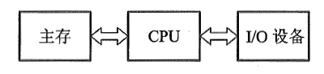

   这种交换方式延续了相当长的时间. 当时的I/O设备具有以下几个特点:

   - 每个I/O设备都必须配有一套独立的逻辑电路与CPU相连, 用来实现I/O设备与主机之间的信息交换, 因此线路十分散乱, 庞杂. 
   - 输入输出过程是穿插在CPU执行程序过程之中进行的, 当I/O设备与主机交换信息时, CPU不得不停止各种运算, 因此,  I/O设备与CPU是按串行方式工作的, 极浪费时间.
   - 每个I/O设备的逻辑控制电路与CPU的控制器紧密构成一个不可分割的整体, 它们彼此依赖, 相互牵连, 因此, 欲增添, 撤减或更换I/O设备是非常困难的. 

   在这个阶段中, 计算机系统硬件价格十分昂贵, 机器运行速度不高, 配置的I/O 设备不多, 主机与I/O设备之间交换的信息量也不大, 计算机应用尚未普及.

2. 接口模块和DMA 阶段

   这个阶段I/O设备通过接口模块与主机连接, 计算机系统采用了总线结构.

   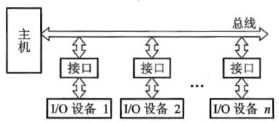

   通常, 在接口中都设有数据通路和控制通路. 数据经过接口既起到缓冲作用, 又可完成串-并变换. 控制通路用以传送CPU向I/O设备发出的各种控制命令, 或使CPU接受来自I/O设备的反馈信号. 许多接口还能满足中断请求处理的要求, 使I/O设备与CPU可按并行方式工作, 大大地提高了CPU的工作效率. 采用接口技术还可以使多台I/O设备分时占用总线, 使多台I/O设备互相之间也可实现并行工作方式, 有利于整机工作效率的提高.

   虽然这个阶段实现了CPU 和I/O设备**并行工作**, 但是在主机与I/O设备交换信息时, **CPU要中断现行程序**, 即CPU 与I/O设备还不能做到绝对的并行工作. 

   为了进一步提高CPU的工作效率, 又出现了**直接存储器存取(Direct Memory Access, DMA)**技术, 其**特点是I/O设备与主存之间有一条直接数据通路, I/O设备可以与主存直接交换信息,** 使CPU在I/O设备与主存交换信息时能继续完成自身的工作, 故资源利用率得到了进一步提高. 

3. 具有通道结构的阶段

   在小型和微型计算机中, 采用DMA方式可实现高速I/O设备与主机之间成组数据的交换, 但在大中型计算机中,  I/O设备配置繁多, 数据传送频繁, 若仍采用DMA方式会出现一系列问题.

   - 如果每台I/O设备都配置专用的DMA接口, 不仅增加了硬件成本, 而且为了解决众多DMA接口同时访问主存的冲突问题, 会使控制变得十分复杂. 
   - CPU需要对众多的DMA 接口进行管理, 同样会占用CPU 的工作时间, 而且因频繁地进入周期挪用阶段, 也会直接影响CPU的整体工作效率.

   因此在**大中型计算机系统中**, **采用I/O通道的方式**来进行数据交换.

   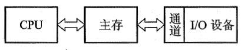

   通道是**用来负责`管理I/O设备`以及实现`主存`与`I/O设备`之间交换信息的部件**, 可以**视为一种具有特殊功能的处理器**. **通道有`专用的通道指令`**, 能**独立地执行用通道指令所编写的输入输出程序**, 但**不是一个完全独立的处理器**. 它**依据CPU的I/O指令进行启动, 停止或改变工作状态**, 是**从属于CPU的一个专用处理器**. 依赖通道管理的I/O设备在与主机交换信息时, **CPU不直接参与管理**, 故提高了CPU的资源利用率. 

4. 具有I/O处理机的阶段

   输入输出系统发展到第四阶段, 出现了I/O处理机. I/O处理机又称为外围处理机(Peripheral Processor), 它基本独立于主机工作, 既可完成I/O通道要完成的I/O控制, 又可完成码制变换, 格式处理, 数据块检错, 纠错等操作. 具有I/O处理机的输入输出系统与CPU 工作的并行性更高, 这说明I/O系统对主机来说具有更大的独立性.

   本章主要介绍**第二阶段**的输入输出系统, 有关通道及I/O处理机管理I/O系统的内容将在"计算机体系结构"课程中讲述.

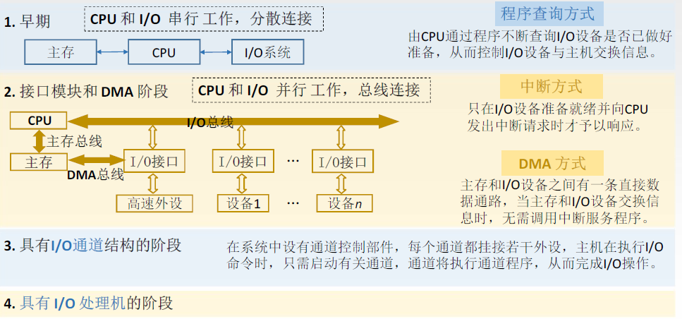

## I/O系统基本组成  

输入输出系统由**I/O软件**和**I/O硬件**两部分组成.

### I/O软件

包括驱动程序, 用户程序, 管理程序, 升级补丁等.

输入输出系统软件的主要任务如下：
①将用户编制的程序(或数据)输入主机内. 
②将运算结果输送给用户. 
③实现输入输出系统与主机工作的协调等. 

> 不同结构的输入输出系统所采用的软件技术差异很大. 一般而言, 当**采用接口模块方式**时, 应用**机器指令系统**中的**I/O指令**及**系统软件中的管理程序**便可使I/O设备与主机协调工作. 当**采用通道管理方式**时, 除**I/O指令外**, 还必须有**通道指令**及**相应的操作系统**. 即使都采用操作系统, 不同的机器其操作系统的复杂程度差异也是很大的.

#### I/O指令

I/O指令的一般格式:

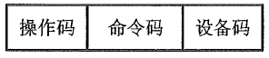

I/O指令是**机器指令的一类**, 其**指令格式与其他指令既有相似之处**, **又有所不同**. I/O指令**可以和其他机器指令的字长相等**, 但它还**应该能反映CPU与I/O设备交换信息的各种特点**, 如它必须**反映出对多台I/O设备的选择**, 以及在完成信息交换过程中, **对不同设备应做哪些具体操作**等.

图中的**操作码字段**可作为I/O指令与其他指令(如访存指令, 算逻指令, 控制指令等)的判别代码; 命令码体现I/O设备的具体操作; 设备码是多台I/O设备的选择码.

I/O指令的**命令码**一般可表述如下几种情况:

- 将数据从I/O设备输入主机

  例如, 将某台设备接口电路的数据缓冲寄存器中的数据读入CPU 的某个寄存器(如累加器ACC).

- 将数据从主机输出至I/O设备

  例如, 将CPU的某个寄存器(如ACC)中的数据写入某台设备接口电路的数据缓冲寄存器内. 

- 状态测试

  利用命令码检测各个I/O设备所处的状态是"忙"(Busy) 还是"准备就绪"(Ready), 以便决定下一步是否可进入主机与I/O设备交换信息的阶段.

- 形成某些操作命令

  不同I/O设备与主机交换信息时, 需要完成不同的操作. 例如, 磁带机需要正转, 反转, 读, 写, 写文件结束等; 对于磁盘驱动器, 需要读扇区, 写扇区, 找磁道, 扫描记录标识符等. 

I/O指令的**设备码**相当于**设备的地址**. 只有对繁多的I/O设备赋以不同的编号, 才能准确选择某台设备与主机交换信息.

#### 通道指令

通道指令是**对具有通道的I/O系统**专门**设置的指令**, 这类指令**一般用以指明参与传送(写入或读取)的数据组在主存中的首地址**; **指明需要传送的字节数或所传送数据组的末地址**; **指明所选设备的设备码及完成某种操作的命令码**. 这类指令的**位数一般较长**, 如IBM370机的通道指令为64位.

**通道指令**又称为**通道控制字(**Channel Control Word, CCW), 它是**通道用于执行I/O操作的指令**, 可以**由管理程序存放在`主存`的任何地方**, 由**通道从主存中取出并执行**. **`通道程序`**即**由通道指令组成**, 它**完成某种外围设备与主存之间传送信息的操作**. 例如, 将磁带记录区的部分内容送到指定的主存缓冲区内.

**通道指令是通道自身的指令**, 用来**执行I/O操作**, 如读, 写, 磁带走带及磁盘找道等, 而**I/O指令是CPU指令系统的一部分,** 是**CPU用来控制输入输出操作的指令, 由CPU译码后执行**. 

在**具有通道结构的计算机中**, **I/O指令不实现I/O数据传送**, 主要**完成启, 停I/O设备, 查询通道和I/O设备的状态及控制通道所做的其他操作**. 具有**通道指令的计算机**, 一旦**CPU执行了启动I/O设备的指令**, 就**由通道来代替CPU对I/O设备的管理.**

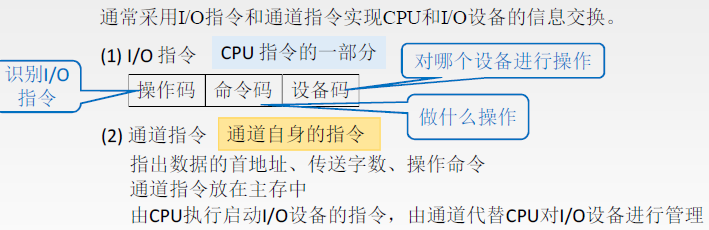

### I/O硬件

硬件组成是多种多样的, 在带有接口的I/O 系统中, 一般包括接口模块及I/O设备两大部分. 包括外部设备, 设备控制器和接口, I/O总线等.

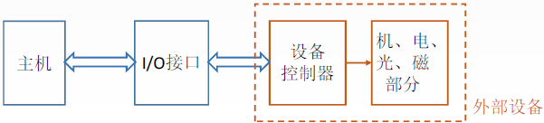

接口电路实际上包含许多数据传送通路和有关数据, 还包含控制信号通路及其相应的逻辑电路.

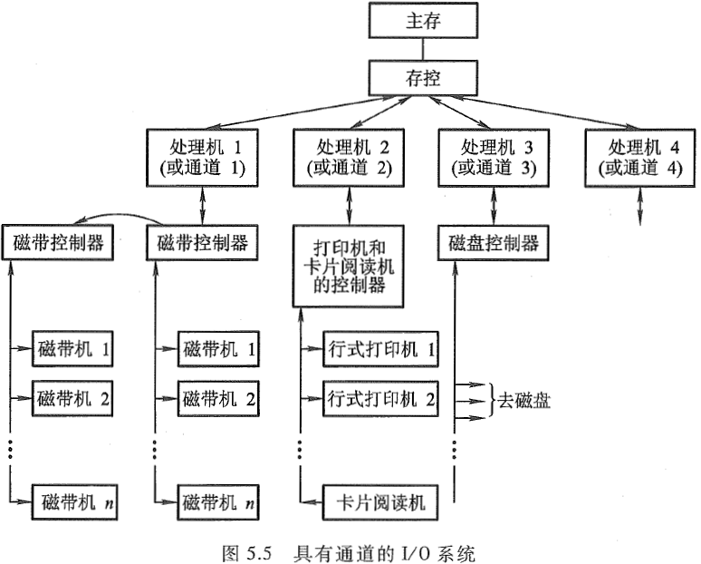

一个通道可以和一个以上的设备控制器相连，一个设备控制器又可以控制若干台同一类型的设备.

#### I/O接口

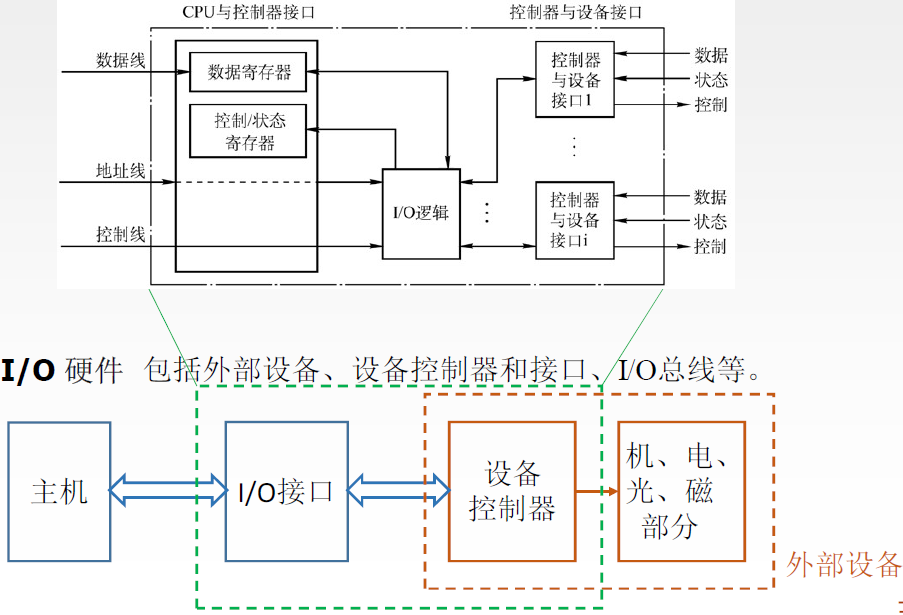

## I/O设备与主机的联系方式

I/O设备与主机交换信息和CPU与主存交换信息相比, 有许多不同点. 例如,  CPU如何对I/O设备编址; 如何寻找I/O设备号; 信息传送是逐位串行还是多位并行; I/O设备与主机以什么方式进行联络, 使它们彼此都知道对方处于何种状态;  I/O设备与主机是怎么连接的, 等等. 这一系列问题统称为I/O设备与主机的联系方式.

### I/O设备编址方式

通常将**I/O设备码**看作**地址码**, 对**I/O地址码的编址**可采用两种方式: **统一编址或不统一编址**.

统一编址就是**将I/O地址看作存储器地址的一部分**.

> 例如, 在64K地址的存储空间中, 划出8K地址作为I/O设备的地址, 凡是在这8K地址范围内的访问, 就是对I/O设备的访问, 所用的指令与访存指令相似.

不统一编址就是指**I/O地址和存储器地址是分开的**, 所有**对I/O设备的访问必须有专用的I/O指令**. 

> 显然统一编址占用了存储空间, 减少了主存容量, 但无须专用的I/O指令. 不统一编址由千不占用主存空间, 故不影响主存容量, 但需设I/O专用指令. 因此, 设计机器时, 需根据实际情况权衡考虑选取何种编址方式.

当设备通过**接口**与主机相连时, CPU可以**通过接口地址**来访问I/O设备。

### 设备寻址

由于每台设备都赋予一个**设备号**, 因此, 当要**启动某一设备时**, 可由I/O指令的**设备码字段**直接**指出该设备的设备号**.通过接口电路中的设备选择电路, 便可选中要交换信息的设备.

### 传送方式

在**同一瞬间**, **n位信息同时从CPU输出至I/O设备**, **或由I/O设备输入CPU**, 这种传送方式称为**并行传送**. 其特点是传送速度较快, 但要求数据线多. 例如, 16位信息并行传送需要16根数据线.
若在**同一瞬间只传送一位信息**, 在**不同时刻连续逐位传送一串信息**, 这种传送方式称为**串行传送**. 其特点是传送速度较慢. 但只需一根数据线和一根地线.

当**I/O设备与主机距离很远时, 采用串行传送较为合理**, 例如远距离数据通信.
不同的传送方式需配置不同的接口电路, 如并行传送接口, 串行传送接口或串并联用的传送接口等. 用户可按需要选择合适的接口电路.

### 联络方式

不论是串行传送还是并行传送,  I/O设备与主机之间必须互相了解彼此当时所处的状态, 如是否可以传送, 传送是否已结束等. 这就是I/O设备与主机之间的联络问题. 按I/O设备工作速度的不同, 可分为三种联络方式.

#### 立即响应方式

**对于一些工作速度`十分缓慢`的I/O设备**, 如指示灯的亮与灭, 开关的通与断, A/D转换器缓变信号的输入等, **当它们与CPU发生联系时,** 通常**都已使其处于某种等待状态**, 因此, 只要CPU的I/O指令一到,它们**便立即响应**, 故**这种设备无须特殊联络信号**, 称为**立即响应方式**.

#### 异步工作采用应答信号联络

当I/O设备与主机工作速度不匹配时, 通常采用异步工作方式. 这种方式在交换信息前, I/O设备与CPU各自完成自身的任务, 一旦出现联络信号, 彼此才准备交换信息.

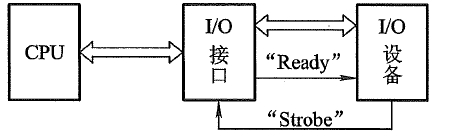

当CPU将数据输出到I/O接口后, 接口立即向I/O设备发出一个"Ready"(准备就绪)信号, 告诉I/O设备可以从接口内取数据. I/O设备收到"Ready"信号后, 通常便立即从接口中取出数据, 接着便向接口回发一个"Strobe"信号, 并让接口转告CPU, 接口中的数据已被取走, CPU还可继续向此接口送数据. 同理, 倘若I/O设备需向CPU传送数据, 则先由I/O设备向接口送数据, 并向接口发"Strobe"信号, 表明数据已送出. 口接到联络信号后便通知CPU可以取数, 一旦数据被取走, 接口便向I/O设备发"Ready"信号, 通知I/O设备, 数据已被取走, 尚可继续送数据. 这种一应一答的联络方式称为异步联络.

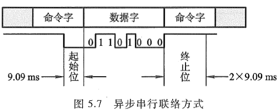

> I/O设备与CPU双方设定一组特殊标记, 用”起始”和“终止”来建立联系. 图中9.09 ms 的低电平表示“起始”, 又用2x9.09ms 的高电平表示“终止”.

#### 同步工作采用同步时标联络

**同步工作要求I/O设备与CPU 的工作速度完全同步.** 例如, 在数据采集过程中, 若外部数据以2400bps的速率传送至接口, 则**CPU也必须以1/2400s的速率接收每一位数**. **这种联络互相之间还得配有专用电路**, **用以产生同步时标**来控制同步工作. 

### I/O设备与主机的连接方式

I/O设备与主机的连接方式通常有两种: 辐射式和总线式 .图5.8和图5.2分别示意了这两种方式.

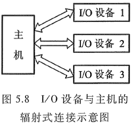

采用辐射式连接方式时, 要求每台I/O设备都有一套控制线路和一组信号线, 因此所用的器件和连线较多, 对I/O设备的增删都比较困难. 这种连接方式大多**出现在计算机发展的初级阶段**.

总线连接方式, 通过一组总线(包括地址线, 数据线, 控制线等), 将所有的I/O设备与主机连接. 这种连接方式是现代大多数计算机系统所采用的方式.

## I/O设备与主机信息传送的控制方式

I/O设备与主机交换信息时, 共有5种控制方式: 程序查询方式, 程序中断方式, 直接存储器存取方式(DMA), I/O通道方式, I/O处理机方式. 

### 程序查询方式

程序查询方式是**由CPU通过程序不断查询I/O设备是否己做好准备**, 从而控制I/O设备与主机交换信息, 采用这种方式实现主机和I/O设备交换信息, **要求I/O接口内设置一个能反映I/O设备是否准备就绪的`状态标记`**, CPU通过对此标记的检测, 可得知I/O设备的准备情况.

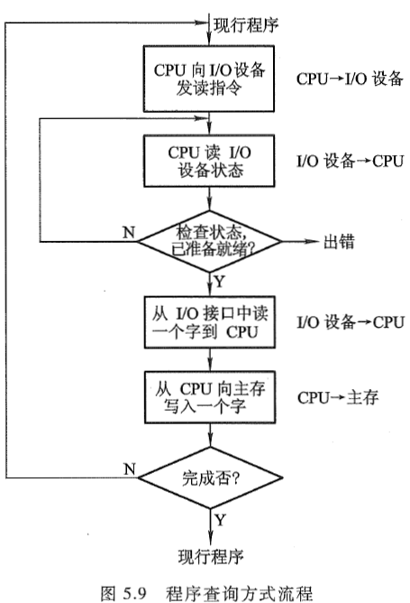

> CPU启动I/O设备后便开始对I/O设备的状态进行查询. 若查得I/O设备未准备就绪, 就继续查询; 
> 若查得I/O设备准备就绪, 就将数据从I/O接口送至CPU, 再由CPU送至主存. 这样一个字一个字地传送, 直至这个数据块的数据全部传送结束, CPU又重新回到原现行程序.

由这个查询过程可见, 只要一启动I/O设备, CPU便不断查询I/O设备的准备情况, 从而终止了原程序的执行. CPU在反复查询过程中, 犹如就地"踏步". 另一方面,  I/O设备准备就绪后, CPU要一个字一个字地从I/O设备取出, 经CPU送至主存, 此刻CPU也不能执行原程序, 可见这种方式使CPU和I/O设备处于串行工作状态, CPU的工作**效率不高**.

### 程序中断方式

倘若CPU在启动I/O设备后, 不查询设备是否已准备就绪, 继续执行自身程序, 只是当I/O设备准备就绪并向CPU发出中断请求后才予以响应, 这将大大提高CPU的工作效率.

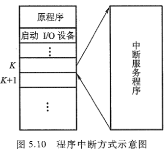

由图中可见, **CPU启动I/O设备后仍继续执行原程序**, 在**第K条指令执行结束后**, **CPU响应了I/O设备的请求**, **中断了现行程序**, **转至中断服务程序**, 待**处理完后又返回到原程序断点处**, **继续从第K+1条指令往下执行**. 由于这种方式使原程序中断了运行, 故称为程**序中断方式**.

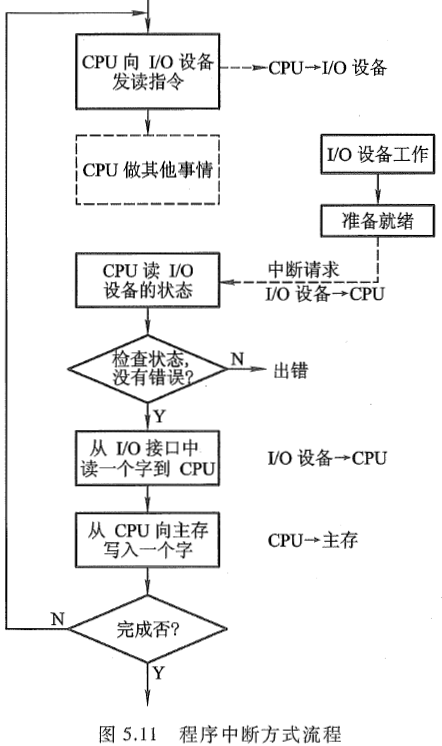

CPU向I/O设备发读指令后, 仍在处理其他事情(如继续在运算), 当I/O设备向CPU发出请求后, CPU才从I/O接口读一个字经CPU 送至主存(这是通过执行中断服务程序完成的). 如果I/O设备的一批数据(一个数据块的全部数据)尚未传送结束时, CPU再次启动I/O设备, 命令I/O设备再做准备, 一旦又接收到I/O设备中断请求时, CPU重复上述中断服务过程, 这样周而复始, 直至一批数据传送完毕.

程序中断方式在I/O设备进行准备时, CPU不必时刻查询I/O设备的准备情况, 不出现"踏步"现象, 即CPU执行程序与I/O设备做准备是同时进行的, 这种方式和CPU与I/O设备是串行工作的程序查询方式相比, CPU的资源得到了充分的利用.

采用程序中断方式, CPU和I/O接口不仅在硬件方面需增加相应的电路, 而且在软件方面还必须编制中断服务程序.

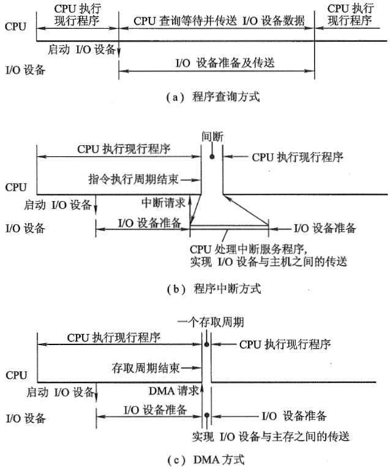

### DMA 方式

虽然程序中断方式消除了程序查询方式的"踏步"现象, 提高了CPU资源的利用率. 但是CPU在响应中断请求后, 必须停止现行程序而转入中断服务程序, 并且为了完成I/O设备与主存交换信息, 还不得不**占用CPU内部的一些寄存器**, 这同样是**对CPU资源的消耗**. 如果I/O设备能**直接与主存交换信息而不占用CPU**, 那么, CPU的资源利用率显然又可进一步提高, 这就出现了**直接存储器存取(DMA)**的方式.

在DMA方式中, **主存与I/O设备之间有一条数据通路**, **主存与I/O设备交换信息时, 无须调用中断服务程序**. 若出现**DMA和CPU同时访问主存**, **CPU总是将总线占有权让给DMA,** 通常把DMA的这种占有称为**窃取或挪用**. **窃取的时间一般为一个存取周期**, 故又把DMA占用的存取周期窃取周期或挪用周期. 而且, 在DMA窃取存取周期时, CPU尚能继续做内部操作(如乘法运算). 可见, 与程序查询和程序中断方式相比, DMA方式进一步提高了CPU的资源利用率。

当然, 采用DMA方式时, 也需要增加必要的DMA接口电路.

## 小结

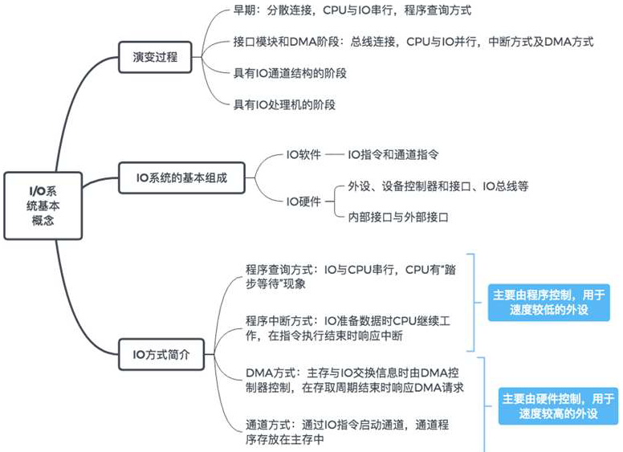

## I/O设备

中央处理器和主存构成了主机, 除主机外的大部分硬件设备都可称为I/O设备或外部设备, 或外围设备，简称外设。计算机系统没有输入输出设备, 就如计算机系统没有软件一样, 是毫无意义的.

设备控制器用来控制I/O设备的具体动作, 不同的I/O设备完成的控制功能也不同. 
机, 电, 磁, 光部件与具体的I/O设备有关, 即I/O设备的具体结构大致与机, 电, 磁, 光的工作原理有关.

I/O设备大致可分为三类:

- 人机交互设备

它是**实现操作者与计算机之间互相交流信息的设备**, 能将人体五官可识别的信息转换成机器可识别的信息, 如键盘, 鼠标, 手写板, 扫描仪, 摄像机, 语音识别器等. 反之, 另一类是将**计算机的处理结果信息转换为人们可识别的信息**, 如打印机, 显示器, 绘图仪, 语音合成器等.

- 计算机信息的存储设备

系统软件和各种计算机的有用信息, 其信息量极大, 需存储保留起来. 存储设备多数可作为计算机系统的辅助存储器, 如磁盘, 光盘, 磁带等.

- 机-机通信设备

它是用来实现一台计算机与其他计算机或与其他系统之间完成通信任务的设备. 例如, 两台计算机之间可利用电话线进行通信, 它们可以通过调制解调器(Modem) 完成. 用计算机实现实时工业控制, 可通过D/A, A/D转换设备来完成。计算机与计算机及其他系统还可通过各种设备实现远距离的信息交换。

### 输入设备

#### 键盘

输入设备完成输入程序, 数据和操作命令等功能.

键盘输入信息分为以下3 个步骤。

1. 按下一个键.
2. 查出按下的是哪个键.
3. 将此键翻译成ASCII 码, 由计算机接收.

采用硬件确认哪个键被按下的方法称为编码键盘法, 它由硬件电路形成对应被按键的唯一编码信息.

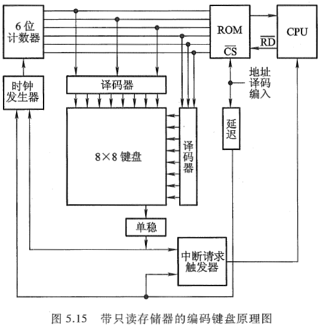

图中的**6位计数器**经两个**八选一的译码器对键盘扫描**. 若**键未按下,** 则**扫描将随着计数器的循环计数而反复进行**. 一旦**扫描发现某键被按下**, 则**键盘通过一个单稳电路产生一个脉冲信号**. **该信号一方面使计数器停止计数**, 用以**终止扫描**, 此刻**计数器的值便与所按键的位置相对应**, 该**值可作为只读存储器(ROM)的输入地址**, 而**该地址中的内容即为所按键的ASCII码**. 

可见只读存储器存储的内容便是对应各个键的ASCII码. 另一方面, 此脉冲经中断请求触发器向CPU发中断请求, CPU响应请求后便转入中断服务程序, 在中断服务程序的执行过程中, CPU通过执行读入指令, 将计数器所对应的ROM地址中的内容, 即所按键对应的ASCII码送入CPU中. CPU的读入指令既可作为读出ROM内容的片选信号, 而且经一段延迟后, 又可用来清除中断请求触发器 ,并重新启动6位计数器开始新的扫描.

> 采用软件判断键是否按下的方法称为非编码键盘法, 这种方法利用简单的硬件和一套专用键盘编码程序来判断按键的位置, 然后由CPU将位置码经查表程序转换成相应的编码信息. 这种方法结构简单, 但速度比较慢.

#### 鼠标

鼠标(Mouse) 是一种手持式的定位设备.

#### 触摸屏

触摸屏是**一种对物体的接触或靠近能产生反应的定位设备**. 按原理的不同, 触摸屏大致可分为5 类: 电阻式, 电容式, 表面超声波式, 扫描红外线式和压感式.

### 输出设备

#### 显示设备

以可见光的形式传递和处理信息的设备称为显示设备.

按显示器件划分有阴极射线管(Cathode Ray Tube, CRT) 显示器, 液晶显示器(Liquid Crystal Display, LCD), 等离子显示器(PD)等.

按显示内容分有字符显示器, 图形显示器和图像显示器; 按显示器功能分有普通显示器和显示终端.

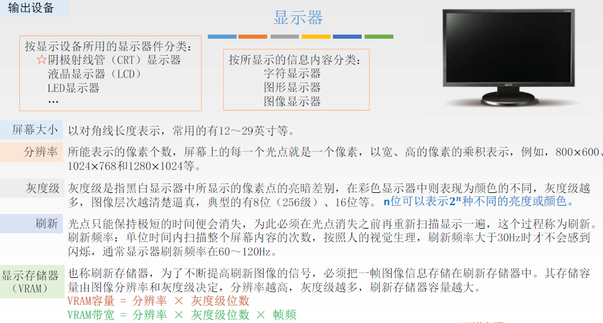

#### 打印设备

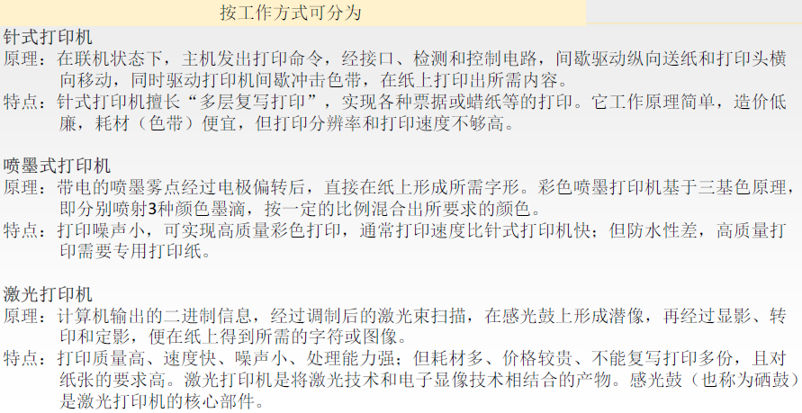

#### 小结

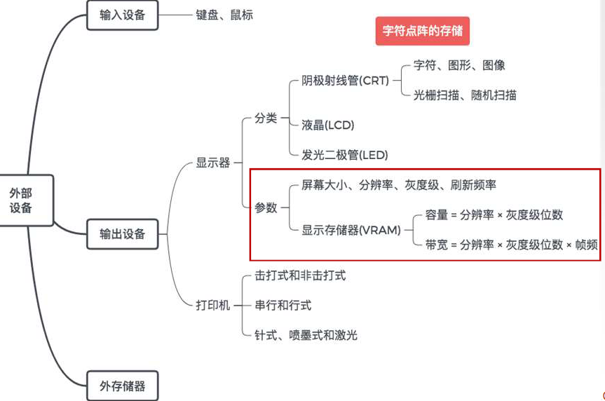

### 外部存储

#### 磁盘存储器

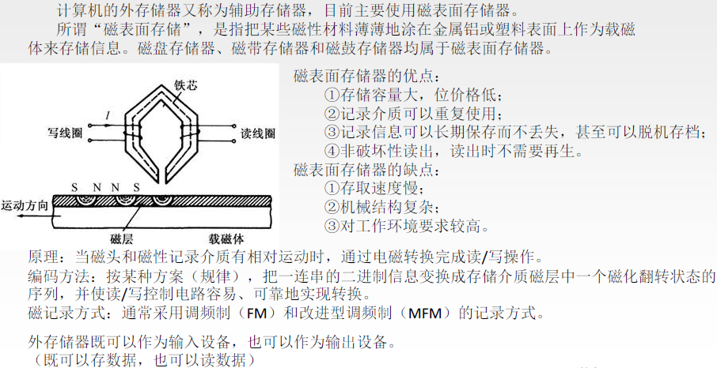

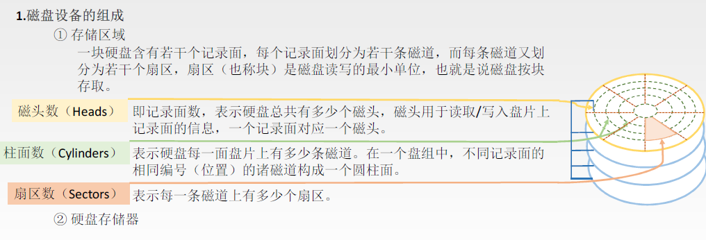

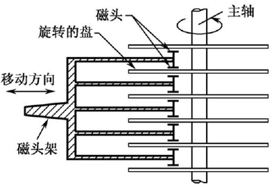

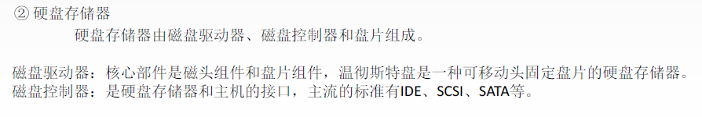

## I/O接口

**接口**可以看作**两个系统或两个部件之间的交接部分**, 它既可以是**两种硬设备之间的连接电路**, 也可以是**两个软件之间的共同逻辑边界**.

**I/O接口**通常是指**主机与I/O设备之间设置的一个硬件电路及其相应的软件控制**.

由上图可知, 不同的I/O设备都有其相应的设备控制器, 而它们往往都是通过I/O接口与主机取得联系的.

主机与I/O设备之间设置接口的理由如下：

- 一台机器通常配有多台I/O设备, 它们各自有其设备号(地址), 通过接口可实现I/O设备的选择.
- I/O设备种类繁多, 速度不一,与CPU速度相差可能很大,通过接口可实现数据缓冲,达到速度匹配.
- 有些I/O设备可能串行传送数据,而CPU 一般为并行传,通过接口可实现数据串-并格式的转换.
- I/O设备的输入输出电平可能与CPU的输入输出电平不同,通过接口可实现电平转换.
- CPU 启动I/O设备工作,要向I/O设备发各种控制信号,通过接口可传送控制命令.
- I/O设备需将其工作状态(如"忙"”就绪”“错误”“中断请求”等)及时向CPU 报告, 通过接口可监视设备的工作状态, 并可保存状态信息, 供CPU 查询. 

> 接口(Interface) 和端口(Port) 是两个不同的概念. 端口是指接口电路中的一些寄存器, 这些寄存器分别用来存放数据信息, 控制信息和状态信息, 相应的端口分别称为数据端口, 控制端口和状态端口. 若干个端口加上相应的控制逻辑才能组成接口. CPU通过输入指令, 从端口读入信息, 通过输出指令, 可将信息写入端口中.

### 接口的功能和组成

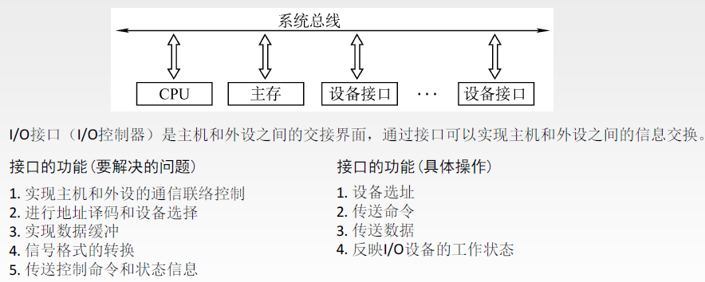

#### 选址功能

由于I/O总线与所有设备的接口电路相连, 但CPU究竟选择哪台设备, 还得通过**设备选择线上的设备码**来确定. 该设备码将**送至所有设备的接口**, 因此, **要求每个接口都必须具有选址功能**, 即**当设备选择线上的设备码与本设备码相符时**,  应**发出设备选中信号SEL**, 这种功能可**通过接口内的设备选择电路**来实现.

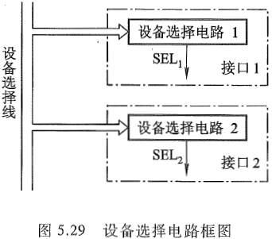

图5.29 所示为接口1和接口2的设备选择电路. 这两个电路的具体线路可以不同, 它们分别**能识别出自身的设备码**, 一旦某接口设备选择电路有输出时, 它便可控制这个设备通过命令线, 状态线和数据线与主机交换信息.

#### 传送命令的功能

当CPU向I/O设备发出命令时, 要求I/O设备能做出响应, 如果I/O接口不具备传送命令信息的功能那么设备将无法响应, 故通常在I/O接口中设有存放命令的命令寄存器以及命令译码器, 如图5.30所示.

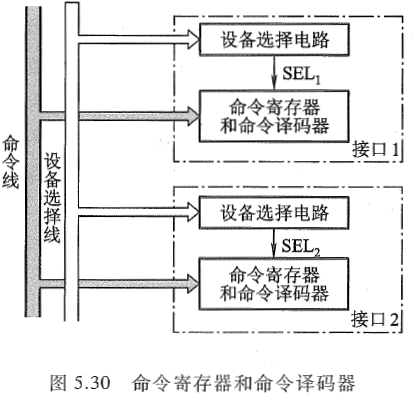

命令寄存器用来存放I/O指令中的命令码, 它受设备选中信号控制. 命令线和所有接口电路的命令寄存器相连, 只有被选中设备的SEL信号有效, 命令寄存器才可接受命令线上的命令码.

#### 传送数据的功能

既然**接口处于主机与I/O设备之间**, 因此**数据必须通过接口才能实现主机与I/O设备之间的传送**. 这就**要求接口中具有数据通路, 完成数据传送**. 这种数据通路还应**具有缓冲能力**, 即能**将数据暂存在接口内**. 接口中通常**设有数据缓冲寄存器(Data Buffer Register, DBR)**, 它用来**暂存I/O设备与主机准备交换的信息**, **与I/O总线中的数据线是相连的**.

每个接口中的数据缓冲寄存器的位数可以各不相同, 这取决于各类I/O设备的不同需要.
例如, 键盘接口的DBR定为8位, 因为ASCII码为7位, 再加一位奇偶校验位, 故为8 位. 又如磁盘这类外设, 其DBR的位数通常与存储字长的位数相等, 而且还要求具有串-并转换能力, 既可将从磁盘中串行读出的信息并行送至主存, 又可将从主存中并行读出的信息串行输至磁盘.

#### 反映I/O设备工作状态的功能

为了使CPU能及时了解各I/O设备的工作状态, 接口内**必须设置一些反映设备工作状态的触发器**.

例如, 用完成触发器D和工作触发器B来标志设备所处的状态.
当D=0,B=0时, 表示I/O设备处于暂停状态.
当D=1,B=0时, 表示I/O设备已经准备就绪.
当D=0,B=1时, 表示I/O设备正处于准备状态.

由于现代计算机系统中大多采用中断技术, 因此接口电路中一般还设有中断请求触发器INTR. 当其为“1” 时. 表示该I/O设备向CPU发出中断请求. 接口内还有屏蔽触发器MASK, 它与中断请求触发器配合使用,完成设备的屏蔽功能.

所有的状态标志触发器都与I/O总线中的状态线相连. 此外, 不同的I/O设备的接口电路中还可根据需要增设一些其他状态标志触发器, 如"出错"触发器, "数据迟到"触发器, 或配置一些奇偶校验电路, 循环码校验电路等. 随着大规模集成电路制作工艺的不断进步, 目前大多数I/O设备所共用的电路都制作在一个芯片内, 作为通用接口芯片. 另一些I/O设备专用的电路, 制作在I/O设备的设备控制器中. 本节所讲述的接口功能及组成均是指通用接口所具备的.

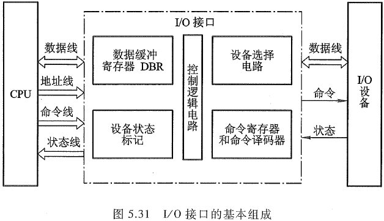

#### 总线连接方式的I/O接口电路

如图, 总线结构的计算机, 每一台I/O设备都是通过I/O接口挂到系统总线上的. 图中的I/O总线包括数据线, 设备选择线, 命令线和状态线.

- 数据线
  数据线是I/O设备与主机之间数据代码的传送线, 其**根数一般等于存储字长的位数或字符的位数**, 它通常是**双向**的, 也可以是**单向**的. 若采用单向数据总线, 则必须用两组才能实现数据的输入和输出功能, 而双向数据总线只需一组即可.
- 设备选择线
  设备选择线是用来传送设备码的, 它的**根数取决于I/O指令中设备码的位数**. **如果把设备码看作地址号, 那么设备选择线又可称为地址线**. 设备选择线可以有一组, 也可以有两组, 其中一组用于主机向I/O设备发送设备码, 另一组用于I/O设备向主机回送设备码. 当然设备选择线也可采用一组双向总线代替两组单向总线.
- 命令线
  命令线主要用以传输CPU向设备发出的各种命令信号, 如启动, 清除, 屏蔽, 读, 写等. 它是一组单向总线, 其根数与命令信号多少有关.
- 状态线
  状态线是将I/O设备的状态向主机报告的信号线, 例如, 设备是否准备就绪, 是否向CPU 发出中断请求等. 它也是一组单向总线. 
  现代计算机中大多采用三态逻辑电路来构成总线.

#### I/O接口的基本结构

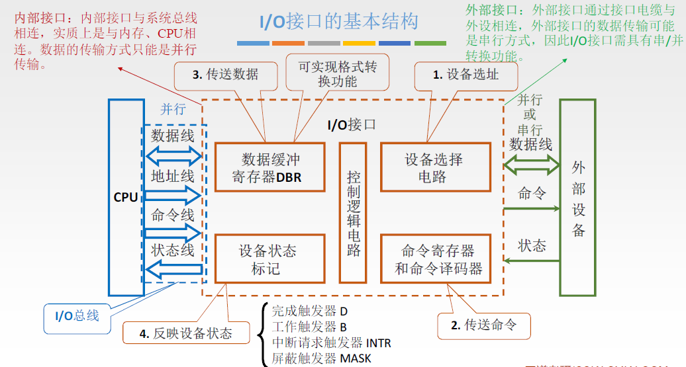

工作过程:

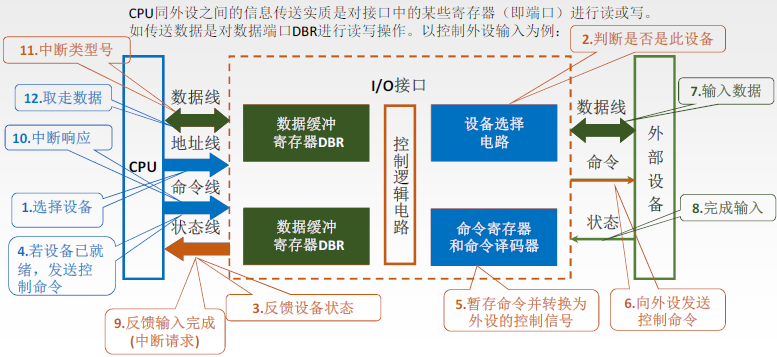

### I/O端口

#### 接口与端口

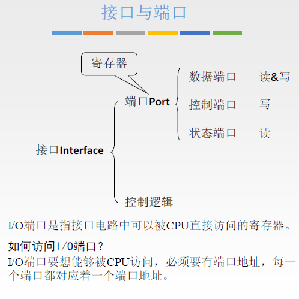

#### 编址

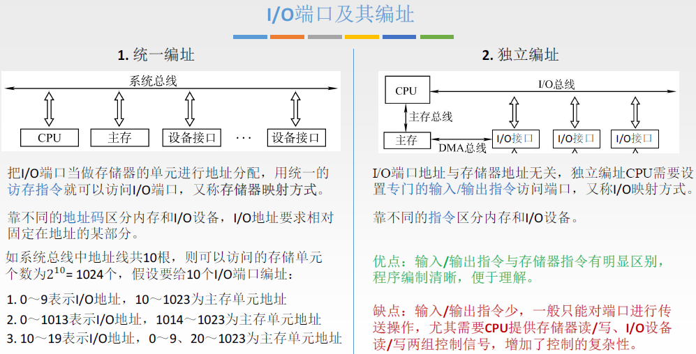

### 接口类型

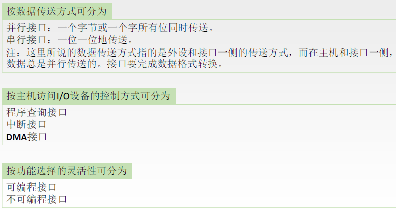

