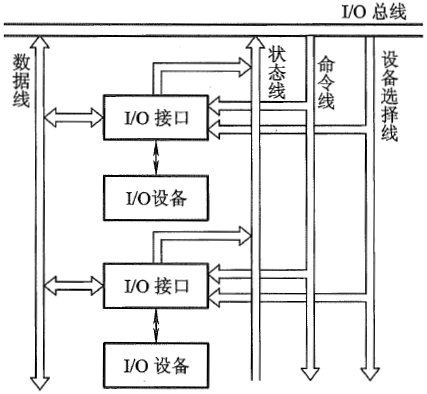
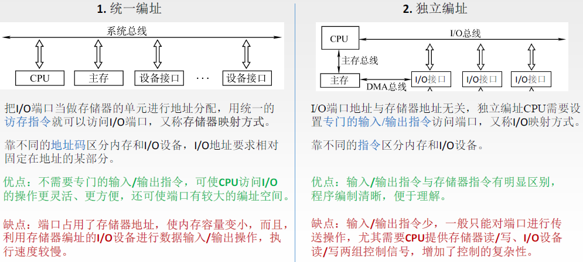
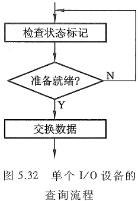
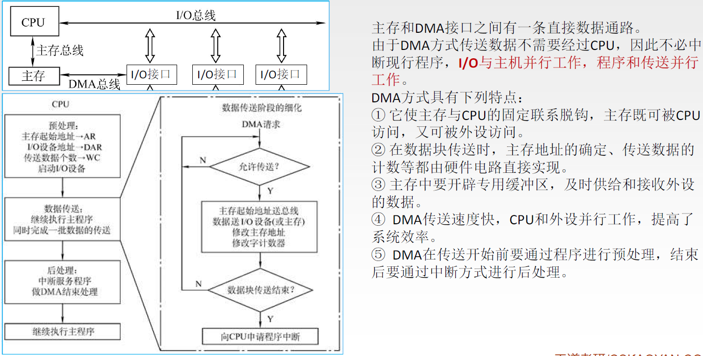
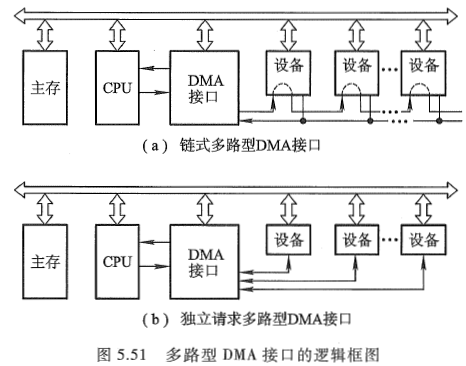

Computer Organization

# Chapter 7  I/O System

## 概述

除了CPU 和存储器两大模块外, 计算机硬件系统的第三个关键部分是输入输出模块, 又称输入输出系统. 随着计算机系统的不断发展, 应用范围的不断扩大, I/O设备的数量和种类也越来越多, 它们与主机的联络方式及信息的交换方式也各不相同. 因此, 输入输出系统涉及的内容极其繁杂, 既包括具体的各类I/O设备, 又包括各种不同的I/O设备如何与主机交换信息. 本章重点分析I/O设备与主机交换信息的三种控制方式(程序查询, 中断和DMA)及其相应的接口功能和组成.

## I/O系统演变过程

### 早期阶段

早期的I/O设备种类较少, I/O设备与主存交换信息都必须通过CPU.

这种交换方式延续了相当长的时间. 当时的I/O设备具有以下几个特点:

- 每个I/O设备都必须配有一套独立的逻辑电路与CPU相连, 用来实现I/O设备与主机之间的信息交换, 因此线路十分散乱, 庞杂. 
- 输入输出过程是穿插在CPU执行程序过程之中进行的, 当I/O设备与主机交换信息时, CPU不得不停止各种运算, 因此,  I/O设备与CPU是按串行方式工作的, 极浪费时间.
- 每个I/O设备的逻辑控制电路与CPU的控制器紧密构成一个不可分割的整体, 它们彼此依赖, 相互牵连, 因此, 欲增添, 撤减或更换I/O设备是非常困难的. 

在这个阶段中, 计算机系统硬件价格十分昂贵, 机器运行速度不高, 配置的I/O 设备不多, 主机与I/O设备之间交换的信息量也不大, 计算机应用尚未普及.

### 接口模块和DMA阶段

这个阶段I/O设备通过**接口模块**与主机连接, 计算机系统采用了总线结构.

通常, 在**接口中都设有数据通路和控制通路. 数据经过接口既起到缓冲作用, 又可完成串-并变换.** 控制通路用以传送CPU向I/O设备发出的各种控制命令, 或使CPU接受来自I/O设备的反馈信号. 许多接口还能满足中断请求处理的要求, 使I/O设备与CPU可按并行方式工作, 大大地提高了CPU的工作效率. 采用接口技术还可以使多台I/O设备分时占用总线, 使多台I/O设备互相之间也可实现并行工作方式, 有利于整机工作效率的提高.

虽然这个阶段实现了CPU 和I/O设备**并行工作**, 但是在主机与I/O设备交换信息时, **CPU要中断现行程序**, 即CPU 与I/O设备还不能做到绝对的并行工作. 

为了进一步提高CPU的工作效率, 又出现了**直接存储器存取(Direct Memory Access, DMA)**技术, 其**特点是I/O设备与主存之间有一条直接数据通路, I/O设备可以与主存直接交换信息,** 使CPU在I/O设备与主存交换信息时能继续完成自身的工作, 故资源利用率得到了进一步提高. 

### 具有通道结构的阶段

在小型和微型计算机中, 采用DMA方式可实现高速I/O设备与主机之间成组数据的交换, 但在大中型计算机中,  I/O设备配置繁多, 数据传送频繁, 若仍采用DMA方式会出现一系列问题.

- 如果每台I/O设备都配置专用的DMA接口, 不仅增加了硬件成本, 而且为了解决众多DMA接口同时访问主存的冲突问题, 会使控制变得十分复杂. 
- CPU需要对众多的DMA接口进行管理, 同样会占用CPU的工作时间, 而且因频繁地进入周期挪用阶段, 也会直接影响CPU的整体工作效率.

因此在**大中型计算机系统中**, **采用I/O通道的方式**来进行数据交换.

通道是**用来负责`管理I/O设备`以及实现`主存`与`I/O设备`之间交换信息的部件**, 可以**视为一种具有特殊功能的处理器**. **通道有`专用的通道指令`**, 能**独立地执行用通道指令所编写的输入输出程序**, 但**不是一个完全独立的处理器**. 它**依据CPU的I/O指令进行启动, 停止或改变工作状态**, 是**从属于CPU的一个专用处理器**. 依赖通道管理的I/O设备在与主机交换信息时, **CPU不直接参与管理**, 故提高了CPU的资源利用率. 

### 具有I/O处理机的阶段

输入输出系统发展到第四阶段, 出现了I/O处理机. I/O处理机又称为**外围处理机(Peripheral Processor),** 它**基本独立于主机工作**, 既可完成I/O通道要完成的I/O控制, 又可完成码制变换, 格式处理, 数据块检错, 纠错等操作. 具有I/O处理机的输入输出系统与CPU 工作的并行性更高, 这说明I/O系统对主机来说具有更大的独立性.

这里主要介绍**第二阶段**的I/O系统, 有关通道及I/O处理机管理I/O系统的内容在"计算机体系结构"中有.

## I/O系统基本组成  

输入输出系统由**I/O软件**和**I/O硬件**两部分组成.

### I/O软件

包括驱动程序, 用户程序, 管理程序, 升级补丁等.

输入输出系统软件的主要任务如下：
①将用户编制的程序(或数据)输入主机内. 
②将运算结果输送给用户. 
③实现输入输出系统与主机工作的协调等. 

> 不同结构的输入输出系统所采用的软件技术差异很大. 一般而言, 当**采用接口模块方式**时, 应用**机器指令系统**中的**I/O指令**及**系统软件中的管理程序**便可使I/O设备与主机协调工作. 当**采用通道管理方式**时, 除**I/O指令外**, 还必须有**通道指令**及**相应的操作系统**. 即使都采用操作系统, 不同的机器其操作系统的复杂程度差异也是很大的.

#### I/O指令

I/O指令的一般格式:

I/O指令是**机器指令的一类**, 其**指令格式与其他指令既有相似之处**, **又有所不同**. I/O指令**可以和其他机器指令的字长相等**, 但它还**应该能反映CPU与I/O设备交换信息的各种特点**, 如它必须**反映出对多台I/O设备的选择**, 以及在完成信息交换过程中, **对不同设备应做哪些具体操作**等.

图中的**操作码字段**可作为I/O指令与其他指令(如访存指令, 算逻指令, 控制指令等)的判别代码; 命令码体现I/O设备的具体操作; 设备码是多台I/O设备的选择码.

I/O指令的**命令码**一般可表述如下几种情况:

- 将数据从I/O设备输入主机

  例如, 将某台设备接口电路的数据缓冲寄存器中的数据读入CPU 的某个寄存器(如累加器ACC).

- 将数据从主机输出至I/O设备

  例如, 将CPU的某个寄存器(如ACC)中的数据写入某台设备接口电路的数据缓冲寄存器内. 

- 状态测试

  利用命令码检测各个I/O设备所处的状态是"忙"(Busy) 还是"准备就绪"(Ready), 以便决定下一步是否可进入主机与I/O设备交换信息的阶段.

- 形成某些操作命令

  不同I/O设备与主机交换信息时, 需要完成不同的操作. 例如, 磁带机需要正转, 反转, 读, 写, 写文件结束等; 对于磁盘驱动器, 需要读扇区, 写扇区, 找磁道, 扫描记录标识符等. 

I/O指令的**设备码**相当于**设备的地址**. 只有对繁多的I/O设备赋以不同的编号, 才能准确选择某台设备与主机交换信息.

#### 通道指令

通道指令是**对具有通道的I/O系统**专门**设置的指令**, 这类指令**一般用以指明参与传送(写入或读取)的数据组在主存中的首地址**; **指明需要传送的字节数或所传送数据组的末地址**; **指明所选设备的设备码及完成某种操作的命令码**. 这类指令的**位数一般较长**, 如IBM370机的通道指令为64位.

**通道指令**又称为**通道控制字(**Channel Control Word, CCW), 它是**通道用于执行I/O操作的指令**, 可以**由管理程序存放在`主存`的任何地方**, 由**通道从主存中取出并执行**. **`通道程序`**即**由通道指令组成**, 它**完成某种外围设备与主存之间传送信息的操作**. 例如, 将磁带记录区的部分内容送到指定的主存缓冲区内.

**通道指令是通道自身的指令**, 用来**执行I/O操作**, 如读, 写, 磁带走带及磁盘找道等, 而**I/O指令是CPU指令系统的一部分,** 是**CPU用来控制输入输出操作的指令, 由CPU译码后执行**. 

在**具有通道结构的计算机中**, **I/O指令不实现I/O数据传送**, 主要**完成启, 停I/O设备, 查询通道和I/O设备的状态及控制通道所做的其他操作**. 具有**通道指令的计算机**, 一旦**CPU执行了启动I/O设备的指令**, 就**由通道来代替CPU对I/O设备的管理.**

### I/O硬件

硬件组成是多种多样的, 在**带有接口**的I/O系统中, 一般包括接口模块及I/O设备两大部分. 包括外部设备, 设备控制器和接口, I/O总线等.

**接口电路实际上包含许多数据传送通路和有关数据, 还包含控制信号通路及其相应的逻辑电路.**

一个通道可以和一个以上的设备控制器相连, 一个设备控制器又可以控制若干台同一类型的设备.

#### I/O接口

## I/O设备与主机的联系方式

I/O设备与主机交换信息和CPU与主存交换信息相比, 有许多不同点. 例如, CPU如何对I/O设备编址; 如何寻找I/O设备号; 信息传送是逐位串行还是多位并行; I/O设备与主机以什么方式进行联络, 使它们彼此都知道对方处于何种状态;  I/O设备与主机是怎么连接的, 等等. 这一系列问题统称为I/O设备与主机的联系方式.

### I/O设备编址方式

通常将**I/O设备码**看作**地址码**, 对**I/O地址码的编址**可采用两种方式: **统一编址或不统一编址**.

统一编址就是**将I/O地址看作存储器地址的一部分**.

> 例如, 在64K地址的存储空间中, 划出8K地址作为I/O设备的地址, 凡是在这8K地址范围内的访问, 就是对I/O设备的访问, 所用的指令与访存指令相似.

不统一编址就是指**I/O地址和存储器地址是分开的**, 所有**对I/O设备的访问必须有专用的I/O指令**. 

> 显然统一编址占用了存储空间, 减少了主存容量, 但无须专用的I/O指令. 不统一编址由于不占用主存空间, 故不影响主存容量, 但需设I/O专用指令. 因此, 设计机器时, 需根据实际情况权衡考虑选取何种编址方式.

当设备通过**接口**与主机相连时, CPU可以**通过接口地址**来访问I/O设备。

### 设备寻址

由于每台设备都赋予一个**设备号**, 因此, 当要**启动某一设备时**, 可由I/O指令的**设备码字段**直接**指出该设备的设备号**.通过接口电路中的设备选择电路, 便可选中要交换信息的设备.

### 传送方式

在**同一瞬间**, **n位信息同时从CPU输出至I/O设备**, **或由I/O设备输入CPU**, 这种传送方式称为**并行传送**. 其特点是传送速度较快, 但要求数据线多. 例如, 16位信息并行传送需要16根数据线.
若在**同一瞬间只传送一位信息**, 在**不同时刻连续逐位传送一串信息**, 这种传送方式称为**串行传送**. 其特点是传送速度较慢. 但只需一根数据线和一根地线.

当**I/O设备与主机距离很远时, 采用串行传送较为合理**, 例如远距离数据通信.
不同的传送方式需配置不同的接口电路, 如并行传送接口, 串行传送接口或串并联用的传送接口等. 用户可按需要选择合适的接口电路.

### 联络方式

不论是串行传送还是并行传送, I/O设备与主机之间必须互相了解彼此当时所处的状态, 如是否可以传送, 传送是否已结束等. 这就是I/O设备与主机之间的联络问题. 按I/O设备工作速度的不同, 可分为三种联络方式.

#### 立即响应方式

**对于一些工作速度`十分缓慢`的I/O设备**, 如指示灯的亮与灭, 开关的通与断, A/D转换器缓变信号的输入等, **当它们与CPU发生联系时,** 通常**都已使其处于某种等待状态**, 因此, 只要CPU的I/O指令一到,它们**便立即响应**, 故**这种设备无须特殊联络信号**, 称为**立即响应方式**.

#### 异步工作采用应答信号联络

当**I/O设备与主机工作速度不匹配**时, 通常采用**异步工作方式**. 这种方式在交换信息前, **I/O设备与CPU各自完成自身的任务, 一旦出现联络信号, 彼此才准备交换信息.**

当CPU将数据输出到I/O接口后, 接口立即向I/O设备发出一个"Ready"(准备就绪)信号, 告诉I/O设备可以从接口内取数据. I/O设备收到"Ready"信号后, 通常便立即从接口中取出数据, 接着便向接口回发一个"Strobe"信号, 并让接口转告CPU, 接口中的数据已被取走, CPU还可继续向此接口送数据. 同理, 倘若I/O设备需向CPU传送数据, 则先由I/O设备向接口送数据, 并向接口发"Strobe"信号, 表明数据已送出. 口接到联络信号后便通知CPU可以取数, 一旦数据被取走, 接口便向I/O设备发"Ready"信号, 通知I/O设备, 数据已被取走, 尚可继续送数据. **这种一应一答的联络方式称为异步联络.**

> I/O设备与CPU双方设定一组特殊标记, 用”起始”和“终止”来建立联系. 图中9.09 ms 的低电平表示“起始”, 又用2x9.09ms 的高电平表示“终止”.

#### 同步工作采用同步时标联络

**同步工作要求I/O设备与CPU 的工作速度完全同步.** 例如, 在数据采集过程中, 若外部数据以2400bps的速率传送至接口, 则**CPU也必须以1/2400s的速率接收每一位数**. **这种联络互相之间还得配有专用电路**, **用以产生同步时标**来控制同步工作. 

### I/O设备与主机的连接方式

I/O设备与主机的连接方式通常有两种: **辐射式和总线式** .下面分别示意了这两种方式.

采用辐射式连接方式时, 要求每台I/O设备都有一套控制线路和一组信号线, 因此所用的器件和连线较多, 对I/O设备的增删都比较困难. 这种连接方式大多**出现在计算机发展的初级阶段**.

**总线连接方式**, 通过一组总线(包括地址线, 数据线, 控制线等), 将所有的I/O设备与主机连接. 这种连接方式是现代大多数计算机系统所采用的方式.

## I/O设备与主机信息传送的控制方式

I/O设备与主机交换信息时, 共有5种控制方式: 程序查询方式, 程序中断方式, 直接存储器存取方式(DMA), I/O通道方式, I/O处理机方式. 

### 程序查询方式

程序查询方式是**由CPU通过程序不断查询I/O设备是否己做好准备**, 从而控制I/O设备与主机交换信息, 采用这种方式实现主机和I/O设备交换信息, **要求I/O接口内设置一个能反映I/O设备是否准备就绪的`状态标记`**, CPU通过对此标记的检测, 可得知I/O设备的准备情况.

> CPU启动I/O设备后便开始对I/O设备的状态进行查询. 若查得I/O设备未准备就绪, 就继续查询; 
> 若查得I/O设备准备就绪, 就将数据从I/O接口送至CPU, 再由CPU送至主存. 这样一个字一个字地传送, 直至这个数据块的数据全部传送结束, CPU又重新回到原现行程序.

由这个查询过程可见, 只要一启动I/O设备, CPU便不断查询I/O设备的准备情况, 从而终止了原程序的执行. CPU在反复查询过程中, 犹如就地"踏步". 另一方面,  I/O设备准备就绪后, CPU要一个字一个字地从I/O设备取出, 经CPU送至主存, 此刻CPU也不能执行原程序, 可见这种方式使CPU和I/O设备处于串行工作状态, CPU的工作**效率不高**.

### 程序中断方式

倘若CPU在启动I/O设备后, 不查询设备是否已准备就绪, 继续执行自身程序, 只是当I/O设备准备就绪并向CPU发出中断请求后才予以响应, 这将大大提高CPU的工作效率.

由图中可见, **CPU启动I/O设备后仍继续执行原程序**, 在**第K条指令执行结束后**, **CPU响应了I/O设备的请求**, **中断了现行程序**, **转至中断服务程序**, 待**处理完后又返回到原程序断点处**, **继续从第K+1条指令往下执行**. 由于这种方式使原程序中断了运行, 故称为程**序中断方式**.

CPU向I/O设备发读指令后, 仍在处理其他事情(如继续在运算), 当I/O设备向CPU发出请求后, CPU才从I/O接口读一个字经CPU 送至主存(这是通过执行中断服务程序完成的). 如果I/O设备的一批数据(一个数据块的全部数据)尚未传送结束时, CPU再次启动I/O设备, 命令I/O设备再做准备, 一旦又接收到I/O设备中断请求时, CPU重复上述中断服务过程, 这样周而复始, 直至一批数据传送完毕.

程序中断方式在I/O设备进行准备时, CPU不必时刻查询I/O设备的准备情况, 不出现"踏步"现象, 即CPU执行程序与I/O设备做准备是同时进行的, 这种方式和CPU与I/O设备是串行工作的程序查询方式相比, CPU的资源得到了充分的利用.

采用程序中断方式, CPU和I/O接口不仅在硬件方面需增加相应的电路, 而且在软件方面还必须编制中断服务程序.

### DMA 方式

虽然程序中断方式消除了程序查询方式的"踏步"现象, 提高了CPU资源的利用率. 但是CPU在响应中断请求后, 必须停止现行程序而转入中断服务程序, 并且为了完成I/O设备与主存交换信息, 还不得不**占用CPU内部的一些寄存器**, 这同样是**对CPU资源的消耗**. 如果I/O设备能**直接与主存交换信息而不占用CPU**, 那么, CPU的资源利用率显然又可进一步提高, 这就出现了**直接存储器存取(DMA)**的方式.

在DMA方式中, **主存与I/O设备之间有一条数据通路**, **主存与I/O设备交换信息时, 无须调用中断服务程序**. 若出现**DMA和CPU同时访问主存**, **CPU总是将总线占有权让给DMA,** 通常把DMA的这种占有称为**窃取或挪用**. **窃取的时间一般为一个存取周期**, 故又把DMA占用的存取周期窃取周期或挪用周期. 而且, 在DMA窃取存取周期时, CPU尚能继续做内部操作(如乘法运算). 可见, 与程序查询和程序中断方式相比, DMA方式进一步提高了CPU的资源利用率。

当然, 采用DMA方式时, 也需要增加必要的**DMA接口电路**.

## 小结

## I/O设备

中央处理器和主存构成了主机, 除主机外的大部分硬件设备都可称为I/O设备或外部设备, 或外围设备，简称外设。计算机系统没有输入输出设备, 就如计算机系统没有软件一样, 是毫无意义的.

设备控制器用来控制I/O设备的具体动作, 不同的I/O设备完成的控制功能也不同. 
机, 电, 磁, 光部件与具体的I/O设备有关, 即I/O设备的具体结构大致与机, 电, 磁, 光的工作原理有关.

I/O设备大致可分为三类:

- 人机交互设备

它是**实现操作者与计算机之间互相交流信息的设备**, 能将人体五官可识别的信息转换成机器可识别的信息, 如键盘, 鼠标, 手写板, 扫描仪, 摄像机, 语音识别器等. 反之, 另一类是将**计算机的处理结果信息转换为人们可识别的信息**, 如打印机, 显示器, 绘图仪, 语音合成器等.

- 计算机信息的存储设备

系统软件和各种计算机的有用信息, 其信息量极大, 需存储保留起来. 存储设备多数可作为计算机系统的辅助存储器, 如磁盘, 光盘, 磁带等.

- 机-机通信设备

它是用来实现一台计算机与其他计算机或与其他系统之间完成通信任务的设备. 例如, 两台计算机之间可利用电话线进行通信, 它们可以通过调制解调器(Modem) 完成. 用计算机实现实时工业控制, 可通过D/A, A/D转换设备来完成。计算机与计算机及其他系统还可通过各种设备实现远距离的信息交换。

### 输入设备

#### 键盘

输入设备完成输入程序, 数据和操作命令等功能.

键盘输入信息分为以下3 个步骤。

1. 按下一个键.
2. 查出按下的是哪个键.
3. 将此键翻译成ASCII 码, 由计算机接收.

采用硬件确认哪个键被按下的方法称为编码键盘法, 它由硬件电路形成对应被按键的唯一编码信息.

图中的**6位计数器**经两个**八选一的译码器对键盘扫描**. 若**键未按下,** 则**扫描将随着计数器的循环计数而反复进行**. 一旦**扫描发现某键被按下**, 则**键盘通过一个单稳电路产生一个脉冲信号**. **该信号一方面使计数器停止计数**, 用以**终止扫描**, 此刻**计数器的值便与所按键的位置相对应**, 该**值可作为只读存储器(ROM)的输入地址**, 而**该地址中的内容即为所按键的ASCII码**. 

可见只读存储器存储的内容便是对应各个键的ASCII码. 另一方面, 此脉冲经中断请求触发器向CPU发中断请求, CPU响应请求后便转入中断服务程序, 在中断服务程序的执行过程中, CPU通过执行读入指令, 将计数器所对应的ROM地址中的内容, 即所按键对应的ASCII码送入CPU中. CPU的读入指令既可作为读出ROM内容的片选信号, 而且经一段延迟后, 又可用来清除中断请求触发器 ,并重新启动6位计数器开始新的扫描.

> 采用软件判断键是否按下的方法称为非编码键盘法, 这种方法利用简单的硬件和一套专用键盘编码程序来判断按键的位置, 然后由CPU将位置码经查表程序转换成相应的编码信息. 这种方法结构简单, 但速度比较慢.

#### 鼠标

鼠标(Mouse) 是一种手持式的定位设备.

#### 触摸屏

触摸屏是**一种对物体的接触或靠近能产生反应的定位设备**. 按原理的不同, 触摸屏大致可分为5 类: 电阻式, 电容式, 表面超声波式, 扫描红外线式和压感式.

### 输出设备

#### 显示设备

以可见光的形式传递和处理信息的设备称为显示设备.

按显示器件划分有阴极射线管(Cathode Ray Tube, CRT) 显示器, 液晶显示器(Liquid Crystal Display, LCD), 等离子显示器(PD)等.

按显示内容分有字符显示器, 图形显示器和图像显示器; 按显示器功能分有普通显示器和显示终端.

#### 打印设备

#### 小结

### 外部存储

#### 磁盘存储器

## I/O接口

**接口**可以看作**两个系统或两个部件之间的交接部分**, 它既可以是**两种硬设备之间的连接电路**, 也可以是**两个软件之间的共同逻辑边界**.

**I/O接口**通常是指**主机与I/O设备之间设置的一个硬件电路及其相应的软件控制**.

由上图可知, **不同的I/O设备都有其相应的设备控制器**, 而它们往往都是**通过I/O接口与主机取得联系**的.

主机与I/O设备之间**设置接口的理由**如下：

- 一台机器通常配有多台I/O设备, 它们各自有其设备号(地址), 通过接口可实现I/O设备的选择.
- I/O设备种类繁多, 速度不一,与CPU速度相差可能很大,通过接口可实现数据缓冲,达到速度匹配.
- 有些I/O设备可能串行传送数据,而CPU 一般为并行传,通过接口可实现数据串-并格式的转换.
- I/O设备的输入输出电平可能与CPU的输入输出电平不同,通过接口可实现电平转换.
- CPU 启动I/O设备工作,要向I/O设备发各种控制信号,通过接口可传送控制命令.
- I/O设备需将其工作状态(如"忙"”就绪”“错误”“中断请求”等)及时向CPU 报告, 通过接口可监视设备的工作状态, 并可保存状态信息, 供CPU 查询. 

> **`接口(Interface)`** 和**`端口(Port)`** 是两个不同的概念. **端口是指接口电路中的一些寄存器, 这些寄存器分别用来存放数据信息, 控制信息和状态信息, 相应的端口分别称为数据端口, 控制端口和状态端口**. **若干个端口加上相应的控制逻辑才能组成接口**. CPU通过输入指令, 从端口读入信息, 通过输出指令, 可将信息写入端口中.

### 接口的功能和组成

#### 选址功能

由于I/O总线与所有设备的接口电路相连, 但CPU究竟选择哪台设备, 还得通过**设备选择线上的设备码**来确定. 该设备码将**送至所有设备的接口**, 因此, **要求每个接口都必须具有选址功能**, 即**当设备选择线上的设备码与本设备码相符时**,  应**发出设备选中信号SEL**, 这种功能可**通过接口内的设备选择电路**来实现.

图5.29 所示为接口1和接口2的设备选择电路. 这两个电路的具体线路可以不同, 它们分别**能识别出自身的设备码**, 一旦某接口设备选择电路有输出时, 它便可控制这个设备通过命令线, 状态线和数据线与主机交换信息.

#### 传送命令的功能

当CPU向I/O设备发出命令时, 要求I/O设备能做出响应, 如果I/O接口不具备传送命令信息的功能那么设备将无法响应, 故通常在I/O接口中设有存放命令的命令寄存器以及命令译码器, 如图5.30所示.

命令寄存器用来存放I/O指令中的命令码, 它受设备选中信号控制. 命令线和所有接口电路的命令寄存器相连, 只有被选中设备的SEL信号有效, 命令寄存器才可接受命令线上的命令码.

#### 传送数据的功能

既然**接口处于主机与I/O设备之间**, 因此**数据必须通过接口才能实现主机与I/O设备之间的传送**. 这就**要求接口中具有数据通路, 完成数据传送**. 这种数据通路还应**具有缓冲能力**, 即能**将数据暂存在接口内**. 接口中通常**设有数据缓冲寄存器(Data Buffer Register, DBR)**, 它用来**暂存I/O设备与主机准备交换的信息**, **与I/O总线中的数据线是相连的**.

每个接口中的数据缓冲寄存器的位数可以各不相同, 这取决于各类I/O设备的不同需要.
例如, 键盘接口的DBR定为8位, 因为ASCII码为7位, 再加一位奇偶校验位, 故为8 位. 又如磁盘这类外设, 其DBR的位数通常与存储字长的位数相等, 而且还要求具有串-并转换能力, 既可将从磁盘中串行读出的信息并行送至主存, 又可将从主存中并行读出的信息串行输至磁盘.

#### 反映I/O设备工作状态的功能

为了使CPU能及时了解各I/O设备的工作状态, 接口内**必须设置一些反映设备工作状态的触发器**.

例如, 用完成触发器D和工作触发器B来标志设备所处的状态.
当D=0,B=0时, 表示I/O设备处于暂停状态.
当D=1,B=0时, 表示I/O设备已经准备就绪.
当D=0,B=1时, 表示I/O设备正处于准备状态.

由于现代计算机系统中大多采用中断技术, 因此接口电路中一般还设有中断请求触发器INTR. 当其为“1” 时. 表示该I/O设备向CPU发出中断请求. 接口内还有屏蔽触发器MASK, 它与中断请求触发器配合使用,完成设备的屏蔽功能.

所有的状态标志触发器都与I/O总线中的状态线相连. 此外, 不同的I/O设备的接口电路中还可根据需要增设一些其他状态标志触发器, 如"出错"触发器, "数据迟到"触发器, 或配置一些奇偶校验电路, 循环码校验电路等. 随着大规模集成电路制作工艺的不断进步, 目前大多数I/O设备所共用的电路都制作在一个芯片内, 作为通用接口芯片. 另一些I/O设备专用的电路, 制作在I/O设备的设备控制器中. 本节所讲述的接口功能及组成均是指通用接口所具备的.

#### 总线连接方式的I/O接口电路

如图, 总线结构的计算机, **`每一台I/O设备`都是`通过I/O接口`挂到系统总线上的**. 图中的I/O总线包括数据线, 设备选择线, 命令线和状态线.

- 数据线
  数据线是I/O设备与主机之间数据代码的传送线, 其**根数一般等于存储字长的位数或字符的位数**, 它通常是**双向**的, 也可以是**单向**的. 若采用单向数据总线, 则必须用两组才能实现数据的输入和输出功能, 而双向数据总线只需一组即可.
- 设备选择线
  设备选择线是用来传送设备码的, 它的**根数取决于I/O指令中设备码的位数**. **如果把设备码看作地址号, 那么设备选择线又可称为地址线**. 设备选择线可以有一组, 也可以有两组, 其中一组用于主机向I/O设备发送设备码, 另一组用于I/O设备向主机回送设备码. 当然设备选择线也可采用一组双向总线代替两组单向总线.
- 命令线
  命令线主要用以传输CPU向设备发出的各种命令信号, 如启动, 清除, 屏蔽, 读, 写等. 它是一组单向总线, 其根数与命令信号多少有关.
- 状态线
  状态线是将I/O设备的状态向主机报告的信号线, 例如, 设备是否准备就绪, 是否向CPU 发出中断请求等. 它也是一组单向总线. 
  现代计算机中大多采用三态逻辑电路来构成总线.

#### I/O接口的基本结构

**工作过程**:

> CPU与外设之间的信息传递 实质是对接口中的**某些寄存器(即端口)**进行读或写.

### I/O端口

#### 接口与端口

#### 端口编址

统一编址&独立编址

### 接口类型

## I/O方式

### 程序查询方式

信息交换的控制完全由主机执行程序实现, 程序查询方式接口中设置一个数据缓冲寄存器(数据端口)和一个设备状态寄存器(状态端口). 主机进行I/O操作时, 先发出询问信号, 读取设备的状态并根据设备状态决定下一步操作是数据传送还是等待.

#### 程序查询流程

程序查询方式的核心问题在于每时每刻需不断查询I/O设备是否准备就绪.

当I/O设备较多时, CPU需按各个I/O设备在系统中的优先级别进行逐级查询, 其流程图如5.33所示. 图中设备的优先顺序按1至N降序排列.

为了正确完成这种查询, 通常要执行如下3 条指令.

1. 测试指令, 用来查询I/O设备是否准备就绪. 

2. 传送指令, 当I/O设备已准备就绪时, 执行传送指令.

3. 转移指令, 若I/O设备未准备就绪, 执行转移指令, 转至测试指令, 继续测试I/O设备的状态.

   

图5.34所示为单个I/O设备程序查询方式的程序流程. 当需要启动某一I/O设备时, 必须将该程序插入现行程序中. 该程序包括如下几项, 其中1\-3为准备工作.

1. 由于这种方式传送数据时要**占用CPU中的寄存器**, 故首先需**将寄存器原内容保护**起来(若该寄存器中存有有用信息).
2. 由于传送往往是一批数据, 因此需先**设置I/O设备与主机交换数据的计数值**.
3. **设置欲传送数据在主存缓冲区的首地址**.
4. CPU**启动I/O设备**.
5. 将**I/O接口中的设备状态标志**取至CPU并**测试I/O设备是否准备就绪**. 如果**未准备就绪, 则等待**, **直到准备就绪为止**. 当**准备就绪时, 接着可实现传送**. 对**输入而言**, **准备就绪**意味着**接口电路中的数据缓冲寄存器已装满欲传送的数据**, 称为**输入缓冲满**, **CPU即可取走数据;** 对**输出而言**, **准备就绪**意味着**接口电路中的数据已被设备取走**, 故称为**输出缓冲空**, 这样**CPU可再次将数据送到接口**, 设备**可再次从接口接收数据**.
6. CPU**执行I/O指令**, **或**从I/O接口的数据缓冲寄存器中**读出**一个数据, **或**把一个数据**写入**I/O接口中的数据缓冲寄存器内, **同时将接口中的状态标志复位**. 
7. **修改主存地址**.
8. **修改计数值**, 若原设置计数值为原码, 则依次减1;若原设置计数值为负数的补码, 则依次加1.
9. **判断计数值**. 若**计数值不为0**, 表示一批**数据尚未传送完**, **重新启动外设继续传送**; 若**计数值为0**, 则表示一批**数据已传送完毕**.
10. **结束I/O传**送, **继续执行现行程序**.

#### 程序查询方式接口结构

图中设备选择电路用以识别本设备地址, 当地址线上的设备号与本设备号相符时, SEL有效, 可以接收命令; 数据缓冲寄存器用于存放欲传送的数据; D是完成触发器, B是工作触发器.
以输入设备为例, 该接口的工作过程如下: 

1. 当CPU通过I/O指令**启动输入设备**时, **指令的设备码字段**通过**地址线**送至**设备选择电路**. 
2. 若**该接口的设备码与地址线上的代码吻合**, 其**输出SEL有效**.
3. I/O指令的**启动命令经过"与非"门将工作触发器B 置"1"**, 将**完成触发器D置"O"**.
4. **由B触发器启动设备工作**.
5. 输入设备将**数据送至数据缓冲寄存器**。
6. 由**设备发设备工作结束信号**, 将**D置"1"**, **B置"0"**, 表示**外设准备就绪**.
7. **D 触发器以"准备就绪"状态通知CPU**, 表示"**数据缓冲满**".
8. **CPU执行输入指令**, 将数据缓冲寄存器中的数据送至**CPU的通用寄存器**, **再存入主存相关单元**.

小结回顾:

### 中断系统

#### 中断基本概念

**程序中断是指在计算机执行现行程序的过程中, 出现某些急需处理的异常情况或特殊请求, CPU暂时中止现行程序, 而转去对这些异常情况或特殊请求进行处理, 在处理完毕后CPU又自动返回到现行程序的断点处, 继续执行原程序.**

中断是现代计算机能有效合理地发挥效能和提高效率的一个十分重要的功能. 通常又把实现这种功能所需的软硬件技术统称为**中断技术**.

I/O中断只是CPU众多中断中的一种, 引起中断的因素很多, 为了处理各种中断, CPU 内通常设有处理中断的机构——中断系统, 以解决各种中断的共性问题.

- **工作流程**:

1. **中断请求** 

  (程序顺序执行, 在执行完第K条指令, 转入某个特殊的程序)

  中断源向CPU发送中断请求信号.

  (当CPU检测到中断请求, 就会考虑下一步, 不一定就直接进入中断服务程序, 而是根据当前的状态和条件决定是否进入.)

2. **中断响应**

  响应中断的条件.

  中断判优:**多个中断源同时**提出请求时通过**中断判优**逻辑响应**一个中断源**.

3. **中断处理**

  中断隐指令(保存当前断点的现场).
  中断服务程序.

#### 中断请求分类

- 人为设置的中断

  这种中断一般称为**自愿中断**, 因为它是**在程序中人为设置的**, 故一旦机器执行这种人为中断, 便**自愿停止现行程序而转入中断处理**.

  

  "转管指令"可能是转至从I/O设备调入一批信息到主存的管理程序, 也可能是转至将一批数据送往打印机打印的管理程序. 显然, 当用户程序执行了"转管指令"后, 便中断现行程序, 转入管理程序, 这种转移完全是自愿的.

  IBM PC(Intel 8086) 的INT TYPE指令类似千这种自愿中断, 它完成系统调用. TYPE决定了系统调用的类型.

- 程序性事故
  如定点**溢出**, 浮点溢出, **操作码不能识别**, 除法中出现"**非法**"等, 这些都属于**由程序设计不周**而引起的中断.

- 硬件故障
  硬件故障类型很多, 如插件接触不良, 通风不良, 磁表面损坏, 电源掉电等, 这些都属于硬设备故障.

- I/O设备
  I/O设备被启动以后, 一旦准备就绪, 便向CPU 发出中断请求. 每个I/O设备都能发中断请求, 因此这种中断与计算机所配置的I/O设备多少有关.

- 外部事件
  用户通过键盘来中断现行程序属于外部事件中断.

> 通常将能引起中断的各个因素称为**中断源**. 中断源可分两大类: 一类为**不可屏蔽中断**, 这类中断**CPU不能禁止响应**, 如电源掉电; 另一类为**可屏蔽中断**, 对可屏蔽中断源的请求, **CPU可根据该中断源是否被屏蔽来确定是否给予响应**. 若**未屏蔽则能响应**; 若**已被屏蔽, 则CPU不能响应**.

**中断系统须解决的问题**:

1. 各中断源如何向CPU提出中断请求.
2. 当多个中断源同时提出中断请求时, 中断系统如何确定优先响应哪个中断源的请求.
3. CPU在什么条件, 什么时候, 以什么方式来响应中断.
4. CPU响应中断后如何保护现场.
5. CPU响应中断后, 如何停止原程序的执行而转入中断服务程序的入口地址.
6. 中断处理结束后, CPU如何恢复现场, 如何返回到原程序的间断处.
7. 在中断处理过程中又出现了新的中断请求, CPU该如何处理.

要解决上述7 个问题, 只有在中断系统中配置相应的硬件和软件, 才能完成中断处理任务.

#### 中断请求标记

每个中断源向CPU发出中断请求的时间都是随机的.

为了**记录中断事件**并**区分不同的中断源**, 中断系统需对每个中断源设置**中断请求标记触发器INTR**, 当其状态为“1”时, 表示**中断源有请求**.

这些触发器可组成中断请求标记寄存器, 该寄存器可集中在CPU中, 也可分散在各个中断源中(如鼠标的触发器可以做在鼠标中).

图中1, 2,3,4,5, …,  n分别对应掉电, 过热, 主存读写校验错, 阶上溢, 非法除法……打印机输出等中断源的中断请求触发器, 其中任意一个触发器为1, 即表明对应的中断源提出了中断请求. 显然, 中断请求触发器越多, 说明计算机处理中断的能力越强.

对于**外中断**, CPU是在统一的时刻即**每条指令执行阶段结束前向接口发出中断查询信号**, 以获取I/O的中断请求, 也就是说, **CPU响应中断的时间是在每条指令执行阶段的结束时刻**.

> 对于执行时间很长的指令, 可在执行过程中设置若干个"查询断点"

**CPU响应中断必须满足以下3个条件**：
① 中断源有中断请求.
② CPU允许中断即开中断.
③ 一条指令执行完毕, 且没有更紧迫的任务.

#### 中断判优逻辑

任何一个中断系统, 在任一时刻, 只能响应一个中断源的请求. 但许多中断源提出请求都是随机的, 当某一时刻有多个中断源提出中断请求时, 中断系统必须按其优先顺序予以响应, 这称为中断判优.

**各中断源的优先顺序是根据该中断源若得不到及时响应, 致使机器工作出错的严重程度而定的.**

> 例如, **电源掉电**对计算机工作影响程度最大, 优先等级为最高. 又如"定点溢出"对机器正常工作影响也很大, 若不及时响应, 将使计算机一切运行均无效, 故它的优先等级也较高. **对于I/O设备, 则可按其速度高低安排优先等级, 速度高的设备优先级比速度低的设备高.**

#### **中断请求优先级:**

1. 硬件故障中断属于最高级,  其次是软件中断;
2. 非屏蔽中断优于可屏蔽中断; 
3. DMA请求优于I/O设备传送的中断请求; 
4. 高速设备优于低速设备;
5. 输入设备优于输出设备;
6. 实时设备优于普通设备.

**中断判优可用硬件实现, 也可用软件实现.** 

- **硬件排队**

  硬件排队又分两种. 一种为**链式排队器**, **对应中断请求触发器分散在各个接口电路中的情况**, 如图5.38所示, 每一个接口电路中都设有一个非门和一个与非门, 它们犹如链条一样串接起来. 

  另一种**排队器设在CPU内**, 如图8.25所示, 图中假设其优先顺序按1, 2, 3, 4由高向低排列. 这样, 当最高优先级的中断源有请求时INTR1=1, 就可封住比它级别低的中断源的请求.

  

  

- 软件排队
  软件排队是**通过编写查询程序实现的**, 其程序框图如图8.26 所示. 程序按中断源的优先等级, 从高至低逐级查询各中断源是否有中断请求, 这样就可以保证CPU首先响应级别高的中断源的请求.

  

#### 中断处理过程

**中断隐指令的主要任务**：
**① 关中断**. 在中断服务程序中, **为了保护中断现场(即CPU主要寄存器中的内容)期间不被`新的中断`所打断**, 必须关中断, 从而保证被中断的程序在中断服务程序执行完毕之后能接着正确地执行下去.

**② 保存断点**. 为了保证在中断服务程序执行完毕后能正确地返回到原来的程序, 必须将原来程序的断点(即程序计数器(PC)的内容)保存起来. 可以存入堆栈, 也可以存入指定单元. (① ②由硬件并行执行)

**③ 引出中断服务程序**. 引出中断服务程序的实质就是取出中断服务程序的入口地址并传送给程序计数器(PC). 可用**软件查询法**或**硬件向量法**.

#### 中断服务程序入口地址的寻找

- **硬件向量法**

硬件向量法就是利用**硬件**产生**向量地址**, 再由**向量地址**找到中断服务程序的**入口地址**. 向量地址由**中断向量地址形成部件**产生, 这个电路可分散设置在各个接口电路中(如图5.41中的设备编码器), 也可设置在CPU内, 如图8.27所示.

由向量地址寻找中断服务程序的入口地址通常采用两种办法. 一种如图5.40所示, 在**向量地址内存放一条无条件转移指令**, CPU响应中断时, 只要将向量地址(如12H)送至PC, 执行这条指令, 便可无条件转向打印机服务程序的入口地址200.

另一种是**设置向量地址表**, 如图8.28所示. 该表设**在存储器内**, **存储单元的地址为向量地址**, **存储单元的内容为入口地址**, 例如, 图8.28中的12H, 13H, 14H为向量地址, 200, 300, 400为入口地址, 只要访问向量地址所指示的存储单元, 便可获得入口地址.

硬件向量法寻找入口地址速度快, 在现代计算机中被普遍采用.

#### 中断响应

1. 响应中断的条件

   CPU 响应I/O中断的条件是允许中断触发器必须为"1", 这一结论同样适合于其他中断源.

   在中断系统中有一个允许中断触发器EINT, 它可被开中断指令置"1", 也可被关中断指令置"0". 当允许中断触发器为"1"时, 意味着CPU允许响应中断源的请求; 当其为"0" 时, 意味着CPU禁止响应中断. 故当EINT=1, 且有中断请求(即中断请求标记触发器INTR=1) 时, CPU可以响应中断.

2. 响应中断的时间

   与响应I/O中断一样, CPU总是在指令执行周期结束后, 响应任何中断源的请求, 如图8.8所示. 在指令执行周期结束后, 若有中断, CPU则进入中断周期; 若无中断, 则进入下一条指令的取指周期.

   

   之所以CPU在指令的执行周期后进入中断周期, 是因为**CPU在执行周期的结束时刻统一向所有中断源发中断查询信号**, **只有此时, CPU才能获知哪个中断源有请求**. 如图8.29 所示, 图中INTRi (i=1,2, …)是各个中断源的中断请求触发器, 触发器的数据端来自各中断源, 当它们有请求时, 数据端为"1", 而且只有当CPU发出的中断查询信号输入触发器的时钟端时, 才能将INTRi置"1".

   

   在某些计算机中, 有些指令执行时间很长, 若CPU的查询信号一律安排在执行周期结束时刻, 有可能因CPU发现中断请求过迟而出差错. 为此, **可在指令执行过程中设置若干个查询断点**, CPU在每个“查询断点”时刻均发中断查询信号, 以便发现有中断请求便可及时响应.

3. **中断隐指令**

   CPU 响应中断后, 即进入中断周期. 在中断周期内, CPU要自动完成一系列操作, 具体如下：

   **(1) 保护程序断点**

   保护程序断点就是要将当前程序计数器PC的内容(**程序断点**)保存到存储器中. 它可以存在存储器的特定单元(如0号地址)内, 也可以存入堆栈. 

   **(2) 寻找中断服务程序的入口地址**

   由于中断周期结束后进入下条指令(即中断服务程序的第一条指令)的取指周期, 因此在中断周期内必须设法找到中断服务程序的入口地址. 由于入口地址有两种方法获得, 因此在中断周期内也有两种方法寻找入口地址. 
   其一, 在中断周期内, 将向量地址送至PC(对应硬件向量法), 使CPU 执行下一条无条件转移指令, 转至中断服务程序的入口地址. 
   其二, 在中断周期内, 将如图8.26 所示的软件查询入口地址的程序(又称中断识别程序)首地址送至PC, 使CPU执行中断识别程序, 找到入口地址(对应软件查询法).

   **(3) 关中断**

   CPU进入中断周期, 意味着CPU响应了某个中断源的请求, 为了确保CPU响应后所需做的一系列操作不至千又受到新的中断请求的干扰, 在中断周期内必须自动关中断, 以禁止CPU再次响应新的中断请求. 图8.30是CPU自动关中断的示意图. 图中**允许中断触发器EINT**和**中断标记触发器INT**可选用标准的R-S触发器. 当进入中断周期时,  INT为"1"状态, 触发器原端输出有一个正跳变, 经反相后产生一个负跳变, 使EINT置“0"即关中断. 

   上述**保护断点, 寻找入口地址和关中断**这些操作都是在**中断周期**内由一条**中断隐指令**完成的. 所谓**中断隐指令, 即在机器指令系统中没有的指令, 它是CPU在中断周期内由硬件自动完成的一条指令.**

   

#### 中断服务程序的主要任务：

① **保护现场**

一是保存程序断点(PC), 已由中断隐指令完成; 
二是保存通用寄存器和状态寄存器的内容, 由中断服务程序完成. 可以使用堆栈, 也可以使用特定存储单元.

> 具体而言, 可在中断服务程序的起始部分安排若干条存数指令, 将寄存器的内容存至存储器中保存, 或用进栈指令(PUSH)将各寄存器的内容推入堆栈保存, 即将程序中断时的“现场“保存起来.

② **中断服务**(设备服务)

中断服务程序的主体部分, 对不同的中断请求源, 其中断服务操作内容是不同的, 如通过程序控制需打印的字符代码送入打印机的缓冲存储器中.

③ **恢复现场**

中断服务程序的结尾部分, 要求在退出服务程序前, 将原程序中断时的"现场"恢复到原来的寄存器中. 通过出栈指令或取数指令把之前保存在存储器(或堆栈)中的信息送回寄存器中.

④**中断返回**
中断服务程序的最后一条指令通常是一条中断返回指令, 使其返回到原程序的断点处, 以便继续执行原程序.

#### 保护现场和恢复现场

保护现场应该包括保护程序**断点**和保护CPU内部**各寄存器内容**的现场两个方面. 程序断点的现场由**中断隐指令**完成, 各寄存器内的现场可在**中断服务程序**中由用户(或系统)用机器指令编程实现.

恢复现场是指在中断返回前, 必须将寄存器的内容恢复到中断处理前的状态, 这部分工作也由中断服务程序完成, 如图5.43 所示.

#### 单重中断与多重中断

当**CPU正在执行某个中断服务程序**时, **另一个中断源又提出了新的中断请求**, 而**CPU又响应了这个新的请求**, **暂时停止正在运行的服务程序**, 转去**执行新的中断服务程序**, 这称为**多重中断**, 又称**中断嵌套**, 如图8.31所示. 如果CPU**对新的请求不予响应**, 待**执行完当前**的服务程序后**再响应**, 即为**单重中断**. 中断系统若要具有处理多重中断的功能, 必须具备各项条件.

- **实现多重中断的条件**

  1. 提前设置"开中断"指令.

     CPU进入中断周期后, 由中断隐指令自动将EINT置"0", 即关中断, 这就意味着CPU在执行中断服务程序中禁止响应新的中断请求. CPU若想再次响应中断请求, 必须开中断, 这一任务通常由中断服务程序中的开中断指令实现. 由于开中断指令设置的位置不同, 决定了CPU能否实现多重中断. 由图5.43见, 多重中断"开中断"指令的位置前于单重中断, 从而保证了多重中断允许出现中断嵌套.

     

  2. 优先级别高的中断源有权中断优先级别低的中断源

     在满足1的前提下, 只有优先级别更高的中断源请求才可以中断比其级别低的中断服务程序, 反之则不然. 例如,有A, B, C, D 4个中断源, 其优先级按A→B→C→D由高向低次序排列. 在CPU 执行主程序期间, 同时出现了B和C的中断请求, 由于B级别高于C, 故首先执行B的服务程序. 当B级中断服务程序执行完返回主程序后, 由于C请求未撤销, 故CPU又再去执行C级的中断服务程序. 若此时又出现了D请求, 因为D级别低于C, 故CPU不响应, 当C级中断服务程序执行完返回主程序后再去执行D级的服务程序, 若此时又出现了A请求, 因A 级别高于D, 故CPU**暂停对D级中断服务程序的执行**, **转去执行A级中断服务程序**, 等A级中断服务程序执行完后, 再去执行D 级中断服务程序. 上述的中断处理示意图如图8.32所示.

     

     为了保证级别低的中断源不干扰比其级别高的中断源的中断处理过程, 保证上述2的实施, 可采用屏蔽技术.

CPU 一旦响应了某中断源的中断请求后, 便由硬件线路自动关中断, 即中断允许触发器EINT被置"0", 以确保该中断服务程序的顺利执行. 因此如果不用“开中断”指令将EINT置”1", 则意味着CPU不能再响应其他任何一个中断源的中断请求. 对于单重中断, 开中断指令设置在最后”中断返回”之前, 意味着在整个中断服务处理过程中, 不能再响应其他中断源的请求. 对于多重中断, 开中断指令提前至“保护现场”之后, 意味着在保护现场后, 若有级别更高的中断源提出请求(这是实现多重中断的必要条件), CPU也可以响应, 即再次中断现行的服务程序, 转至新的中断服务程序, 这是**单重中断与多重中断的主要区别.**

#### 中断屏蔽技术

中断屏蔽技术主要用于多重中断.

- 屏蔽触发器与屏蔽字

  

  图5.37示出了程序中断接口电路中**完成触发器D**, **中断请求触发器INTR**和**屏蔽触发器MASK**三者之间的关系. 当该**中断源被屏蔽时(MASK=1)**, 此时**即使D=1**, 中断查询信号到来时刻只能将INTR置“0", CPU接收不到该中断源的中断请求, 即**它被屏蔽**. 若该中断源未被屏蔽(MASK=0), 当设备工作已完成时(D=1), 中断查询信号则将INTR 置”1”, 表示该中断源向CPU发出中断请求, 该信号送至排队器进行优先级判断.

  如果排队器集中设在CPU 内, 加上屏蔽条件, 就可组成具有屏蔽功能的排队器.

  

  对应**每个中断请求触发器就有一个屏蔽触发器**, 将**所有屏蔽触发器组合在一起**, 便构成一个**屏蔽寄存器**, **屏蔽寄存器的内容**称为**屏蔽字**. 屏蔽字与中断源的优先级别是一一对应的.

  **屏蔽字设置的规律**：

  1. 一般用'1'表示屏蔽, '0'表示正常申请.
  2. 每个中断源对应一个屏蔽字(在处理该中断源的中断服务程序时, 屏蔽寄存器中的内容为该中断源对应的屏蔽字).
  3. 屏蔽字中'1'越多, 优先级越高. 每个屏蔽字中至少有一个'1'(至少要能屏蔽自身的中断).

  

> 在中断服务程序中设置适当的屏蔽字，能起到对优先级别不同的中断源的屏蔽作用. 
>
> 例如, 1级中断源的请求已被CPU响应, 若在其中断服务程序中(通常在开中断指令前)设置一个全"1"的屏蔽字, 便可保证在执行1级中断服务程序过程中, CPU不再响应任何一个中断源(包括本级在内)的中断请求, 即此刻不能实现多重中断. 如果在4级中断源的服务程序中设置一个屏蔽字, 由于第1\~3位为0, 意味着第1\~3级的中断源未被屏蔽, 因此在开中断指令后, 比第4级中断源级别更高的1, 2, 3级中断源可以中断4级中断源的中断服务程序, 实现多重中断.

- 屏蔽技术可改变优先等级

  严格地说, 优先级包含响应优先级和处理优先级. 响应优先级是指CPU响应各中断源请求的优先次序, 这种次序往往是硬件线路已设置好的, 不便改动. 处理优先级是指CPU实际对各中断源请求的处理优先次序. 如果不采用屏蔽技术, 响应的优先次序就是处理的优先次序. 
  采用了屏蔽技术后, 可以改变CPU处理各中断源的优先等级, 从而改变CPU执行程序的轨迹. 例如, A, B, C, D这4个中断源的优先级别按A→B→C→D 降序排列, 根据这一次序, CPU执行程序的轨迹如图8.34示. 当4个中断源同时提出请求时, 处理次序与响应次序一致.

  

  在不改变CPU响应中断的次序下, 通过改变屏蔽字可以改变CPU 处理中断的次序.

  例如, 将上述4 个中断源的处理次序改为A→D→C→B, 则每个中断源所对应的屏蔽字发生了变化, 如表8.8 所示. 表中原屏蔽字对应A→B→C→D的响应顺序, 新屏蔽字对应A→D→C→B 的处理顺序.

  

  在同样中断请求的情况下, CPU执行程序的轨迹发生了变化, 如图8.35所示:

  

CPU在运行程序的过程中,若A, B, C, D 4个中断源同时提出请求, 按照中断级别的高低, CPU首先响应并处理A中断源的请求, 由于A的屏蔽字是1111, **屏蔽了所有的中断源**, 故A程序可以全部执行完, 然后**回到主程序**. 由于B, C, D的中断请求还未响应, 而B的响应优先级高于其他, 所以CPU响应B的请求, 进入B的中断服务程序. 在B的服务程序中, 由于设置了新的屏蔽字0100, 即A, C, D可打断B. 而A程序已执行完, C的响应优先级又高于D, 于是CPU响应C, 进入C的服务程序. 在C的服务程序中, 由于设置了新的屏蔽字0110, 即A, D可打断C, 由于A程序已执行完, 于是CPU响应D, 执行D的服务程序. 在D的服务程序中, 屏蔽字变成0111, 即只有A 可打断D, 但A已处理结束, 所以D可以一直执行完, 然后回到C程序. C程序执行完后, 回到B程序. B程序执行完后, 回到主程序. 至此, A, B, C, D均处理完毕.

采用了屏蔽技术后, 在中断服务程序中需设置新的屏蔽字, 流程如图8.36所示. 与图5.43 (b) 所示的中断服务程序相比, 增加了**置屏蔽字**和**恢复屏蔽字**两部分内容. 而且为了**防止在恢复现场过程中又出现新的中断**. 在**恢复现场前又增加了关中断**, **恢复屏蔽字之后, 必须再次开中断.**

- 屏蔽技术的其他作用

  屏蔽技术还能给程序控制带来更大的灵活性.

  例如, 在浮点运算中, 当程序员估计到执行某段程序时可能出现"阶上溢", 但又不希望因“阶上溢"而使机器停机,为此可设一屏蔽字, 使对应"阶上溢""的屏蔽位为"1", 这样, 即使出现"阶上溢", 机器也不停机.

#### 多重中断的断点保护

多重中断时, 每次中断出现的断点都必须保存起来, 如图8.31中共出现了3次中断, 有3 个断点k+1, l+1, m+1 需保存.中断系统对断点的保存都是在**中断周期内**由**中断隐指令**实现的, **对用户是透明的**. 
断点可以保存在堆栈中, 由于堆栈先进后出的特点, 因此图8.31中的k+1先进栈, 接着是l+1进栈, 最后是m+1进栈. 出栈时, 按相反顺序便可准确返回到程序间断处. 

断点也可保存在特定的存储单元内, 例如约定一律将程序断点存至主存的0号地址单元内. 由于保存断点是由中断隐指令自动完成的, 因此3次中断的断点都将存入0地址单元, 这势必造成前两次存入的断点k+1和l+1被冲掉. 为此, 在中断服务程序中的开中断指令之前, 必须先将0地址单元的内容转存至其他地址单元中, 才能真正保存每一个断点.

#### 中断系统小结

程序中断的作用如下：
① 实现CPU与I/O设备的**并行**工作.
② 处理**硬件故障**和**软件错误**.
③ 实现**人机交互**, **用户干预机器**需要用到中断系统.
④ 实现**多道程序**, **分时操作**, **多道程序的切换**需借助于中断系统.
⑤ **实时处理**需要借助中断系统来**实现快速响应**.
⑥ 实现**应用程序**和**操作系统**(管态程序)的**切换**, 称为“软中断”.
⑦ **多处理器**系统中各处理器之间的**信息交流和任务切换**.

### 程序中断方式

#### I/O中断的产生

在I/O设备与主机交换信息时, 由于**设备本身机电特性**的影响, 其工**作速度较低**, 与CPU无法匹配, 因此, **CPU启动设备**后, 往往**需要等待**一段时间才能实现主机与I/O设备之间的信息交换. 如果在设备准备的同时, CPU不做无谓的等待, 而继续执行现行程序, 只有当**I/O设备准备就绪向CPU提出请求**后, 再暂时中断CPU现行程序转入I/O服务程序, 这便产生了I/O中断.

为了提高计算机的整机效率,为了应付突发事件, 为了实时控制的需要, 在计算机技术发展过程中产生了“中断”技术.

图5.36所示为由打印机引起的I/0 中断时, CPU 与打印机并行工作的时间示意.

然后做一个通用的引申:

看例题:

#### 接口电路

为处理I/O中断，在I/O接口电路中必须配置相关的硬件线路.

- 中断请求触发器和中断屏蔽触发器

  每台外部设备都必须配置一个**中断请求触发器INTR**, 当其**为"1"时**, 表示**该设备向CPU提出中断请求**. 但是设备欲提出中断请求时, 其**设备本身必须准备就绪**, **即接口内的完成触发器D的状态必须为"1"**.

  凡能向CPU 提出中断请求的各种因素统称为中断源.

  当多个中断源向CPU提出中断请求时, **CPU必须坚持**一个原则, 即**在任何瞬间只能接受一个中断源的请求**. 所以, 当多个中断源同时提出请求时, **CPU必须对各中断源的请求进行排队**, 且**只能接受级别最高的中断源的请求**, 不允许**级别低的中断源**中断**正在运行的中断服务程序**. 这样, 在**I/O接口**中**需设置一个屏蔽触发器MASK**, 当其**为"1" 时**, 表示**被屏蔽**, 即**封锁其中断源的请求**. 可见**中断请求触发器和中断屏蔽触发器在I/O接口中是成对出现**的.

  **CPU总**是**在统一的时间**, 即**每条指令执行阶段的最后时刻**, **查询所有的设备是否有中断请求**.

  综合上述各因素，可得出接口电路中的完成触发器D, 中断请求触发器INTR , 中断屏蔽触发器MASK和中断查询信号的关系如图5.37所示. 可见, 仅当设备准备就绪(D = 1) , 且该设备未被屏蔽(MASK= 0) 时, CPU的中断查询信号可将中断请求触发器置“1" (INTR = 1) .

  

- 排队器

  如上所述, 当多个中断源同时向CPU提出请求时, CPU只能按**中断源的不同性质对其排队**, 给予**不同等级的优先权**, 并按优先等级的高低予以响应. 就**I/O中断**而言, **速度越高的I/O设备**, **优先级越高**, 因为若CPU不及时响应高速I/O的请求, 其信息可能会立即丢失.

  硬件排队器的实现方法很多, 既可在CPU内部设置一个统一的排队器, 对所有中断源进行排队(详见图8.25), 也可**在接口电路内分别设置各个设备的排队器**, 图5.38 所示是设在各个接口电路中的排队器电路, 又称为**链式排队器**. 

  

  图中下面的**一排门电路**是链式排队器的核心. 每个接口中有一个反相器和一个”与非“门(如图中点画线框内所示), 它们之间犹如链条一样串接在一起, 故称为**链式排队器**. 。该电路中级别最高的中断源是1号, 其次是2号, 3号, 4 号. **不论是哪个中断源(一个或多个)提出中断请求, 排队器输出端INTPi`只有一个`高电平.**

  

- 中断向量地址形成部件(设备编码器)

  CPU一旦响应了I/O中断, 就要暂停现行程序, 转去执行该设备的中断服务程序. 不同的设备有不同的中断服务程序, 每个服务程序都有一个入口地址, CPU 必须找到这个入口地址. 入口地址的寻找也可用硬件或软件的方法来完成, 这里只介绍硬件向量法. 所谓**硬件向量法**, 就是**通过向量地址来寻找设备的中断服务程序入口地址**, 而且向量地址是由**硬件电路产生**的, 如图5.39 所示.

  

  中断向量地址形成部件的**输入是来自排队器**的输出INTP1, INTP2, …,  INTPn, 它的**输出是中断向量(二进制代码表示)**, 其**位数与计算机可以处理中断源的个数有关**, 即**一个中断源对应一个向量地址**. 可见, 该**部件实质上是一个编码器**. 在I/O接口中的编码器又称为**设备编码器**.

  这里必须分清向量地址和中断服务程序的入口地址是两个不同的概念, 图5.40是通过向量地址寻找入口地址的一种方案. 其中12H, 13H, 14H 是**向量地址**, 200, 300分别是打印机服务程序和显示器服务程序的**入口地址**.

  

- 程序中断方式接口电路的基本组成

  

  

#### I/O中断处理过程

1. CPU响应中断的条件和时间
     CPU响应I/O设备提出中断请求的条件是必须满足CPU中的**允许中断触发器EINT** 为"1". 该触发器可用开中断指令置位(称为**开中断**); 也可用关中断指令或硬件自动使其复位(称为**关中断**).
       由图5.37分析可知, I/O设备准备就绪的时间(即D=1) 是随机的, 而CPU是在统一的时刻(每条指令执行阶段结束前)向接口发中断查询信号, 以获取I/O的中断请求. 因此, CPU响应中断的时间一定是在每条指令执行阶段的结束时刻.

2. I/O中断处理过程
     下面以输入设备为例, 结合图5.41, 说明I/0 中断处理的全过程. 当CPU通过I/O指令的地址码选中某设后, 则:

       1. 由CPU 发启动I/O设备命令, 将接口中的B置"1", D 置"0". 

       2. 接口启动输入设备开始工作.

       3. 输入设备将数据送入数据缓冲寄存器.

       4. 输入设备向接口发出"设备工作结束"信号, 将D置"1", B置"0", 标志设备准备就绪.

       5. 当设备准备就绪(D=1), 且本设备未被屏蔽(MASK=0) 时, 在指令执行阶段的结束时刻, 由CPU发出中断查询信号.

       6. 设备中断请求触发器INTR被置"1", 标志设备向CPU提出中断请求. 与此同时, INTR送至排队器, 进行中断判优. 

       7. 若CPU允许中断(EINT=1), 设备又被排队选中, 即进入中断响应阶段, 由中断响应信号INTA 将排队器输出送至编码器形成向量地址。

       8. 向量地址送至PC, 作为下一条指令的地址. 

       9. 由于向量地址中存放的是一条无条件转移指令(参见图5.40), 故这条指令执行结束后，即无条件转至该设备的服务程序入口地址, 开始执行中断服务程序, 进入中断服务阶段 通过输入指令将数据缓冲寄存器的输入数据送至CPU的通用寄存器, 再存入主存相关单元. 

       10. 中断服务程序的最后一条指令是中断返回指令, 当其执行结束时, 即中断返回至原程序的断点处. 至此, 一个完整的程序中断处理过程即告结束.

综上所述, 可将一次中断处理过程简单地归纳为**中断请求, 中断判优, 中断响应, 中断服务和中断返回**5个阶段. 至于为什么能准确返回至原程序断点, CPU在中断响应阶段除了将向量地址送至PC 外, 还做了什么其他操作等问题, 在上面中断系统有说.

#### 中断服务程序的流程

见上面, 中断服务程序的主要任务.

从宏观上分析, 程序**中断方式**克服了程序查询方式中的CPU"踏步"现象, 实现了CPU与I/O的并行工作, 提高了CPU的资源利用率. 但从**微观操作分析**, 发现**CPU**在**处理中断服务程序时**仍需**暂停原程序的正常运行**, 尤其是当高速I/O设备或辅助存储器**频繁地**, 成批地**与主存交换信息时**, 需**不断地打断CPU执行主程序**而**执行中断服务程序**. 图5.44是主程序和服务程序抢占CPU的示意图. 为此, 人们探索出使CPU效率更高的**DMA控制方式.**

### DMA方式

DMA方式是一种**完全由硬件进行成组信息传送的控制方式**, 它具有程序中断方式的优点, 即在数据准备阶段, CPU与外设并行工作. DMA方式在外设与内存之间开辟一条"直接数据通道", 信息传送不再经过CPU, 降低了CPU在传送数据时的开销, 故称直接存储器存取方式. 由于数据传送不经过CPU, 也就不需保护, 恢复CPU现场等繁琐的操作.

这种方式适用于磁盘机, 磁带机等高速设备大批量数据的传送, 它硬件开销比较大. 在**DMA方式**中, **中断的作用仅限于故障与正常传送结束时的处理.**

图5.45 示意了DMA 方式与程序中断方式的数据通路。

由图中可见, 由于主存和DMA接口之间有一条数据通路, 因此主存和设备交换信息时, 不通过CPU, 也不需要CPU暂停现行程序为设备服务, 省去了保护现场和恢复现场, 因此工作速度比程序中断方式的工作速度高. 这一特点特别适合于高速I/O或辅存与主存之间的信息交换.

若出现高速I/O(通过DMA接口)和CPU同时访问主存, CPU必须将总线(如地址线, 数据线)占有权让给DMA接口使用, 即DMA采用周期窃取的方式占用一个存取周期.

#### DMA 接口的功能

利用DMA方式传送数据时, 数据的传输过程完全由DMA接口电路控制, 故DMA接口又有DMA控制器之称, DMA接口应具有如下几个功能.

1. 向CPU申请DMA传送. 
2. 在CPU允许DMA工作时, 处理总线控制权的转交, 避免因进入DMA工作而影响CPU正常活动或引起总线竞争.
3. 在DMA期间管理系统总线, 控制数据传送.
4. 确定数据传送的起始地址和数据长度, 修正数据传送过程中的数据地址和数据长度.
5. 在数据块传送结束时, 给出DMA操作完成的信号.

#### DMA控制器组成

(1) 主存地址寄存器(AR)

AR用千存放主存中需要交换数据的地址. 在DMA传送数据前, 必须通过程序将数据在主存中的首地址送到主存地址寄存器. 在DMA传送过程中, 每交换一次数据, 将地址寄存器内容加1, 直到一批数据传送完毕为止.

(2) 字计数器(WC)

WC用于记录传送数据的总字数, 通常以交换字数的补码值预置. 在DMA传送过程中, 每传送一个字, 字计数器加1, 直到计数器为0, 即最高位产生进位时, 表示该批数据传送完毕(若交换字数以原码值预置, 则每传送一个字, 字计数器减1, 直到计数器为0时, 表示该批数据传送结束). 于是DMA接口向CPU发中断请求信号.

(3) 数据缓冲寄存器(BR)

BR用于暂存每次传送的数据. 通常**DMA接口与主存之间**采用**字传送**, 而**DMA与设备之间**可能是**字节或位传送**. 因此DMA接口中还可能包括有**装配或拆卸字信息的硬件逻辑**, 如数据移位缓冲寄存器, 字节计数器等.

(4) DMA控制逻辑

DMA控制逻辑负责管理DMA的传送过程, 由控制电路, 时序电路及命令状态控制寄存器等组成. 每当设备准备好一个数据字(或一个字传送结束), 就向DMA接口提出申请(DREQ), DMA控制逻辑便向CPU请求DMA服务, 发出总线使用权的请求信号(HRQ). 待收到CPU发出的响应信号HLDA后,  DMA 控制逻辑便开始负责管理DMA传送的全过程, 包括对主存地址寄存器和字计数器的修改, 识别总线地址, 指定传送类型(输入或输出)以及通知设备已经被授予一个DMA周期(DACK)等.

(5) 中断机构

当字计数器溢出(全"0")时, 表示一批数据交换完毕, 由"溢出信号"通过中断机构向CPU提出中断请求, 请求CPU作DMA操作的后处理. 必须注意, 这里的中断与前面介绍的I/O中断的技术相同, 但中断的目的不同, 前面是为了数据的输入或输出, 而这里是为了报告一批数据传送结束. 它们是I/O系统中不同的中断事件.

(6) 设备地址寄存器(DAR)

DAR存放I/O设备的设备码或表示设备信息存储区的寻址信息, 如磁盘数据所在的区号, 盘面号和柱面号. 具体内容取决于设备的数据格式和地址的编址方式,

#### DMA传送过程

DMA的数据传送过程分为预处理, 数据传送和后处理3个阶段.

1. 预处理

   在DMA接口开始工作之前, CPU必须给它预置如下信息。

   - 给DMA**控制逻辑**指明**数据传送方向**是输入(写主存)还是输出(读主存).

   - 向DMA**设备地址寄存器**送入**设备号**, 并**启动设备**.

   - 向DMA**主存地址寄存器**送入交换数据的**主存起始地址**.

   - 对**字计数器**赋予**交换数据的个数**.

   上述工作由**CPU执行几条输入输出指令完成**, 即**程序的初始化阶段.** 这些工作**完成后**, **CPU继续执行原来的程序**, 如图5.48 (a)所示.
   当I/O设备**准备好**发送的数据(输入)或上次接收的数据已经**处理完毕**(输出)时, 它便**通过DMA 接口**向CPU提出**占用总线的申请**, 若有多个DMA同时申请, 则按轻重缓急由**硬件排队判优逻辑**决定优先等. 待I/O设备得到主存总线的控制权后, 数据的传送便由该**DMA接口**进行管理.

   

2. 数据传送

   DMA方式是以**数据块为单位**传送的, 以周期挪用的DMA方式为例, 其数据传送的流程如图5.48 (b)所示.

   

   以数据输入为例, 具体操作如下:

   ①当**设备准备好一个字**时, **发出选通信号**, 将**该字读到DMA的数据缓冲寄存器(BR)**中, 表示数**据缓冲寄存器"满"**(如果I/O设备是**面向字符**的, 则**一次读入一个字节**, **组装成一个字**).
   ②与此**同时设备向DMA接口发请求(DREQ).** 
   ③DMA**接口**向CPU**申请总线控制权(HRQ).** 

   ④CPU**发回HLDA 信号**, 表示**允许**将总线**控制权交给DMA接口**. 
   ⑤将DMA**主存地址寄存器**中的**主存地址**送**地址总线**, 并**命令存储器写**. 
   ⑥**通知设备**已**被授予一个DMA周期(DACK)**, 并**为交换下一个字做准备**.
   ⑦将DMA **数据缓冲寄存器**的**内容送数据总线**.
   ⑧**主存**将**数据总线**上的**信息写至地址总线指定**的**存储单元**中.
   ⑨**修改主存地址和字计数值**.
   ⑩判断**数据块是否传送结束**, 若未结束, 则继续传送; 若**已结束(字计数器溢出)**, 则向**CPU申请程序中断**, **标志**数据块**传送结束**.

   

   若为输出数据,则应完成以下操作:

   ①当DMA数据缓冲寄存器已将输出数据送至I/O设备后, 表示数据缓冲寄存器已"空".
   ②设备向DMA接口发请求(DREQ).
   ③DMA接口向CPU申请总线控制权(HRQ). 
   ④CPU 发回HLDA 信号, 表示允许将总线控制权交给DMA 接口使用.
   ⑤将DMA 主存地址寄存器中的主存地址送地址总线, 并命令存储器读.
   ⑥通知设备已被授予一个DMA 周期(DACK), 并为交换下一个字做准备.
   ⑦主存将相应地址单元的内容通过数据总线读入DMA 的数据缓冲寄存器中.
   ⑧将DMA 数据缓冲寄存器的内容送到输出设备, 若为字符设备, 则需将其拆成字符输出.

   ⑨修改主存地址和字计数值.
   ⑩判断数据块是否已传送完毕, 若未完毕,继续传送; 若已传送完毕,则向CPU申请程序中断.

3. 后处理.

   当DMA 的中断请求得到响应后, CPU停止原程序的执行, 转去执行中断服务程序, 做一些**DMA的结束工作**, 如图5.48(a)的后处理部分. 这包括**校验送入主存的数据是否正确**; **决定是否继续用DMA传送其他数据块**, 若继续传送, 则又要对DMA接口进行初始化, 若不需要传送, 则停止外设; **测试在传送过程中是否发生错误**, 若出错, 则转错误诊断及处理错误程序.

#### DMA传送方式

在DMA方式中, 由于DMA接口与CPU共享主存, 这就有可能出现两者争用主存的冲突. 为了有效地分时使用主存, 通常DMA与主存交换数据时采用如下三种方法.

1. 停止CPU 访问主存
   当外设要求传送一批数据时, 由DMA接口向CPU发一个停止信号, 要求CPU放弃地址线, 数据线和有关控制线的使用权. DMA接口获得总线控制权后, 开始进行数据传送, 在数据传送结束后,  DMA接口通知CPU可以使用主存, 并把总线控制权交回给CPU, 图5.46 (a) 是该方式的时间示意图.

   

   这种方式的优点是控制简单, 适用于数据传输率很高的I/O设备实现成组数据的传送. 缺点是DMA接口在访间主存时, CPU基本上处于不工作状态或保持原状态. 

   而且即使I/O设备高速运行, 两个数据之间的准备间隔时间也总大千一个存取周期, 因此, CPU对主存的利用率并没得到充分的发挥. 

   如软盘读一个8位二进制数大约需要32μs, 而半导体存储器的存取周期远小于1μs, 可见在软盘准备数据的时间内, 主存处于空闲状态, 而CPU又暂停访问主存. 为此在DMA接口中, 一般设有一个小容量存储器(这种存储器是用半导体芯片制作的), 使I/O设备首先与小容量存储器交换数据, 然后由小容量存储器与主存交换数据, 这便可减少DMA传送数据时占用总线的时间, 即可减少CPU的暂停工作时间.

2. 周期挪用(或周期窃取)
   在这种方法中, 每当I/O设备发出DMA请求时, I/O设备便挪用或窃取总线占用权一个或几个主存周期, 而DMA 不请求时, CPU仍继续访问主存.

   I/O设备请求DMA 传送会遇到三种情况:

   一种是CPU此时不需要访问主存(如CPU正在执行乘法指令, 由于乘法指令执行时间较长, 此时CPU不需要访问主存), 故I/O设备与CPU 不发生冲突.

   第二种情况是I/O设备请求DMA传送时, CPU正在访问主存, 此时必须待存取周期结束, CPU才能将总线占有权让出. 

   第三种情况是I/O设备要求访问主存时, CPU也要求访问主存, 这就出现了访间冲突. 此刻, I/O访存优先于CPU访问主存, 因为I/O不立即访问主存就可能丢失数据, 这时I/O要窃取一两个存取周期, 意味着CPU在执行访问主存指令过程中插入了DMA请求, 并挪用了一两个存取周期,使CPU延缓了一两个存取周期再访间主存.图5.46(b)示意了DMA 周期挪用的时间对应关系.

   

   与CPU暂停访存的方式相比, 这种方式既实现了I/O传送, 又较好地发挥了主存与CPU的效率, 是一种广泛采用的方法.
   应该指出, I/O设备每挪用一个主存周期都要申请总线控制权, 建立总线控制权和归还总线控制权. 因此, 尽管传送一个字对主存而言只占用一个主存周期, 但对DMA接口而言, 实质上要占2\~5个主存周期(由逻辑线路的延迟特性而定). 因此**周期挪用的方法比较适合于I/O设备的读/写周期大于主存周期的情况。**

3. DMA 与CPU 交替访问

   这种方法**适合于CPU的工作周期比主存存取周期长的情况**. 例如, CPU 的工作周期为1.2 μs, 主存的存取周期小于0.6μs, 那么可将一个CPU周期分为C1和C2两个分周期, 其中C1专供DMA 访存, C2专供CPU访存, 如图5.46(C) 所示.

   

   这种方式不需要总线使用权的申请, 建立和归还过程, 总线使用权是通过C1和C2分别控制的. CPU与DMA 接口各自有独立的访存地址寄存器, 数据寄存器和读/写信号. 实际上总线变成了在C1和C2控制下的多路转换器, 其总线控制权的转移几乎不需要什么时间, 具有很高的DMA传送速率. 在这种工作方式下, CPU既不停止主程序的运行也不进入等待状态, 即完成了DMA的数据传送. 当然其相应的硬件逻辑变得更为复杂.

#### DMA 接口与系统的连接方式

DMA接口与系统的连接方式有两种, 如图5.49所示.图5.49(a) 为**具有公共请求线的DMA请求方式**, 若干个DMA接口通过一条公用的DMA请求线向CPU申请总线控制权. CPU 发出响应信号, 用**链式查询方式**通过DMA接口, 首先选中的设备获得总线控制权, 即可占用总线与主存传送信息.

图5.49 (b)是独立的DMA请求方式, 每一个DMA 接口各有一对独立的DMA 请求线和DMA 响应线, 它由CPU 的优先级判别机构裁决首先响应哪个请求, 并在响应线上发出响应信号, 被获得响应信号的DMA 接口便可控制总线与主存传送数据.

#### DMA 小结

与程序中断方式相比, DMA方式有如下特点.

1. 从数据传送看, 程序中断方式靠程序传送, DMA方式靠硬件传送. 
2. 从CPU 响应时间看, 程序中断方式是在一条指令执行结束时响应, 而DMA方式可在指令周期内的任一存取周期结束时响应.
3. 程序中断方式有处理异常事件的能力, DMA方式没有这种能力, 主要用于大批数据的传送, 如硬盘存取, 图像处理, 高速数据采集系统等, 可提高数据吞吐量.
4. 程序中断方式需要中断现行程序, 故需保护现场; DMA方式不中断现行程序, 无须保护现场.
5. DMA的优先级比程序中断的优先级高.

#### DMA方式的特点

#### DMA接口类型

现代集成电路制造技术已**将DMA接口制成芯片**, 通常有选择型和多路型两类.

1. 选择型DMA 接口

   这种类型的DMA接口的基本组成如图5.47所示, 它的**主要特点**是**在物理上可连接多个设备**, 在**逻辑上只允许连接一个设备**, 即**在某一段时间内, DMA接口只能为一个设备服务**, **关键**是**在预处理时将所选设备的设备号送入设备地址寄存器**. 图5.50是选择型DMA接口的逻辑框图. **选择型DMA 接口特别适用千数据传输率很高的设备.**

   

   

   

2. 多路型DMA 接口

   **多路型DMA**接口不仅在**物理上可以连接多个设备**, 而且在**逻辑上也允许多个设备同时工作**, **各个设备采用字节交叉的方式**通过**DMA 接口进行数据传送**. 在多路型DMA接口中, **为每个与它连接的设备都设置了一套寄存器**, **分别存放各自的传送参数**. 图5.51(a)和(b)分别是链式多路型DMA接口和独立请求多路型DMA接口的逻辑框图. 这类接口**特别适合于同时为多个数据传输率不十分高的设备服务.**

   

图5.52 是多路型DMA接口工作原理示意图. 图中磁盘, 磁带, 打印机同时工作. 磁盘, 磁带, 打印机分别每隔30 μs, 45 μs, 150 μs 向DMA接口发DMA请求, 磁盘的优先级高于磁带, 磁带的优先级高于打印机.

假设DMA接口完成一次DMA数据传送需5 μs, 由图5.52 可见, 打印机首先发请求, 故DMA 接口首先为打印机服务(T1); 接着磁盘, 磁带同时又有DMA请求, DMA接口按优先级别先响应磁盘请求(T2), 再响应磁带请求(T3), 每次DMA 传送都是一个字节. 这样, 在90 多微秒的时间里, DMA 接口为打印机服务一次(T1), 为磁盘服务4次(T2, T4, T6, T7)为磁带服务3 次(T3, T5, T8). 可见DMA接口还有很多空闲时间, 可再容纳更多的设备.

