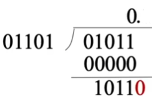
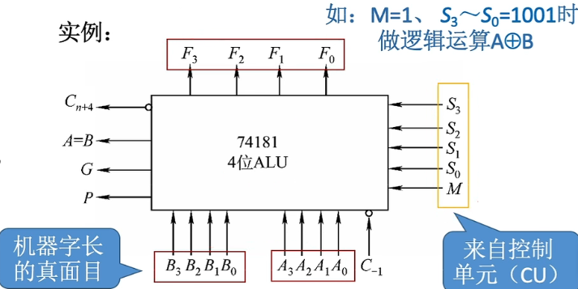
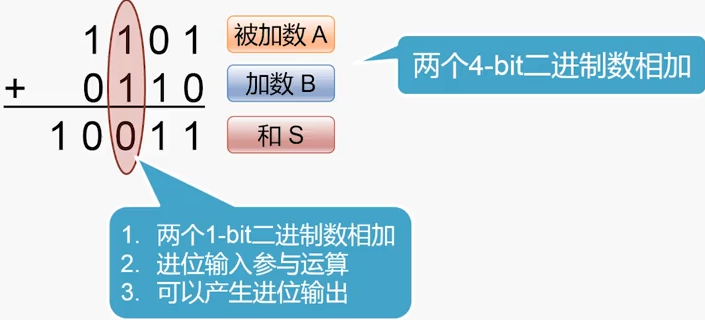
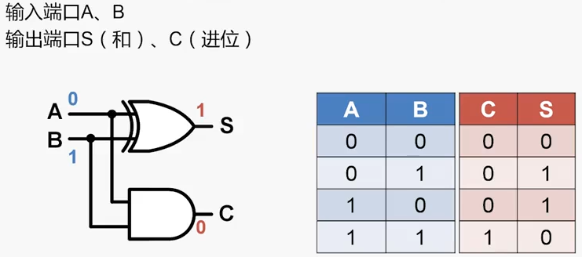

# 计算机组成原理

> “练拳不练功，到老一场空”。

**如果越早去弄清楚计算机的底层原理，在你的知识体系中“储蓄”起这些知识，也就意味着你有越长的时间来收获学习知识的“利息”。虽然一开始可能不起眼，但是随着时间带来的复利效应，你的长线投资项目，就能让你在成长的过程中越走越快。**

**知识体系:**


## 第0章 计算机第一门课


### 0x00 计算机软硬件

计算机由两大部分组成: **硬件** 和 **软件**

- 硬件: 即看的键的计算机部件物体

- 软件: 运行在计算机内的程序.

  - 软件又分: **系统软件** 和 **应用软件**

  - > 系统软件: 管理计算机系统,监视服务,合理调度系统资源,高效.
    >
    > 系统软件组成:标准程序库,语言处理程序(编译器,汇编器),操作系统,服务程序,数据库管理系统,网络软件等.
    >
    > 应用软件: 为完成某个目的而编写的程序. 

### 0x01 计算机系统层次结构


### 0x02 计算机体系结构与组成原理

计算机体系结构也是一门计算机课程, 它与组成原理是不一样的.

计算机体系结构关心的是 计算机中的东西该怎么来设计, 或者该设计什么东西让计算机更加高效.

> 比如我的指令系统是不是要有乘法指令,  我应该设计怎样的数据类型, 寻址技术, I/O机理等.

计算机组成原理关心的是, 设计好的这些东西我怎么来实现, 用什么样的器件, 方法来实现, 从而更高效.

> 组成原理关心我要用什么样的电路设计, 和元器件来实现这个乘法指令, 能让ALU用更少的时钟周期完成运算.
>
> 这部分对程序员来说是不可见的, 程序员也不用关心这部分.

总而言之, 就是`计算机体系结构`关心如何设计硬件与软件之间的接口(逻辑层面), 

而`组成原理`关心如何用电路与元件来实现定义的接口(物理层面).


## 第1章 计算机概述

### 0x00 计算机发展史

图灵机 → ENIAC(第一台真空管) → 冯诺依曼结构目前主要)和哈佛结构(嵌入式主要) → 半导体集成电路

- 冯诺依曼机型第一篇论文:`First Draft of a Report on the EDVAC`,提出`存储程序`概念

  - > `存储程序`思想: 把事先编写好的`程序与原始数据`送入`主存`中, 然后启动执行. 计算机在不需操作人员操作下,自然完成取出指令和执行指令的任务.

  - `存储程序`的另一层涵义: `可编程`.

- ENIAC非冯诺依曼结构

### 0x01 计算机特点

- 高速: 高速元器件和`存储程序`的工作方式带来高速运行.
- 通用: 在处理对象和应用领域没有限制
- 准确: 精度足够的算数运算
- 智能: 逻辑推理能力有智能型

### 0x02 冯诺依曼结构

#### 1. 五大组成部分


- 冯诺依曼结构的组成部分(来自First Draft):

  - 输入设备 (Input device)

  - 算术/逻辑运算器 (Arithmetic/Logic Unit): 

    与**处理器寄存器**(Processor Register)的**处理器单元**(Processing Unit),一起完成各种算术和逻辑运算.

    我们称之为**数据通路（Datapath）**或者**运算器**.

  - 控制器 (Control Unit) :

    由**指令寄存器(Instruction Register)**和**程序计数器(Program Counter)**组成,用来控制程序的流程,通常就是不同条件下的分支和跳转

  - 存储器 (Memory Unit):

    存储数据Data和指令Instruction的**内存**以及更大容量的**外部存储**.

  - 输出设备(Output device)

  在现在的计算机里,上面的算术逻辑单元和这里的控制器单元,共同组成了我们说的 CPU.

所有的计算机程序, 也都可以抽象为从**输入设备**读取输入信息, 通过**运算器**和**控制器**来执行存储在**存储器**里的程序,最终把结果输出到**输出设备**中.  而我们所有撰写的无论高级还是低级语言的程序, 也都是基于这样一个抽象框架来进行运作的.


#### 2. 冯诺依曼结构计算机的特点:

- 典型的五大部件

- **指令和数据, 以二进制形式, 不加区别地, 存放在存储器中**! (哈佛结构就不是这样) 

  意味着指令与数据的宽度一样. 指令与数据可按地址寻访. 

- 指令由**操作码**和**地址码**组成, 操作码指数**操作类型**,地址码给出**操作数的地址**.

- 计算机工作时, 能**自动**从存储器中**取出指令**进行执行

- **指令**在存储器内**顺序存放**.通常, 指令是**顺序执行**,但也可**改变执行顺序**.

- 运算器能进行加减乘除四种**基本算术运算**, 也能进行**逻辑运算**与**附加运算**.

- 操作人员可以通过**输入设备**和**输出设备**和主机进行通信

- 机器**以运算器为中心**,**输入输出设备与存储器**之间的**数据传送**通过**运算器**完成.

### 0x03 现代计算机结构

现代计算机已经转为**以存储器为中心**.如图:


#### **各部件功能**

- 运算器: 完成算术与逻辑运算, **中间结果暂存运算器(寄存器)内**.
- **存储器**存放数据和程序(与冯氏结构一样)
- **控制器**可以**控制, 指挥程序和数据的输入,运行以及处理运算结果**.
- 输入设备把人类的信息形式,转为计算机能识别的信息形式.如键鼠等.
- 输出设备是把计算机运算的结果,转换成人类熟悉的信息形式.如显示器, 音响等.

#### **现代计算机由三大部分组成**

- CPU  = 运算器 + 控制器 

- 主存储器

- I/O设备 

  

  **各部件的包含关系**


#### 细化的计算机组成图


#### **存储器介绍**


**存储器**分为**主存储器(内存)**和**辅助存储器(外存储器)**. 

CPU能**直接访问主存储器**. 辅助存储器中的内容必须先调入主存后,才能由CPU访问. 

**主存储器**(内存或主存) 包括存储体, 各种逻辑部件及控制电路等.

**主存储器**的工作方式, 是**按存储单元的地址进行存取**, 即**按地址存取方式**.

> 人们只要事先将编好的程序按顺序存入主存各单元, 当运行程序时, 先给出该程序在主存的首地址, 然后采用程序计数器加 1 的方法, 自动形成下一条指令所在存储单元的地址, 机器便可自动完成整个程序的操作. 
>
> 由于数据和指令都存放在存储体内各自所占用的不同单元中, 因此, 当需要反复使用某个数据或某条指令时, 只要指出其相应的单元地址号即可, 而不必占用更多的存储单元重复存放同一个数据或同一条指令, 大大提高了存储空间的利用率. 此外, 由于指令和数据都由存储单元地址号来反映, 因此, 取一条指令和取一个数据的
> 操作完全可视为是相同的, 这样就可使用一套控制线路来完成两种截然不同的操作. 


如图是主存储器的基本组成.

存储体中存放二进制代码数据. 

**存储体**由**许多存储单元**组成, 每个**存储单元**包含若干**存储元件**, 每个**存储元件**存储1位二进制代码0或1.

故存储单元可存储一串二进制代码, 这串代码称为**存储字**, 称这串代码的位数为**存储字长.**

也就是说, **存储单元的宽度就是一个存储字长**. 存储字长可以为8位,16位, 32位等.

> 一个存储字可代表一个二进制数, 也可代表一串字符, 如存储字为 0011011001111101, 既可表示
> 为由十六进制字符组成的 367DH , 又可代表 16 位的二进制数, 此值对应十进制数为 13949 , 还可代表两个 ASCII 码：＂ 6” 和“}＂. 一个存储字还可代表一条指令. 
>
> 如果把一个存储体看作一幢大楼, 那么每个存储单元可看作大楼中的每个房间 ,  每个存储元
> 可看作每个房间中的一张床位, 床位有人相当于 “1” ,  无人相当于 “0”.  床位数相当于存储字长.
> 显然, 每个房间都需要有一个房间编号, 同样可以赋予每个存储单元一个编号, 称为存储单元的
> 地址号. 

为了能实现按地址访间的方式, **主存中**还必须配置两个**寄存器 MAR 和 MDR.**

**存储器地址寄存器(MAR, Memory Address Register)**存放**欲访问的存储单元的地址,  经过地址译码后**, 找到所选的存储单元. 接着进行读操作或写操作.

**存储器数据寄存器(MDR, Memory Data Register)**用于**存放从存储体某单元取出的代码或者准备往某存储单元写入的代码.** 

**时序控制逻辑**用于**产生存储器操作所需的各种时序信号**.

> 要想完整地完成一个取或存操作,  CPU还得给主存加以各种控制信号, 如读命令, 写命令和地址译码驱动信号等。随着硬件技术的发展, 主存都制成大规模集成电路的芯片而将 MAR和 MDR集成在 CPU 芯片中.

**MAR用于寻址**, 其位数对应着**存储单元的个数**, 如MAR是10位的话,  就有2的10次方 1024个存储单元, 1024记为1K.

**MAR的长度与PC的长度相等**.

**MDR的位数与存储字长相等**, 一般为字节的二次幂的整倍数.若MDR为16位, 那么1个字就是16位长.

#### **运算器介绍**


**运算器** 的核心是ALU 算术逻辑单元.

运算器中, 包含若干**通用寄存器(GPR, General Purpose Register)**, 用于暂存操作数与中间结果. 如累加器(ACC, Accumulator ), 乘商计算器(MQ, Multiplier-Quotient Register), 操作数寄存器(X), 变址寄存器(IX), 基址寄存器(BR)等, 其中**前三个是必备**的.

运算器内还有**程序状态寄存器(PSW, Program Status Word)**, 也称**标志寄存器(Flag Register)**. 用于存放ALU运算得到的一些**标志信息**或者**处理机的状态信息**.如结果是否溢出, 有无产生进位或错位,结果是否为负等.(单片机常见)

#### **控制器介绍**


**控制器**是是计算机的神经中枢, 由其指挥各部件自动, 协调地进行工作. 

>具体而言, 它首先要命令存储器读出一条指令, 称为取指过程, 也称取指阶段. 接着,  它要对这条指令进行分析, 指出该指令要完成什么样的操作, 并按寻址特征指明操作数的地址, 称为分析过程,也称分析阶段. 
>最后根据操作数所在的地址以及指令的操作码完成某种操作, 称为执行过程, 也称执行阶段.
>
>以上就是通常所说的完成一条指令操作的取指, 分析和执行 3 个阶段. 

控制器由**程序计数器(PC, Program Counter)**, **指令寄存器(IR, Instruction Register)**和**控制单元(CU)**组成.

***控制单元CU***用来**分析当前指令所需完成的操作**, 并**发出各种微操作命令序列**, 用以**控制所有被控对象**. 

***程序计数器PC***用来存放**当前欲执行指令的地址**, **可以自动加1以形成下一条指令的地址, 它与主存的MAR之间有直接通路.**

***指令寄存器IR***用来**存放当前的指令**, 其**内容来自主存的MDR**. 

IR 中的操作码 ( OP (IR) )送至 CU, 记作 OP (IR) → CU , 用来**分析指令**;    

其地址码 ( Ad(IR) )作为**操作数的地址**送至**存储器的 MAR** ，记作 Ad (IR)  → MAR 。 


> 如上图是冯诺依曼的模型机, CPU包含ALU, 通用寄存器组GPRs, 标志寄存器, 控制器, 指令寄存器IR,程序计数器PC, 存储器地址寄存器MAR, 存储器数据寄存器MDR. 从控制器发出的是控制信号, 可以控制如何修改PC以得到下一条指令的地址, 可以控制ALU执行何种运算, 可以控制主存是读操作还是写操作.

CPU和内存之间通过一组总线相连, 总线中有地址, 控制和数据3组信号线. MAR中的地址信息会直接送到地址总线上, 用于指向读/写操作的内存存储单元; 控制线中有读/写信号线, 指出数据是从CPU写入内存, 还是从内存读到CPU, 根据是读操作or写操作来控制将MDR中的数据是直接送到数据线上, 还是讲数据线上的数据放到MDR中.


#### 计算机工作过程

我们需要知道的控制过程的部件, `CU, PC , IR, MAR, MDR, 运算器`. 运算器的运算过程, 我们暂时把它当黑箱. 

**看个例子:**


C语言写个简单的程序, 然后编译器经过`预处理, 编译, 汇编, 链接`之后, 翻译成机器认识的二进制代码, 装入内存.

> 

假设地址从0开始(`这段程序首地址是0`), 然后16位作为一个存储字长.  指令和数据, 顺序存储在内存中.

地址0到4, 存放的是指令, 5到8存放的是我们定义的4个变量. 

**执行过程:**

开始: `PC` 中的地址值为0, 指向内存的第一条指令地址.

\#1:  `PC`中的地址, 经地址总线, 传到MAR中去. 此时MAR中的值为 0号地址. 

​        同时控制器通过控制总线告诉主存, 此次操作为`读取`

\#2:  `主存`会根据`MAR`中的地址信息, 去0号地址读取其中的二进制代码. 存放到`MDR`中.

\#3:  `主存`通过`数据总线`把`MDR`中的数据送给`IR`, 此时IR 中的值就是0000010000000101

​       `此时,  PC自动加1.` PC中的值为 1号地址.

\#4: `IR`中的`操作码OP` 送给`CU`(OP (IR) → CU), CU`分析指令`后, 知道是取数的命令. 

\#5: `IR`中的`地址码Ad` 送给`MAR`(Ad (IR)  → MAR), 则MAR中的值为0000000101(就是5号地址位).

\#6: 主存根据MAR的地址, 从5号地址读取其中的数据, 存放到MDR. MDR中的数据就是 2.

\#7: CU指挥MAR中的数据, 经数据总线, 传给ACC

> \#1~#3为取指领, #4 为分析指令. #5~#7 为执行指令.	


PC自动加1 后:

\#1: PC中的值再传给 MAR, MAR中的值为1号地址. 控制器给出读取指令.

\#2: 主存根据MAR的内容, 去1号地址读取指令, 存到MDR.

\#3: MDR中的指令 再传给IR.                     (取指令完成)

​       同时PC再自动加1, 变成2号地址.

\#4: OP (IR) → CU , CU分析命令, 得知是乘法命令. (分析指令)

\#5: Ad (IR)  → MAR, MAR中的值为6号地址.

\#6: 主存去6号地址取数据3, 存到MDR.      

\#7: MDR中的数据经数据总线传到 MQ 中.

\#8: 控制器把ACC中的a的值2, 传到操作数寄存器X中, CU通过2进制代码告诉ALU进行乘法.

\#9: ALU执行乘法运算, 结果存在ACC中.(若乘积很大, 则需要MQ帮助存储.)     (执行)

如此重复, 自动执行.

> - **总结一下**:
> - **取指令**:(PC)→(MAR)→Memory→(MDR)→IR
>   - 将PC中的地址, 送到MAR中, MAR中的内容送到地址线, 同时控制器将读信号送读/写信号线,
>   - 主存根据地址线中的地址和读信号, 从存储单元中读取指令, 送往数据线, MDR从数据线接收
>   - 指令数据, 并转送到IR中.
>
> - **每当取指令完成, PC会自动加1,  形成下一条指令地址.**
> - **分析指令:**OP(IR)→CU
>   - 根据IR中的操作码,  CU分析出相应需要哪些指令来完成操作, 送到不同的部件去执行.
> - **执行指令:** Ad(IR)→MAR→Memory→MDR→ACC
>   - 把IR中的地址码送给MAR, MAR中的内容送给地址线, 同时控制器把指令读信号送到读/写信号线.
>   - 从内存中读取操作数, 并经数据线传给MDR, 再由MDR转送到ACC寄存器中.


### 0x04 计算机的性能指标

#### 主存容量


> 比如你CPU是32位的, 那最多支持4G内存容量. 
> 你可以只插2G的内存条. 但当你插8G内存条, 系统也只能识别出4G.

#### CPU性能指标

> 你听说过超频吗? 

- **CPU主频**

  CPU主频就是, **(石英)晶体振荡器的频率**. CPU中的(石英)晶体振荡器在振荡时, 会产生数字脉冲信号.

  > 
  >
  > (石英)晶振产生的高低电平脉冲. 这就是CPU时钟信号的来源.可以理解为CPU工作的计时器.
  >
  > (石英)晶振要是坏了, 那CPU也就没办法正常工作了.

  - **CPU时钟周期**
  - 
  - 脉冲信号一个连续高低电平的时间, 就是CPU时钟周期了.

**CPU的主频就是 `CPU时钟周期的倒数`.** 单位是**Hz赫兹**, 即**一秒内时钟周期的个数**.


- **CPI(Clock cycle Per Instruction)**

  CPI就是 **执行一个指令所需的时钟周期数**. 

  CPI不好度量, 不同的指令CPI是不同的. 即使是相同指令, CPI也可能不同. 我们往往取平均值.

  所以, **`执行一条指令耗时 = CPI x CPU时钟周期`**

> 例如, CPU主频1000Hz, 某程序包含100条指令, 平均来看指令CPI=3. 求CPU执行时间.
>
> 3x (1/1000) x100 = 0.3s -- 平均一条指令的耗时 x 指令条数.

- **IPS(Instructions Per Second)**

  每秒执行指令数.

  **IPS= 主频(Hz) / 平均CPI** 单位: KIPS, MIPS等. K与M, 为Kilo , Million的缩写, 数学单位.

- **FLOPS(Floating-point Operations Per Second)**

  每秒执行浮点运算的次数.

  单位: `KFLOPS, MFLOPS, GFLOPS, TFLOPS`. (K=10^3^, M=10^6^, G=10^9^, T=10^12^)

#### 系统整体性能指标

- **数据通路带宽**

  **数据总线一次所能并行传送信息的位数**.(各硬件部件通过**数据总线**传送数据)

- **吞吐量**

  指系统在**单位时间**内**处理请求**的数量. ( 请求的概念需要结合实际的场景来理解. )

  > 它取决于信息能多快地输入**`内存`**, CPU能多快地取指令, 数据能多快地从**`内存`**取出, 或写入.
  >
  > 以及所得结果能多快地从**`内存`**送给一台外部设备. 
  >
  > 所以, 系统吞吐量主要**取决于内存的存取周期**.

- **响应时间**

  指从用户向计算机发送一个请求, 到系统对该请求做出响应并获得它所需要的结果的等待时间.

  > 通常包括CPU时间(运行一个程序所花费的时间)与等待时间(用于磁盘访问, 存储器访问, I/O操作, 操作系统开销等时间.)

- **基准程序**

  用来测量计算机处理速度的一种实用程序, 以便被测的计算机性能可以与运行相同程序的其他计算机性能进行比较. 比如 benchmark等跑分软件.

  

## 第2章 计算机中的数据与运算

### 0x00 数据的进制及相互转换

对程序员来说, 用得到的数制有10进制, 2进制, 8进制, 16进制.

不详细讲这个部分了, 简单.

### 0x01 BCD码(Binary-Coded Decimal) 

看名字就知道, 这是2进制编码的10进制数. 它通常用4位2进制数表示1位10进制数中的(0~9)这十个数.

> 比如十进制1用二进制就是0001, 9就是1001等等. 
>
> 那 18呢? 一样, 每一位依次转为4位二进制. 就是0001 1000, 前4位是10位, 后四位是个位.

但4位二进制,可以表示16种代码. 因此有6种状态为冗余状态. 

- **常用BCD码**:

#### 8421码(最常用)

8421依次对应4位二进制的位权. 

若两个8421码相加之和, 小于等于9, 则不用修正. 若大于9, 则需要加6.(4位二进制能表示16个数, 为了让二进制表示进位, 进位后的数仍与原10进制数值相等)

> 比如1(0001)~2~+8(1000)~2~=9(1001)~2~, 不必修正. 4(0100)~2~+9(1001)~2~= 13(1101)~2~ , 我们说过4位2进制只表示一位10进制, 1101 找不到对应的10进制基数(0~9)的数值. 所以要加6. 变成 10011, 如果补齐4位,
> 就是0001 0011, 十位为0001, 个位是0110就对了.
>
> 再比如9+7=16, 16的二进制10000, 这时候补齐0001 0000,它不是BCD码的16, 是BCD码表示的(10)~10~
>
> 所以要加6.变成0001 0110.

#### 余3码

 这是一种无权码.是在8421码基础上, 加 (0011)~2~形成.

> 如0→0011, 8→1011, 9→1100, 15 (0001 0101)~2~→ 1 1000

#### 2421码

这也是一种有权码, 权值由高到低分别为2, 4, 2, 1.

特点就是, 大于等于5的4位二进制数中最高位为1, 小于5的最高位为0.

> 如 5→1011 而非0101,  4→0100 , 3→ 0011, 6→ 1100而非0110
>
> 那16呢? 0001 1100咯.

### 0x02 字符与字符串

#### 1. ASCII码

由于数字+字母+符号加一起才128个字符,所以 7位二进制编码足以. 计算机中会在高位补个0, 凑够一个字节存放.


上面就是ASCII码表.

**可印刷字符: 32~126, 其它为控制(如127 的delete), 通信字符(如6 的ACK)**

*数字(0~9)为:   48~57* , ***大写字母65(0100 0001)~90(0101 1010)  小写字符是大写字母+32(偏移0010 0000)***

***小写字母范围 92(0110 0001)~122(0111 1010)***

#### 2. 汉字的表示和编码

汉字比英文二十六个字母多多了. 汉字的编码方式:

`输入码`+`汉字内码`+`汉字字形码`

- 输入码:对汉字进行相应的按键编码表示,用于输入.比如输入法 输入zhong, 会有对于的字出来.
- 汉字内码:就是系统中进行存储,查找,传送用的二进制编码.

- 汉字字形码:就是用于输出,在屏幕上看到的各种字体, 用于显示,打印.

汉字内码编码类型: GB2312-80, 国标码, UNICODE.了解一下. 

**汉字在计算机中用2个字节存储.**

**汉字字形码**在计算机内, 是矩阵存储的.


#### 3. 字符串

知道了计算机是怎么存西文字符跟汉字的, 那么字符串, 就是内存中的一串字符.

上面我们知道, 西文字母和字符都用1个字节存储, 而汉字用2个字节存储.

那么, 字符串"abc"占三个字节, 但系统会给这个字符串一个结束符'\0', 来在内存中区分这个字符串跟别的内容.

所以"abc"实际是 4个字节.  "abc啊"是6个字节


大小端是后面的内容.

### 0x03 校验码

因为数据在计算机内进行运算, 存储以及传输过程中, 元器件可能受到干扰, 发生故障,

从而造成数据的错误, 所以我们需要用数据校验的方式, 来保证数据的正确性.

**校验原理简介**


> 如图, 2位编码, 只有4个合法状态. 换成3位编码, 重新进行编码.
> 但3位能表示的状态是8个.所以会多出4个非法状态.
> 所以2位编码时, 计算机无法发现错误, 因为01跟00 都是合法的, 
> 计算机不知道你原来是什么内容, 反正都是合法的它不管.
> 重新编码后, 会有四个非法状态, 若是能根据某种编码规则, 容易找出出错的位置.
> 就是校验的基本原理.

**几个术语**

**码字**: 由若干位代码组成的一个字.

> 上面例子, 2位组成的有4种码字, 3位组成的有8种码字.

**码字距离**:将两个码字逐位进行对比, 具有不同位的个数, 成为**两个码字之间的距离**.

> 上面例子中, 2位编码的 00 跟 11, 两个码字的距离是2, 00与01的距离是1.
> 3位编码的 001 与 010距离 是3,  010与111距离2

**码距**: 一种编码方案可能有若干合法码字, 各合法码字之间的最小距离 为码距.

> 上面例子, 2位编码方案, 各合法码字间最小距离是1, 那码距就是1.
> 3位编码方案, 各合法码字之间距离最小是2 , 码距就是2.

当码距为1时, 没有检错能力. 当码距为2时, 有检错的能力.

当码距>=3时, 若设计合理, 可能具有检错, 纠错的能力

#### 1. 奇偶校验码(不纠错)

**奇校验码**: 整个校验码(有效信息位与校验位) 中 "1" 的个数为奇数.

**偶校验码**: 整个校验码(有效信息位与校验位) 中 "1" 的个数为偶数.


> 举个栗子, 1001101 与 1010111 两个编码, 他们的 奇校验码与 偶校验码:
> 1001101 里有4个1, 所以奇校验码是 1100 1101 , 偶校验码0100 1101
> 1010111 有5个1, 所以奇校验码为 0101 0111, 偶校验码 1101 0111

若 偶校验码 发生1位错误时, 变成了奇校验码, 所以计算机会知道数据错了; 而 发生2位错误, 那偶校验码

还是偶检验码. 计算机就无法发现错误. 这就是奇偶校验的局限性.

> `奇数个bit发生错误 能发现出来但不知哪位错了`, `而偶数个bit发生错误 无法发现. `
> `奇偶校验 不能纠错. 只能要求重传.`

**偶校验码的算法**(因为后面要用到):

计算机对有效信息位, 逐位进行异或运算. 即可得到偶校验码的校验位.

比如 1001101,  逐位异或, 得到是0. 那校验位就置0, 偶校验码就是: 0100 1101.

**如何进行偶校验呢?**

偶校验码的所有位, 进行异或运算, 若结果为1, 说明出错.

> 假设 0100 1101 出错变成 0101 1101, 对出错后的编码进行所有位异或, 结果是 1 则发现出错.

#### 2. 海明校验码

**海明校验码 基于 偶校验码**. 偶校验码只添加1个校验位. 

海明校验码, 把有效信息位, 分为**K个组**. 然后**每个组都变成偶校验码**,  就会多出K个校验位.

> 这里有两个问题要处理: 1. 怎样分组, K是多少呢. 2. 有效信息位又该怎么分组.

##### 分几个组(要几个校验位)


2^k^  必须包含n+k种状态, 并且至少有1种正确状态.

**2^k^  >= n+k+1**

##### 海明码各位置数据

假设信息位是1010 , n=4, 由上图可知 k就取3.

我们设信息位1010对应**D~4~D~3~D~2~D~1~** , 校验位**P~3~P~2~P~1~** , 

对应的7位海明码为 **H~7~H~6~H~5~H~4~H~3~H~2~H~1~**

**海明校验码规定, 校验位P~i~ 要放在海明码位号为2^i-1^ 位置上, 信息位按顺序放到其余位置.**


##### 分组规则

每个有效数据位用多个校验位进行校验, 需要满足条件:

**被校验的数据位的海明码位号 = 校验该数据位的各校验位 海明码位号之和.**

> D~1~ D~2~ D~3~ D~4~ 这几个数据位, 在海明码是第3, 5, 6, 7位, 校验位 P~1~ P~2~ P~3~ 是海明码第1, 2, 4位.
>
> 3 = 1+2即 D~1~由P~1~P~2~ 校验, 依此类推, D2由P1P3校验, D3由P2P3校验, D4由P1P2P3校验

P~1~参与校验D~1~, D~2~, D~4~,  

P~2~参与校验D~1~, D~3~, D~4~,   

P~3~参与校验D~2~, D~3~, D~4~.

分组完成, P~1~D~1~D~2~D~4~, P~2~D~1~D~3~D~4~ , P~3~D~2~D~3~ D~4~

**求校验位的值**

上面分完组, 就是有k=3组, **每一组都是偶校验码.**

根据上面**偶校验码的算法**, 校验位就是数据位**异或**得来.

P1 = D1⊕D2⊕D4 = 0

P2 = D1⊕D3⊕D4 = 1

P3 = D2⊕D3⊕D4 = 0

或者用下面这个方法来也行:


得到了P~1~P~2~P~3~,  反正这7位海明码是 1010010.


三组也就出来了:

**P~1~D~1~D~2~D~4~ : 0011**,  **P~2~D~1~D~3~D~4~ : 1001**,  **P~3~D~2~D~3~D~4~ :  0101 ** 的确是偶校验码

##### 校验与纠错

上面三组校验结果, 用三个变量来存(偶校验码的校验方法):

S~1~ = P~1~⊕D~1~⊕D~2~⊕D~4~

S~2~ = P~2~⊕D~1~⊕D~3~⊕D~4~

S~3~ = P~3~⊕D~2~⊕D~3~⊕D~4~

计算机接收到二进制编码后, **S~3~S~2~S~1~**值为000, 就没有错误. 

**值为 001, 则出错位在海明码第1位即H1. 值为101, 则H6出错.**

##### 补充

海明码有1位纠错能力, 2位检错能力.

但无法去封到底是1位错还是2位错.

所以在实际使用时, 海明还会在最高位加一位 **`全校验位`**, 让这8位成为偶校验码.


此时,

**S~3~S~2~S~1~** = 000, 且 **全体偶校验成功**, 则  没有错误.

**S~3~S~2~S~1~**  不是 000, 且**全体偶校验失败** 则有1位错, 纠正即可.

**S~3~S~2~S~1~** 不是 000,  且**全体偶校验成功** 则有2位错, 要求重传. 


#### 3. 循环冗余校验码(CRC)

##### 基本思想


数据的发送方与接收方, 约定一个**除数**

用 **K个信息位后面加R个校验位**作为**被除数** 除以 **约定的除数**, 来观察**余数是否发生变化, **
来确定**数据是否发生了错误**.

先介绍**模2运算**,后面用得到.

##### 模2加/减运算

模2加法运算为: 1+1=0, 0+1=1, 0+0=0, **无进位**; 

模2减法运算为: 1-1=0, 0-1=1, 1-0=1, 0-0=0, **无借位**. 

模2加减法相当于二进制中的逻辑**异或运算**. 

##### **模2除法**

采用模2减法，不带借位的二进制减法，因此考虑余数够减除数与否是没有意义 的。实际上，在CRC运算中，总能保证除数的首位为1，则模2除法运算的商是由余数首位与除数首位的模2除法运算结果确定。因为除数首位总是1，按照模2 除法运算法则，那么余数首位是1就商1，是0就商0。

（1）一步步的计算方法：

模2除法与长除法类似，但有个特点：不借位。说白了就是按位异或，相同为0，不同为1。 
它有三个原则： 

1. 除数与被除数最高几位（与除数位数相同）做异或，商1。（除数首位必须为1） 
2. 余数先去掉首位，若此时余数最高位为1，商1，并对以它为除数继续模2除。 
若最高位为0，则商0，重复步骤2。 
3. 直到余数位数小于除数位数时，运算结束。 

（2）熟悉规则之后，比较简洁的方法

1. 当余数位数与除数位数相同时，才进行异或运算，余数首位是1，商就是1，余数首位是0，商就是0。
2. 当已经除了几位后，余数位数小于除数，商0，余数往右补一位，位数仍比除数少，则继续商0，当余数位数和除数位数一样时，商1，进行异或运算，得新的余数，以此至被除数最后一位。


##### 循环冗余校验码工作原理

- **确定K, R以及生成多项式对应的二进制码**

设**生成多项式**G(x)=x\^3+x\^2+1, 信息码为101001, 求CRC码.

G(x) 写成 = **1**\*x\^3+**1**\*x\^2+**0**\*x\^1+**1**\*x\^0  **除数就是1101**

**K = 信息码长度** = 6,  **R = 生成多项式最高次幂** = 3 则, 

**CRC校验码位数N= K+R** = 9

- **移位**

  信息码**左移R位,** 低位补0, 结果就是左移3位, 101001 **000** 它就是**被除数**.

- **相除**

  用生成多项式产生的**除数**, **对移位后的信息码**进行**模2除法**, 产生**R位余数.**


得到校验位001, 所以CRC码就是101001 001

- **检错与纠错**

发送方发送上面得到的CRC码 101001001 记作C9~C1

接收方接收到数据后, 用约定的除数 1101对它进行模2除, 如果余数为000, 则没出错.

假设接收到101001011 模2除后, 余数为010说明~~C2出错~~.


所以, 不一定是C2出错, 也有可能是C9.


为什么叫循环呢? 因为如果CRC码够长, 余数从001~110(对应上图1到7), **会不停的循环出现**.

后面计算机网络也会遇到这个内容.

### 0x04 定点数的表示与运算

定点与浮点, 就是小数点位置固定与不固定的区别.

#### 无符号数

机器字长的所有二进制位都是数值位, 没有符号位, 相当于绝对值.

通常只有无符号的整数, 而没有无符号小数. 后面介绍浮点数就知道了.

n位无符号数的范围是0到2^n -1

#### 有符号定点数


有符号数, 最高位为符号位, 剩下的是数值位, 数值部分也成为尾数.

符号位0为正, 1为负.

定点整数, 其小数点在最右隐藏.

定点小数, 其小数点在符号位后面隐藏.

小数点在计算机存储数据的时候是没有的, 计算机会认识这段数据是小数.

后面有IEEE754的浮点数的内容.

原码, 反码, 补码, 移码.

若真值为x, 用[x]原, [x]反, [x]补, [x]移 表示它的原码, 反码, 补码, 移码.

**反码**

正数的反码是它的原码, 负数的反码, 符号位不变, 数值位按位取反.

**补码**

正数的补码, 就是它的原码. 负数的补码, 就是反码末尾+1. 

> (这是它的算法, 这个补码怎么来的, 可以了解`补数`, 是`数论`的内容. 唐朔飞教授的计算机组成原理里有讲.)

> 注意, 0的原码, 可有正负0, 假设是8位即0000 0000, 1000 0000. 负0的补码舍掉进位, 还是0000 0000
> 那负0的补码跟正0重复了. 所以:
> 规定 (8位)定点整数补码的 1000 0000是 -2^7.

引申一下补码的原生定义, 假设存储长度为n位. 那这n位的**模**就是2^n

**那 x 的补码 就是` 2^n ` 减 `x的绝对值 `.**

**移码**

将 补码 的符号位 取反. 它只能表示整数.

#### 补码作用

有了补码,  那减去一个数, 就可以变成加上这个数的补码就可以了.

这就可以让减法变成加法. 那计算机就只需要设计加法器, 不用设计减法器.

计算机中, 正整数是按它的原码存储,  负整数是以补码形式存储.

#### 定点数移位运算

**算数移位**


**正数**的原码, 补码, 反码一样, 左移数值位低位补0, 右移数值位高位补0.

**下面是负数**:

原码的算数移位:  符号位不变, 仅对数值位进行移位. 左移数值位低位补0, 右移数值位高位补0.

负数反码算数移位: 左移低位补1, 右移高位补1.

补码移位: 符号位不动, 左移低位补0, 右移高位补1.

**移位运算可能会丢失精度.**

移位的ALU指令很少, 比计算乘除法要快. 所以, 乘以2 除以2 就可以用移位来操作.


**逻辑移位**

逻辑移位,可以把它看做是无符号数的算数移位.

逻辑右移: 高位补0 , 低位舍掉.

逻辑左移: 低位补0 , 高位舍掉.


**循环移位**

循环移位就是把应该被舍掉的数据, 放到应该补位的地方.

如循环左移, 假设左边最高位应该舍掉的数据是1, 那就把1放到最右边空出来的地方.

**1**011 0101 循环左移一位, 结果就是 0110 101**1**

**带进位位的循环移位**

跟普通循环移位不同点 就是多了一位CF位, Carry Flag.


比如现在CF中的数据是1 , 要移位的数据是 1011 0101.

**带CF的循环左移,** 就会把最高位1, 先放到CF中, 然后把CF中的数据, 去补最右边出现的空位.

结果就是 CF 1 数据位是 0110 1011

**带CF的循环右移**, 就会把最低位中的数据, 放到CF中, 然后CF中的数据补到最高位. 结果就是1101 1010.

循环移位就可以把高字节和低字节的数据进行互换.


#### 定点数加减运算

计算机的加减运算 **都是加法处理**. 计算机里 负数是用补码存放的. 

所以减去一个正数, 就是加上这个数变成负数的补码.

减去一个负数, 就是加上这个负数的绝对值.

设机器字长为n.

[A+B]补 = [A]补+ [B]补(mod 2^n) 

[A-B]补 = [A]补+[-B]补(mod 2^n)

mod 2^n 是将溢出位丢掉, 计算机自动完成的操作.

#### 定点数溢出判断

由于计算机内对于内存的管理, 是按字节管理.  不同的数据类型, 占用的内存字节数也不同.

所以, 每种数据类型, 能存放数据的大小, 也不同.

这就必然会出现溢出的问题.

**上溢**: 正数区的溢出,  正+正=负

**下溢**: 负数区的溢出,  负+负=正

假设3位二进制运算, 带符号的话3位二进制就能表示-4 到 3.

当计算2+2就会(上)溢出.

ALU是如何实现溢出判断呢?

- **方法一 采用一位符号位**

  设A的符号为As, B的符号为Bs, A,B运算结果的符号为Ss, 则溢出逻辑表达式为:

   

  > V=0, 无溢出; V=1, 表示有溢出
  >
  > 

上面这个V表达式, 的意思就是 正+正=负, 负+负=正都是有溢出的.  Ss取非, 是为了 + 号一侧为1.

- **方法二** 

跟方法一差不多, 只是引入一个符号位的进位Cs(即符号位在加法计算后有没有产生进位), 

和一个最高数值位的进位C1(就是计算结果时,看看计算最高数值位时有没有产生进位.).


- **方法三** **双符号位**

  原来数据都是一个符号位, 现在变成两个符号位,

  设相邻的两个符号位, 左边的为Ss1, 右边的为Ss2.

  则Ss1为本应得到的符号, Ss2为实际得到的符号.

  如果计算结果为01 则意思是本应得到正数, 实际得到负数, 即为上溢.

  如果计算结果为10 则意思是本应得到负数, 实际得到正数, 即为下溢.

  令V=Ss1 ⊕ Ss2, 

  V = 0 表示无溢出 , v = 1 表示有溢出.

  

#### 符号扩展

有两个变量char a = 1;  int b = 2; 在32位机器中, char是一个字节, int 是4个字节.

那a+b时, 因为计算是在ALU中进行, 而且是按位相加的, 那两个不长度的值, 在寄存器中怎么加.

所以, 短数据一定要迁就长数据,  不然char只有1个字节,  而int 4个字节, 高位的3个字节, 就没法算了.

这个时候就需要符号扩展.(高级语言中的隐式数据类型转换)

**定点整数**

正整数扩展很简单, 高位补0就行了(因为正数符号位也是0). 

负整数扩展就有区别了:

原码: 符号位与数据位之间添0

反码: 符号位与数据位之间添1

**补码: 符号位与数据位之间添1** (计算机内负整数都以补码存储)

**定点小数**

正小数: 在尾部添0, 这样不会改变小数的数值.

负小数:

原码: 尾部后面往右添0

反码: 尾部后面往右添1

补码: 尾部后面往右添0

#### 定点数乘法运算

##### **原码的乘法**

我们来计算0.1101 *  0.1011 , 把乘数按权拆开:


那乘法就变成了加法:


**接下来看看计算机是如何处理的:**

假设机器字长 n+1=5 一位符号位, [X]原 =1.1101 [Y]原 = 0.1011, 用原码一位乘法求x*y.

符号位单独处理: Xs ⊕ Ys , 然后数值位绝对值进行乘	法运算. 绝对值就是原码符号位值0.


前面介绍过的, 寄存器的内容.


上图左边是手动乘法, 右边是运算器中的动作. 被乘数0.1101放在X寄存器中, ACC放乘积的高位, MQ寄存器放乘数与乘积的低位.乘法开始前, ACC寄存器置0.

现在乘数当前位是1, 乘以被乘数, 加上ACC中的数据, 结果是0.1101放到ACC寄存器.


第二个位积,与第一个位积相加时, 有一个错位. 所以,  计算机让ACC MQ中的数据, 作为一个整体, 向右**逻辑右移**一位, 低位舍掉, 高位补0. 丢弃的那位已经参与过运算了, 用不到了.


然后继续, 被乘数乘以当前乘数的位1, 加上acc中的00110 结果就是10011.


然后ACC MQ作为整体, 再右移. 如此反复. 到MQ当前乘数的符号位时停止运算. 结果就是:


然后把符号位结果放置到符号位上去.


##### **补码的乘法**

补码的一位乘法, 与原码乘法类似, 但有区别. 还是以例子说明.

> 设机器字长5位, 含符号位 数值位n=4. X = -0.1101 Y = 0.1011 , 用Booth算法求X*Y.

补码一位乘法: 也是进行n轮加法与移位操作,  **最后再多一次加法**.

补码乘法中, ACC寄存器要加的值, 有**三种可能**(原码乘法是两种), 为**`+0, +[X]补 + [-X]补`**.

这三种是根据MQ寄存器中最低位跟**`辅助位`**, 来确定是哪一种.

> 辅助位 减 MQ寄存器最低位 = 1,    (ACC) + [X]补
> 辅助位 减 MQ寄存器最低位 = 0,    (ACC) + 0
> 辅助位 减 MQ寄存器最低位 = `-1`, (ACC) + `[-X]补`

之前原码乘法, 是ACC 与 MQ寄存器作为一个整体, 逻辑右移.

而,补码乘法的每次右移 是 `补码的算数右移`,  而且**补码的符号位也参与运算**.


MQ乘商寄存器会增加一位辅助位, 在**原来的MQ最低位**后面, 就是图中MQ寄存器红色的位.

> 实际上现在MQ寄存器最低位就是这个辅助位, 但为了方便理解, 我们说`辅助位`就是`红色`的那个位, 
> `最低位`就是MQ`灰色`的那个位.

X寄存器, 与 ACC寄存器也增加一位, 因此采用双符号位补码运算.

被乘数的补码的符号位也参与运算, 所以被乘数的补码就以110011存放于X寄存器.

> X补码到-X的补码的转换, 会有一个辅助电路实现.


对比之前的原码乘法流程, 然后注意一下, 补码乘法的特性, 这个过程应该看得懂.

> Y4 Y5 分别对应最低位和辅助位.

#### 定点数除法运算

先手动算除法, 设机器字长5位(数值位n=4), X=0.1011 Y=0.1101 求X/Y.


那运算器如何将上面这个手算的过程实现呢?


如上图, 累加器, 乘商寄存器, 通用寄存器在除法的时候, 各存放什么内容.

##### **原码除法** **恢复余数法**

类似原码的乘法, **原码除法结果的符号位, 由除数的符号与被除数的符号异或而来.**

商的数值位, 由两个数的数值位进行运算得到.

|X|=0.1011 |Y|= 0.1101 [|Y|]补 =0.1101 [-|Y|]补 = 1.0011

> 最后一个负Y绝对值的补码, 就是为了运算相减的运算. 把相减运算变成加法运算.


运算器如何确定第一个商呢? **它会默认先上商1, 如果发现错了, 就改回来商0, 并恢复余数.**


如上图, 默认先商1, 如果被除数减除数结果是负的, 那说明商1不对, 改商0. 再把ACC中的余数改过来.


上图, 改商0, 然后恢复余数放到ACC, 那(ACC) = 01011.

然后从手算的过程可以知道, 得到的余数, 要再后面补0, 前面的0不要了.




计算机如何实现这个步骤呢? 


计算机会将 ACC 与 MQ中的数据整体**逻辑左移**. ACC高位0丢弃, MQ低位补0.

**然后继续确定下一位的商是什么.** 跟第一个商的过程一样, 运算器默认商1.

而且这一次, 默认商1的对的. 因为 10110 - 01101是正数.


这样前两位的商就是01确定了.然后继续**逻辑左移**.


然后循环以上步骤. 得到**5位**的商.


然后**确定符号位** 就是0.

##### **原码除法 加减交替法(不恢复余数)**


由这个过程我们可以知道, 不恢复余数, 直接让错的余数 乘以2, 再加上除数. 可以简化运算器操作.


##### 补码除法 加减交替

**补码与原码除法的不同:**

- 符号位参与运算
- 被除数/余数, 除数均**采用双符号位**

还是机器字长5位(n=4), X=0.1000, Y= -0.1011, 求X/Y.

[X]补= 00.1000 **[Y]补 = 11.0101** [-Y]补 = 00.1011

> 符号位参与运算, 就不用取绝对值的补码了.

**若被除数与除数同号**, 则被除数减除数;  **异号**则被除数加上除数.

然后,

若余数和除数**同号**, 则商**1**, *余数左移1位**再减去**除数.*

若余数和除数**异号**, 则商**0**, *余数左移1位**再加上**除数.*

重复n次.

**末位商恒置为1.**

计算过程如下图:


所以, [X/Y]补 = 1.0101 余数为 0.0111 x 2^-4

对比一下原码与补码的加减交替法:


#### 定点整数的强制类型转换

C语言中, 定点整数是用补码存储. 正整数的补码是它原码, 负整数的补码, 是它的反码+1

```C
void main(void)
{
    short x = -4321;
    unsigned short y =(unsigned short)x; //符号的处理
    
    int a = 165537, b = -34991;        //长数据类型 转 短数据类型
    short c = (short)a, d = (short)b;
    
    short x = -4321;       // 短数据类型 转 长数据类型
    int m = x;
    unsigned short n = (unsigned short)x; // 数据不变, 解读方法变. 所有数据位都当做数值.
    unsigned int p = n; //无符号 高位补0
}
```

> x 的二进制是 1110 1111 0001 1111 , 强制把x转换成无符号short类型, x地址那段数据是不会变的, 
> 然后这段1110 .... 1111, 直接赋值给无符号short y,  那y所有位都是数值位了, y = 61215

> a是四个字节, 32位, 用16进制表示0x000286a1. 而short 是2个字节, C语言的处理方式, 就是**高位不要了**, 
> **留低位的2个字节**赋值给c. c为起始地址的接下来两个字节里的内容就是 0x86a1, 有符号数真值就是-31071
> b的补码 十六进制是0xffff7751 那d就是 0x7751, d真值 30545

> 短数据类型转长数据类型就只之前说的 **符号扩展**, 带符号的数据类型, 符号位不变, 高位**补符号位**;
>就是正数的补码高位补0, 负数的补码高位补1; m二进制就是x的补码高位补1,到达4字节长度;

#### 数据的存储和排列

##### 大小端模式

MSB: 最高有效字节

LSB: 最低有效字节


##### 边界对齐

现代计算机通常是 按字节编内存地址, 即每个字节对应1个地址.

通常也支持按字, 按半字, 按字节寻址.

假设存储字长为32位, 则1个字就是4个字节, 半字就是 2个字节. 

这个时候寻址就可以按1个字节, 2个字节, 4个字节进行寻址了.


边界对齐, **以空间换时间**, 减少内存访问次数, 但会相对的浪费部分内存.

边界不对齐, **以时间换空间**, 充分利用内存空间 , 但访问内存的次数会大大增加, 速度不会快.

> 过去硬件不发达, 都是先求内存够用能跑, 不求多快. 而如今硬件的容量早已不是问题, 我们要求更快.


### 0x05 浮点数表示与运算

#### 定点数的局限

定点数的可表示数字范围是有限的, 但我们不能无限制地增加数据的长度. 那我们如何在内存长度不变的情况下,

增加可表示数的范围呢?

#### 科学计数法理解浮点数

+3.026 * 10^11 就是3.141乘以10的11次方.

十进制的时候, 10这个底数不会变的, 所以可以省略.就可以写成:

+11 +3.026.

我们给**指数11**起个名字,  叫做**阶码**, +11前面的正号成为 **阶符**.

3.026 叫做**尾数**. 3.026前面的符号 成为**数符**.

所以, **阶码反映数值大小, 尾数反映数值精度.**


#### 浮点数的表示


**阶码**是常用补码或移码表示的定点整数.

**尾数**是常用原码或补码表示的定点小数.

浮点数的真值为:

> `N = r^E * M ` -- r为底数(2进制,r就是2), E为**阶码**, M为**尾数**.

阶码E 反映浮点数的表示范围, 及小数点的实际位置.

尾数M的数值部分的位数n 反映浮点数的精度.

> 阶码其实就是指数, 拿10进制来理解, 假设阶码规定是2位数, 那这个指数就是0到99, 底数是10.
>
> 所以, 阶码反映这个数的大小范围, 也决定了小数点要移动多少位.
>
> 假如我们规定尾数精确到小数点后面三位数, 只能到3.026, 这就是精度.
>
> 二进制也是一样的.

**浮点数尾数的规格化**

**规格化浮点数**: 规定**尾数的最高数值位**, 必须是**有效值**(非0).

**左规**: 当浮点数运算的结果为非规格化时, 要进行规格化处理, 将尾数算数左移一位, 阶码减1.

**右规**: 当浮点数运算结果尾数出现溢出( 双符号位为01或10时) , 将尾数算术右移一位, 阶码加1.

**规格化浮点数的特点**


> 规定 负数 补码尾数 最高数值位必须为0 .


**浮点数表示的范围:**


浮点数的精度是有限的, 所以大于最大范围的, 系统会中断抛出异常. 

小于最小范围的, 系统当做0.

#### IEEE754 浮点数表示

IEEE : 电气与电子工程师协会

IEEE754 规定的浮点数表示法, 为目前通用计算机内浮点数的存储方法.

其阶码, 用移码表示.

复习一下移码: 

> 移码 = 真值 + 偏置值

假设数据用**n位存储**, 那么 **真值加上 2^(n-1) 结果就是这个数的移码.**

此时这个  2^(n-1) 就是**偏置值.**

**偏置值 可以根据需要来规定.**(就是偏移量可以灵活设置) 


上图就是8位阶码, 偏置值为2^(n-1) 与 2^(n-1) -1的两种情况.

**IEEE754 标准**


> 数符 表示整个浮点数的正负. 
> 阶码, 以移码表示.
> 尾数部分, IEEE754 规定原码表示. 这里尾数不涉及符号, 故全是数值位, 而我们规格化数规定`最高数值位`必然是`1`, 那这个 `1` 就可以隐藏, 而省出一位给精度.
>  IEEE 754 阶码的`全1`, 与 `全0` 有特殊用途,  所以8位阶码 `真值的`范围只有`-126到127`, 移码的范围就是1~254


上图 浮点型在内存中存放, 计算机就会按照IEEE754标准去识别这些二进制的数据.

连个题目: 十进制 -0.75 转为IEEE754 单精度浮点格式.

先转2进制: -0.11 , 规格化 -1.1x2^-1 然后求出阶码 -1 + 127 =126 (0111 1110) 

然后是尾数: 0000 0000 0000 0000 0000 001

最终结果: 1011 1111 0100 0000 0000 0000 0000 0000

再来个题目: 求 IEEE754 单精度浮点数 C0 A0 00 00H 的值

先转2进制: 1100 0000 1010 0000 0000 0000 0000 0000. 

最高位符号位1为负, 阶码1000 0001 = 129 -127 = 2

尾数010 0000 0000 0000 0000 0000 = 0.25 再加1  = 1.25 `(注意这个隐藏的1)`

就是- 1.25 * 2^2 = -5.0

- **几种特殊情况:**

  

#### 浮点数的加减运算

`对阶 → 尾数加减 → 规格化 → 舍入 → 判溢出.`

9.85211 * 10^12 + 9.96007 * 10^10 为例.

对阶的时候, 是`阶数小的往阶数大的靠`. 因为如果是大阶数往小阶数靠, 就会有好几个有效位.

9.85211 * 10 ^12 + 0.0996007* 10 ^12  = 9.9517107 * 10^12

这个结果就是规格化浮点数, 省略规格化步骤.

舍入: 尾数的精度是有限的, 所以要面临舍入. 比如上面这结果只保留6位有效位, 那就要把最后的07舍掉.

判溢出: 要判断结果在规格化的时候, 会不会导致 阶码 溢出.

尾数可以通过规格化跟舍入来处理, 一般不会导致整体溢出.


#### **浮点数强制类型转换**

float 阶码 8位, 尾数1+23位,

double 阶码11位 尾数1+52位

浮点数强制转成定点整数, 小数部分会全部截断.

#### 浮点数乘除法的运算

**运算规则**:两个浮点数相乘，**乘积的阶码应为相乘两数的阶码之和**，**乘积的尾数应为相乘两数的尾数之积**。两个浮点数相除，**商的阶码为被除数的阶码减去除数的阶码**，**尾数为被除数的尾数除以除数的尾数所得的商**.


#### 加法器设计

##### 算数逻辑单元ALU


ALU功能:

算数运算(加减乘除), 逻辑运算(与 或 非 异或等) , 辅助功能(移位, 求补等)


**比如4位的ALU 74181芯片**



##### 数电基础

程序员打交道最多的是数字电路, 数字电路实现成为物理电路, 那是电气电子工程师的工作.


AC+AD的两种实现.

**复合逻辑**


##### 德摩根定律

X AND Y = Y AND X    

X OR Y = Y OR X        

X AND (Y AND Z) = (X AND Y) AND Z 

X OR (Y OR Z) =  (X OR Y) OR Z

X AND (Y OR Z) = (X AND Y) OR (X AND Z)

X OR (Y AND Z) = (X OR Y) AND(X OR Z)

NOT(X AND Y) = NOT(X) OR NOT(Y)

NOT(X OR Y) = NOT(X) AND NOT(Y)

X NAND  Y=  NOT(X AND Y)   与非

X XOR Y = (NOT(X) AND Y) OR (X AND NOT(Y))   异或

##### 半加器(Half Adder)

**半加器的功能就是俩一位二进制相加.**



二进制加法肯定是一位一位加的, 这位的结果(0或1), 跟这一位的进位(0或1).

两个一位二进制 a+b 的结果, 就是0+0 跟 1+1 本位结果就是0, 先不管进位, 然后其它情况都是1 , 这就是异或嘛.

我们再来看进位, 只有a是1 b是1 才能会有进位C(Carry), 所以 C 就是 a AND b.数字电路就有了.



实现**一位加法, 不能进位**的电路可能是这样的. 所以, 我们可以不用去管实际电路.


**一位全加器**

**由两个半加器组成.** 上面1位半加器, 它的进位没法参与下一位加法的运算, 要解决这个问题.


所以, 其实全加器的输入是有三个, 要算上上一位的进位.

##### 4位加法器

**由4个一位全加器串联. 就是`串行进位加法器`** 这样上面的加法例子就有下面这个组成. 


由4位加法器就可以拓展到32位:


##### 溢出检查

**溢出仅对于`有符号数`的运算**, 数值超过了可表示范围就会溢出, 那加法器如何检查结果是否有溢出呢.

>  就是`负 + 负 = 正 正+ 正 = 负.`

 **`最高位的进位输入 不等于 最高位的进位输出`** 就是溢出了.

**`最高位是符号位!!!`**, 

假如它进位输入是1, 而进位输出是0, 就意味着两个数最高位一定是0, 此时S31必然是1.

意思就是, 两个正数相加得到个负数.

假如它的进位输入是0, 而进位输出是1, 那两个数的最高位必然都是1相加才会有进位输出产生,S31必然是0.

意思就是, 两个负数相加得到了正数, 肯定是溢出的.

剩下的情况进位输入跟进位输出都是1或0, 此时肯定就是两个数的高位, 一个是1 另一个是0, 一正一负相加, 

不可能溢出.

电路设计就是下图. 判断两个数一不一样, 异或门.


加法器对于输入进来的数据, 是不知道它是有符号还是无符号的. 所以硬件解决不了识别符号数的问题.

这就要交给计算机科学家来完成了.

##### 不同架构溢出的处理方式

- **MIPS**

  

  MIPS是用两种不同的CPU指令来处理. 有符号数CPU会去查Overflow的信息. 无符号数不查.

- X86

  

##### 减法器

计算机减法是按加法做的, 那如何把 `x` 变成 `-x`呢.


> ` ~x` 就是对x按位取反.  这样`-x`就出来了.


**sub-mode 是一个一位二进制的输入. 2-to-1 Mux 是一个为选一的多选器.**

**当sub-mode是0, 2-to-1 Mux就把左边导通, 此时C0也是0, 就是之前的加法器.**

**当sub-mode是1, 2-to-1 Mux就右边导通, 实现把B按位取反, 此时C0是1, 就实现了末尾加1.**


##### 加法器的优化

上面的加法器, 是串联的. 意思就是**左边一位的加法器, 要等它右边的进位输出.** 

如此套娃, 就是所有的1bit全加器, 都要等最右边的那个1位全加器.

这样, 就好像是人排波浪一样, 最右边的先蹲下, 然后右边第二个蹲下.

所以, 这种加法器又叫 **行波进位加法器(RCA, Ripple-Carry Adder)**. 

行波进位加法器的特点: 低位全加器的Cout连接到高一位全加器的Cin

它的优点: 设计简单, 电路易布局.

缺点: 延迟时间长.


电信号在集成电路的线上传播有延迟(线), 通过门电路也有延迟(门延迟). 我们主要考虑门延迟.

上图就说明了为什么行波进位加法器延迟高.


上面这张图, 说明了 行波进位加法器性能之低.

- **优化思路**

  问题在于: **高位的运算要等低位的 进位输出信号**.

  **能不能提前计算出 进位输出信号?**

  >  第1位的进位C1, 由A0 B0 C0决定. A0 B0 C0 只要其中有两个是1, C1就是1.

  所以就有了:

  

  **Ai Bi 在运算之前就都知道了. 32位每一位是什么很明确. 而且C0 由sub-mode决定.**


​    **这样推下去, 所有的进位, 都能在运算前就得到.** 硬件实现如下:


这种优化过的加法器, 称为**超前进位加法器(CLA, Carry-Lookahead Adder)**.


所以, 超前进位加法器, 对于性能的提升巨大.

- **32位加法器的实现**

  