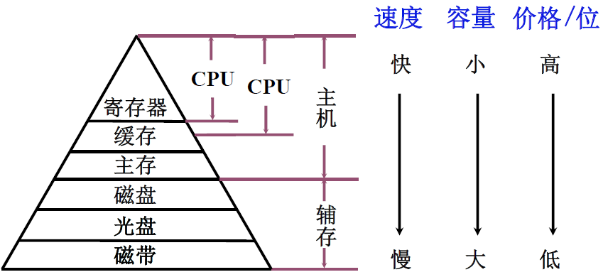
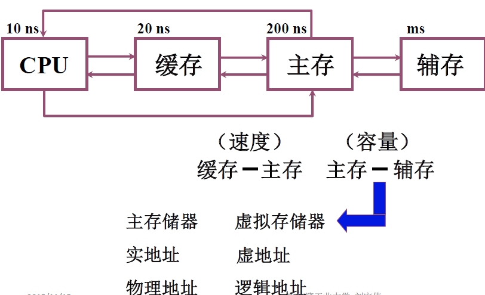
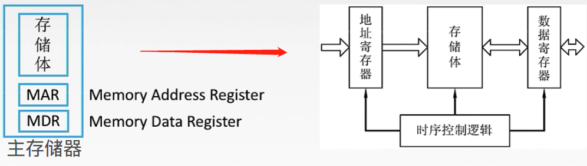
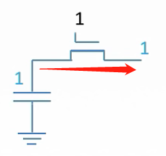
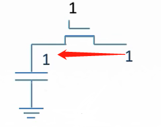
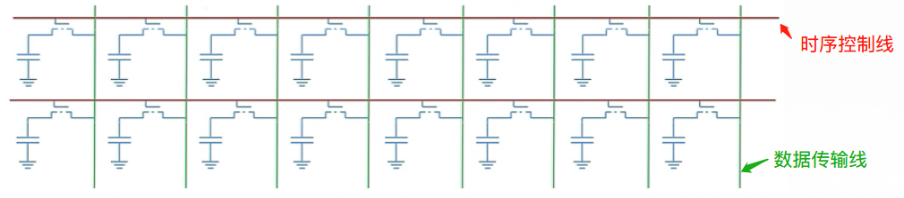
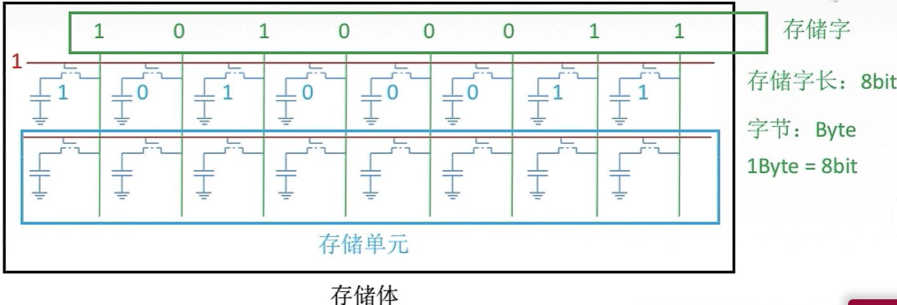

# 计算机组成原理

> “练拳不练功，到老一场空”。

## 第3章 存储系统

传统的冯诺依曼模型, 以运算器为核心, 造成了性能瓶颈. 后来加以改进, 成为**以存储器为核心**的冯氏模型.

#### 概述

存储器用来存放数据与指令.  由于超大规模集成电路的技术, CPU速度变得非常的快, 而存储器的读写速度

没有很大的提升, 故计算机系统的运行速度很大程度上受限于存储器速度. 

I/O 设备不断增多, 若他们与存储器交换信息都通过CPU来实现, 会大大降低CPU工作效率. 为此, 出现了I/O

与存储器的直接存取方式(DMA).

#### 存储器的分类

- **按存储介质分**

  1. 半导体存储器

     存储元件由半导体器件组成. 现代半导体存储器都用超大规模集成电路制程芯片, 体积小, 功耗低, 存取时间短. 但电源消失, 所存储的信息也会丢失(断电瞬间不会丢, 过一小会就丢了).

     半导体存储器, 由可按材料不同, 分双极性(TTL)半导体存储器, 与MOS半导体存储器. 前者速度非常快,

     后者具有高集成度的特点, 并且制造简单, 成本低, 功耗小, 所以MOS半导体存储器被广泛使用.	

  2. 磁表面存储器

     磁表面存储器是在金属或塑料基体的表面上涂一层磁性材料作为记录介质, 工作时磁层随
     载磁体高速运转, 用磁头在磁层上进行读/写操作, 故称为磁表面存储器. 按载磁体形状的不同，
     可分为磁盘, 磁带和磁鼓. 现代计算机已很少采用磁鼓. 由千用具有矩形磁滞回线特性的材料
     作磁表面物质, 它们按其剩磁状态的不同而区分“0” 或“1” , 而且剩磁状态不会轻易丢失, 故这类
     存储器具有非易失性的特点.

  3. 磁芯存储器 

     目前已被淘汰

  4. 光盘存储器

     光盘存储器是应用激光在记录介质（磁光材料）上进行读/写的存储器, 具有非易失性的特
     点. 由千光盘记录密度高、耐用性好、可靠性高和可互换性强等特点, 光盘存储器越来越被用于
     计算机系统.

- **按存取方式分类**

  1. 随机存储器  Random Access Memory, RAM

     RAM 是一种可读/写存储器, 其特点是存储器的任何一个存储单元的内容都可以随机存取, 
     而且**存取时间与存储单元的物理位置无关**. 计算机系统中的**主存**都采用这种随机存储器. 由于
     存储信息原理的不同, RAM 又分为**静态RAM** (以触发器原理寄存信息)和**动态RAM** (以电容充
     放电原理寄存信息).

  2. 只读存储器 Read Only Memory, ROM

     只读存储器是能对其存储的内容读出, 而不能对其重新写入的存储器. 这种存储器一旦存
     入了原始信息后, 在程序执行过程中, 只能将内部信息读出, 而不能随意重新写入新的信息去改
     变原始信息. 因此, 通常用它存放固定不变的程序, 常数和汉字字库, 甚至用于操作系统的固化.
     它与随机存储器可共同作为主存的一部分, 统一构成主存的地址域。

     随着半导体技术的发展和用户需求的变化, 只读存储器先后派生出**可编程只读存储器**(Programmable ROM, PROM) , **可擦除可编程只读存储器**(Erasable Programmable ROM, EPROM) 以及**电擦除可编程只读存储器**(Electrically - Erasable Programmable ROM, EEPROM) . 近年来还出现了**闪速存储器**Flash
     Memory ，**它具有EEPROM 的特点，而速度比EEPROM 快得多**。

  3. 串行访问存储器

     如果对存储单元进行读/写操作时, 需按其物理位置的先后顺序寻找地址, 则这种存储器称
     为**串行访问存储器**. **显然这种存储器由千信息所在位置不同, 使得读/写时间均不相同**. 例如, 
     磁带存储器, 不论信息处在哪个位置, 读/写时必须从其介质的始端开始按顺序寻找, 故这类串行
     访间的存储器又称为**顺序存取存储器**. 还有一种属于**部分串行访问的存储器**, 如磁盘. 在对磁
     盘读/写时, 首先直接指出该存储器中的某个小区域（磁道）, 然后再顺序寻访, 直至找到位置. 
     故其前段是直接访间, 后段是串行访问, 称为**直接存取存储器**。

- **按作用分类**

  按在计算机系统中的作用不同，存储器主要分为**主存储器**、**辅助存储器**、**缓冲存储器**。

  主存储器(简称主存) 的主要特点是它可以和CPU 直接交换信息. 辅助存储器(简称辅存) 
  是主存储器的后援存储器, 用来存放当前暂时不用的程序和数据, 它不能与CPU 直接交换信息. 
  两者相比, 主存速度快, 容量小, 每位价格高; 辅存速度慢, 容量大, 每位价格低. 缓冲存储器(简
  称缓存)用在两个速度不同的部件之中, 例如, CPU 与主存之间可设置一个**快速缓存**（有关内容
  将在后面讲述),  起到缓冲作用。

  

#### 存储器的层次结构

存储器有3个主要性能指标: 速度, 容量与价格. 一般来说, 速度越高, 位价就越高; 容量越大, 位价就越低, 而且容量越大, 速度必越低. 人们追求大容量, 高速度, 低位价的存储器, 可惜这是很难达到的.

上图右上到下: 速度越来越慢, 容量越来越大, CPU访问频度越来越少.

寄存器: 直接在CPU内部, 速度最快, 价格最高, 容量也最小. 某些I/O中也有寄存器.

主存: 用来存放将要参与运行, 程序和数据, 其速度与CPU 速度差距较大, 为了使它们之间速度更好地匹配, 在主存与CPU之间插入了一种比主存速度更快, 容量更小的**高速缓冲存储器**Cache , 显然其位价要高于主存. 现代计算机将Cache 也制作在CPU 内. 磁盘, 磁带属于辅助存储器, 其容量比主存大得多, 大都用来存放暂时未用到的程序和数据文件. CPU 不能直接访问辅存, 辅存只能与主存交换信息, 因此辅存的速度可以比主存慢很多.

实际上, 存储系统层次结构主要体现在**缓存－主存和主存－辅存**这两个存储层次上. 显然, CPU 和缓存, 主存都能直接交换信息; 缓存能直接和CPU , 主存交换信息; 主存可以和CPU , 缓存, 辅存交换信息.

**缓存-主存层次**主要解决CPU 和主存**速度不匹配**的间题. 由于缓存的速度比主存的速度高, 只要将CPU 近期要用的信息调入缓存,  CPU 便可以直接从缓存中获取信息, 从而提高访存速度. 但由于缓存的容量小，因此需不断地将主存的内容调入缓存, 使缓存中原来的信息被替换掉. 主存和缓存之间的数据调动是由硬件自动完成的, 对程序员是透明的.

**主存-辅存层次**主要解决存储系统的容量问题. 辅存的速度比主存的速度低, 而且不能和CPU 直接交换信息，但它的容量比主存大得多, 可以存放大量暂时未用到的信息. 当CPU 需要用到这些信息时, 再将辅存的内容调入主存, 供CPU 直接访问. 主存和辅存之间的数据调动是由**硬件和操作系统共同完成**的.

从CPU 角度来看, 缓存-主存这一层次的速度接近于缓存, 高于主存; 其容量和位价却接近于主存, 这就从速度和成本的矛盾中获得了理想的解决办法. 主存- 辅存这一层次, 从整体分析, 其速度接近于主存, 容量接近于辅存, 平均位价也接近低速, 廉价的辅存位价, 这又解决了速度, 容量, 成本这三者的矛盾. 现代的计算机系统几乎都具有这两个存储层次, 成了**缓存, 主存, 辅存三级存储系统**.

在主存-辅存这一层次的不断发展中, 逐渐形成了**虚拟存储系统**. 在这个系统中, **程序员编程的地址范围与虚拟存储器的地址空间相对应**. 例如, 机器指令地址码为24 位, 则虚拟存储器存储单元的个数可达16 M . **可是这个数与主存的实际存储单元的个数相比要大得多**, 称这类指令地址码为**虚地址(虚存地址、虚拟地址)或逻辑地址**, 而把**主存的实际地址称为物理地址或实地址**. **物理地址是程序在执行过程中能够真正访问的地址, 也是实实在在的主存地址**. 对具有虚拟存储器的计算机系统而言, 程序员编程时, 可用的地址空间远远大于主存空间, 使程序员以为自己占有一个容量极大的主存, 其实这个主存并不存在, 这就是将其称为虚拟存储器的原因. **对虚拟存储器而言, 其逻辑地址变换为物理地址的工作是由计算机系统的硬件和操作系统自动完成的,** 对程序员是透明的. 当虚地址的内容在主存时, 机器便可立即使用; **若虚地址的内容不在主存, 则必须先将此虚地址的内容传递到主存的合适单元后再为机器所用**. 有关这些方面的内容, 可在”计算机体系结构”和“操作系统”课程中学到.

#### 主存储器

 先回顾第1章的存储器介绍的两张图:

那么存储体中如何存储一个二进制位?

上图给出了一位二进制数据的**逻辑电路图**, 这样的电路,称为一个**`存储元`**. 存储体由n个存储元够成.

假设现在是**读取**命令, 时序控制给开关处加1(高电平), 电路导通, 那么存储体中的高电平信号1就可以顺着电路传出去了.

**写入**命令, 是数据先放到数据寄存器, 数据准备完毕, 通知时序控制逻辑, 时序控制给出信号, 让电路导通, 于是数据被写入.

那么如何把这一个存储元组一起来, 变成一个字节的存储字呢.

如上图所示, 为2个字节的, 16位的存储元.

> 从上面的图其实可以知道,  `每一次只能让一条时序控制线位于工作状态,` 读出该存储字的内容.
> 如果两条一起工作, 数据传输线就不知道该传谁的数据了.
> 啊
> 啊

