# 计算机组成原理

> “练拳不练功，到老一场空”。

## 第3章 存储系统

传统的冯诺依曼模型, 以运算器为核心, 造成了性能瓶颈. 后来加以改进, 成为**以存储器为核心**的冯氏模型.

### 概述

存储器用来存放数据与指令.  由于超大规模集成电路的技术, CPU速度变得非常的快, 而存储器的读写速度

没有很大的提升, 故计算机系统的运行速度很大程度上受限于存储器速度. 

I/O 设备不断增多, 若他们与存储器交换信息都通过CPU来实现, 会大大降低CPU工作效率. 为此, 出现了I/O

与存储器的直接存取方式(DMA).

### 存储器的分类

- **按存储介质分**

  1. 半导体存储器

     存储元件由半导体器件组成. 现代半导体存储器都用超大规模集成电路制程芯片, 体积小, 功耗低, 存取时间短. 但电源消失, 所存储的信息也会丢失.

     半导体存储器, 由可按材料不同, 分**双极性**(TTL)半导体存储器, 与**MOS**半导体存储器. 前者速度非常快,

     后者具有高集成度的特点, 并且制造简单, 成本低, 功耗小, 所以MOS半导体存储器被广泛使用.	

  2. 磁表面存储器

     磁表面存储器是在金属或塑料基体的表面上涂一层磁性材料作为记录介质, 工作时磁层随
     载磁体高速运转, 用磁头在磁层上进行读/写操作, 故称为磁表面存储器. 按载磁体形状的不同，
     可分为磁盘, 磁带和磁鼓. 现代计算机已很少采用磁鼓. 由千用具有矩形磁滞回线特性的材料
     作磁表面物质, 它们按其剩磁状态的不同而区分“0” 或“1” , 而且剩磁状态不会轻易丢失, 故这类
     存储器具有**非易失性**的特点.

  3. 磁芯存储器 

     目前已被淘汰

  4. 光盘存储器

     光盘存储器是应用激光在记录介质（磁光材料）上进行读/写的存储器, 具有**非易失性**的特
     点. 由千光盘记录密度高、耐用性好、可靠性高和可互换性强等特点, 光盘存储器越来越被用于
     计算机系统.

- **按存取方式分类**

  1. 随机存储器  Random Access Memory, RAM

     RAM 是一种可读/写存储器, 其特点是**存储器的任何一个存储单元的内容都可以随机存取**, 
     而且**存取时间与存储单元的物理位置无关**. 计算机系统中的**主存**都采用这种随机存储器. 由于
     存储信息原理的不同, RAM 又分为**静态RAM** (以**触发器原理**寄存信息)和**动态RAM** (以**电容充**
     **放电原理**寄存信息).

  2. 只读存储器 Read Only Memory, ROM

     只读存储器是能对其存储的内容读出, 而不能对其重新写入的存储器. 这种存储器一旦存
     入了原始信息后, 在程序执行过程中, 只能将内部信息读出, 而不能随意重新写入新的信息去改
     变原始信息. 因此, 通常用它存放固定不变的程序, 常数和汉字字库, 甚至用于操作系统的固化.
     **它与随机存储器可共同作为主存的一部分, 统一构成主存的地址域。**

     随着半导体技术的发展和用户需求的变化, 只读存储器先后派生出**可编程只读存储器**(Programmable ROM, PROM) , **可擦除可编程只读存储器**(Erasable Programmable ROM, EPROM) 以及**电擦除可编程只读存储器**(Electrically - Erasable Programmable ROM, EEPROM) . 近年来还出现了**闪速存储器**Flash
     Memory ，**它具有EEPROM 的特点，而速度比EEPROM 快得多**。

  3. 串行访问存储器

     如果对存储单元进行读/写操作时, 需按其物理位置的先后顺序寻找地址, 则这种存储器称
     为**串行访问存储器**. **显然这种存储器由千信息所在位置不同, 使得读/写时间均不相同**. 例如, 
     磁带存储器, 不论信息处在哪个位置, 读/写时必须从其介质的始端开始按顺序寻找, 故这类串行
     访间的存储器又称为**顺序存取存储器**. 还有一种属于**部分串行访问的存储器**, 如磁盘. 在对磁
     盘读/写时, 首先直接指出该存储器中的某个小区域（磁道）, 然后再顺序寻访, 直至找到位置. 
     故其前段是直接访间, 后段是串行访问, 称为**直接存取存储器**。

- **按作用分类**

  按在计算机系统中的作用不同，存储器主要分为**主存储器**、**辅助存储器**、**缓冲存储器**。

  主存储器(简称主存) 的主要特点是它可以和CPU 直接交换信息. 辅助存储器(简称辅存) 
  是主存储器的后援存储器, 用来存放当前暂时不用的程序和数据, 它不能与CPU 直接交换信息. 
  两者相比, 主存速度快, 容量小, 每位价格高; 辅存速度慢, 容量大, 每位价格低. 缓冲存储器(简
  称缓存)用在两个速度不同的部件之中, 例如, CPU 与主存之间可设置一个**快速缓存**（有关内容
  将在后面讲述),  起到缓冲作用。

  

### 存储器的层次结构

存储器有3个主要性能指标: 速度, 容量与价格. 一般来说, 速度越高, 位价就越高; 容量越大, 位价就越低, 而且容量越大, 速度必越低. 人们追求大容量, 高速度, 低位价的存储器, 可惜这是很难达到的.

上图右上到下: 速度越来越慢, 容量越来越大, CPU访问频度越来越少.

寄存器: 直接在CPU内部, 速度最快, 价格最高, 容量也最小. 某些I/O中也有寄存器.

主存: 用来存放将要参与运行, 程序和数据, 其速度与CPU 速度差距较大, 为了使它们之间速度更好地匹配, 在主存与CPU之间插入了一种比主存速度更快, 容量更小的**高速缓冲存储器**Cache , 显然其位价要高于主存. 现代计算机将Cache 也制作在CPU 内. 磁盘, 磁带属于辅助存储器, 其容量比主存大得多, 大都用来存放暂时未用到的程序和数据文件. CPU 不能直接访问辅存, 辅存只能与主存交换信息, 因此辅存的速度可以比主存慢很多.

实际上, 存储系统层次结构主要体现在**缓存－主存和主存－辅存**这两个存储层次上. 显然, CPU 和缓存, 主存都能直接交换信息; 缓存能直接和CPU , 主存交换信息; 主存可以和CPU , 缓存, 辅存交换信息.

**缓存-主存层次**主要解决CPU 和主存**速度不匹配**的间题. 由于缓存的速度比主存的速度高, 只要将CPU 近期要用的信息调入缓存,  CPU 便可以直接从缓存中获取信息, 从而提高访存速度. 但由于缓存的容量小，因此需不断地将主存的内容调入缓存, 使缓存中原来的信息被替换掉. 主存和缓存之间的数据调动是**由硬件自动完成**的, 对程序员是透明的.

**主存-辅存层次**主要解决存储系统的容量问题. 辅存的速度比主存的速度低, 而且不能和CPU 直接交换信息，但它的容量比主存大得多, 可以存放大量暂时未用到的信息. 当CPU 需要用到这些信息时, 再将辅存的内容调入主存, 供CPU 直接访问. 主存和辅存之间的数据调动是由**硬件和操作系统共同完成**的.

从CPU 角度来看, 缓存-主存这一层次的速度接近于缓存, 高于主存; 其容量和位价却接近于主存, 这就从速度和成本的矛盾中获得了理想的解决办法. 主存- 辅存这一层次, 从整体分析, 其速度接近于主存, 容量接近于辅存, 平均位价也接近低速, 廉价的辅存位价, 这又解决了速度, 容量, 成本这三者的矛盾. 现代的计算机系统几乎都具有这两个存储层次, 成了**缓存, 主存, 辅存三级存储系统**.

在主存-辅存这一层次的不断发展中, 逐渐形成了**虚拟存储系统**. 在这个系统中, **程序员编程的地址范围与虚拟存储器的地址空间相对应**. 例如, 机器指令地址码为24 位, 则虚拟存储器存储单元的个数可达16 M . **可是这个数与主存的实际存储单元的个数相比要大得多**, 称这类指令地址码为**虚地址(虚存地址、虚拟地址)或逻辑地址**, 而把**主存的实际地址称为物理地址或实地址**. **物理地址是程序在执行过程中能够真正访问的地址, 也是实实在在的主存地址**. 对具有虚拟存储器的计算机系统而言, 程序员编程时, 可用的地址空间远远大于主存空间, 使程序员以为自己占有一个容量极大的主存, 其实这个主存并不存在, 这就是将其称为虚拟存储器的原因. **对虚拟存储器而言, 其逻辑地址变换为物理地址的工作是由计算机系统的硬件和操作系统自动完成的,** 对程序员是透明的. 当虚地址的内容在主存时, 机器便可立即使用; **若虚地址的内容不在主存, 则必须先将此虚地址的内容传递到主存的合适单元后再为机器所用**. 这些方面的内容, 可在”计算机体系结构”和“操作系统”课程中学到.

### 主存储器

 先回顾第1章的存储器介绍的两张图:

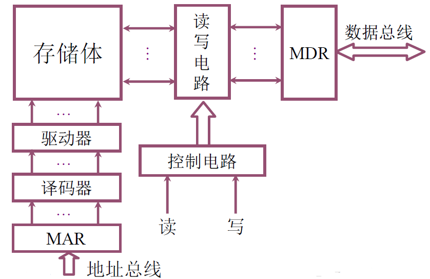

那么存储体中如何存储一个二进制位?

上图给出了一位二进制数据的**逻辑电路图**, 这样的电路,称为一个**`存储元`**. 存储体由n个存储元够成.

假设现在是**读取**命令, 时序控制给开关处加1(高电平), 电路导通, 那么存储体中的高电平信号1就可以顺着电路传出去了.

**写入**命令, 是数据先放到数据寄存器, 数据准备完毕, 通知时序控制逻辑, 时序控制给出信号, 让电路导通, 于是数据被写入.

那么如何把这一个存储元组一起来, 变成一个字节的存储字呢.

如上图所示, 为2个字节的, 16位的存储元.

> 从上面的图其实可以知道,  `每一次只能让一条时序控制线位于工作状态,` 读出该存储字的内容.
> 如果两条一起工作, 数据传输线就不知道该传谁的数据到MDR了.

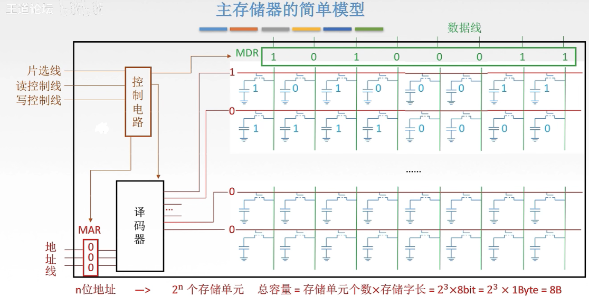

**上图就是存储器芯片的基本结构.**

因为每次只有一条控制线处于工作状态1, 而其他线都是0. 如果单独来存这串控制代码, 太浪费资源.

于是, 我们用一个译码器, 把MAR中的内存地址, 转换成二进制控制信号串, 假设 3位地址010, 传过来要读第2个存储单元的内容. 因为有3位, 所以主存有8个存储单元. 那译码器拿到这个地址之后, 就会把它翻译成, 0000 0010, 从低位数第二个控制线工作. 然后数据存到MDR再由它从数据总线传出去. 要是100, 就是第4个单元, 控制信号就是
0000 1000.  假如地址线传过来的数转成十进制是n, 其实就是把1左移n就行了.

控制电路, 就是之前说的 时序控制逻辑. 

**片选线**: 是整个芯片的开关. 它有两种模式, 一种是高电平有效, 一种是低电平有效. 

确定哪个存储芯片被选中, 可用于存储容量的扩充.

上图的写法, 就表示CS(Chip Selection) 或 CE (Chip Enable) 为低电平有效.没有上面的横线就是高电平有效.

- **理解片选线的作用:**

假设手上有n片 16K \*1位的存储芯片, 要组成64K \* 8位的存储器. 那就需要**32个**这样的chip.

16K \*1位 * 8 * 4 就是, 这个chip 8个一组, 组成 4组就够了.

因为65535 是64K - 1 所以, 它是在最后一组chip里, **此时前面3根片选线是无效的电平, 只有黄色这跟片选线是使能的**. 只做最后一组chip的访问.

**读控制线/写控制线**: 决定当前这次操作是读还是写的操作, 以及什么时候读或写. 这两根线完全可以合并成一根线.

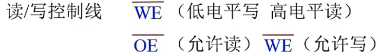

上图给出了读写控制线由一条线还是两条线控制的引脚功能.

如果是一条控制线, 那么这条线的引脚就是WE上加一横, 意思是低电平写, 相反就是高电平读.

若是两条线, 就有两个引脚. OE加横线, 就是(主语是CPU)低电平读, 为什么是O, Output是主语是这个内存, CPU来读, 就是内存往外输出数据. 另一个引脚WE加横线, 就是低电平允许写.

下图就是芯片结构的逻辑图:

**译码驱动**: 把来自地址总线的地址信号翻译成对应存储单元的选通信号, 该信号在读写电路的配合下完成对被选单元的读写操作.

**译码驱动器**: 是提升 时序控制线 控制能力的电路. 之前一个1, 控制一个存储元开关, 现在一个1控制8个开关.所以, 需要有个电路帮它扩大输送控制信号1的能力, 这就是**译码驱动器**的功能.

**读/写电路:** 就是读写控制线的电路, 来控制整个读写过程的一组电路. 包括读出放大器和写入电路, 来完成读写操作.

**地址线**: 对应MAR的位数(行数, 红色线), 单向输送.

**数据线:** 对应MDR的位数(列数, 绿色线), 双向输送.

存储芯片通过**地址总线, 数据总线和控制总线**与外部连接. 

### 主存性能指标

- 容量

  能够存放二进制数据的总位数,

  存储容量 = 存储单元个数 x 存储字长   单位是位. 也可以除以8, 单位是字节.

- 存储速度

  - 存取时间 : **存储器的访问时间**, 从存储器得到地址到 拿到稳定的数据. 分读出时间跟写入时间.

  - 存取周期 : **连续**两次**独立**的存储器操作(Read or Write)所需要的**最小间隔时间**.现代MOS 型存储器的存取周期可达100 ns ; 双极型TTL 存储器的存取周期接近于10 ns . 

    > 一般来说, 存取周期要大于存取时间, 因为一个存取周期里, 除了存取操作, 还有别的操作.

- 存储器的带宽 

  它表示单位时间内存储器存取的信息量, 单位可用字/秒或字节/秒或位/秒表示. 

  带宽是衡量数据传输率的重要技术指标.

  > 存储器的带宽决定了以存储器为中心的机器获得信息的传输速度, 它是改善机器瓶颈的一
  > 个关键因素. 为了提高存储器的带宽, 可以采用以下措施: 
  >
  > - 缩短存取周期;
  > - 增加存储字长, 使每个存取周期可读/写更多的二进制位数.
  > - 增加存储体

### 半导体存储芯片的译码驱动方式

- **线选法**

  

  所谓线选法, 就是地址线过来的几位地址, 经由地址译码器翻译过后, 得到一个控制位串, 4位的地址, 就是2的4次方, 16位的位串, 这16位的位串每一位控制一条线. 上图的一条线上有8个存储元.

  **线选法, 是一维的**. 但是线选法有个问题, 就是4位地址就要设计16条线. 那32位呢 64位呢? 所以线选法有局限.

- **重合法**

  为了解决线选法的局限性, 我们把存储芯片按**二维排列**. 地址分开成两部分, **行地址与列地址.**

  

  **用二维地址左边定位一个存储单元.** 行地址对应一行, 列地址对应一列.

  实际上, 这一行 跟 一列**都会激活**, 但因为电路导通的只有0,0 这个存储单元, 所以只有它的内容会传出去.

  上图的例子中, 行地址有5位, 列地址有5位. 按照线选法 就要设计 2的10次方, 1024根选通线,

  而重合法, 只需要2的5次方 乘以2 就是64根就够了. 1024根与64根, 成本谁更大呢.

### RAM

#### 静态RAM(SRAM)

- SRAM基本电路

  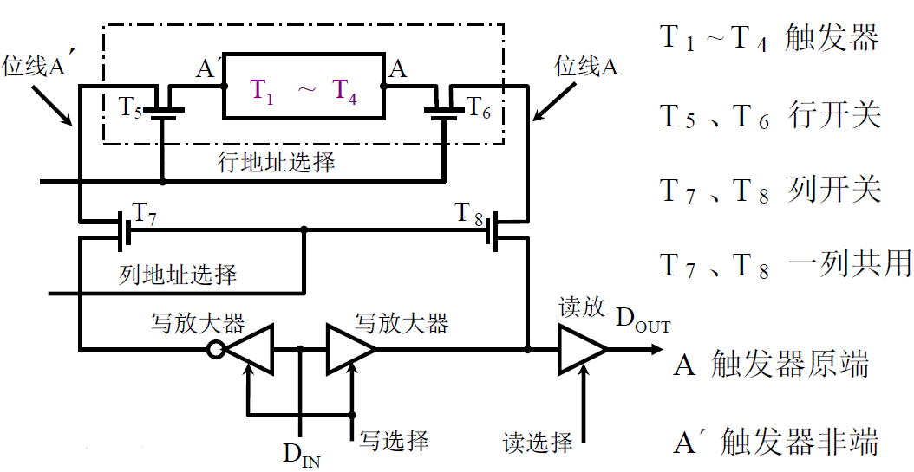

- SRAM读操作

  

- SRAM写操作

  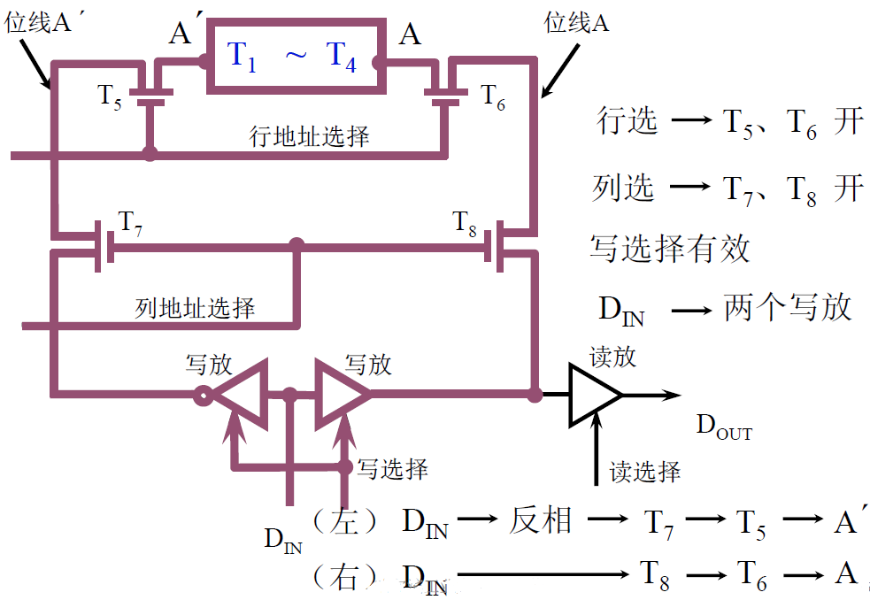

#### DRAM

- DRAM基本单元电路

  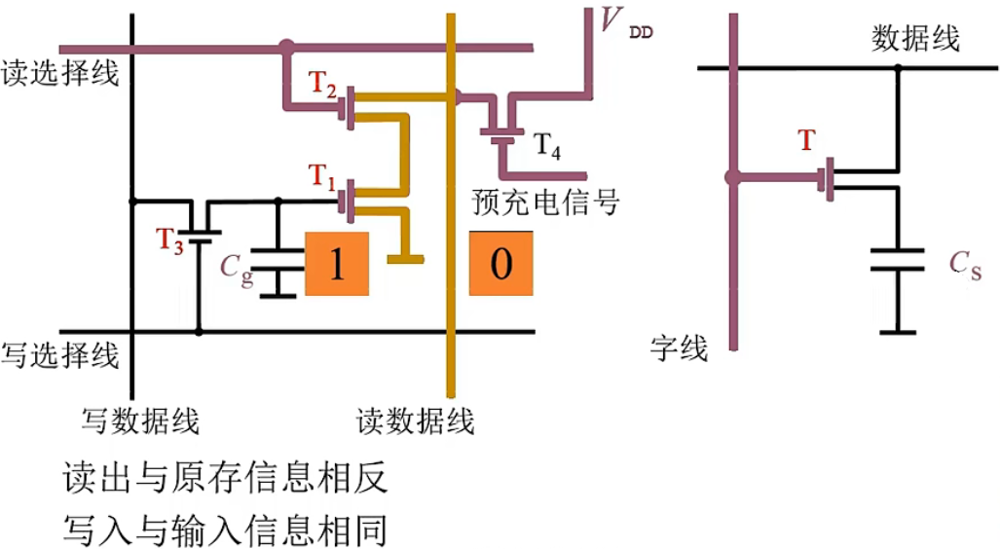

  DRAM是用电容进行充放电, 来存储数据. 当电容Cg没充电, 里面的数据就是0.

  假设是要读数据, 预充电信号预充电, 给T4导通,  VDD通过T4给读数据线充电, 数据线为高电平.

  现在Cg没充电, 数据是0, 那么T1的栅极是低电平,不会导通, 读数据就会保持高电平, 读出1.

  当Cg充电, 数据为1 , 那么T1栅极为高电平, 导通, 数据线就会经过T2, T1放电, 读出0.

  所以读出的信号要经过取反.

  假设是写入, 写选择线有效, T3导通. 如果写入1, 写数据线为高电平, 往Cg充电. 如果写入0, Cg通过T3放电.

### 寻址

寻址其实就是按照不同的大小(你想要的大小)来切分存储矩阵, 比如按字节, 还是按字, 按半字.

按字节,就是1个字节一跳. 按半字, 就是2个字节一跳. 按字, 就是4个字节一跳.

> 有一点要注意, 不论你是怎么寻址, 计算机的编址, 都是如之前所讲的, **`按字节编址`**的.

1K = 1024 = 2的10次方. 就是10根地址线.

大小端, 说过好几次了.  注意的地方是, 它是字节跟字节的顺序, 字节内每一位该怎么放还是怎么放的.

### **半导体随机存取存储器**

前面说了主存储器的内部结构, 现在来看看存储体中每个存储元的材料.

SRAM 跟 DRAM都把地址拆分成行列两部分, 不同的是, SRAM的行地址跟列地址, **可以不等长**. 因为它是同时送.

DRAM的行地址跟列地址, 就**必须等长**, 因为它要分两次送.

### DRAM的刷新

- **为何要用行列地址**

  设计上DRAM把存储单元排列成2的(n/2)行与2的(n/2)列

假如地址是 0000 0000 8位, 那DRAM就会把**存储单元**排列成16行 16列.

读0000 0000这个字节的数据, 就如下图. 每个单元还是1个字节.

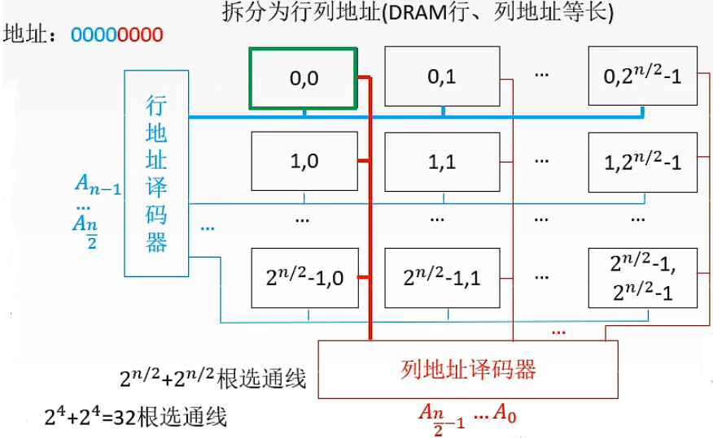

如果是原来的一维模型, 就需要2^8 = 256根选通线. 现在二维模型只需要32跟选通线.

就**大大减少了选通线的数量**, 非常容易设计. 这就是**为何要用行列地址**.

- **如何刷新**

  由硬件来完成, 读书一行的信息后, 重新写入, 占用1个读/写周期.(读跟写周期实际上花费时间不同

  但为方便把他们设计成一样.)

- **什么时刻刷新**

  假设DRAM内部结构为128*128, 读/写周期(存取周期) 为0.5μs.上面说了 刷新周期为2ms.

  那么2ms中就有4000个读写周期. 4000个读写周期, 拿出一部分给刷新用.

  三种方式:

  刷新是按行进行的, 每次刷新一行存储单位.

  

  > 分散刷新: 优点是无死区, 缺点是加长了系统的存取周期, 降低了整机的速度.
  >
  > 集中刷新: 优点是读写操作时不受刷新工作的影响, 故存取速度较高, 缺点是在集中刷新期间(死区), 不能访问存储器.
  >
  > 异步刷新: 综合了前面两种. 既可以缩短死区, 又能充分利用最大刷新时间. 这样可以避免CPU连续等待时间过长 并且减少刷新次数, 提供了效率. **将刷新安排在指令译码阶段, 不会出现 "死区"**

  DRAM的刷新, 对CPU是透明的, 不用依赖外部的访问. 它以行为单位, 故刷新只需要行地址. 刷新类似读, 但又不同. 刷新操作仅是给栅极电容补充电荷, 不需要信息输出. 刷新不需要选片, 即整个存储器中所有芯片同时刷新.

### RAM的读周期时序

以2114RAM芯片为例.

之前说过存取时间, 与存取周期是不一样的.而存取周期往往大于存取时间.

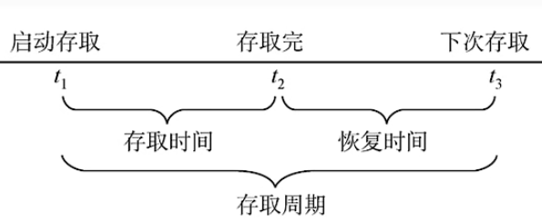

上面DRAM知道了, 它需要刷新来恢复电容里的电荷, 来使数据持续存在. 所以上图就好理解了.

读周期大概运作如下:

在整个读周期中读写信号线WE, 始终为高电平(高电平为读, 低电平为写.) .

tRC就是 read cycle读周期, 指对芯片进行连续两次读操作的最小间隔时间.

读时间tA, 表示从地址有效到数据稳定所需时间, 显然读时间肯定小于读周期.

tco表示从片选有效, 到输出稳定的时间. 

可见只有当地址有效经tA 后, 且当片选有效经tco 后, 数据才能稳定输出, 这两者必须同时具备.

当地址有效后, 经tA -tco 时间必须给出片选有效信号, 否则信号不能出现在数据线上.

从片选失效到输出高阻需一段时间tOTD , 故地址失效后, 数据线上的有效数据有一段维持时间tOHA , 以保证所读的数据可靠.

> 从上面的图可以看到, 地址开始有效一段时间, 片选才给出信号, 这是等待地址传输完毕且稳定, 然后片选信号给了, 也要等一段tcx, 然后才会读信号. 读完数据, 很快片选失效, 而数据会一直持续到地址失效, 以保证读到的数据可靠.

### RAM的写周期时序

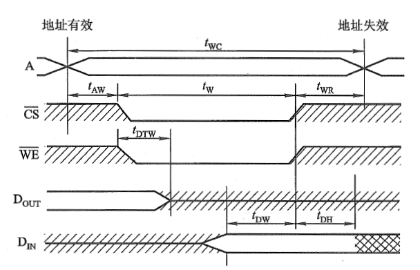

写周期twc write cycle是对芯片进行连续两次写操作的最小间隔时间.

写周期包括滞后时间tAW , 写入时间tw 和写恢复时间tWR. 

在写有效数据出现之前, RAM的数据线上有上面读取的数据内容DOUT. 故在地址线发现变化后, CS, WE都要

滞后tAW 再有效, 避免将无效数据写入RAM. 但写允许WE失效后, 地址必须保持一段时间, 称为写恢复时间.

RAM数据线上的有效数据, 就是写入数据DIN, 必须在CS, WE失效前, 的tDW 时刻出现, 并延续一段时间.

(此刻地址线仍处于有效期, 且 tDH < tWR), 以保证数据可靠写入. 

> 已经制成的RAM 芯片读/写时序关系**已被确定**, 因此, 将它与CPU 连接时, 必须注意它们相互
> 间的时序匹配关系, 否则RAM 将无法正常工作. 具体RAM 芯片的读/写周期时序可查看相
> 关资料. (驱动工程师需要注意的)

值得注意的是, 不论是对存储器进行读操作还是写操作, 在读周期和写周期内, 地址线上的地址始终不变. 

### 只读存储器ROM

RAM是易失性的存储器, 所以一旦掉电, RAM只要过一小会就没信息了. 

而硬盘这种辅存, 虽然不易丢失数据, 但是却不能和CPU直接通信, 它通过I/O连接到主机的.

而辅存与CPU的通信, 也需要主存中的指令才能完成.

所以, 我们需要掉电不丢失数据, 又能跟CPU直接通信的ROM.

ROM的容量不大, 可以存储一些关键信息. 比如存储操作系统在辅存中的位置, 把操作系统通过I/O接口,

调到RAM中去. 

所以主机, 就是由CPU RAM ROM组成, ROM存储一些固定的信息, 如上面说的操作系统在硬盘中的位置等.

ROM一开始不能写入, 后来发展成可以写入了, 但是写入速度也是非常慢的.

#### ROM的发展与种类

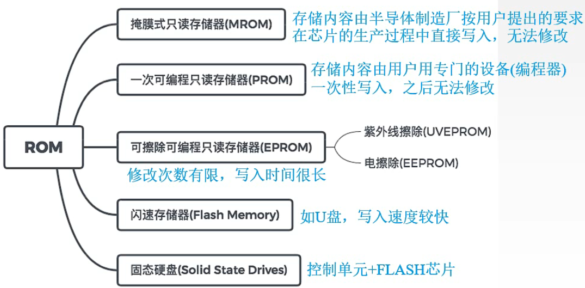

- **掩模ROM (MROM)**

  行列选择线交叉处有 MOS 管为“1”
  行列选择线交叉处无 MOS 管为“0”

- PROM (一次性编程)

  

- EPROM (多次性编程)

  

- EEPROM (多次性编程)

  电可擦写
  局部擦写
  全部擦写

- Flash Memory (闪速型存储器)

  EPROM      价格便宜 集成度高
  EEPROM      电可擦洗重写
  比 EEPROM快  具备 RAM 功能

### CPU与主存的连接

#### 存储器容量的扩展

- **位扩展** 

  为了增加存储字长.  

  例如, 如何用1K \* 4位 的chip, 组成1K \* 8位的存储器.

  我们用2个1k乘4的chip, 用**相同的片选线**.

  

  再例如, 用8K \* 1 位的chip, 组成8K \* 8位的存储器.

   用8个芯片, 他们的片选也是用同一根.

- **字扩展**

  增加存储字的数量.

  用 1K x 8位的chip, 组成2K x 8位.

  2个芯片, 但这个两个芯片不能同时工作, 都是8位. 2K x 8 有11条地址线.

  所以, 我们可以把两个芯片的地址线共用, 多出来一条作为片选.

  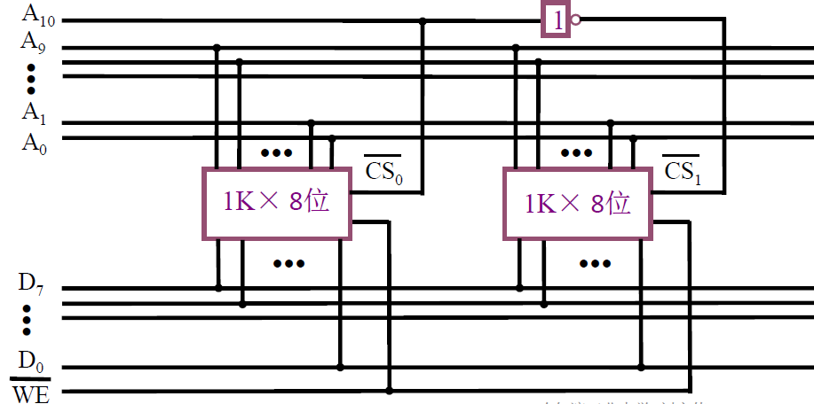

  A10 为低电平时, 左边的芯片被启用, A10 为高电平时, 右边的芯片被启动.

  这样 000 0000 0000 到 01 1111 1111 这1K的地址给了左边的芯片,

  100 0000 0000 到 111 1111 1111这1K地址给了右边的芯片. 

- **字与位扩展**

  用1K x 4位的chip, 组成4K x 8位. 显然, 我们需要8个chip.

  两个芯片组成 1K x 8位,  搞4组这样的芯片组就行. 4K有12根地址线, 原来1K 10根, 多的两根做片选线.

  2根片选线控制4个组, 那肯定要译码器来完成了.

  

#### 存储器与CPU的连接

- 地址线的连接

- 数据线的连接

- 读/写命令线的连接

- 片选线的连接

- 合理选择存储芯片

- > 保存系统程序和配置信息的存储芯片, 用ROM, 这些都是不经常改动的部分.
  >
  > 而用户程序区, 或系统运行区域, 要用到RAM.
  >
  > 用的芯片尽可能少, 片选的逻辑尽可能简单.

- 其他: 时序, 负载(CPU带几个存储芯片).

#### 存储芯片的地址分配和片选

CPU要实现对存储单元的访问, 首先要选择存储芯片, 即进行**片选**; 然后再为选中的芯片依地址码选择相应的存储单元, 以进行数据的存取, 即进行**字选**. 片内的字选通常是由CPU送出的N条**低位地址线**完成的, 地址线直接接到所有存储芯片的地址输入端(N由存储容量决定). 片选信号的产生, 分为线选法与译码线选法.

- 线选法

  就是用除片内寻址外的高位地址线直接(或经反相器)分别接各个芯片的片选引脚, 高位地址线的信息位"0",

  就选中该对应的芯片. 高位片选地址线一次只有一根有效, 因为一次只选一个芯片(组).

  上面用 1K x 8位的chip, 组成2K x 8位 的例子就是.

  优点: 不用译码器, 线路简单.

  缺点: 地址空间不连续, 不能充分利用系统的存储空间, 浪费地址资源.

- 译码片选法

  如上面字与位扩展中的例子.

来个题目:

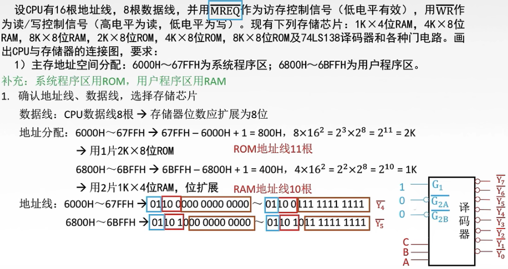

74138译码器, **三个控制端, 1个高电平, 两个低电平才能让它工作.**

先确定地址线, 数据线各需要几根, 再决定要用什么的芯片. 再确定地址线怎么分配.然后画图:

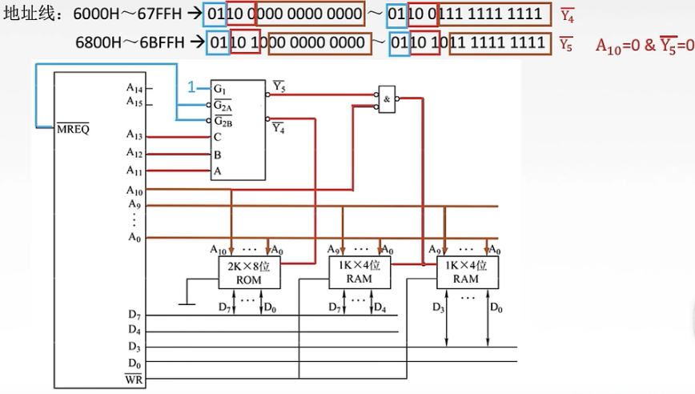

> 注意, ROM芯片的PD/Progr 编程端接地, 以确保在读出时低电平有效.  当然也要看ROM的芯片有OE引脚, 那就把WR接到OE.
>
> ROM的数据线画错了, ROM的数据线应该是单向的.
>
> 片选译码器往往是最复杂的部分, 可以有多种方式来实现.

### 存储器的校验

海明校验, 之前第2章 校验码节讲过了.

### 提高访存速度的措施

提高访存速度, 可以提高整个系统的效率. 以存储器为中心的结构, CPU中的指令与数据都来自内存, 内存不够快,

CPU就要空转, 浪费性能. 这种情况, 我们称之为存储墙. 

主要有以下几个思路:

1. 采用高速器件
2. 采用层次结构 如 cache - 主存的结构.
3. 调整主存结构

前两种,  成本都比较高, 我们主要看看**第3个思路**能不能有可行性.

回顾一下, 之前的主存内容. 因为一个存取周期中, 有恢复时间的存在. 有时间上的浪费.

所以, 提高访存速度, 就要通过一定的方法, 利用好那段恢复时间.

思路1: 对多个 不同时间, 能够进行不同存取的存储单元, 进行并行操作.

思路2: 利用流水线的方案, 某个单元在恢复时间中, 对其他单元进行存取.

#### 双端口RAM(了解)

为了实现思路1, 我们可以用双端口RAM. 

双端口RAM是指: 同一个存储器有左 右两个独立的端口, 分别具有两组相互独立的地址线, 数据线和读写控制线,

它允许两个独立的控制器同时异步地访问存储单元. 当两个端口的地址不同时, 两个端口进行读写操作就不会冲突.

相反, 他们同时存取存储器的同一地址单元, 那肯定冲突.

两个端口同时存取同一个主存时 有4种情况:

- 两个端口不同时刻对同一地址单元存取数据.  这当然没问题
- 两个端口不同时刻从同一地址单元读出数据.  同时读出也没问题.
- 两个端口不同时刻向同一地址单元写入数据.  这肯定会有冲突.
- 两个端口不同时刻对同一地址单元写入数据, 一个端口写入数据, 一个端口读出数据. 读出的端口可能会读错.

解决冲突的方法, 就是加个控制信号量:

这种方法, 不常见, 至少我孤陋寡闻, 没见过.

#### 多模块存储器

多模块存储器主要有两种结构:

- 单体多字存储
- 多体并行存储

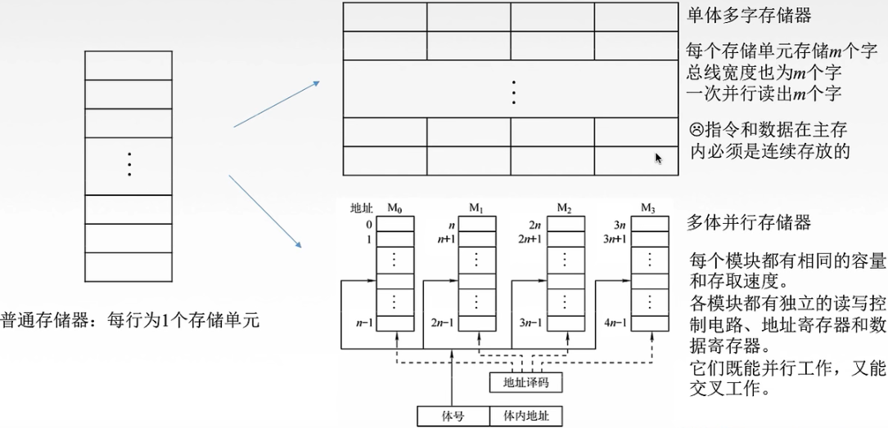

- **单体多字存储系统**

  假设CPU的字长是16位, 那我们可以把内存的存储字长从16位搞成64位, 就是把存储字长扩展4倍.

  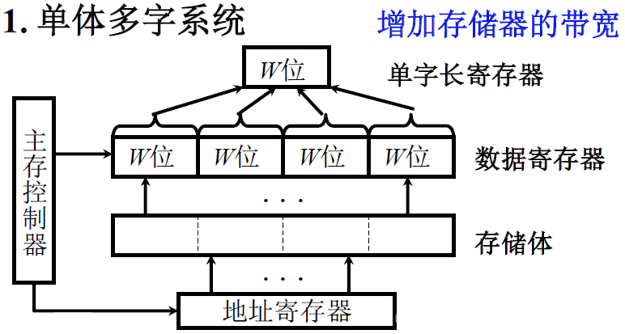

  那么一次就可以读出4个CPU字长, 64位的数据, 扔到数据寄存器里, 就好比原材料一直可以足够供给, 工厂就可以一直开工, 不至于无米下锅. 这当然就快了,  但也有个致命的问题.

  就是如果要写入数据, 就要先把16位数据放到单字长的寄存器中 , 然后写到4字长的数据寄存器, 然后在写到内存中. 我只想写16位, 却不得不写64位, 那48位的数据也被覆盖修改掉了, 造成内存数据的错误.

  另一个问题是, 如果要读取的数据, 它不连续存放在一个存储字里怎么办. 第一个存储字里放一部分, 另外的部分存放在另外的存储字里.

  > 带宽是大了, 但是正确性不能保证. 于是在此基础上, 有了下面这个方案.

- **多体并行存储系统**

  多体并行有两种方案提高存储带宽:

  - **高位交叉 顺序编址**

    

    4个存储体, 低4位的地址用来给各个存储体内部的存储单元编址, 高2位, 给4个存储体编址.这样就组成了6位地址的编址.

    若是每个存储体各自都有自己的MAR,MDR跟地址译码器这些**控制电路**, 它们就能并行地工作了.

    但是它也有问题,  比如有个程序指令放在M0这个存储体0000中, 按顺序往高位地址存放指令, 那么CPU从它中获取指令, 按序执行, 那CPU不停访问M0中其他的数据. 这个时候, 其他三个都没事干, 斗地主去了.

    所以, 虽然能并行, 但也是一段时间只有一个忙.

  - **低位交叉  各个存储体轮流编址**

    低位交叉的编址跟高位交叉反过来, 低位是给存储体编号, 高位给存储体内的存储单元编号.

  

  若是每个存储体各自都有自己的MAR,MDR跟地址译码器这些**控制电路**, 它们就能并行地工作了.

  数据现在是横着存了.

  

  上图的流水线方式存取, 以下图更为直观.

  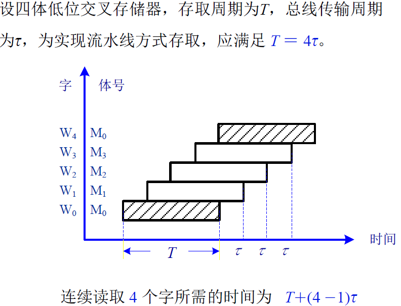

  对比一下两种方式:

  

  > 低位交叉的T+(n-1)τ 其实是有条件限制的, 不是说低位交叉一定就是这个耗时. 
  >
  > 必须要满足 存储体的个数m要大于等于 T/τ 这个样的设计. 上图就是T=4τ 

  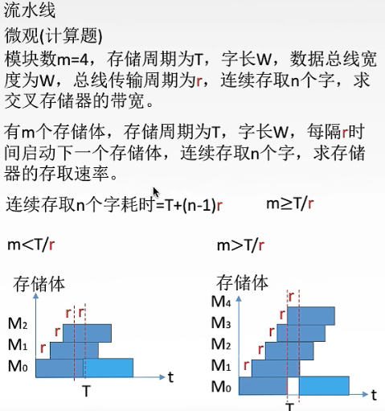

  ​	从上图可以看出来, 不满足 m < T/r  , 公式 T+(n-1)r 就是不对的.

  ​	m > T/r 时 , 会有一小段等待时间. 

  ​	**所以,  当设计满足 m = T/r 时, 是利用率是最高的. 提速也达到最大效果.**

  > 补充: 低位交叉的方式, 可以如 单体多字的方式并行工作的, 但前提是数据总线的宽度要满足mW,
  >
  > 就是m个存储体的存储字长W一起读取, 要有足够的总线宽度来承接. 

  ​	接着完成上面的题目:

  ​	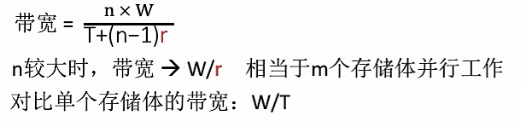

#### 高性能存储芯片

采用高性能存储芯片也是提高主存速度的措施之一. DRAM 集成度高, 价格便宜, 广泛应用
于主存. 其发展速度很快, 几乎每隔3 年存储芯片的容量就翻两番. 为了进一步提高DRAM 的
性能, 人们开发了许多对基本DRAM 结构的增强功能, 出现了SDRAM , RDRAM 和CDRAM.

- SDRAM (Synchronous DRAM, 同步DRAM)

  SDRAM 与常用的异步DRAM 不同,  **它与处理器的数据交换同步千系统的时钟信号**, 并且以
  **处理器－存储器总线的最高速度运行**，而不需要插入等待状态.

  CPU不需要等待.

- RD RAM (Rambus DRAM)

  由Rambus 开发的RDRAM 采用专门的DRAM 和高性能的芯片接口取代现有的存储器接口。它主要解决存储器带宽的问题, 通过高速总线获得存储器请求(包括操作时所需的地址、操作类型和字节数), 总线最多可寻址320 块RDRAM 芯片, 传输率可达1.6 GBps.

  它不像传统的DRAM 采用RAS , CAS 和WE信号来控制, 而是采用异步的面向块的传输协议传送地址信息和
  数据信息. 一个RDRAM 芯片就像一个存储系统, 通过一种新的互连电路RamLink ，将各个
  RDRAM 芯片连接成一个环, 数据通信在主存控制器的控制下进行, 数据交换以包为单位。

- 带Cache 的DRAM (CDRAM)

  带Cache 的DRAM 是在通常的DRAM 芯片内又集成了一个小的SRAM, 又称增强型的DRAM(EDRAM).

### 高速缓冲存储器

在多体并行存储系统中, 由于**I/O设备向主存请求的级别高于CPU 访存**, 这就出现了CPU等待I/O 设备访存的现象，致使**CPU 空等一段时间**, 甚至可能等待几个主存周期, 从而降低了CPU 的工作效率. 为了避免CPU 与I/O 设备争抢访存, **可在CPU 与主存之间加一级缓存**, 这样, 主存可将CPU 要取的信息提前送至缓存, 一旦主存在与I/O  设备交换时,  CPU 可直接从缓存中读取所需信息, 不必空等而影响效率。

从另一角度来看, 主存速度的提高始终跟不上CPU 的发展. 据统计,  CPU 的速度平均每年改进60%, 而组成主存的动态RAM 速度平均每年只改进7%, 结果是CPU 和动态RAM 之间的速度间隙平均每年增大50% . 例如,  100 MHz 的Pentium 处理器平均每10 ns 就执行一条指令, 而动态RAM 的典型访问时间为60 ~ 120 ns . 这也希望由高速缓存Cache 来解决主存与CPU 速度的不匹配问题. 

Cache 的出现使CPU 可以不直接访问主存, 而与高速Cache 交换信息. 那么, 这是否可能呢? **通过大量典型程序的分析, 发现CPU 从主存取指令或取数据, 在一定时间内, 只是对主存局部地址区域的访问**. 这是由于指令和数据在主存内都是连续存放的, 并且有些指令和数据往往会被多次调用（如子程序、循环程序和一些常数）, 即指令和数据在主存的地址分布不是随机的, 而是相对的簇聚, 使得CPU 在执行程序时, 访存具有相对的局部性, 这就称为程序访问的`局部性原理`.

根据这一原理, 很容易设想, 只要将CPU 近期要用到的程序和数据提前从主存送到Cache, 那么就可以做到CPU 在一定时间内只访问Cache. 一般Cache 采用高速的SRAM 制作其价格比主存贵, 但因其容量远小于主存, 因此能很好地解决速度和成本的矛盾.