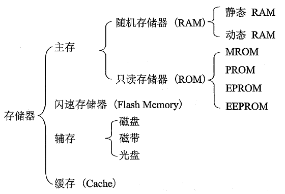
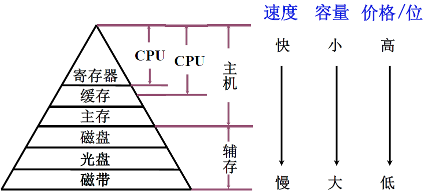
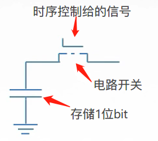
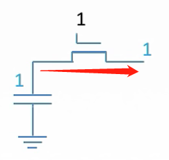
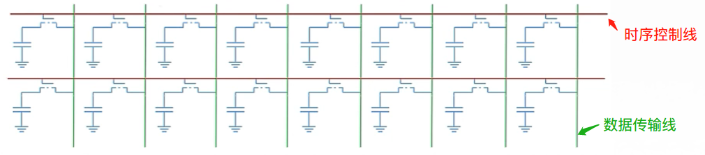
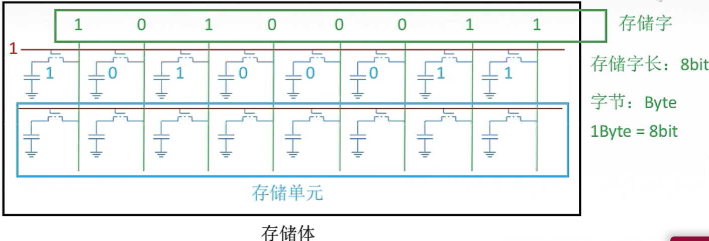
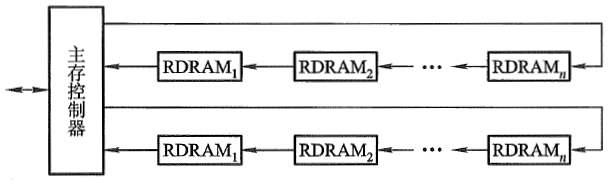
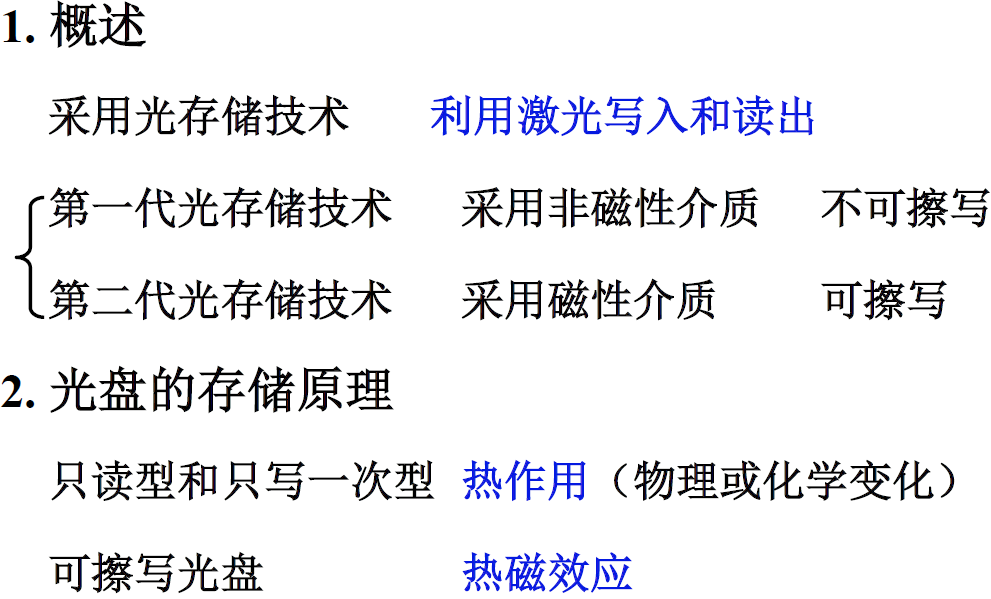

# 计算机组成原理

> “练拳不练功, 到老一场空”. 

## 第3章 存储系统

传统的冯诺依曼模型, 以运算器为核心, 造成了性能瓶颈. 后来加以改进, 成为**以存储器为核心**的冯氏模型.

### 概述

存储器用来存放数据与指令.  由于超大规模集成电路的技术, CPU速度变得非常的快, 而存储器的读写速度

没有很大的提升, 故计算机系统的运行速度很大程度上受限于存储器速度. 

I/O 设备不断增多, 若他们与存储器交换信息都通过CPU来实现, 会大大降低CPU工作效率. 为此, 出现了I/O

与存储器的直接存取方式(DMA).

### 存储器的分类

- **按存储介质分**

  1. 半导体存储器

     存储元件由半导体器件组成. 现代半导体存储器都用超大规模集成电路制程芯片, 体积小, 功耗低, 存取时间短. 但电源消失, 所存储的信息也会丢失.

     半导体存储器, 由可按材料不同, 分**双极性**(TTL)半导体存储器, 与**MOS**半导体存储器. 前者速度非常快,

     后者具有高集成度的特点, 并且制造简单, 成本低, 功耗小, 所以MOS半导体存储器被广泛使用.	

  2. 磁表面存储器

     磁表面存储器是在金属或塑料基体的表面上涂一层磁性材料作为记录介质, 工作时磁层随
     载磁体高速运转, 用磁头在磁层上进行读/写操作, 故称为磁表面存储器. 按载磁体形状的不同, 
     可分为磁盘, 磁带和磁鼓. 现代计算机已很少采用磁鼓. 由千用具有矩形磁滞回线特性的材料
     作磁表面物质, 它们按其剩磁状态的不同而区分“0” 或“1” , 而且剩磁状态不会轻易丢失, 故这类
     存储器具有**非易失性**的特点.

  3. 磁芯存储器 

     目前已被淘汰

  4. 光盘存储器

     光盘存储器是应用激光在记录介质(磁光材料）上进行读/写的存储器, 具有**非易失性**的特
     点. 由千光盘记录密度高、耐用性好、可靠性高和可互换性强等特点, 光盘存储器越来越被用于
     计算机系统.

- **按存取方式分类**

  1. 随机存储器  Random Access Memory, RAM

     RAM 是一种可读/写存储器, 其特点是**存储器的任何一个存储单元的内容都可以随机存取**, 
     而且**存取时间与存储单元的物理位置无关**. 计算机系统中的**主存**都采用这种随机存储器. 由于
     存储信息原理的不同, RAM 又分为**静态RAM** (以**触发器原理**寄存信息)和**动态RAM** (以**电容充**
     **放电原理**寄存信息).

  2. 只读存储器 Read Only Memory, ROM

     只读存储器是能对其存储的内容读出, 而不能对其重新写入的存储器. 这种存储器一旦存
     入了原始信息后, 在程序执行过程中, 只能将内部信息读出, 而不能随意重新写入新的信息去改
     变原始信息. 因此, 通常用它存放固定不变的程序, 常数和汉字字库, 甚至用于操作系统的固化.
     **它与随机存储器可共同作为主存的一部分, 统一构成主存的地址域. **

     随着半导体技术的发展和用户需求的变化, 只读存储器先后派生出**可编程只读存储器**(Programmable ROM, PROM) , **可擦除可编程只读存储器**(Erasable Programmable ROM, EPROM) 以及**电擦除可编程只读存储器**(Electrically - Erasable Programmable ROM, EEPROM) . 近年来还出现了**闪速存储器**Flash
     Memory , **它具有EEPROM 的特点, 而速度比EEPROM 快得多**. 

  3. 串行访问存储器

     如果对存储单元进行读/写操作时, 需按其物理位置的先后顺序寻找地址, 则这种存储器称
     为**串行访问存储器**. **显然这种存储器由千信息所在位置不同, 使得读/写时间均不相同**. 例如, 
     磁带存储器, 不论信息处在哪个位置, 读/写时必须从其介质的始端开始按顺序寻找, 故这类串行
     访间的存储器又称为**顺序存取存储器**. 还有一种属于**部分串行访问的存储器**, 如磁盘. 在对磁
     盘读/写时, 首先直接指出该存储器中的某个小区域(磁道）, 然后再顺序寻访, 直至找到位置. 
     故其前段是直接访间, 后段是串行访问, 称为**直接存取存储器**. 

- **按作用分类**

  按在计算机系统中的作用不同, 存储器主要分为**主存储器**、**辅助存储器**、**缓冲存储器**. 

  主存储器(简称主存) 的主要特点是它可以和CPU 直接交换信息. 辅助存储器(简称辅存) 
  是主存储器的后援存储器, 用来存放当前暂时不用的程序和数据, 它不能与CPU 直接交换信息. 
  两者相比, 主存速度快, 容量小, 每位价格高; 辅存速度慢, 容量大, 每位价格低. 缓冲存储器(简
  称缓存)用在两个速度不同的部件之中, 例如, CPU 与主存之间可设置一个**快速缓存**(有关内容
  将在后面讲述),  起到缓冲作用. 

  

### 存储器的层次结构

存储器有3个主要性能指标: 速度, 容量与价格. 一般来说, 速度越高, 位价就越高; 容量越大, 位价就越低, 而且容量越大, 速度必越低. 人们追求大容量, 高速度, 低位价的存储器, 可惜这是很难达到的.

上图右上到下: 速度越来越慢, 容量越来越大, CPU访问频度越来越少.

寄存器: 直接在CPU内部, 速度最快, 价格最高, 容量也最小. 某些I/O中也有寄存器.

主存: 用来存放将要参与运行, 程序和数据, 其速度与CPU 速度差距较大, 为了使它们之间速度更好地匹配, 在主存与CPU之间插入了一种比主存速度更快, 容量更小的**高速缓冲存储器**Cache , 显然其位价要高于主存. 现代计算机将Cache 也制作在CPU 内. 磁盘, 磁带属于辅助存储器, 其容量比主存大得多, 大都用来存放暂时未用到的程序和数据文件. CPU 不能直接访问辅存, 辅存只能与主存交换信息, 因此辅存的速度可以比主存慢很多.

实际上, 存储系统层次结构主要体现在**缓存－主存和主存－辅存**这两个存储层次上. 显然, CPU 和缓存, 主存都能直接交换信息; 缓存能直接和CPU , 主存交换信息; 主存可以和CPU , 缓存, 辅存交换信息.

> **存储器层次结构的主要思想, 是上一级的存储器, 作为低一层存储器的高速缓存.**

**缓存-主存层次**主要**解决CPU 和主存速度不匹配的问题**. 由于缓存的速度比主存的速度高, 只要将CPU 近期要用的信息调入缓存,  CPU 便可以直接从缓存中获取信息, 从而提高访存速度. 但由于缓存的容量小, 因此需不断地将主存的内容调入缓存, 使缓存中原来的信息被替换掉. 主存和缓存之间的数据调动是**由硬件自动完成**的, 对程序员是透明的.

**主存-辅存层次**主要**解决存储系统的容量问题**. 辅存的速度比主存的速度低, 而且不能和CPU 直接交换信息, 但它的容量比主存大得多, 可以存放大量暂时未用到的信息. 当CPU 需要用到这些信息时, 再将辅存的内容调入主存, 供CPU 直接访问. 主存和辅存之间的数据调动是由**硬件和操作系统共同完成**的.

从CPU 角度来看, 缓存-主存这一层次的速度接近于缓存, 高于主存; 其容量和位价却接近于主存, 这就从速度和成本的矛盾中获得了理想的解决办法. 主存- 辅存这一层次, 从整体分析, 其速度接近于主存, 容量接近于辅存, 平均位价也接近低速, 廉价的辅存位价, 这又解决了速度, 容量, 成本这三者的矛盾. 现代的计算机系统几乎都具有这两个存储层次, 成了**缓存, 主存, 辅存三级存储系统**.

在主存-辅存这一层次的不断发展中, 逐渐形成了**虚拟存储系统**. 在这个系统中, **程序员编程的地址范围与虚拟存储器的地址空间相对应**. 例如, 机器指令地址码为24 位, 则虚拟存储器存储单元的个数可达16 M . **可是这个数与主存的实际存储单元的个数相比要大得多**, 称这类指令地址码为**虚地址(虚存地址、虚拟地址)或逻辑地址**, 而把**主存的实际地址称为物理地址或实地址**. **物理地址是程序在执行过程中能够真正访问的地址, 也是实实在在的主存地址**. 

对具有虚拟存储器的计算机系统而言, 程序员编程时, 可用的地址空间远远大于主存空间, 使程序员以为自己占有一个容量极大的主存, 其实这个主存并不存在, 这就是将其称为虚拟存储器的原因. **对虚拟存储器而言, 其逻辑地址变换为物理地址的工作是由计算机系统的硬件和操作系统自动完成的,** 对程序员是透明的. 当虚地址的内容在主存时, 机器便可立即使用; **若虚地址的内容不在主存, 则必须先将此虚地址的内容传递到主存的合适单元后再为机器所用**. 这些方面的内容, 可在”计算机体系结构”和“操作系统”课程中学到.

### 主存储器

 先回顾第1章的存储器介绍的两张图:

那么存储体中如何存储一个二进制位?

上图给出了一位二进制数据的**逻辑电路图**, 这样的电路,称为一个**`存储元`**. 存储体由n个存储元够成.

假设现在是**读取**命令, 时序控制给开关处加1(高电平), 电路导通, 那么存储体中的高电平信号1就可以顺着电路传出去了.

**写入**命令, 是数据先放到数据寄存器, 数据准备完毕, 通知时序控制逻辑, 时序控制给出信号, 让电路导通, 于是数据被写入.

那么如何把这一个存储元组一起来, 变成一个字节的存储字呢.

如上图所示, 为2个字节的, 16位的存储元.

> 从上面的图其实可以知道,  `每一次只能让一条时序控制线位于工作状态,` 读出该存储字的内容.
> 如果两条一起工作, 数据传输线就不知道该传谁的数据到MDR了.

**上图就是存储器芯片的基本结构.**

因为每次只有一条控制线处于工作状态1, 而其他线都是0. 如果单独来存这串控制代码, 太浪费资源.

于是, 我们用一个译码器, 把MAR中的内存地址, 转换成二进制控制信号串, 假设 3位地址010, 传过来要读第2个存储单元的内容. 因为有3位, 所以主存有8个存储单元. 那译码器拿到这个地址之后, 就会把它翻译成, 0000 0010, 从低位数第二个控制线工作. 然后数据存到MDR再由它从数据总线传出去. 要是100, 就是第4个单元, 控制信号就是
0000 1000.  假如地址线传过来的数转成十进制是n, 其实就是把1左移n就行了.

控制电路, 就是之前说的 时序控制逻辑. 

**片选线**: 是整个芯片的开关. 它有两种模式, 一种是高电平有效, 一种是低电平有效. 

确定哪个存储芯片被选中, 可用于存储容量的扩充.

上图的写法, 就表示CS\*(Chip Selection) 或 CE\* (Chip Enable) 为低电平有效.没有上面的横线就是高电平有效.

> **`字母上面的横线打不出来, 约定以右上角加个星号 CS* 来代表低电平有效,这也是常用写法.`**

- **理解片选线的作用:**

假设手上有n片 16K \*1位的存储芯片, 要组成64K \* 8位的存储器. 那就需要**32个**这样的chip.

16K \*1位 * 8 * 4 就是, 这个chip 8个一组, 组成 4组就够了.

因为65535 是64K - 1 所以, 它是在最后一组chip里, **此时前面3根片选线是无效的电平, 只有黄色这跟片选线是使能的**. 只做最后一组chip的访问.

**读控制线/写控制线**: 决定当前这次操作是读还是写的操作, 以及什么时候读或写. 这两根线完全可以合并成一根线.

上图给出了读写控制线由一条线还是两条线控制的引脚功能.

如果是一条控制线, 那么这条线的引脚就是`WE*` 意思是低电平写, 相反就是高电平读.

若是两条线, 就有两个引脚. OE加横线, 就是(主语是CPU)低电平读, 为什么是O, Output是主语是这个内存, CPU来读, 就是内存往外输出数据. 另一个引脚WE加横线, 就是低电平允许写.

下图就是芯片结构的逻辑图:

**存储矩阵**: 就是存储体, 是存储单元的集合, 由行(X)选择线与列(Y)选择线来选择要访问的单元. 存储体的同行, 同列的位同时被读取或写入. 但由行和列电路定位, 就只有一个存储单元会被有效读写.

**译码驱动**: 把来自地址总线的地址信号翻译成对应存储单元的选通信号, 该信号在读写电路的配合下完成对被选单元的读写操作.

**译码驱动器**: 是提升 时序控制线 控制能力的电路. 之前一个1, 控制一个存储元开关, 现在一个1控制n个开关.所以, 需要有个电路帮它扩大输送控制信号1的能力, 这就是**驱动器**的功能.

**读/写电路:** 就是读写控制线的电路, 来控制整个读写过程的一组电路. 包括读出放大器和写入电路, 来完成读写操作.

**地址线**: 对应MAR的位数(行数, 红色线), 单向输送.

**数据线:** 对应MDR的位数(列数, 绿色线), 双向输送.

存储芯片通过**地址总线, 数据总线和控制总线**与外部连接. 

### 主存性能指标

- 容量

  能够存放二进制数据的总位数,

  存储容量 = 存储单元个数 x 存储字长   单位是位. 也可以除以8, 单位是字节.

  > 存储单元个数也就是存储字数, 存储字数表示存储器地址空间大小, 字长表示一次存取操作的数据量.

- 存储速度

  - 存取时间(Ta) : **存储器的访问时间**, 从存储器得到地址到 拿到稳定的数据. 分读出时间跟写入时间.

  - 存取周期(Tm) : **连续**两次**独立**的存储器操作(Read or Write)所需要的**最小间隔时间**.现代MOS 型存储器的存取周期可达100 ns ; 双极型TTL 存储器的存取周期接近于10 ns . 

    > 一般来说, 存取周期要大于存取时间, 因为一个存取周期里, 除了存取操作, 还有别的操作.

- 存储器的带宽 (Bm)

  它表示单位时间内存储器存取的信息量, 单位可用字/秒或字节/秒或位/秒表示. 

  带宽是衡量数据传输率的重要技术指标.

  > 存储器的带宽决定了以存储器为中心的机器获得信息的传输速度, 它是改善机器瓶颈的一
  > 个关键因素. 为了提高存储器的带宽, 可以采用以下措施: 
  >
  > - 缩短存取周期;
  > - 增加存储字长, 使每个存取周期可读/写更多的二进制位数.
  > - 增加存储体

### 半导体存储芯片的译码驱动方式

- **线选法**

  

  所谓线选法, 就是地址线过来的几位地址, 经由地址译码器翻译过后, 得到一个控制位串, 4位的地址, 就是2的4次方, 16位的位串, 这16位的位串每一位控制一条线. 上图的一条线上有8个存储元.

  **线选法, 是一维的**. 但是线选法有个问题, 就是4位地址就要设计16条线. 那32位呢 64位呢? 所以线选法有局限.

- **重合法**

  为了解决线选法的局限性, 我们把存储芯片按**二维排列**. 地址分开成两部分, **行地址与列地址.**

  

  **用二维地址左边定位一个存储单元.** 行地址对应一行, 列地址对应一列.

  实际上, 这一行 跟 一列**都会激活**, 但因为电路导通的只有0,0 这个存储单元, 所以只有它的内容会传出去.

  上图的例子中, 行地址有5位, 列地址有5位. 按照线选法 就要设计 2的10次方, 1024根选通线,

  而重合法, 只需要2的5次方 乘以2 就是64根就够了. 1024根与64根, 成本谁更大呢.

### RAM

#### 静态RAM-SRAM

读写操作了解即可.

- SRAM基本电路

  

- SRAM读操作

  

- SRAM写操作

  

#### 动态RAM-DRAM

- DRAM基本单元电路

  

  DRAM是用电容进行充放电, 来存储数据. 当电容Cg没充电, 里面的数据就是0.

  假设是要读数据, 预充电信号预充电, 给T4导通,  VDD通过T4给读数据线充电, 数据线为高电平.

  现在Cg没充电, 数据是0, 那么T1的栅极是低电平,不会导通, 读数据就会保持高电平, 读出1.

  当Cg充电, 数据为1 , 那么T1栅极为高电平, 导通, 数据线就会经过T2, T1放电, 读出0.

  所以读出的信号要经过取反.

  假设是写入, 写选择线有效, T3导通. 如果写入1, 写数据线为高电平, 往Cg充电. 如果写入0, Cg通过T3放电.

### 寻址

寻址其实就是按照不同的大小(你想要的大小)来切分存储矩阵, 比如按字节, 还是按字, 按半字.

按字节,就是1个字节一跳. 按半字, 就是2个字节一跳. 按字, 就是4个字节一跳.

> 编址可按字节, 或按字编址, 它是最小可寻址单位. 现代计算机通常是按字节编址.

1K = 1024 = 2的10次方. 就是10根地址线.

大小端, 说过好几次了.  注意的地方是, **它是字节跟字节的顺序, 字节内每一位该怎么放还是怎么放的.**

> **`大小端, 只看读到的第一个有效字节, 是高字节(大端)还是低字节(小端).`**

### **半导体随机存取存储器**

前面说了主存储器的内部结构, 现在来看看存储体中每个存储元的材料.

SRAM 跟 DRAM都把地址拆分成行列两部分, 不同的是, SRAM的行地址跟列地址, **可以不等长**. 因为它是同时送.

DRAM的行地址跟列地址, 就**必须等长**, 因为它要分两次送.

> SRAM常用来做为cache, 它的存储元是双稳态触发器(六晶体管MOS), 信息被读取不需要恢复, 就比DRAM快.

### RAM的读周期时序

以2114RAM芯片为例.

之前说过存取时间, 与存取周期是不一样的.而存取周期往往大于存取时间.

上面DRAM知道了, 它需要刷新来恢复电容里的电荷, 来使数据持续存在. 所以上图就好理解了.

读周期大概运作如下:

在整个读周期中读写信号线WE\*, 始终为高电平(高电平为读, 低电平为写.) .

tRC就是 read cycle读周期, 指对芯片进行连续两次读操作的最小间隔时间.

读时间tA, 表示从地址有效到数据稳定所需时间, 显然读时间肯定小于读周期.

tco表示从片选有效, 到输出稳定的时间. 地址片选信号CS\* 必须保持到数据稳定输出.

可见只有当地址有效经tA 后, 且当片选有效经tco 后, 数据才能稳定输出, 这两者必须同时具备.

当地址有效后, 经tA -tco 时间必须给出片选有效信号, 否则信号不能出现在数据线上.

从片选失效到输出高阻需一段时间tOTD , 故地址失效后, 数据线上的有效数据有一段维持时间tOHA , 以保证所读的数据可靠.

> 从上面的图可以看到, 地址开始有效一段时间, 片选才给出信号, 这是等待地址传输完毕且稳定, 然后片选信号给了, 也要等一段tcx, 然后才会读信号. 读完数据, 很快片选失效, 而数据会一直持续到地址失效, 以保证读到的数据可靠.

### RAM的写周期时序

写周期twc write cycle是对芯片进行连续两次写操作的最小间隔时间.

写周期包括滞后时间tAW , 写入时间tw 和写恢复时间tWR. 

在写有效数据出现之前, RAM的数据线上有上面读取的数据内容DOUT. 故在地址线发现变化后, `CS*`, `WE*`都要

滞后tAW 再有效, 避免将无效数据写入RAM. 但写允许WE失效后, 地址必须保持一段时间, 称为写恢复时间.

RAM数据线上的有效数据, 就是写入数据DIN, 必须在CS, WE失效前, 的tDW 时刻出现, 并延续一段时间.

(此刻地址线仍处于有效期, 且 tDH < tWR), 以保证数据可靠写入. 

> 已经制成的RAM 芯片读/写时序关系**已被确定**, 因此, 将它与CPU 连接时, 必须注意它们相互
> 间的时序匹配关系, 否则RAM 将无法正常工作. 具体RAM 芯片的读/写周期时序可查看相
> 关资料. (驱动工程师需要注意的)

值得注意的是, 不论是对存储器进行读操作还是写操作, 在读周期和写周期内, 地址线上的地址始终不变. 

### DRAM的刷新

- **为何要用行列地址**

  设计上DRAM把存储单元排列成2的(n/2)行与2的(n/2)列

假如地址是 0000 0000 8位, 那DRAM就会把**存储单元**排列成16行 16列.

读0000 0000这个字节的数据, 就如下图. 每个单元还是1个字节.

如果是原来的一维模型, 就需要2^8 = 256根选通线. 现在二维模型只需要32跟选通线.

就**大大减少了选通线的数量**, 非常容易设计. 这就是**为何要用行列地址**.

- **如何刷新**

  由硬件来完成, 读书一行的信息后, 重新写入, 占用1个读/写周期.(读跟写周期实际上花费时间不同

  但为方便把他们设计成一样.)

- **什么时刻刷新**

  假设DRAM内部结构为128*128, 读/写周期(存取周期) 为0.5μs.上面说了 刷新周期为2ms.

  那么2ms中就有4000个读写周期. 4000个读写周期, 拿出一部分给刷新用.

  三种方式:

  刷新是按行进行的, 每次刷新一行存储单位.

  

  > 分散刷新: 优点是无死区, 缺点是加长了系统的存取周期, 降低了整机的速度. 干一天休一天.
  >
  > 集中刷新: 优点是读写操作时不受刷新工作的影响, 故存取速度较高, 缺点是在集中刷新期间(死区), 不能访问存储器. 干三周, 休一周.
  >
  > 异步刷新: 综合了前面两种. 既可以缩短死区, 又能充分利用最大刷新时间. 这样可以避免CPU连续等待时间过长 并且减少刷新次数, 提供了效率. **将刷新安排在指令译码阶段, 不会出现 "死区"**. 干六天休一天

  DRAM的刷新, `对CPU是透明的`, `不用依赖外部的访问`. 它以行为单位, 故刷新只需要行地址. 刷新类似读, 但又不同. 刷新操作仅是给栅极电容补充电荷, 不需要信息输出. 刷新不需要选片, 即整个存储器中所有芯片同时刷新.

### 只读存储器ROM

RAM是易失性的存储器, 所以一旦掉电, RAM只要过一小会就没信息了. 

而硬盘这种辅存, 虽然不易丢失数据, 但是却不能和CPU直接通信, 它通过I/O连接到主机的.

而辅存与CPU的通信, 也需要主存中的指令才能完成.

所以, 我们需要掉电不丢失数据, 又能跟CPU直接通信的ROM.

ROM的容量不大, 可以存储一些关键信息. 比如存储操作系统在辅存中的位置, 把操作系统通过I/O接口,

调到RAM中去. 

所以主机, 就是由CPU RAM ROM组成, ROM存储一些固定的信息, 如上面说的操作系统在硬盘中的位置等.

ROM一开始不能写入, 后来发展成可以写入了, 但是写入速度也是非常慢的.

RAM 跟 ROM 都支持随机存取.

#### ROM的发展与种类

- **掩模ROM (MROM)**

  行列选择线交叉处有 MOS 管为“1”
  行列选择线交叉处无 MOS 管为“0”

- PROM (一次性编程)

  

- EPROM (多次性编程)

  

- EEPROM (多次性编程)

  电可擦写
  局部擦写
  全部擦写

- Flash Memory (闪速型存储器)

  EPROM      价格便宜 集成度高
  EEPROM      电可擦洗重写
  比 EEPROM快  具备 RAM 功能

- Solid State Drives(SSD 固态硬盘)

  基于上面Flash芯片, 用固态电子存储芯片阵列,  由控制单元和存储单元组成.

  保留了Flash长期保存信息,快速擦除与重写特性. 比传统硬盘, 读写速度快, 功耗低, 但更贵.

### CPU与主存的连接

#### 存储器容量的扩展

- **位扩展** 

  为了增加存储字长.  

  例如, 如何用1K \* 4位 的chip, 组成1K \* 8位的存储器.

  我们用2个1k乘4的chip, 用**相同的片选线**.

  

  再例如, 用8K \* 1 位的chip, 组成8K \* 8位的存储器.

   用8个芯片, 他们的片选也是用同一根.

- **字扩展**

  增加存储字的数量, 字长不变. 芯片的地址线, 数据线, 读写控制线对应并联, 由片选信号来区分各芯片的地址范围.

  用 1K x 8位的chip, 组成2K x 8位.

  2个芯片, 但这个两个芯片不能同时工作, 都是8位. 2K x 8 有11条地址线.

  所以, 我们可以把两个芯片的地址线共用, 多出来一条作为片选.

  

  A10 为低电平时, 左边的芯片被启用, A10 为高电平时, 右边的芯片被启动.

  这样 000 0000 0000 到 01 1111 1111 这1K的地址给了左边的芯片,

  100 0000 0000 到 111 1111 1111这1K地址给了右边的芯片. 

- **字与位扩展**

  用1K x 4位的chip, 组成4K x 8位. 显然, 我们需要8个chip.

  两个芯片组成 1K x 8位,  搞4组这样的芯片组就行. 4K有12根地址线, 原来1K 10根, 多的两根做片选线.

  2根片选线控制4个组, 那肯定要译码器来完成了.

  

#### 存储器与CPU的连接

- 地址线的连接

- 数据线的连接

- 读/写命令线的连接

- 片选线的连接

- 合理选择存储芯片

- > 保存系统程序和配置信息的存储芯片, 用ROM, 这些都是不经常改动的部分.
  >
  > 而用户程序区, 或系统运行区域, 要用到RAM.
  >
  > 用的芯片尽可能少, 片选的逻辑尽可能简单.

- 其他: 时序, 负载(CPU带几个存储芯片).

#### 存储芯片的地址分配和片选

CPU要实现对存储单元的访问, 首先要选择存储芯片, 即进行**片选**; 然后再为选中的芯片依地址码选择相应的存储单元, 以进行数据的存取, 即进行**字选**. 片内的字选通常是由CPU送出的N条**低位地址线**完成的, 地址线直接接到所有存储芯片的地址输入端(N由存储容量决定). 片选信号的产生, 分为线选法与译码线选法.

- 线选法

  就是用除片内寻址外的高位地址线直接(或经反相器)分别接各个芯片的片选引脚, 高位地址线的信息位"0",

  就选中该对应的芯片. 高位片选地址线一次只有一根有效, 因为一次只选一个芯片(组).

  上面用 1K x 8位的chip, 组成2K x 8位 的例子就是.

  优点: 不用译码器, 线路简单.

  缺点: 地址空间不连续, 不能充分利用系统的存储空间, 浪费地址资源.

- 译码片选法

  如上面字与位扩展中的例子.

来个题目:

74138译码器, **三个控制端, 1个高电平, 两个低电平才能让它工作.**

先确定地址线, 数据线各需要几根, 再决定要用什么的芯片. 再确定地址线怎么分配.然后画图:

> 注意, ROM芯片的PD/Progr 编程端接地, 以确保在读出时低电平有效.  当然也要看ROM的芯片有OE引脚, 那就把WR接到OE.
>
> ROM的数据线画错了, ROM的数据线应该是单向的.
>
> 片选译码器往往是最复杂的部分, 可以有多种方式来实现.

### 存储器的校验

海明校验, 之前第2章 校验码节讲过了.

### 提高访存速度的措施

提高访存速度, 可以提高整个系统的效率. 以存储器为中心的结构, CPU中的指令与数据都来自内存, 内存不够快,

CPU就要空转, 浪费性能. 这种情况, 我们称之为存储墙. 

主要有以下几个思路:

1. 采用高速器件
2. 采用层次结构 如 cache - 主存的结构.
3. 调整主存结构

前两种,  成本都比较高, 我们主要看看**第3个思路**能不能有可行性.

回顾一下, 之前的主存内容. 因为一个存取周期中, 有恢复时间的存在. 有时间上的浪费.

所以, 提高访存速度, 就要通过一定的方法, 利用好那段恢复时间.

思路1: 对多个 不同时间, 能够进行不同存取的存储单元, 进行并行操作.

思路2: 利用流水线的方案, 某个单元在恢复时间中, 对其他单元进行存取.

#### 双端口RAM(了解)

为了实现思路1, 我们可以用双端口RAM. 

双端口RAM是指: 同一个存储器有左 右两个独立的端口, 分别具有两组相互独立的地址线, 数据线和读写控制线,

它允许两个独立的控制器同时异步地访问存储单元. 当两个端口的地址不同时, 两个端口进行读写操作就不会冲突.

相反, 他们同时存取存储器的同一地址单元, 那肯定冲突.

两个端口同时存取同一个主存时 有4种情况:

- 两个端口不同时刻对同一地址单元存取数据.  这当然没问题
- 两个端口不同时刻从同一地址单元读出数据.  同时读出也没问题.
- 两个端口不同时刻向同一地址单元写入数据.  这肯定会有冲突.
- 两个端口不同时刻对同一地址单元写入数据, 一个端口写入数据, 一个端口读出数据. 读出的端口可能会读错.

解决冲突的方法, 就是加个控制信号量:

这种方法, 不常见, 至少我孤陋寡闻, 没见过.

#### 多模块存储器

多模块存储器主要有两种结构:

- 单体多字存储
- 多体并行存储

- **单体多字存储系统**

  假设CPU的字长是16位, 那我们可以把内存的存储字长从16位搞成64位, 就是把存储字长扩展4倍.

  

  那么一次就可以读出4个CPU字长, 64位的数据, 扔到数据寄存器里, 就好比原材料一直可以足够供给, 工厂就可以一直开工, 不至于无米下锅. 这当然就快了,  但也有个致命的问题.

  就是如果要写入数据, 就要先把16位数据放到单字长的寄存器中 , 然后写到4字长的数据寄存器, 然后在写到内存中. 我只想写16位, 却不得不写64位, 那48位的数据也被覆盖修改掉了, 造成内存数据的错误.

  另一个问题是, 如果要读取的数据, 它不连续存放在一个存储字里怎么办. 第一个存储字里放一部分, 另外的部分存放在另外的存储字里.

  > 带宽是大了, 但是正确性不能保证. 于是在此基础上, 有了下面这个方案.

- **多体并行存储系统**

  多体并行有两种方案提高存储带宽:

  - **高位交叉 顺序编址**

    

    4个存储体, 低4位的地址用来给各个存储体内部的存储单元编址, 高2位, 给4个存储体编址.这样就组成了6位地址的编址.

    若是每个存储体各自都有自己的MAR,MDR跟地址译码器这些**控制电路**, 它们就能并行地工作了.

    但是它也有问题,  比如有个程序指令放在M0这个存储体0000中, 按顺序往高位地址存放指令, 那么CPU从它中获取指令, 按序执行, 那CPU不停访问M0中其他的数据. 这个时候, 其他三个都没事干, 斗地主去了.

    所以, 虽然能并行, 但也是一段时间只有一个忙.

  - **低位交叉  各个存储体轮流编址**

    低位交叉的编址跟高位交叉反过来, 低位是给存储体编号, 高位给存储体内的存储单元编号.

  

  若是每个存储体各自都有自己的MAR,MDR跟地址译码器这些**控制电路**, 它们就能并行地工作了.

  数据现在是横着存了.

  

  上图的流水线方式存取, 以下图更为直观.

  

  对比一下两种方式:

  

  > 低位交叉的T+(n-1)τ 其实是有条件限制的, 不是说低位交叉一定就是这个耗时. 
  >
  > 必须要满足 存储体的个数m要大于等于 T/τ 这个样的设计. 上图就是T=4τ 

  

  ​	从上图可以看出来, 不满足 m < T/r  , 公式 T+(n-1)r 就是不对的.

  ​	m > T/r 时 , 会有一小段等待时间. 

  ​	**所以,  当设计满足 m = T/r 时, 是利用率是最高的. 提速也达到最大效果.**

  > 补充: 低位交叉的方式, 可以如 单体多字的方式并行工作的, 但前提是数据总线的宽度要满足mW,
  >
  > 就是m个存储体的存储字长W一起读取, 要有足够的总线宽度来承接. 

  ​	接着完成上面的题目:

  ​	

#### 高性能存储芯片

采用高性能存储芯片也是提高主存速度的措施之一. DRAM 集成度高, 价格便宜, 广泛应用
于主存. 其发展速度很快, 几乎每隔3 年存储芯片的容量就翻两番. 为了进一步提高DRAM 的
性能, 人们开发了许多对基本DRAM 结构的增强功能, 出现了SDRAM , RDRAM 和CDRAM.

- SDRAM (Synchronous DRAM, 同步DRAM)

  SDRAM 与常用的异步DRAM 不同,  **它与处理器的数据交换同步千系统的时钟信号**, 并且以
  **处理器－存储器总线的最高速度运行**, 而不需要插入等待状态.

  CPU不需要等待.

- RD RAM (Rambus DRAM)

  由Rambus 开发的RDRAM 采用专门的DRAM 和高性能的芯片接口取代现有的存储器接口. 它主要解决存储器带宽的问题, 通过高速总线获得存储器请求(包括操作时所需的地址、操作类型和字节数), 总线最多可寻址320 块RDRAM 芯片, 传输率可达1.6 GBps.

  它不像传统的DRAM 采用RAS , CAS 和WE信号来控制, 而是采用异步的面向块的传输协议传送地址信息和
  数据信息. 一个RDRAM 芯片就像一个存储系统, 通过一种新的互连电路RamLink , 将各个
  RDRAM 芯片连接成一个环, 数据通信在主存控制器的控制下进行, 数据交换以包为单位. 

- 带Cache 的DRAM (CDRAM)

  带Cache 的DRAM 是在通常的DRAM 芯片内又集成了一个小的SRAM, 又称增强型的DRAM(EDRAM).

### 高速缓冲存储器

#### 局部性原理

> 程序访问的局部性原理非常重要. 它分为 时间的局部性和空间的局部性.
> **时间的局部性:** 当前正在使用的指令和数据, 在不久的将来还会被用到. 所以把它们放到cache中.  
> **空间的局部性:** 当前正在使用的指令和数据, 不久的将来跟它相邻的指令和数据, 就有可能会被使用. 在用的和相邻的数据和指令, 统统放进cache.

在多体并行存储系统中, 由于**I/O设备向主存请求的级别高于CPU 访存**, 这就出现了CPU等待I/O 设备访存的现象, 致使**CPU 空等一段时间**, 甚至可能等待几个主存周期, 从而降低了CPU 的工作效率. 为了避免CPU 与I/O 设备争抢访存, **可在CPU 与主存之间加一级缓存**, 这样, 主存可将CPU 要取的信息提前送至缓存, 一旦主存在与I/O  设备交换时,  CPU 可直接从缓存中读取所需信息, 不必空等而影响效率. 

从另一角度来看, 主存速度的提高始终跟不上CPU 的发展. 据统计,  CPU 的速度平均每年改进60%, 而组成主存的动态RAM 速度平均每年只改进7%, 结果是CPU 和动态RAM 之间的速度间隙平均每年增大50% . 例如,  100 MHz 的Pentium 处理器平均每10 ns 就执行一条指令, 而动态RAM 的典型访问时间为60 ~ 120 ns . 这也希望由高速缓存Cache 来解决主存与CPU 速度的不匹配问题. 

Cache 的出现使CPU 可以不直接访问主存, 而与高速Cache 交换信息. 那么, 这是否可能呢? **通过大量典型程序的分析, 发现CPU 从主存取指令或取数据, 在一定时间内, 只是对主存局部地址区域的访问**. 这是由于指令和数据在主存内都是连续存放的, 并且有些指令和数据往往会被多次调用(如子程序、循环程序和一些常数）, 即指令和数据在主存的地址分布不是随机的, 而是相对的簇聚, 使得CPU 在执行程序时, 访存具有相对的局部性, 这就称为程序访问的**`局部性原理`**.

根据这一原理, 很容易设想, 只要将CPU 近期要用到的程序和数据提前从主存送到Cache, 那么就可以做到CPU 在一定时间内只访问Cache. 一般Cache 采用高速的SRAM 制作其价格比主存贵, 但因其容量远小于主存, 因此能很好地解决速度和成本的矛盾. 

#### Cache 的工作原理

主存由`2^n `个可编址的字组成, 每个字有唯一的n 位地址. **为了与Cache 映射**, **将`主存`与`缓存`都分成若干块**, **每块内又包含若干个字, 并使它们的块大小相同(即块内的字数相同）**. 这就将**主存的地址分成两段**：高m 位表示主存的块地址, 低b 位表示块内地址, 则`2^m = M` 表示主存的**块数**. 

同样, **缓存的地址也分为两段**：高c 位表示缓存的块号, 低b 位表示块内地址, 则2^c = C 表示缓存块数, 且C 远小于M(Cache的容量一定小于主存). **主存与缓存地址中都用b 位表示其块内字数**, 即`B=2^b` 反映了**块的大小, 称B 为块长. **

> 把主存跟cache 按块划分n块, 那**CPU给出的内存地址, 就可以分为两部分**, 一部分是`块内偏移地址`, 它的位数, 决定块的大小. (如一个块有16个字节, 内存编址单位是字节, 那块内地址就是4位), 另一部分就是`主存的块编号`.
>
> **数据 在主存与cache之间, 是以块为单位, 整体传送. 块内字节顺序, 不会发生变化. 所以, 主存和cache的块内地址部分, 完全相同.**
>
> cache的标记, 是标记主存块 与 cache块之间的对应关系, 如果一个主存块, 被调入cache中了. 就会把`主存块号写到cache 的标记中去`. CPU想要从cache中去读取数据, 它就拿给出地址的`主存块号`到cache 的标记去找, 若在cache标记中正好找到了与主存块号相等的标记, 并且此cache块是有效的. CPU就可以直接从此cache块读取数据.

划重点: cache - 主存 按块存储与传输,  块的大小都相同,  块内地址完全相同, 不需转换. B为块长.

CPU 读信息时, 要将主存地址的高m 位(或m 位中的一部分)与缓存块的标记进行比较, 以判断所读的信息是否已在缓存中.

#### 命中与未命中

之前提到, 主存共有M块, 而cache有的C块, 是远远小于M的.

那就只有部分主存块, 被放到cache中.

**命中**: 主存块`已经 调入` 缓存, CPU能从cache中取到相应的数据或指令. 主存块与cache块`建立了对应关系`(cache标记来记录 与某个cache块建立了对应关系的主存块号).

**未命中**: 主存块`没有被 调入`缓存, CPU只能从主存中去取到相应的数据或指令. 主存块与cache块未建立对应关系.

此时需将该字所在的主存整个字块一次调入Cache 中(Cache 与主存之间是字块传送）.

> CPU 与Cache 之间通常一次传送一个字, 而cache与主存直接传送是按 cache块大小.

#### Cache的命中率

CPU欲访问的信息已经在Cache中的比率.  命中率与Cache 的`容量`与`块长`有关(不是重点). 

> 一般而言, ` Cache 容量越大, 其CPU 的命中率就越高.` 当然容量也没必要太大, 太大会增加成本, 而且当Cache 容量达到一定值时, 命中率已不因容量的增大而有明显的提高. 因此, `Cache容量是总成本价与命中率的折中值.`

> 块长与命中率之间的关系更为复杂, 它取决于各程序的局部特性. 当块由小到大增长时, 起初会因局部性原理使命中率有所提高. 由局部性原理指出, 在已被访问字的附近, 近期也可能被访问, 因此增大块长, 可将更多有用字存入缓存, 提高其命中率. 可是, `倘若继续增大块长, 命中率很可能下降`, 这是因为所装入缓存的有用数据反而少于被替换掉的有用数据. 由于块长的增大, 导致缓存中块数的减少, 而新装入的块要覆盖旧块, 很可能出现少数块刚刚装入就被覆盖, 因此`命中率反而下降`. 再者, 块增大后, 追加上的字距离已被访问的字更远, 故近期被访问的可能性会更小. `块长的最优值是很难确定的, 一般每块取4至8个可编址单位(字或字节)较好, 也可取一个主存周期所能调出主存的信息长度.`

前面说的 多体交叉的方法, 块的大小与多体交叉有直接关系

例如, CRAY_1 16体交叉, 每个存储体存一个字,  块长就取16个存储字, 因为16体交叉一个存取周期, 就能读取16个存储字,  放到cache中.

再如, IBM370/168 它是4体交叉, 块长就取4个存储字, 一个存储字是64位.

在一个程序执行期间, 设Nc 为访问Cache 的总命中次数, Nm为访问主存的总次数, 则命中
率h 为` h = Nc / (Nc + Nm)   `

那缺失率`M = 1 - h`

#### Cache-主存系统的效率

接着上面的命中率,  `效率e 与 命中率h 有关`. 我们设tc为命中时的Cache访问时间,  tm为未命中时的访问时间.

Cache-主存系统的平均访问时间Ta为

`Ta = h*tc + (1-h)*tm`

那么` e = tc / Ta *100%`

> e的最大值, 是命中率为1的时候, 最小值是命中率为0的时候.

#### Cache的基本结构

> 注意: 有的计算机是同时访问cache与主存, 若是命中, 主存访问终止. 否则访问主存, 并把主存块放到cache.

它主要由`Cache 存储体`, `地址映射变换机构`, `Cache 替换机构`几大模块组成

> - Cache 存储体
>
>   Cache 存储体以块为单位与主存交换信息, 为加速Cache 与主存之间的调动, 主存大多采用多体结构, 且Cache 访存的优先级最高.
>
> - 地址映射变换机构
>
>   地址映射变换机构是将**CPU 送来的主存地址转换为Cache 地址**. 由于主存和Cache 的块大小相同, 块内地址都是相对于块的起始地址的偏移量(即低位地址相同), 因此**地址变换主要是主存的块号(高位地址) 与Cache 块号间的转换**. 而地址变换又与主存地址以什么样的函数关系映射到Cache中(称为**地址映射**) 有关.
>
>   如果转换后的Cache 块已与CPU 欲访问的主存块建立了对应关系, 即已命中, 则CPU 可直接访问Cache 存储体. 如果转换后的Cache 块与CPU 欲访问的主存块未建立对应关系, 即不命中, 此刻CPU 在访问主存时, 不仅将该字从主存取出, 同时将它所在的主存块一并调入Cache, 供CPU 使用. 当然, 此刻能将主存块调入Cache 内, 也是由于**Cache 原来处于未被装满的状态**. 反之, 倘若Cache 原来已被装满, 即已无法将主存块调入Cache 内时, **就得采用替换策略**.
>
> - 替换机构
>
>   当Cache 内容已满, 无法接受来自主存块的信息时, 就由Cache 内的替换机构**按一定的替换算法**来确定应从Cache 内移出哪个块返回主存, 而把新的主存块调入Cache.
>
>    `Cache 对用户是透明的`, 即用户编程时所用到的地址是主存地址, 用户根本不知道这些主存块是否已调入Cache 内. 因为, **将主存块调入Cache 的任务全由机器硬件自动完成**.

#### Cache读操作

读操作的过程可用上面流程图来描述. 当CPU 发出主存地址后, 首先判断该存储字是否在Cache 中. 若命中, 直接访问Cache , 将该字送至CPU; 若未命中, 一方面要访问主存, 将该字传送给CPU, 与此同时, 要将该字所在的主存块装入Cache, 如果此时Cache 已装满, 就要执行替换算法, 腾出空位才能将新的主存块调入. 

#### Cache写操作

> cache是主存中某个块或某些块的缓存, cache中有的信息, 内存中也有. 读操作不对cache块中信息进行修改.
>
> 主存跟cache块中信息是一致的. 而对cache写操作, 将导致主存与cache中内容不一致. 这也是cache写操作要解决的**一致性问题**.

- **写直达法 (Write-through)**

  又称为存直达法(Store-through)或全写法, 即**`当CPU对Cache写命中时,写操作时数据既写入Cache 又写入主存`**. 它能随时保证主存和Cache 的数据始终一致, 但增加了访存次数.

  由于Cache 中的数据始终和主存保持一致, 在读操作Cache 失效时, 只需选择一个替换的块(主存块)调入Cache , 直接覆盖被替换的块(Cache 块). 可见读操作不涉及对主存的写操作. 因此这种方法更新策略比较容易实现. 但是在写操作时, 既要写入Cache 又要写入主存, 因此写直达法的"写"操作时间就是**访问主存的时间.**

  写缓冲: 为减少写直达法直接写入主存的时间损耗, 在Cache与主存之间加个写缓冲(Write Buffer), CPU同时写数据到Cache与写缓冲, 写缓冲再将内容写入主存. 写缓冲是个FIFO队列, 写缓冲可以解决速度不匹配问题.

  但若出现频繁写时, 会使写缓冲饱和溢出.

  

  优点: cache与主存一直保持一致

  缺点: 可能会造成CPU对同一个内存单元重复读写.

- **写回法 (Write-back)**

  又称为拷回法(Copy-back). 即**`写操作时只把数据写入Cache 而不写入主存`**, 但当Cache数据被替换出去时才写回主存. 可见写回法Cache 中的数据会与主存中的不一致. 

  > 为了识别Cache 中的数据是否与主存一致,  Cache中的每一块要增设一个`标志位,` 该位有两个状态: "清"(表示未修改过, 与主存一致) 和"浊"(表示修改过, 与主存不一致). 在Cache 替换时, "清"的Cache 块不必写回主存, 因为此时主存中相应块的内容与Cache 块是一致的. 在写Cache 时, 要将该标志位设置为"浊", 替换时此Cache 块要写回主存, 同时要使标志位为“清”.

  在写回法中, 写操作时只写入Cache, 故``"写"操作时间就是访问Cache 的时间, 因此速度快``. 这种方法对主存的写操作只发生在块替换时, 而且对Cache中一个数据块的多次写操作只一次写入主存, 因此可减少主存的写操作次数. 但在读操作Cache 失效时要发生数据替换, 引起被替换的块写回主存的操作, 增加了Cache 的复杂性. 对于有多个处理器的系统, 各自都有独立的Cache , 且都共享主存, 这样又出现了新问题. 即当一个缓存中数据被修改时, 不仅主存中相对应的字无效, 连同其他缓存中相对应的字也无效(当然恰好其他缓存也有相应的字). 即使通过写直达法改变了主存的相应字, 而其他缓存中数据仍然无效. 显然, 解决系统中Cache 一致性的问题很重要. 当今研究Cache 一致性问题非常活跃, 想进一步了解可查阅有关资料. 

- **对于写不命中**

  

#### Cache的改进

Cache 刚出现时, 典型系统只有一个缓存, 近年来普遍采用多个Cache . 其含义有两方面: 一是增加Cache 的级数; 二是将统一的Cache 变成分立的Cache.

- 增加Cache的级数

  单一缓存, 是指在CPU 和主存之间只设一个缓存. 随着集成电路逻辑密度的提高, 又把这个缓存直接与CPU 制作在同一个芯片内, 故又称为`片内缓存(片载缓存)`. 片内缓存可以提高外部总线的利用率, 因为将Cache 制作在芯片内,  CPU 直接访问Cache 不必占用芯片外的总线(系统总线), 而且片内缓存与CPU 之间的数据通路很短, 大大提高了存取速度, 外部总线又可更多地支持I/O 设备与主存的信息传输, 增强了系统的整体效率. 

  可是, 由于片内缓存在芯片内, 其容量不可能很大, 这就可能致使CPU 欲访问的信息不在缓存内, 势必通过系统总线访问主存, 访问次数多了, 整机速度就会下降. 如果在主存与片内缓存之间再加一级缓存, 称为`片外缓存`, 由比主存动态RAM 和ROM 存取速度更快的`静态RAM 组成`. 而且不使用系统总线作为片外缓存与CPU 之间的传送路径, 使用一个独立的数据路径, 以减轻系统总线的负担. 那么, 从片外缓存调入片内缓存的速度就能提高, 而CPU 占用系统总线的时间也就大大下降, 整机工作速度有明显改进. 这种由片外缓存和片内缓存组成的Cache 称为`两级缓存`, 并称`片内缓存为第一级, 片外缓存为第二级`. 随着芯片集成度的提高, 已有一些处理器将第二级Cache 结合到处理器芯片上, 改善了性能. 

- 统一缓存和分立缓存

  统一缓存是指`指令和数据都存放在同一缓存内的Cache`; 

  分立缓存是指`指令和数据分别存放在两个缓存中`, 一个称为指令Cache, 另一个称为数据Cache . 两种缓存的选用主要考虑如下两个因素.

  其一, 它与主存结构有关, 如果计算机的主存是统一的(指令、数据存储在同一主存内), 则
  相应的Cache 采用统一缓存; 如果主存采用指令, 数据分开存储的方案, 则相应的Cache 采用分
  立缓存. 
  其二, 它与`机器对指令执行的控制方式`有关. 当采用`超前控制`或`流水线控制`方式时, 一般都采用分立缓存. 

  >所谓超前控制, 是指在当前指令执行过程尚未结束时就提前将下一条准备执行的指令取出, 称为超前取指或指令预取. 
  >
  >所谓流水线控制实质上是多条指令同时执行, 又可视为指令流水.
  >
  >> 当然, 要实现同时执行多条指令, 机器的指令译码电路和功能部件也需多个. 超前控制和流水线控制特别强调指令的预取和指令的并行执行, 因此, 这类机器必须将指令Cache 和数据Cache 分开, 否则可能出现取指和执行过程对统一缓存的争用. 如果此刻采用统一缓存, 则在执行部件向缓存发出取数请求时, 一旦指令预取机构也向缓存发出取指请求, 那么统一缓存只能先满足执行部件请求, 将数据送到执行部件, 而让取指请求暂时等待, 显然达不到预取指令的目的, 从而影响指令流水的实现. 可见, **`这类机器将两种缓存分立尤为重要`**.

看看书上的 奔腾4(我的第一台电脑的CPU)处理器的架构, 零几年的老CPU了. 它是分立缓存.

图中有两级共3 个Cache, 其中一级Cache 分L1指令Cache 和L1数据Cache, 另外还有一个二级L2 Cache.

再来看看PowerPC的处理器.

> 图中也有两个Cache. 数据Cache通过存/取单元支持整数和浮点操作; 指令Cache为只读存储器, 支持指令单元. 执行部件是3 个可并行操作的整数ALU和一个浮点运算部件(有独的寄存器和乘, 加, 除部件).

#### Cache-主存的地址映射方法

由主存地址映射到Cache 地址称为地址映射. 地址映射方式很多, 有直接映射(固定的映射关系), 全相联映射(灵活性大的映射关系), 组相联映射(上述两种映射的折中).

- 直接映射

- 

  图中每个主存块只与一个缓存块相对应，**映射关系式**为

  `i = j mod C` , `C = 2^c`

  其中, i 为缓存块号, j 为主存块号,  C 为缓存块数. 映射结果表明每个缓存块对应若干个主存块.

> 相当于 主存 被分成若干个 跟整个cache一样大的 区, 每个这样的主存区, 内部字块与cache字块一一映射.

这种方式的优点是实现简单, 只需利用主存地址的某些位直接判断, 即可确定所需字块是否在缓存中.  可见, 主存地址高m 位被分成两部分: **低c 位是指Cache 的字块地址, 高t位(t = m-c) 是指主存字块标记, 它被记录在建立了对应关系的缓存块的”标记”位中.** 

当缓存接到**CPU 送来的主存地址**后, 只需**根据中间c 位字段(假设为00 … 01) 找到Cache 字块1** , 然后**根据字块1的”标记”是否与主存地址的高t 位相符来判断**, 若**符合且有效位为"1"**(有效位用来识别Cache 存储块中的数据是否有效, 因为有时Cache 中的数据是无效的, 例如, 在初始时刻Cache应该是"空"的, 其中的内容是无意义的), **表示**该Cache 块已和主存的某块建立了对应关系(即**已命中**)，则可根据b 位地址从Cache 中取得信息; 若不符合, 或有效位为“0" (即不命中), 则从主存读入新的字块来替代旧的字块, 同时将信息送往CPU , 并修改Cache:="标记". 如果原来有效位为"0", 还得将有效位置成"1".

> 直接映射方式的缺点是不够灵活, 因每个主存块只能固定地对应某个缓存块, 即使缓存内还空着许多位置也不能占用, **使缓存的存储空间得不到充分的利用**. 此外, 如果程序恰好要重复访间对应同一缓存位置的不同主存块, 就要**不停地进行替换,** 从而降低命中率. 

- 全相联映射

  

  **全相联映射允许主存中每一字块映射到Cache 中的任何一块位置上**, 如上图. 这种映射方式可以从已被占满的Cache 中替换出任一旧字块.  显然, 这种方式**灵活, 命中率也更高, 缩小了块冲突率**. 与直接映射相比, 它的**主存字块标记**从t 位增加到 `t+c` 位, 这就**使Cache"标记"的位数增多**, 而且访问Cache 时**主存字块标记需要和Cache 的全部“标记”位进行比较**, 才能判断出所访问主存地址的内容是否已在Cache 内. 这种比较通常采用”按内容寻址”的相联存储器来完成. 

  > 这种方式所需的逻辑电路甚多, 成本较高, 实际的Cache 还要采用各种措施来减少地址的比较次数. 
  >
  > 

- **`组相联映射`** 

  组相联映射是对直接映射和全相联映射的一种折中. 它把Cache 分为Q 组, 每组有 2^r 块, 并有以下关系：

  `i =j mod Q`

  其中,  i 为缓存的组号, j 为主存的块号. **某一主存块j 按模Q 将其映射到缓存的第i 组内的任一快Cache**, 看图:

  > Q = 1, 就是全相连映射, Q = Cache块数 就是直接映射

  

  

- 映射总结:

#### 替换算法

当新的主存块需要调入Cache 并且它的可用空间位置又被占满时, 需要替换掉Cache 的数据, 这就产生了替换策略(算法)问题.

在直接映射的Cache 中, 由于某个主存块只与一个Cache字块有映射关系, 因此替换策略很简单。

而在组相联和全相联映射的Cache 中, 主存块可以写入Cache 中若干位置, 这就有一个选择替换掉哪一个Cache 字块的问题, 即所谓替换算法问题. 

理想的替换方法是把未来很少用到的或者很久才用到的数据块替换出来, 但实际上很难做到. 常用的替换算法有

**`先进先出算法`, `近期最少使用算法`和`随机法`. **

- 先进先出(FIFO) 算法

  FIFO 算法`选择最早调入Cache 的字块进行替换`, 它不需要记录各字块的使用情况, 比较容易实现, 开销小, 但`没有根据访存的局部性原理, 故不能提高Cache 的命中率`. 因为最早调入的信息可能以后还要用到, 或者经常要用到, 如循环程序.

  

  

- **近期最少使用(Least Recently Used, LRU) 算法**

  LRU 算法比较好地利用访存局部性原理, 替换出近期用得最少的字块, 它**需要随时记录Cache 中各字块的使用情况**, 以便**确定哪个字块是近期最少使用的字块**, 它**实际是一种推测的方法**, 比较复杂, 一般**采用简化的方法**, **只记录每个块最近一次使用的时间**. LRU 算法的平均命中率比FIFO 的高.

  

  > 从最后访问的块号开始记录, 5 11 4后面又遇到了不被替换, 6也是, 时间较远的12被替换掉.

  

- 随机法

  随机法是随机地确定被替换的块, 比较简单, 可采用一个随机数产生器产生一个随机的被替换的块, 但它也没有根据访存的局部性原理, 故不能提高Cache 的命中率.

**直接映射, 没有啥替换算法**. 每个主存块对应填坑, 只能把固定的cache块给替换了

#### Cache 小结

### 辅助存储器(非重点)

#### 概述

- 特点

  不直接与CPU交换信息, 而是通过I/O总线

- 磁表面存储器的技术指标

  - 记录密度

    道密度 Dt 位密度 Db

  - 存储容量

  - 平均寻址时间 寻道时间+等待时间

    辅存的速度: 寻址时间 + 磁头读写时间

  - 数据传输率 Dr = Db x V

  - 误码率 出错信息位数与读出信息的总位数之比

#### 磁记录原理和记录方式

- 磁记录原理

  

  

#### 硬磁盘存储器

- 硬磁盘存储器的类型

  固定磁头和移动磁头

  可换盘和固定盘

- 硬磁盘存储器结构

  

  - 磁盘驱动器

    

  - 磁盘控制器

    接收主机发来的命令，转换成磁盘驱动器的控制命令

    实现主机和驱动器之间的数据格式转换

    控制磁盘驱动器读写

    磁盘控制器 是主机与磁盘驱动器之间的 接口 , 对主机 通过总线连接, 对硬盘直接控制

  - 盘片

    由硬质铝合金材料制成

#### 软磁盘存储器(没了)

#### 光盘

- 现在用的多的就是固态盘和机械磁盘

### 虚拟存储器

####  虚拟存储器的基本概念

存储系统层次结构主要体现在**缓存－主存和主存－辅存**这两个存储层次上.

前面讲了缓存-主存这个层次, 现在要讲的就是**主存-辅存**这个层次. 

虚拟存储器, 就是**由主存与辅存共同组成**的, 在**硬件与系统软件的共同管理下**工作. 

对于应用程序员而言, 虚拟存储器是透明的.

**虚拟存储器具有主存的速度, 和辅存的容量, 提高了存储系统的性价比.**

windows系统设置里有这么一个东西:

**虚拟存储器将主存或辅存的地址空间统一编址, 形成一个庞大的地址空间**, 在此空间内, 用户可以自由编程, 不必在乎实际的主存容量和程序在主存中的实际存放位置.

用户编程允许涉及的地址, 称为**虚地址**或 **逻辑地址**, **虚地址对应的存储空间, 称为虚拟空间或者程序空间.**

**实际的主存单元地址称为 实地址或物理地址, 实地址对应的是主存地址空间. 也称为实地址空间.**

虚地址比实地址大的多.

> CPU在使用虚地址时, 由**辅助硬件找出虚地址和实地址之间的对应关系**, 并且判断这个虚地址对应的存储单元内容是否已经装入主存. 若已装入, 则通过地址变换, CPU可以直接访问主存指示的实际单元; 若未装入, 则把包含这个字的一页或一段 调入主存, 再由CPU访问. 若主存已经满了, 则采用**替换算法**, 置换主存中的一页或一段.

> 在实际的物理存储层次上, **所编程序和数据在操作系统管理下,** 先送入磁盘, 然后操作系统将当前运行所需要的部分调入主存, 供CPU使用, 其余暂不运行部分留在磁盘中.

举个例子, 你的PC上打开wechat.exe, 这时操作系统会把wechat文件夹下需要的文件调入到主存中, 暂时不需要的先放在磁盘中.

#### 页式虚拟存储器

页式虚拟存储器, 就是**`以页为基本单位的虚拟存储器`**. 

**虚拟空间与主存空间都被划分成同样大小的页**, **主存**的页称为**实页**, **虚存**的页称为**虚页**.

> 虚拟空间包含主存与辅存, 所以虚页要比实页大很多.

把**虚拟地址分为两个字段, 虚页号 和 页内地址.** 

**虚地址到实地址之见的变换, 是由`页表`来实现的.** 

`页表`, 是一张**存放在主存中**的**虚页号和实页号的对照表**, 记录着程序的虚页调入主存时被安排在主存中的位置.

> **页表一般长久地保存在`主存`中.**                                                                                                                                                                                                                                                                                                                                                                                                                                                                                                                                                                                                                                                                                                                                                                                                                                                                                                                                                                                                                                                                                                                                                                                                                                                                                                                                                                                                                                                                                                                                                                                                                                                                                                                                                                                                                                                                                                                                                                                                                                                                                                                                                                                                                                                                                                                                                                                                                                                                                                                                                                                                                                                                                                                                                                                                                                                                                                                                                                                                                                                                                                                                                                                                                                                                                                                                                                                                                                                                                                                                                                                                                                                                                                                                                                                                                                                                                                                                                                                                                                                                                                                                                                                                                                                                                                                                                                                                                                                                                                                                                                                                                                                                                                                                                                                                                                                                                                                                                                                                                                                                                                                                                                                                                                                                                                                                                                                                                                                                                                                                                                                                                                                                                                                                                                                                                                                                                                                                                                                                                                                                                                                                                                                                                                                                                                                                                                                                                                                                                                                                                                                                                                                                                                                                                                                                                                                                                                                                                                                                                                                                                                                                                                                                                                                                                                                                                                                                                                                                                                                                                                                                                                                                                                                                                                                                                                                                                                                                                                                                                                                                                                                                                                                                                                                                                                                                                                                                                                                                                                                                                                                                                                                                                                                                                                                                                                                                                                                                                                                                                                                                                                                                                                                                                                                                                                                                                                                                                                                                                                                                                                                                                                                                                                                                                                                                                                                                                                                                                                                                                      

上图简单演示了虚地址到实地址的变换过程.

页表基址寄存器 **存放当前运行程序的页表的起始地址**, 它**和虚页号拼成页表项地址**, 每个**页表项记录了与某个虚页对应的虚页号, 实页号和装入位等信息**.

> 若装入位为1, 则表示该页面已在主存中, 将对应的实页号和虚地址中的页内地址拼接 就得到了完整的实地址.
>
> 若装入位为0, 则表示该页面不在主存中, 于是要启动I/O系统, 把该页从辅存调入主存后, 再供CPU使用.

#### 页表

如图, 是个页表示例.

**有效位**, 也称**装入位**, **用来表示对应页面是否在主存中**, 若为1, 表示已经从辅存调入主存, 此时页表项存储该页的物理页号. 若为0, 则表示没有调入主存, 此时页表项可存放该页的磁盘地址.

**脏位,** 也称**修改位**, **用来表示页面是否被修改过**. 虚存机制中采用回写策略, 利用脏位可判断替换时**是否要写回磁盘**.

**引用位**, 也称**使用位**, **用来配合替换策略进行设置**.如 是否实现最先调入(FIFO位), 或最近最少使用(LRU位)策略等.

页式虚拟存储器的地址转换过程:

CPU在执行指令时, 需要先将虚拟地址转为主存物理地址.**每个进程都有一个页表基址寄存器**, 存**放该进程的页表首地址,** 然后**根据虚拟地址高位部分的虚页号, 找到对应的页表项.** 

若装入位为1, 则取出物理页号, 与虚拟地址低位的页内地址拼接成实际物理地址; 

若装入位为0, 则说明缺页, 需要操作系统进行缺页处理.

接着剩下的就是Cache-主存的寻址方式了.

> 页式虚拟存储器的优点, 是页面长度固定, 页表简单, 调入方便.
>
> 缺点是, 因为程序不可能正好是页面的整数倍, 最后一页的零头将无法利用而造成浪费, 而且页不是逻辑上的独立实体, 所以处理, 保护跟共享都不如段式虚拟存储器方便.

#### 快表(TLB)

由地址转换过程可知, 访存时先访问一次主存去查页表, 再访问主存才能取数据. 若是缺页, 那还要进行页面替换, 修改等. 因此采用虚拟存储机制后, 访存次数更多了.

依据**程序执行的局部性原理**, 在一段时间内总是经常访问某些页时, 若把这些页对应的页表项放进**cache 组成**的快表中, 则可以明显提高效率.

相应地, 把**放在主存中的页表称为慢表(Page)**. 在地址转换时, 先去查快表, 若命中, 就不必查慢表了. 

快表只是慢表的一个副本, 且只是慢表的很小一部分.

快表通常采用全相联或组相联方式. 每个TLB项, 由页表项内容加上一个TLB标记字段组成, TLB标记用来表示该表项取自页表中的哪个虚页号对应的页表项, 因此, TLB标记的内容在全相联方式下, 就是该页表项对应的虚页号. 组相联方式下, 择时对应虚页号的高位部分, 虚页号的低位部分用于选择TLB组的组索引.(这块操作系统会再讲的)

查找时, 快表与慢表同时进行, 快表若是有此逻辑页号, 则能很快找到对应的物理页号, 送入主存地址寄存器, 慢表的查找作废.  (TLB若是能命中, 则page一定也能命中)

#### 具有TLB与Cache的多级存储系统

上面就是个有TLB与Cache的存储系统, Cache是**二路组相联方式**.

> CPU发出访存命令(逻辑地址), 先查TLB与Page, 将虚拟地址转为实地址, 再去查找对于Cache块(同时查主存.) 若Cache命中, 说明需要的页已经调入主存, Page一定命中, 而TLB未必命中; 若Cache不命中, 说明所需的页面未调入主存, 当然Cache和主存也不会命中, 需执行调页策略.

CPU给出一个32位的虚地址, TLB采用全相联方式, 每一项都有一个比较器, 查找时, 将此虚页号与每个TLB标记字段同时进行比较, 若有某一项相等且对应有效位为1, 则TLB命中, 就可直接通过TLB进行地址转换; 若未命中, 则TLB缺失, 需访问主存查页表. 

图中是**两级页表方式**, **虚页号被分成页目录索引和页表索引两部分**. 由这两部分得到对应页表项, 从而进行地址转换,并将相应表项调入TLB, 若TLB已满, 则需执行替换策略. 

完成由虚地址到实地址的转换后, Cache机构根据映射方式将物理地址划分成多个字段,然后根据映射规则找到对应的Cache行或组, 将对应行中的标记与物理地址中的高位部分进行比较, 若相等且有效位为1, 则Cache命中. 此时根据块内地址取出对应的字送给CPU.

在同时具有虚拟页式存储器(有TLB)和Cache的系统中, 访问操作可能涉及: TLB, 页表,  Cache, 主存以及磁盘访问.

#### 段式虚拟存储器

它的段是按程序的逻辑结构划分的, 各个段的长度因程序而异. 

把虚拟地址分为两个部分: 段号 和 段内地址.

虚拟地址到实地址之间的转换是由段表来完成.

段表是程序的逻辑段和在主存中存放位置的对照表. 段表的每行记录与某个段对应的段号, 装入位, 段起点与段长等信息. 由于段的长度可变, 所以断表中要给出各段的起始地址与段长.

如图 , CPU根据虚拟地址访问主存时, 首先根据段号跟段表基址寄存器中的段表起始地址(段表基地址)拼接成对应的段表地址(段表行), 然后根据该段表行的装入位判断该段是否已经调入主存. 若已经调入, 从表中读出该段在主存中的起始地址, 与段内地址(偏移量)相加, 得到对应的主存实地址. 然后去cache-主存那一套访问.

> 优点: 段的分界与程序的自然分解相对应, 故有逻辑独立性, 使它易于编译, 管理,修改与保护, 也便于多道程序的共享.
>
> 缺点: 段长可变, 分配空间不便,  易在段间留下碎片, 不好利用, 造成浪费.

#### 段页式虚拟存储器

定义: 把程序按逻辑结构分段, 每段再划分为固定大小的页, 主存空间也划分为大小相等的页, 程序对主存的调入, 调出仍以页为单位传送.这样的虚拟存储器称为段页式虚拟存储器.

每个程序对应一个段表, 每段对应一个页表, 段的长度必须是页长的整数倍, 段的起点必须是某一页的起点.

虚地址分为: 段号 段内页号 页内地址三部分

CPU根据虚地址访存, 先根据段号得到段表地址, 再从段表中取出该段的页表起始地址, 与虚地址段内页号合成, 得到页表地址, 最后从页表中取出实页号, 与页内地址拼成主存实地址.

> 优点: 兼具页式与段式虚拟存储器的优点, 可按段实现共享与保护. 
>
> 缺点: 要两次查表, 访存次数多, 系统开销大.

