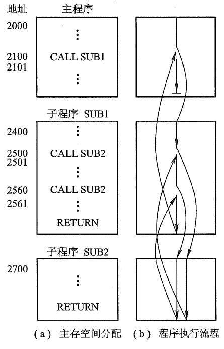

# 计算机组成原理

> 练拳不练功, 到老一场空. 基础不牢, 地动山摇

## 第4章 指令系统

这一章要讲的内容就是 控制单元中的 排队逻辑, 寄存器和解码器 以及 控制存储器.

### 指令的定义

指令又称机器指令, 是指示计算机执行某种操作的命令, 是计算机运行的最小功能单位.

一台计算机的所有指令的集合, 构成该机的指令系统, 也称为指令集.

> 一台计算机只能执行自己指令系统中的指令, 不能执行其它系统的指令.
>
> 指令就是机器语言的一条语句.

### 指令格式

> 一条指令就是机器语言的一条语句, 它是一组有意义的二进制代码.

指令包括:

**`操作码` + `地址码`**

> 操作码:  指明该指令要完成的操作.  操作码是识别指令, 了解指令功能及区分操作数地址内容的组成和使用方法等的关键信息.
>
> 地址码: 用来指出该指令的源操作数的地址(一个或两个), 结果的地址以及下一条指令的地址. 这里的地址可以是主存的, 也可以是寄存器的, 甚至可以是I/O设备的地址.

指令的长度, 就是一条指令中所包含的二进制代码的位数. 指令字长取决于操作码的长度, 操作数地址码的长度和操作数地址的个度.

> 指令的长度, 与机器字长没有固定关系, 它可以等于机器字长, 也可以大于或小于机器字长. 有单字长指令, 半字长指令, 双字长指令.

在一个指令系统中, 若所有**指令的长度**都是相等的, 则成为定长指令字结构. 这种结构, 执行速度快, 控制简单.

若各种指令的长度随指令功能而异, 则称为变字长指令字结构. 主存一般按字节编址, 故指令字长多为字节的整倍数.

**操作码的长度**可以是固定长度, 也可以是可变长度.

> 长度固定是用于指令字长较长的情况, 如RISC ,是为了译码过程的方便, 译码电路简单.
>
> 可变长度, 操作码分散在指令字的不同字段中. 这种格式可有效压缩操作码的平均长度, 在字长较短的微型计算机中被广泛使用.

#### 地址码

根据指令中操作数地址码的数目的不同, 可将指令分成以下几种格式.

- 四地址指令

假设指令字长32位, 操作码是8位, 每个地址字段都是6位的. 则指令操作数的直接寻址范围是64.

该指令完成 (A1)OP(A2)→ A3, A1地址中的内容. 举个例子:

上面这个例子 操作码是加法, 那这条指令的意思就是 A1中的数据加A2中的数据, 结果放到A3地址中. 然后执行下一条取A4地址中的指令.   注意, 这里数据跟指令混合乱放的.

前面章节说了, 程序大多是按顺序执行的, 程序计数器PC既能存放当前将执行指令的存放地址, 又能自加1.所以只需要把指令放一起, 数据放一起, 分开放置, 指令按顺序放, 就可以不要A4. 比如这样

 

那就可以得到以下这种:

- 三地址指令

  

  依旧是完成(A1)OP(A2)→A3, 后续指令的地址隐含在PC中, 有PC中的地址自加1完成. OP仍为8位, 三个地址字段也占8位, 那三地址指令操作数的直接寻址范围可达256. 若地址都是主存地址, 也需要访存4次.

  那如果在运行过程中, 把中间结果先暂存在CPU的寄存器(如累加器ACC)中, 最终结果再写到主存里, 这样放中间结果的A3地址也不需要了.得到下面这种:

- 二地址指令

  

  它完成(A1)OP(A2) → A1的操作. A1字段既代表源操作数的地址, 又代表存放运算结果的地址.此时依旧需要访问4次内存. 若把结果放在ACC寄存器中, 则只访问3次内存. 二地址指令操作数的直接寻址范围是2的12次方.

  接下来把一个操作数的地址隐含在ACC中.则有了下面这种:

- 一地址指令

  

  它可完成(ACC)OP(A1) → ACC的操作. ACC 既存放参与运算的操作数, 又存放运算的中间结果, 这样, 完成一条一地址指令只需两次访存. 在指令字长仍为32 位, 操作码位数仍固定为8位时, 一地址指令操作数的直接寻址范围达2的24次方, 即16 M.

- 零地址指令

  零地址指令在指令字中无地址码, 例如, 空操作(NOP) , 停机(HLT) 这类指令只有操作码. 而子程序返回(RET), 中断返回(IRET) 这类指令没有地址码, 其操作数的地址隐含在堆栈指针SP 中. 

  > 零地址的运算类指令仅用在堆栈计算机中. 通常参与运算的两个操作数隐含地依次从栈顶弹出. 送到运算器执行运算, 结果再隐式地压入堆栈.

通过上述介绍可见, 用一些硬件资源(如PC 、ACC) 承担指令字中需指明的地址码, 可在不改变指令字长的前提下, 扩大指令操作数的直接寻址范围. 此外, 用PC 、ACC 等硬件代替指令字中的某些地址字段, 还可缩短指令字长, 并可减少访存次数. 因此, 究竟采用什么样的地址格式, 必须从机器性能出发综合考虑. 

以上讨论的地址格式均以主存地址为例, 实际上地址字段也可用来表示寄存器. 当CPU 中含有多个通用寄存器时, 对每一个寄存器赋予一个编号, 便可指明源操作数和结果存放在哪个寄存器中. 地址字段表示寄存器时, 也可有三地址, 二地址, 一地址之分. 它们的共同点是, 在指令的执行阶段都不必访问存储器, 直接访问寄存器, 使机器运行速度得到提高(因为寄存器类型的指令只需在取指阶段访问一次存储器). 

#### 定长操作码指令格式

上面介绍了, 操作码分定长跟可变两种.

定长操作码指令, 就是在指令字的最高位部分分配固定的若干位(定长)表示操作码. n位操作码字段的指令系统最大能表是2的n次方条指令. 定长操作码对简化计算机硬件设计, 提高指令译码和识别速度很有利. 当计算机字长为32位或更长, 这是常规方法.

#### 扩展操作码指令格式

为了在指令字长有限的前提下, 仍保持比较丰富的指令种类, 可采用可变长度操作码, 即全部指令的操作码字段的位数不固定, 且分散地放在指令字的不同位置上. 但将增加指令译码和分析的难度, 使控制器的设计复杂化.

通常采用扩展操作码技术, 使操作码的长度随地址数的减少而增加, 不同地址数的指令可以具有不同长度的操作码, 从而在满足需要的前提下, 有效地缩短指令字长.

扩展操作码举例:

假设现在有16位指令字长, 前4位为基本操作码字段OP, 另有3个4位长的地址字段.

这是一种扩展方法.

设计扩展码指令格式时, 要注意:

- 不允许短码是长码的前缀, 即短操作码不能与长操作码的前面部分相同.
- 各指令的操作码一定不能重复.
- 通常情况下, 对使用频率较高的指令, 分配较短的操作码; 从而尽可能减少指令译码和分析的时间.

另一种设计:

#### 指令字长

指令字长取决于操作码的长度, 操作数地址的长度和操作数地址的个数. 

不同机器的指令字长是不相同的. 早期的计算机指令字长, 机器字长和存储字长均相等, 因此访问某个存储单元, 便可取出一条完整的指令或一个完整的数据. 这种机器的指令字长是固定的, 控制方式比较简单. 随着计算机的发展, 存储容量的增大, 要求处理的数据类型增多, 计算机的指令字长也发生了很大的变化. 一台机器的指令系统可以采用位数不相同的指令, 即指令字长是可变的, 如单字长指令, 多字长指令. 控制这类指令的电路比较复杂, 而且多字长指令要多次访问存储器才能取出一条完整的指令, 因此使CPU 速度下降. 为了提高指令的运行速度和节省存储空间, 通常尽可能把常用的指(如数据传送指令, 算逻运算指令等)设计成单字长或短字长格式的指令.

### 操作数类型

机器中常见的操作数类型有地址, 数字, 字符, 逻辑数据等.

#### 地址

地址实际上也可看作是一种数据, 在许多情况下要计算操作数的地址. 这时, 地址可被认为是一个无符号的整数.

#### 数字

计算机中常见的数字有定点数、浮点数和十进制数

#### 字符

在应用计算机时, 文本或者字符串也是一种常见的数据类型. 由于计算机在处理信息过程中不能以简单的字符形式存储和传送, 因此普遍采用ASCII 码, 它是很重要的一种符编码. 当然还有其他一些字符编码, 如8 位EBCDIC 码(Extended Binary Coded Decimal InterchangeCode), 又称扩展BCD 交换码.

#### 逻辑数据

计算机除了做算术运算外, 有时还需做逻辑运算, 此时n个0和1的组合不是被看作算术数字, 而是被看作逻辑数.

例如, 在ASCII码中的0110101, 它表示十进制数5, 若要将它转换为NBCD短十进制码, 只需通过它与逻辑数0001111 完成逻辑与运算, 抽取低4 位, 即可获得0101. 此外, 有时希望存储一个布尔类型的数据, 它们的每一位都代表着真(1) 和假(0) , 这时n个0和1组合的数就都被看作逻辑数.

### 数据在存储器中的存放方式

通常计算机中的数据存放在存储器或寄存器中, 而寄存器的位数便可反映机器字长. 一般机器字长可取字节的1, 2, 4 , 8 倍, 这样便千字符处理. 在大, 中型机器中字长为32 位和64 位, 在微型计算机中字长从4 位, 8 位逐渐发展到目前的16 位, 32 位和64 位.

由于不同的机器数据字长不同，每台机器处理的数据字长也不统一. 因此, 为了便于硬件实现, 通常要求多字节的数据在存储器的存放方式能满足"边界对准"的要求，

总结: 边界对齐 与 边界不对齐,  大端方式与小端方式. 前面讲过了.

> 区分大小端, 就是看计算机先读到的是 高字节还是低字节.

### 操作类型

不同的机器, 操作类型也是不同的, 但几乎所有的机器都有以下几类通用的操作.

#### 数据传送

数据传送包括寄存器与寄存器, 寄存器与存储单元, 存储单元与存储单元之间的传送. 如从源到目的之间的传送, 对存储器读(LOAD) 和写(STORE) , 交换源和目的的内容, 置1 , 清零, 进栈、出栈等。

> 进行主存与CPU直接的数据传输

#### 算术逻辑操作

这类操作可实现算术运算(加, 减, 乘, 除, 增1, 减1 , 取负数即求补)和逻辑运算(与, 或, 非, 异或). 对低档机而言, 一般算术运算只支持最基本的二进制加减, 比较, 求补等, 高档机还能支持浮点运算和十进制运算. 
有些机器还具有位操作功能, 如位测试(测试指定位的值), 位清除(清除指定位), 位求反(对指定位求反)等.

#### 移位

移位可分为算术移位, 逻辑移位和循环移位三种. 算术移位和逻辑移位分别可实现对有符号数和无符号数乘以2\^n(左移)或整除以2\^n(右移)的运算, 并且**移位操作所需时间远比乘除操作执行时间短**, 因此, 移位操作经常被用来代替简单的乘法和除法运算. 

> 算术逻辑 跟 移位操作属于运算类

#### 转移

在多数情况下, 计算机是按顺序执行程序的每条指令的, 但有时需要改变这种顺序, 此刻可采用转移类指令来完成. 转移指令按其转移特征又可分为`无条件转移, 条件转移, 跳转, 过程调用与返回, 陷阱(Trap) `等几种.

- 无条件转移

  无条件转移不受任何条件约束, 可直接把程序转移到下一条需执行指令的地址. 例如`"JMP X"`, 其功能是将指令地址无条件转至X. 

- 条件转移

  条件转移是根据当前指令的执行结果来决定是否需要转移. 若条件满足, 则转移; 若条件不满足, 则继续按顺序执行. 一般机器都能提供一些条件码, 这些条件码是某些操作的结果. 例如: 零标志位(Z), 结果为0, Z= 1; 负标志位(N), 结果为负,  N=1; 溢出标志位(V), 结果有溢出, V=1; 进位标志位(C), 最高位有进位,  C=1; 奇偶标志位(P), 结果呈偶数,  P=1等.

  

  例如, 指令"BROX" 表示若结果(有符号数)溢出(V=1) , 则指令跳转至X. 例如, 指令"BRC Y"表示若最高位有进位(C = 1) , 则指令跳转至Y. 

  还有一种条件转移指令, SKP(Skip) , 它暗示其下一条指令将被跳过, 从而隐含了转移地址SKP后的第二条指令. 例如：

  300 ...

  305 SKP DZ
  306
  307
  这里"SKP DZ"表示若设备的完成触发器D为零, 则执行完305条指令后, 立即跳至第307条指令, 再顺序执行.

- 调用与返回

  在编写程序时, 有些具有特定功能的程序段会被反复使用. 为避免重复编写, 可将这些程序段设定为独立子程序,需要执行某子程序时, 只需用子程序调用指令即可. 此外, 计算机系统还提供了通用子程序, 如申请资源, 读写文件,  控制外设等. 需要时均可由用户直接调用, 不必重新编写. 

  通常调用指令包括`过程调用, 系统调用和子程序调用`. 它可实现从一个程序转移到另一个程序的操作. 
  调用指令(`CALL`) 一般与返回指令(`RETURN`) 配合使用。`CALL` 用于从当前的程序位置转至子程序的入口; `RETURN`用**于子程序执行完后重新返回到原程序的断点.** 

  下图示意了调用(CALL) 和返回(RETURN) 指令在程序执行中的流程.

  

> 上图示意了主程序和子程序在主存所占空间. 主程序从2000 地址单元开始, 并在2100 处有一个调用指令, 当执行到2100 处指令时, CPU 停止下一条顺序号为2101 的指令, 而转到2400执行`SUB1`子程序. 在`SUB1 `中又有两次(2500 和2560 处)调用子程序`SUB2`, 每一次都将`SUB1 `挂起, 而执行`SUB2`. 子程序末尾的`RETURN`指令可使CPU返回调用点. 
> 总结: 主程序→SUB1→SUB2→SUB 1→SUB2→SUB1→ 主程序的执行流程。

​	需要注意以下几点:

​	a. 子程序可在多处被调用.
​	b. 子程序调用可出现在子程序中, 即允许子程序嵌套. 
​	c. 每个CALL 指令都对应一条RETURN 指令.

由于可以在许多处调用子程序, 因此, CPU 必须记住返回地址, 使子程序能准确返回. 返回地址可存放在以下3 处.

1. **寄存器内**. 机器内设有专用寄存器, 专门用于存放返回地址。

2. **子程序的入口地址内**.

3. **栈顶内**. 现代计算机都设有堆栈, 执行RETURN 指令后, 便可自动从栈顶内取出应返回的地址.

- 陷阱(Trap)与陷阱指令

  **陷阱其实是一种意外事故的中断**. 例如, 机器在运行中, 可能会出现电源电压不稳定, 存储器校验出差错, 输入输出设备出现了故障, 用户使用未被定义的指令, 除数出现为0 , 运算结果溢出以及特权指令等种种意外事件, 致使计算机不能正常工作. 此刻必须及时采取措施, 否则将影响整个系统的正常运行. 因此, **一旦出现意外故障, 计算机就发出陷阱信号, 暂停当前程序的执行, 转入故障处理程序进行相应的故障处理.**
  **计算机的陷阱指令一般不提供给用户直接使用**, 而作为**隐指令(即指令系统中不提供的指令)**, 在出现意外故障时, 由CPU 自动产生并执行. 也有的机器设置供用户使用的陷阱指令或"访管"指令, 利用它完成系统调用和程序请求. 例如,  IBM PC (Intel 8086) 的**软中断**INT TYPE(TYPE是8 位常数, 表示中断类型), 其实就是直接提供给用户使用的陷阱指令, 用来完成系统调用.

> 转移操作 是程序控制类:改变程序执行的顺序

#### 输入输出

对于**I/O单独编址(不是编入主存地址)**的计算机而言, 通常设有输入输出指令, 它完成**从外设中的寄存器读入一个数据到CPU的寄存器内, 或将数据从CPU的寄存器输出至某外设的寄存器中.**

> 进行CPU与I/O设备之间的数据传送

#### 其他

其他包括等待指令, 停机指令, 空操作指令, 开中断指令, 关中断指令, 置条件码指令等. 为了适应计算机的信息管理, 数据处理及办公自动化等领域的应用, 有的计算机还设有非数值处理指令. 如字符串传送, 字符串比较, 字符串查询及字符串转换等. 在多用户, 多任务的计算机系统中, 还设有特权指令, 这类指令只能用于操作系统或其他系统软件, 用户是不能使用的. 在有些大型或巨型机中, 还设有向量指令, 可对整个向量或矩阵进行求和, 求积运算. 在多处理器系统中还配有专门的多处理机指令. 

### 指令寻址方式

存储器里也有**寻址**, 它是如何定位到存储器内的某个存储单元.

而指令寻址是**指令如何指出某个对象, 在存储器中的某个位置.** 是不一样的概念.

定义: 寻址方式是指`确定本条指令的数据地址`以及`下一条将要执行的指令地址`的方法，它与硬件结构紧密相关，而且直接影响指令格式和指令功能。

> 所以寻址方式就是指 寻找指令, 寻找操作数有效地址 的方式. 找指令, 找数据.

所以, 寻址方式分为`指令寻址`和`数据寻址`两大类。

#### 指令寻址

指令寻址比较简单, 它分为**`顺序寻址`**和**`跳跃寻址`**两种.

顺序寻址可通过`程序计数器PC` 自加1, 自动形成下一条指令的地址.

> 其实并非任何计算机都是(PC)+1, 比如按字节编址, 指令字长是32位, 那是加+4. 若是可变指令长度, 那计算方法更复杂.
>
> 这里统一指 PC 中下一条地址的计算方式.

跳跃寻址则通过**`转移类指令`**实现.

#### 数据寻址

指令的地址码字段**通常都不代表操作数**的`真实地址`, 故把它称为`形式地址`, 记作A. 

**操作数的真实地址称为有效地址**, 记作EA, 它是由寻址方式和形式地址共同来确定的.

> 注意, (A)表示地址为A的数值, A既可以是寄存器编号, 又可以是内存地址. 对应(A)就是寄存器中, 或内存单元中的数值.

数据寻址, **是指如何在指令中表示一个操作数的地址, 如何用这种表示来得到操作数或怎么计算出操作数的地址.**

数据寻址方式种类较多, 在指令字中必须设一字段来指明属于哪一种寻址方式. 于是:

为了便于分析研究各类寻址方式, **假设指令字长, 存储字长, 机器字长均相同.**

还有可能是多地址, 我们以一地址作为例子讨论.

1. 立即寻址

   立即寻址的特点是操作数本身设在指令字内, 即**形式地址A**不是操作数的地址, 而是**操作数本身**, 又称之为**立即数**.**数据是采用补码形式存放的.**

   

   图中"#"表示立即寻址特征标记.

   > 优点在于只要取出指令, 便可立即获得操作数, 这种指令在执行阶段不必再访问存储器, 指令执行时间最短. 显然A的位数限制了这类指令所能表述的立即数的范围.

2. 直接寻址

   直接寻址的特点是, 指令字中的形式地址A就是操作数的真实地址EA, 即EA=A.

   

   > 优点是寻找操作数比较简单, 也不需要专门计算操作数的地址, 在指令执行阶段对主存只访问一次. 
   >
   > 缺点在于A的位数限制了操作数的寻址范围, 而且操作数的地址不易修改.

3. 间接寻址

   指令字中的**形式地址不直接指出操作数的地址**, 而是**指出操作数有效地址所在的存储单元地址**, 也就是说, 有效地址是由形式地址间接提供的, 即为间接寻址, 即EA= (A). 

   

   (a) 为一次间接寻址, 即A地址单元的内容EA是操作数的有效地址;

   (b) 为两次间接寻址, 即A 地址单元的内容Al 还不是有效地址, 而由Al 所指单元的内容EA 才是有效地址.

   > (a)一次间接寻址, 取指令一次访存, 拿到EA一次访存, 取操作数又一次, 一共三次访存.

   优点:扩大了操作数的寻址范围, 因为A 的位数通常小于指令字长, 而存储字长可与指令字长相等. 有效地址EA的位数大于形式地址A.

   > 若设指令字长和存储字长均为16位, A为8位, 显然直接寻址范围为2^8, 一次间接寻址的寻址范围可达2^16 . 当**多次间接寻址时**, 用**存储字的首位来标志间接寻址是否结束**. 如(b)中, 当存储字首位为"1"时, 标明还需继续访存寻址; 当存储字首位为"0" 时, 标明该存储字即为EA. 由此可见, 存储字首位不能作为EA的组成部分, 因此, 它的寻址范围为2^15.

   间接寻址的第二个优点在于它便于编制程序. 例如, 用间接寻址可以很方便地完成子程序返回.

   > 
   >
   > 图中表示两次调用子程序, 只要在调用前先将返回地址存入子程序最末条指令的形式地址A 的存储单元内, 便可准确返回到原程序断点. 例如, 第一次调用前, 使[A] = 81, 第二次调用前, 使[A]= 202. 这样, 当第一次子程序执行到最末条指令"JMP@A"(＠为间址特征位), 便可无条件转至81号单元. 同理, 第二次执行完子程序后, 便可返回到202号单元.